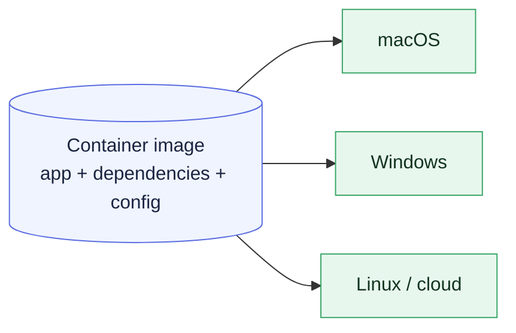
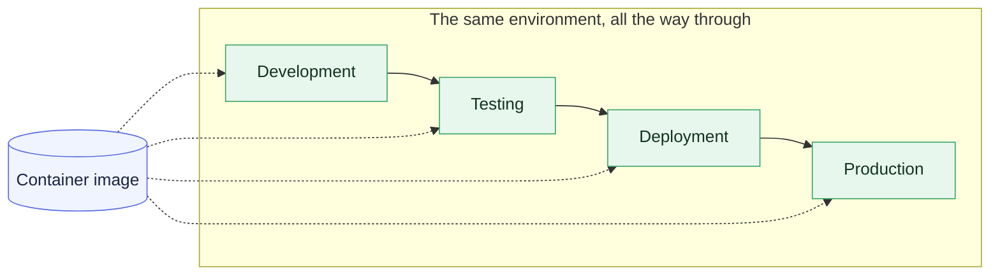

# Chapter 1 — Lesson 1: Why Docker Containers?

> **Learning goal:** Explain why containerization matters for software in
> general and for AI applications in particular, and describe how containers
> provide reproducible environments across the development lifecycle.

Welcome to the course. This first lesson sets the stage: **why** containers
matter, and why they matter even more for AI applications. There is no code
in this lesson — just the ideas you'll lean on for the rest of the course.

---

## 1. The classic problem

Anyone who has shipped software has seen this:

> "It works on my machine."

The application runs perfectly for the developer who wrote it, but breaks
the moment someone else tries to run it — a teammate, a CI server, or a
production host.

Why? Because every machine is subtly different:

| Source of drift          | Example                                    |
| ------------------------ | ------------------------------------------ |
| Language runtime version | Python 3.12.11 vs 3.10 vs 3.14             |
| Library versions         | pandas 2.2.2 vs 1.9.0                      |
| Operating system         | macOS, Linux, Windows                      |
| CPU architecture         | x86_64 vs ARM64                            |
| System libraries         | Different glibc, OpenSSL, CUDA versions    |
| Environment variables    | API keys, paths, locale                    |

Even tiny differences can change how the app behaves — or whether it runs
at all.

---

## 2. Why this is worse for AI

Traditional applications already have to deal with this. AI applications
make it dramatically harder because they typically depend on **many moving
parts**:

* Python libraries and model dependencies
* External APIs or LLM providers
* Vector databases
* Data ingestion pipelines
* GPU libraries and system packages
* Backend services and web frameworks

A modern AI app is rarely a single script. It's a small distributed system.

### The RAG example

Take a Retrieval-Augmented Generation system. A typical RAG includes:

* A document ingestion process
* Embedding models
* A vector database
* Query APIs
* Large language models
* Frontend applications

Sharing setup instructions for all of that — *"Install Python 3.12, these
25 libraries, a vector database, download this model, configure these
environment variables, and hopefully everything works"* — is fragile and
hard to maintain.

---

## 3. The container idea

Containers solve this by **packaging the application together with its
dependencies and system configuration into a reproducible environment.**

Instead of sharing setup instructions, we share the environment itself.

A container is:

* **Reproducible** — same image, same environment, anywhere
* **Isolated** — its own filesystem, network, processes
* **Portable** — runs the same way on macOS, Linux, Windows, cloud
* **Versionable** — image tags pin a known-good environment

If it works locally, it should run successfully on other devices. And —
just as importantly — if it fails on another device, you can reproduce
that exact failure locally.

---

## 4. The same environment, all the way through

Once an application is packaged in a container, the **same environment**
can be used at every stage of the lifecycle:

This consistency is the real win. The benefit isn't "easier to run."
The benefit is **reproducibility**.

> If something works during development, we want the exact same behavior
> during testing and production.

---

## 5. What this course is about

Throughout this course we'll use a RAG system as the running example,
and learn how to:

* Package a multi-component AI app with Docker
* Develop inside containers using a reproducible Python environment
* Move from a single dev container to a multi-service production setup
* Use AI tools like Claude Code to accelerate Dockerization

The same techniques apply to any AI application — agents, forecasters,
recommenders — that has more than one moving part.

---

## What's next

Lesson 2 zooms into the **components of a RAG system** so we have a
shared picture of the application. Lesson 3 turns those components
into a **container strategy** for the rest of the course.
