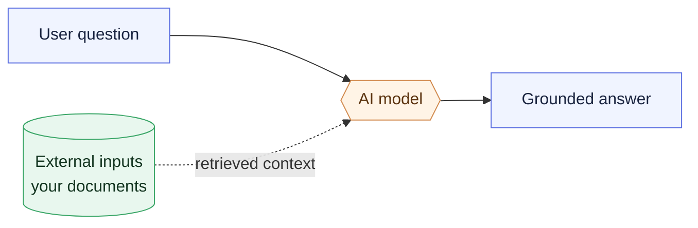
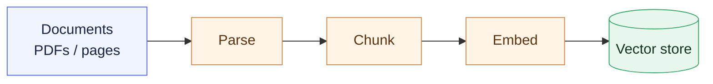
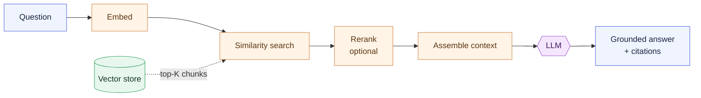
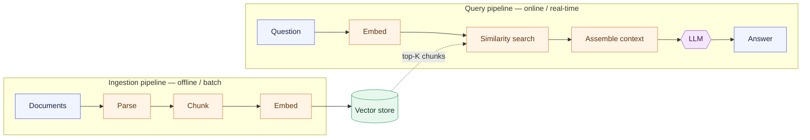

# Chapter 1 — Lesson 2: Introduction to RAG

> **Learning goal:** Describe the components of a Retrieval-Augmented
> Generation (RAG) system and frame them as discrete services that can later
> be containerized.

This lesson introduces the AI system we'll use for the rest of the course:
**Retrieval-Augmented Generation**, or RAG. We're not trying to teach RAG
in depth — we just need a shared mental picture of the components, so
that later chapters can talk concretely about containerizing them.

> If you already know RAG, the only new piece here is the way we frame
> the components as **services** that may eventually become containers.

---

## 1. Why RAG, for this course

We chose RAG as the running example because:

* It's a real-world AI application pattern, not a toy.
* It has **multiple components** — perfect for learning Docker.
* The same patterns show up in agents, forecasters, RAG-over-tools,
  recommendation systems, and many other AI applications.

Whatever AI application you're working on, you'll likely recognize the
shape: ingest data → store it → retrieve it → generate output.

---

## 2. RAG in one sentence

A RAG system enables a language model to answer questions about
information **it was not trained on and does not have access to** — by
using external data.

Common examples:

* Your company's travel policy
* Internal documentation or wikis
* A financial report released an hour ago
* Customer support tickets

The trick is to give the model just the **right snippets** of that
external data at the right time, then let it generate a grounded answer.

---

## 3. The big picture

Conceptually, the system has three actors:

The dashed **external inputs** arrow is what RAG adds on top of a plain LLM.

To make that work, we need two pipelines:

1. **An ingestion pipeline** — prepares the external information so the
   model can retrieve it later.
2. **A query pipeline** — answers the user's question by retrieving and
   then generating.

These are two separate concerns, and that distinction will matter a lot
when we start picking containers.

---

## 4. Pipeline 1 — Data ingestion

LLMs don't work directly with raw text. They work with **embeddings** —
numerical vector representations of text.

The ingestion pipeline turns documents into embeddings the system can
search later:

Typical steps:

| Step          | What it does                                           |
| ------------- | ------------------------------------------------------ |
| Parsing       | Extract text, tables, metadata from PDFs / pages       |
| Chunking      | Split into smaller passages with some overlap          |
| Embedding     | Convert each chunk into a vector                       |
| Vector store  | Index the vectors + metadata for fast similarity search |

The ingestion pipeline is typically **offline / batch** — it runs when
new documents arrive, not on every user request.

---

## 5. Pipeline 2 — Query

The query pipeline runs on every user request. It is **online /
real-time**:

* The user's question is embedded with the **same model** used during
  ingestion (consistency matters).
* A similarity search returns the top-K candidate chunks from the
  vector store.
* An optional reranker rescores those candidates for precision.
* A context-assembly step builds an augmented prompt with the question
  and the retrieved chunks.
* The LLM generates a grounded answer with citations.

---

## 6. What we glossed over

A production RAG system also has:

* **Logging, monitoring, and observability** — what was retrieved? what
  did the LLM say? how often do we hit the cache?
* **Authentication / authorization** for documents per user
* **A user interface** — chat window, search UI, embedded assistant
* **Evaluation harness** — measuring retrieval quality and grounding

We'll skip these for the course but they're important in production.

---

## 7. The takeaway

The detail of *how* RAG works isn't what matters here. What matters is:

> Modern AI systems are usually **composed of multiple independent
> components** working together.

Seen as services, the whole system looks like this — with the **vector
store** as the shared piece both pipelines depend on:

Once we see the components — ingestion pipeline, vector database, query
pipeline — we can ask the question that drives the next lesson:

> Should everything run in one container, or should different components
> run independently?

That's container strategy, and it's where Lesson 3 picks up.
