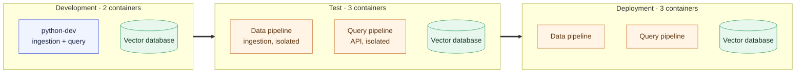
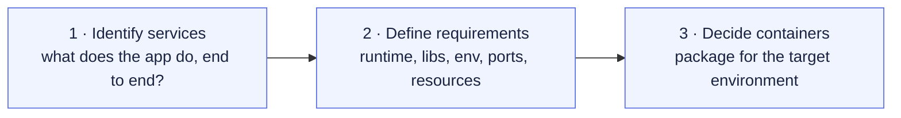

# Chapter 1 — Lesson 3: Container Strategy

> **Learning goal:** Evaluate whether an AI application's services should be
> packaged into one container or many, based on its architecture and target
> production environment.

We've seen what a RAG system looks like. Now the question is: **how do we
turn those components into containers?**

There is no universal answer. The right strategy depends on two things:

1. **The application architecture** — what services exist, how they
   interact, what they need.
2. **The production environment** — where the system will eventually
   run (single VM, Kubernetes, edge device, ...).

This lesson lays out a way to think about that decision and the
specific path we'll take in this course.

---

## 1. Identify the services first

Step one is always the same: list the services that make up the
application. For our RAG example, three core services:

| Service           | What it does                                                  |
| ----------------- | ------------------------------------------------------------- |
| Ingestion pipeline | Processes documents and stores their embeddings              |
| Vector database   | Stores embeddings, enables fast similarity search             |
| Query pipeline    | Receives requests, retrieves context, calls the LLM, returns response |

Once these are clearly named and scoped, we can start asking how they
should be packaged.

---

## 2. One container or many?

This is the central design decision. Both answers can be correct.

### When one container can work

If the ingestion and query work as a **single workflow** — for example,
a session-based app where users upload documents and immediately ask
questions about them — splitting them into multiple services is often
overkill.

The documents may be processed temporarily and discarded after the
session, so there's no long-lived "knowledge base" to maintain. In that
case, one container keeps the system simple.

### When separate containers are better

In most production setups, separating ingestion and query becomes
useful because:

* **Different workloads** — ingestion runs occasionally when new
  documents arrive; query runs continuously.
* **Different resource needs** — ingestion is CPU-heavy and bursty;
  query is steady but latency-sensitive.
* **Independent scaling** — you may need 10 query workers and only 1
  ingestion worker.
* **Independent deployment** — updating the query service shouldn't
  require redeploying ingestion.
* **Failure isolation** — a stuck ingestion job shouldn't take down
  user-facing queries.

Components that **operate independently** are usually good candidates
for separate containers.

---

## 3. The path we'll take

Across this course, we move through three stages. We don't start with
the final production layout — we start simple, then split services out
as they stabilize:

### Development

At first we keep things simple:

* A **Python development container** — reproducible environment for
  writing code, installing dependencies, running notebooks, exploring.
* A **Vector database container** — Chroma, running in its own container
  for persistence and to keep the dev container lean.

Two containers, no premature splitting. The dev container does double
duty for ingestion and query while we're still iterating on the code.

### Test

Once individual services stabilize, we split them out and test the
pipelines in something closer to production:

* **Data pipeline container** — ingestion, isolated and tested
  independently.
* **Vector database container** — same as in production.
* **Query pipeline container** — the API service, isolated.

This is where we discover the integration issues that single-container
prototypes hide.

### Deployment

The same three containers — data pipeline, vector database, query
pipeline — go to production. They were tested separately, they scale
separately, and they fail separately.

---

## 4. Why this order matters

We don't start by designing the production-perfect container layout. We
start by:

1. **Identifying services** — what does the application actually do?
2. **Defining requirements** — what does each service need?
3. **Then deciding containers** — how do we package them given the
   target environment?

It's tempting to skip ahead to the deployment diagram, but if you don't
have services and requirements first, the container choices won't hold
up to real-world friction.

---

## 5. Why this matters

The goal is not to "make the application run." Anything runs once, on a
laptop, with enough patience.

The goal is to make deployment **predictable and consistent across
environments** — laptop, CI, staging, production. Containers are the
unit that makes that possible.

---

## What's next

Chapter 2 zooms into the Docker fundamentals you'll need to actually
build the containers we just sketched: the workflow, the Dockerfile,
`docker build`, `docker run`, and the best practices that keep your
images small, fast, and safe.

By the end of Chapter 2, you'll have the vocabulary and reflexes to
start applying this strategy to the RAG project in Chapter 3.
