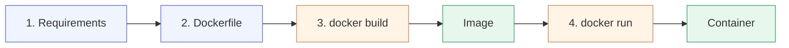
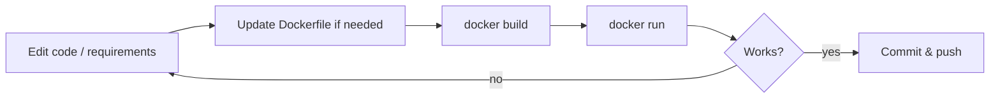
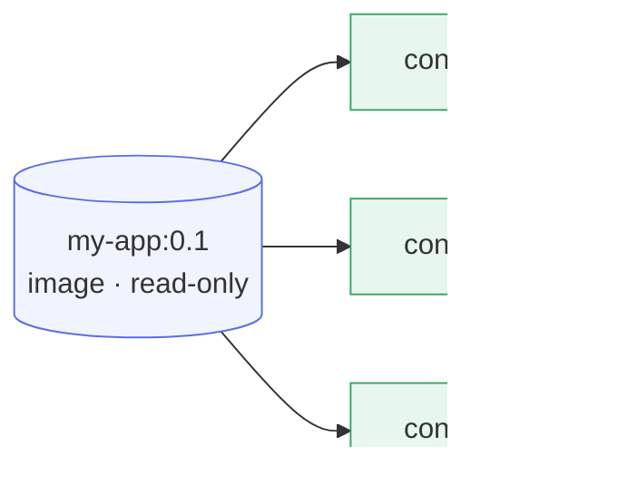

# Chapter 2 — Lesson 1: The Docker Workflow

> **Learning goal:** Describe the four-step Docker workflow (requirements →
> Dockerfile → build → run) and distinguish an image from a container.

This lesson introduces the end-to-end Docker workflow we will use
throughout the rest of the course. Once we understand the shape of
this workflow, every other Docker command becomes easier to place.

---

## 1. The four steps

Every container we build goes through the same four steps:

1. **Requirements** — decide what the application needs.
2. **Dockerfile** — write a recipe that describes the environment.
3. **`docker build`** — turn the recipe into a reusable image.
4. **`docker run`** — start a container from the image.



The blue boxes are things we *write*. The orange boxes are commands
we *run*. The green boxes are what Docker produces for us.

---

## 2. What each step actually does

### Step 1 — Requirements

Before any Docker code is written, ask:

* What language runtime do I need (Python 3.11, Node 20, …)?
* Which OS packages does the app depend on (`curl`, `git`, build tools)?
* Which Python / npm / system libraries does the app import?
* Which configuration values does the app read at runtime
  (API keys, database URLs, paths)?
* Which ports does the app listen on?
* Which files / folders should be persisted across container restarts?

A clear answer to these questions is what makes a clean Dockerfile.
Skipping this step is the #1 reason Dockerfiles grow into a mess.

### Step 2 — Dockerfile

The Dockerfile is the **source code** for the image. It is a small
text file (no extension) that lists, one per line, the instructions
needed to assemble the environment.

A minimal Python Dockerfile looks like this:

```dockerfile
FROM python:3.11-slim
WORKDIR /app
COPY requirements.txt .
RUN pip install --no-cache-dir -r requirements.txt
COPY . .
EXPOSE 8080
CMD ["python", "main.py"]
```

Seven lines, but they fully describe how the environment is built.
Lesson 2 covers each instruction in depth.

### Step 3 — `docker build`

`docker build` is the command that compiles the Dockerfile into an
**image**.

```bash
docker build -t my-app:0.1 .
```

* `-t my-app:0.1` tags the image with a name and version.
* `.` tells Docker that the **build context** is the current
  directory — i.e., the files Docker is allowed to copy into the
  image.

The image is immutable. Every code or dependency change requires a
new build. Lesson 3 covers `docker build` in detail.

### Step 4 — `docker run`

`docker run` starts a **container** from an image.

```bash
docker run -p 8080:8080 my-app:0.1
```

A container is a running instance of the image. The same image can
back many independent containers. Lesson 4 covers `docker run` in
detail.

---

## 3. The dev loop

In practice, the workflow is a loop. Every time the code or
dependencies change, we walk through it again:



The first build is slow because Docker has to download the base
image and install all the dependencies. Subsequent builds are fast
because Docker **caches** every layer that has not changed. Lesson 3
explains caching in detail.

---

## 4. Image vs. container — the one distinction to remember

| Concept   | What it is                                  | Analogy                |
| --------- | ------------------------------------------- | ---------------------- |
| Image     | A read-only snapshot of the environment.    | A class, or an `.exe`. |
| Container | A running instance of an image.             | An object, a process.  |

* One image, many containers.
* Stopping a container does *not* delete the image.
* Deleting a container does *not* delete the image.



This is the single most useful mental model to carry into the rest
of the chapter.

---

## 5. Mapping the workflow to the RAG project

Our RAG project already follows this workflow. You can see it in the
`docker/` folder of this repository:

| Step           | Where it lives in this repo                                         |
| -------------- | ------------------------------------------------------------------- |
| Requirements   | `docker/requirements.txt`, `docker/requirements-api.txt`            |
| Dockerfiles    | `docker/Dockerfile_Base`, `docker/Dockerfile_Dev`, `docker/Dockerfile_API` |
| Build commands | `docker/build_base_docker.sh`, `docker/build_dev_docker.sh`         |
| Run commands   | `docker-compose.yaml`, `.devcontainer/devcontainer.json`            |

The rest of this chapter unpacks each of these pieces. By the end of
the chapter, you will be able to read those files and understand
exactly what they are doing — and why.
