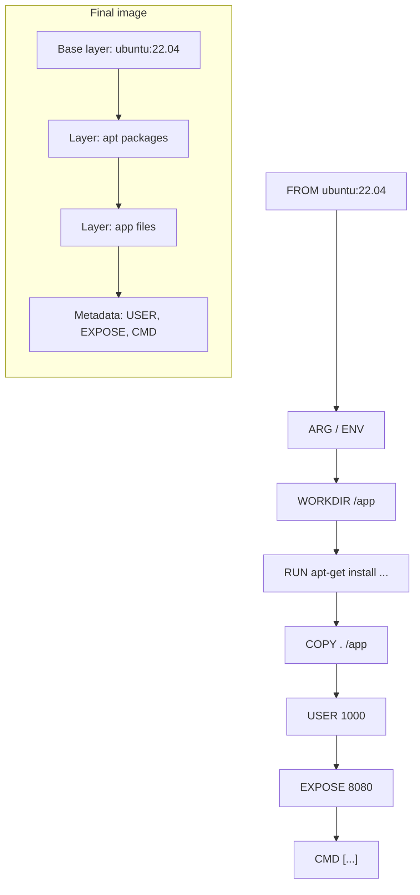

# Chapter 2 — Lesson 2: Core Dockerfile Commands

> **Learning goal:** Write a Dockerfile using the core instructions (`FROM`,
> `ARG`, `ENV`, `WORKDIR`, `RUN`, `COPY`, `EXPOSE`, `CMD`) to define an
> image's environment.

A **Dockerfile** is a plain-text recipe that describes how to build a
Docker image, one instruction per line. When you run `docker build .`,
Docker reads the file top-to-bottom and executes each instruction,
producing a new read-only **layer** for most of them. The final
sequence of layers is the image.

This README is a quick reference to the core Dockerfile instructions
used throughout this chapter. It is meant to be read once at the
start, then referred back to as later sections introduce each command
in a real example.

---

## 1. The big picture

A typical Dockerfile follows the same shape:

```dockerfile
# 1. Pick a starting point
FROM ubuntu:22.04

# 2. (Optional) Configure the build with build-time arguments
ARG APP_VERSION="1.0.0"

# 3. (Optional) Set environment variables for the rest of the build
#    and for the running container
ENV APP_HOME=/app

# 4. Set a working directory
WORKDIR /app

# 5. Install OS packages and tools
RUN apt-get update && apt-get install -y --no-install-recommends curl \
    && rm -rf /var/lib/apt/lists/*

# 6. Copy your application files into the image
COPY . /app

# 7. (Optional) Switch to a non-root user
USER 1000

# 8. Declare runtime defaults
EXPOSE 8080
CMD ["python", "main.py"]
```

A simplified view of how Docker walks through the file:



Each step is explained in the next section.

---

## 2. The instructions

### `FROM` — pick a base image

```dockerfile
FROM ubuntu:22.04
FROM python:3.12-slim
FROM scratch              # no base — fully empty image
```

- **Required.** Every Dockerfile must start with a `FROM` (after
  optional `ARG`s).
- The base image becomes the bottom layer of your image; everything
  below `FROM` in the Dockerfile is layered on top.
- Pin a specific tag (`:22.04`) or, for full reproducibility, a
  digest: `FROM ubuntu:22.04@sha256:<digest>`.

### `RUN` — execute a command at build time

```dockerfile
RUN apt-get update && apt-get install -y curl
```

- Runs the command **during `docker build`** and commits the result
  as a new layer.
- Two forms:
  - *Shell form*: `RUN apt-get install -y curl` — runs through
    `/bin/sh -c`.
  - *Exec form*: `RUN ["apt-get", "install", "-y", "curl"]` — no
    shell involved, no shell features (no `&&`, `|`, `$VAR`).
- Combine related commands with `&&` to avoid creating one layer per
  step. Always clean up in the same `RUN` (e.g.
  `&& rm -rf /var/lib/apt/lists/*`).

### `COPY` — copy files from the build context into the image

```dockerfile
COPY requirements.txt /app/
COPY src/ /app/src/
COPY --chown=1000:1000 app.py /app/app.py
```

- Source paths are relative to the **build context** (the folder you
  pass to `docker build`).
- Destination paths are absolute or relative to `WORKDIR`.
- A trailing `/` on the destination forces "this is a directory".
- `--chown=user:group` sets ownership at copy time.
- Exclude files from the context with a `.dockerignore` file.

### `ADD` — like `COPY`, plus a few extras

```dockerfile
ADD requirements.txt /app/             # same as COPY
ADD https://example.com/file.tar.gz /tmp/
ADD archive.tar.gz /opt/               # auto-extracts archive
```

- Can also fetch URLs and auto-extract local tarballs.
- **Best practice:** use `COPY` by default. Only reach for `ADD` when
  you specifically need URL fetching or tar extraction. The implicit
  behaviour of `ADD` makes Dockerfiles harder to read.

### `WORKDIR` — set the current directory

```dockerfile
WORKDIR /app
```

- Used by every subsequent `RUN`, `CMD`, `COPY`, `ADD`, and
  `ENTRYPOINT` as the current directory.
- Auto-creates the directory if it doesn't exist.
- Use this instead of `RUN cd /app && ...` — `cd` doesn't persist
  between layers, but `WORKDIR` does.

### `ARG` — declare a build-time variable

```dockerfile
ARG PYTHON_VER="3.12.11"
ARG GIT_SHA                 # no default
RUN echo "Building $PYTHON_VER"
```

- **Available only during `docker build`.** Gone once the image is
  built.
- Override with `docker build --build-arg PYTHON_VER=3.11.9 .`.
- Useful for: tool versions, feature flags, build-only credentials
  (although secrets should use BuildKit's `--mount=type=secret`).

### `ENV` — declare an environment variable

```dockerfile
ENV PATH="/opt/myapp/bin:${PATH}"
ENV APP_HOME=/app \
    APP_USER=appuser
```

- **Persists into the running container.** Visible to processes via
  `os.environ`, `getenv()`, `echo $VAR`, etc.
- Override at runtime with `docker run -e APP_HOME=/other ...`.
- Combine multiple `KEY=VALUE` pairs in one `ENV` (with `\` line
  continuations) to produce one layer instead of N.

### `LABEL` — attach metadata to the image

```dockerfile
LABEL org.opencontainers.image.title="My App" \
      org.opencontainers.image.version="1.0.0" \
      org.opencontainers.image.source="https://github.com/me/myapp"
```

- Pure metadata — does not affect the running container.
- Visible via `docker inspect <image> | jq '.[].Config.Labels'`.
- Prefer the standard
  [OCI annotation keys](https://github.com/opencontainers/image-spec/blob/main/annotations.md).

### `USER` — switch the user for subsequent steps and runtime

```dockerfile
RUN useradd -m -u 1000 appuser
USER appuser
WORKDIR /home/appuser
```

- All later `RUN`s, **and every container started from the image**,
  run as the specified user.
- Without `USER`, processes run as `root` (UID 0) — fine for
  development, risky for production.

### `EXPOSE` — document container ports

```dockerfile
EXPOSE 8080
EXPOSE 5432/tcp
```

- **Documentation only.** Does *not* publish the port to the host.
- The actual publish happens at `docker run` time:
  `docker run -p 8080:8080 ...`.
- Worth including so consumers know which ports the image listens on.

### `VOLUME` — declare a mount point for external storage

```dockerfile
VOLUME /data
```

- Tells Docker that `/data` is intended to hold persistent state.
- Anything written to `/data` *after* this line in the Dockerfile is
  lost — `VOLUME` resets the directory at container start.
- Use `docker run -v hostpath:/data ...` (or a named volume) to
  attach actual storage at runtime.

### `CMD` — default command for the container

```dockerfile
CMD ["python", "main.py"]                 # exec form (preferred)
CMD ["arg1", "arg2"]                      # default args to ENTRYPOINT
CMD python main.py                        # shell form (avoid)
```

- Runs when the container starts, **if no command is passed to
  `docker run`**.
- Easily overridden: `docker run myimage bash` replaces `CMD`.
- Use the *exec form* (JSON array) so the process becomes PID 1
  directly and receives signals correctly.

### `ENTRYPOINT` — fixed entry-point command

```dockerfile
ENTRYPOINT ["python", "main.py"]
CMD ["--help"]
```

- Combined with `CMD`, lets you bake in a command and use `CMD` for
  default arguments:
  ```bash
  docker run myimage              # runs: python main.py --help
  docker run myimage --version    # runs: python main.py --version
  ```
- Override at runtime with `docker run --entrypoint <cmd>`.
- Use the *exec form* for the same signal-handling reasons as `CMD`.

### `SHELL` — change the default shell for `RUN`

```dockerfile
SHELL ["/bin/bash", "-eo", "pipefail", "-c"]
```

- Default is `/bin/sh -c`.
- The `pipefail` form is highly recommended whenever you use
  `curl ... | sh`-style pipelines, so a failure in any stage of a
  pipe aborts the build.

### `HEALTHCHECK` — how Docker should test if the container is alive

```dockerfile
HEALTHCHECK --interval=30s --timeout=3s \
    CMD curl -fsS http://localhost:8080/health || exit 1
```

- Periodically runs the given command inside the container.
- Exit code `0` = healthy, `1` = unhealthy.
- Visible via `docker ps` (the `STATUS` column shows `(healthy)`).

### `STOPSIGNAL`, `ONBUILD` — less common

- `STOPSIGNAL SIGTERM` — change the signal `docker stop` sends.
- `ONBUILD` — register an instruction that fires only when *another
  Dockerfile* uses this image as its `FROM`. Rarely used; mostly seen
  in language base images.

---

## 3. Two common points of confusion

### `CMD` vs `ENTRYPOINT`

| You want…                                                | Use…                                                              |
| -------------------------------------------------------- | ----------------------------------------------------------------- |
| A *default* command, easy to override                    | `CMD`                                                             |
| A *fixed* command, with `CMD` providing default arguments | `ENTRYPOINT` + `CMD`                                              |
| Fully overridable                                        | `CMD` only                                                        |
| The image to behave like a single binary (e.g. `nginx`)  | `ENTRYPOINT` only                                                 |

Always use the JSON exec form (`["a", "b", "c"]`). Shell form
(`a b c`) wraps the process in `/bin/sh -c`, which breaks signal
forwarding for `docker stop`.

### `ARG` vs `ENV`

| Aspect                       | `ARG`                                | `ENV`                                  |
| ---------------------------- | ------------------------------------ | -------------------------------------- |
| Available during build       | Yes                                  | Yes                                    |
| Available at container runtime | **No**                             | Yes                                    |
| Overridable at build         | `--build-arg NAME=val`               | (rebuild required)                     |
| Overridable at run           | (impossible — already gone)           | `docker run -e NAME=val`               |

Use **both** when a value is set at build time but needs to be
visible at runtime:

```dockerfile
ARG PYTHON_VER="3.12.11"
ENV PYTHON_VER=$PYTHON_VER
```

---

## 4. Which instructions create layers?

| Creates a filesystem layer       | Metadata only (no layer)                          |
| -------------------------------- | ------------------------------------------------- |
| `FROM`, `RUN`, `COPY`, `ADD`     | `ARG`, `ENV`, `LABEL`, `WORKDIR`, `EXPOSE`, `USER`, `CMD`, `ENTRYPOINT`, `VOLUME`, `HEALTHCHECK`, `SHELL`, `STOPSIGNAL`, `ONBUILD` |

Knowing this is useful when minimizing image size: combining 4
`RUN`s into 1 saves 3 layers; combining 4 `ENV`s does the same for
metadata writes (still saving image-config writes if not actual
filesystem layers).

---

## 5. A minimal end-to-end example

The Dockerfile in this folder (`Dockerfile`) is a minimal Python
example. It only uses the instructions introduced above:

```dockerfile
FROM python:3.11-slim
WORKDIR /app
COPY requirements.txt .
RUN pip install --no-cache-dir -r requirements.txt
COPY . .
EXPOSE 8080
CMD ["python", "main.py"]
```

Seven lines, but it covers `FROM`, `WORKDIR`, `COPY`, `RUN`,
`EXPOSE`, and `CMD`. We will build and run this exact file in the
next two lessons.

---

## 6. Quick reference / cheatsheet

| Instruction    | Purpose                                                       |
| -------------- | ------------------------------------------------------------- |
| `FROM`         | Set the base image.                                           |
| `RUN`          | Execute a command during build.                               |
| `COPY`         | Copy files from the build context into the image.             |
| `ADD`          | Like `COPY`, plus URL fetch and tarball auto-extract.         |
| `WORKDIR`      | Set the working directory for following instructions.         |
| `ARG`          | Declare a build-time variable.                                |
| `ENV`          | Declare an environment variable persisted at runtime.         |
| `LABEL`        | Attach metadata to the image.                                 |
| `USER`         | Switch the user for subsequent steps and runtime.             |
| `EXPOSE`       | Document a port the container listens on.                     |
| `VOLUME`       | Declare a mount point for persistent storage.                 |
| `CMD`          | Default command (and/or default args to `ENTRYPOINT`).        |
| `ENTRYPOINT`   | Fixed command run on container start.                         |
| `SHELL`        | Change the shell used by `RUN`/`CMD`/`ENTRYPOINT` shell form. |
| `HEALTHCHECK`  | Define a liveness probe Docker can run periodically.          |
| `STOPSIGNAL`   | Change the signal sent to PID 1 when stopping the container.  |
| `ONBUILD`      | Register an instruction to run when this image is used as a base. |

In the next lesson (Lesson 3) we will take the example Dockerfile in
this folder and walk through `docker build` step-by-step: how the
build context works, how layers are created, and how caching makes
subsequent builds fast.
