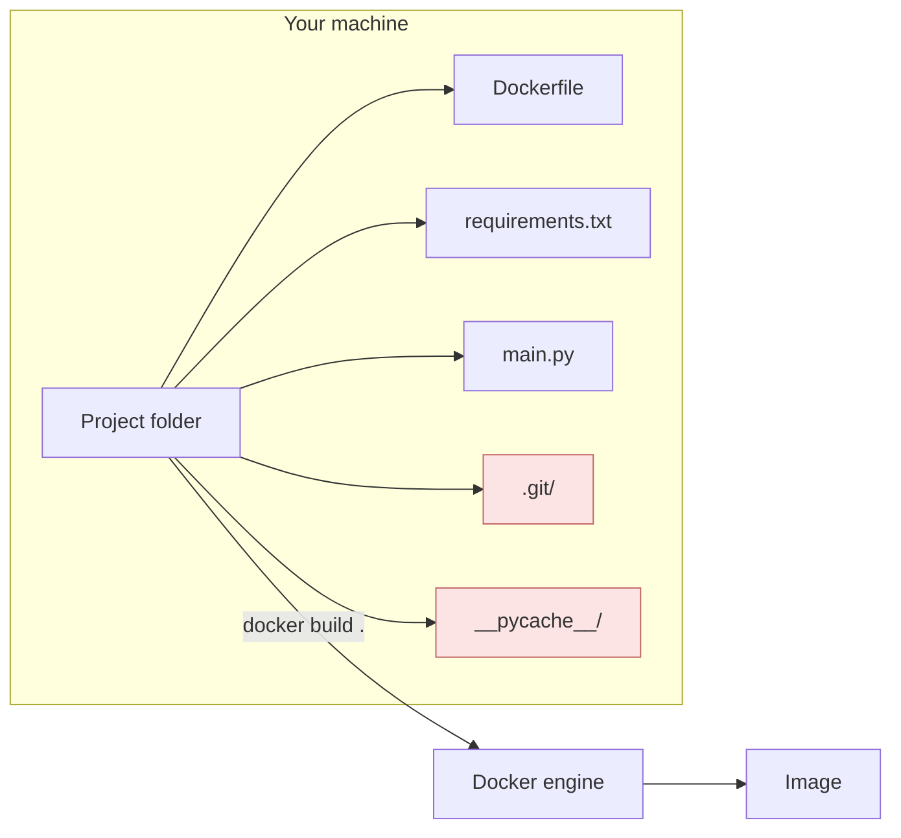
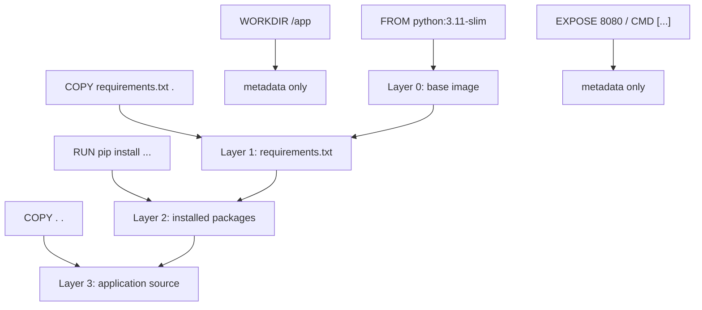

# Chapter 2 — Lesson 3: `docker build`

> **Learning goal:** Build an image from a Dockerfile, and use the build
> context, `.dockerignore`, and layer cache to make builds correct and fast.

This lesson takes the Dockerfile we wrote in Lesson 2 and turns it
into a real, runnable image. We focus on three things:

1. What `docker build` actually does.
2. How the **build context** and **`.dockerignore`** affect the build.
3. How **layers and the build cache** make repeat builds fast.

---

## 1. Anatomy of a build command

```bash
docker build [OPTIONS] PATH | URL | -
```

The most common form:

```bash
docker build -t my-image:0.1 .
```

| Part         | What it does                                                                 |
| ------------ | ---------------------------------------------------------------------------- |
| `docker build` | Invokes the build engine.                                                  |
| `-t my-image:0.1` | Tag for the resulting image. Format is `name:tag`. Omitting `:tag` defaults to `:latest`. |
| `.`          | The **build context** — the folder Docker sends to the build engine.         |

If your Dockerfile has a non-default name, point at it with `-f`:

```bash
docker build -f docker/Dockerfile_API -t rag-api:0.1 .
```

Note that `-f` only changes which Dockerfile to read. The build
context (the `.` at the end) is independent.

---

## 2. The build context

The build context is the **root directory Docker has access to during
the build**. Everything Docker copies into the image (via `COPY` or
`ADD`) must live inside this folder.



Two important consequences:

1. **You cannot `COPY ../something`** — anything above the context is
   invisible to the build.
2. **The entire context is sent to the build engine before the build
   starts.** A 5 GB context means a slow build, even if you only
   `COPY` a few files.

### Shrinking the context with `.dockerignore`

Use a `.dockerignore` file at the root of your context to exclude
things you do *not* want sent. It uses the same patterns as
`.gitignore`:

```text
# .dockerignore
.git
__pycache__/
*.pyc
.venv/
node_modules/
.env
*.log
```

Effects of a good `.dockerignore`:

* Faster builds — less data to send.
* Smaller images — accidental `COPY .` no longer pulls in caches and
  secrets.
* Better cache hits — irrelevant file changes no longer invalidate
  the layer.

---

## 3. Layers and the build cache

`docker build` walks the Dockerfile top-to-bottom and produces a new
**layer** for most instructions (`FROM`, `RUN`, `COPY`, `ADD`).



### How the cache works

When you run the build a second time, for each instruction Docker
asks: *"Are the inputs identical to last time?"*

* For `RUN`: the command string itself.
* For `COPY` / `ADD`: the contents and metadata of the files being
  copied.
* For everything else: the instruction itself.

If yes, Docker reuses the cached layer. If no, Docker **invalidates
every layer from this point down** and rebuilds them.

### Why order matters

Compare these two Dockerfiles:

**Bad — slow on every code change**

```dockerfile
FROM python:3.11-slim
WORKDIR /app
COPY . .                                    # <-- changes constantly
RUN pip install -r requirements.txt         # <-- gets reinstalled every build
```

**Good — fast on code changes**

```dockerfile
FROM python:3.11-slim
WORKDIR /app
COPY requirements.txt .                     # <-- changes rarely
RUN pip install -r requirements.txt         # <-- cached
COPY . .                                    # <-- changes constantly
```

The rule of thumb: **put things that change rarely at the top, and
things that change often at the bottom.**

---

## 4. Useful flags

| Flag                          | What it does                                              |
| ----------------------------- | --------------------------------------------------------- |
| `-t name:tag`                 | Tag the image (you can pass `-t` multiple times).         |
| `-f path/to/Dockerfile`       | Use a Dockerfile other than `./Dockerfile`.               |
| `--build-arg KEY=VALUE`       | Override an `ARG` declared in the Dockerfile.             |
| `--no-cache`                  | Rebuild every layer from scratch.                         |
| `--pull`                      | Always re-pull the base image (don't trust local cache).  |
| `--progress=plain`            | Show full, unwrapped build output (great for debugging).  |
| `--platform linux/amd64`      | Build for a specific architecture.                        |
| `--platform linux/amd64,linux/arm64` | Multi-arch build (requires `docker buildx`).       |

### Example: passing build args

```bash
docker build \
    --build-arg PYTHON_VER=3.11 \
    --build-arg VENV_NAME=my-app \
    -t my-image:0.1 .
```

This is the same pattern used by `docker/build_dev_docker.sh` in this
repo.

### Example: multi-arch build

```bash
docker buildx build \
    --platform linux/amd64,linux/arm64 \
    -f docker/Dockerfile_Base \
    -t rkrispin/python-base:0.0.4 \
    --push \
    .
```

This is what we use to publish base images that work on both Intel
and Apple Silicon machines.

---

## 5. Inspecting what you built

After the build:

```bash
docker images                        # list all local images
docker image inspect my-image:0.1    # full JSON metadata
docker history my-image:0.1          # show layers, sizes, and the
                                     # instructions that produced them
```

`docker history` is the best way to see where image bloat comes
from — each row is a layer with its size and the instruction that
created it. A surprise 800 MB layer usually points at a missing
`.dockerignore` rule or a forgotten `&& rm -rf ...`.

---

## 6. Try it yourself

The folder `chapter_2/l2/` contains a minimal Dockerfile. From the
repository root, build it with:

```bash
docker build -t demo:0.1 chapter_2/l2
```

Then list the image:

```bash
docker images | grep demo
```

And inspect its layers:

```bash
docker history demo:0.1
```

You should see roughly 4 sized layers (base image, `requirements.txt`,
`pip install`, and the rest of the source), plus several zero-byte
metadata layers for `WORKDIR`, `EXPOSE`, and `CMD`.

In the next lesson we will look at how to share this image beyond our
own machine — pulling and pushing images to a registry like Docker Hub.
