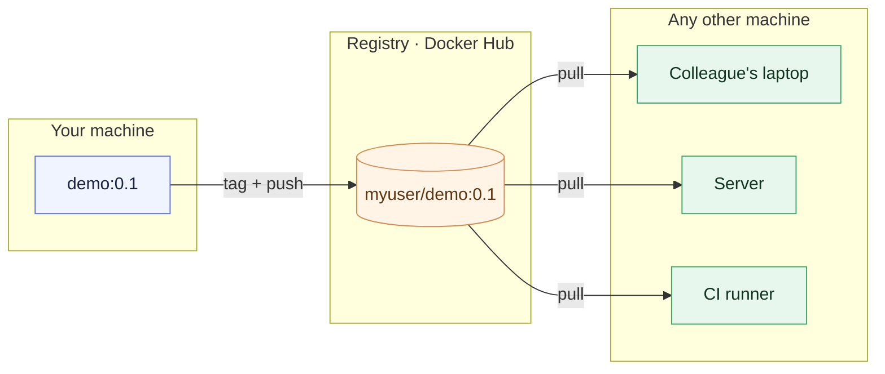

# Chapter 2 — Lesson 4: Working with Registries

> **Learning goal:** pull and push images to a registry, tag them for a
> namespace, and share an image via Docker Hub.

In Lesson 3 we built an image and it landed in our **local** image store —
invisible to teammates, servers, and CI. This lesson is about sharing images
through a **registry**: pulling them down, tagging them for your namespace, and
pushing them up to Docker Hub.

---

## 1. What a registry is

A **registry** is a service that stores and distributes container images. You
have been using one all along: every `FROM python:3.11-slim` **pulls** that base
image from a registry. Unless told otherwise, that registry is **Docker Hub**
(`docker.io`) — Docker's default public registry.

You can pull explicitly, too:

```bash
docker pull python:3.11-slim
```

This downloads the image and its layers into your local store.

---

## 2. How images are named

Pushing requires understanding the full image reference:

```text
docker.io/library/python:3.11-slim
└─ registry ┘└ namespace ┘└ repo ┘└ tag ┘
```

When you type `python:3.11-slim`, Docker fills in the defaults — the `docker.io`
registry and the `library` namespace that holds **official** images. To push
your own image, the namespace must be **your Docker Hub username**.

| Part | Default | Example |
| ---- | ------- | ------- |
| registry | `docker.io` | `ghcr.io`, a private registry |
| namespace | `library` (official) | your username, e.g. `myuser` |
| repository | — | `demo` |
| tag | `latest` | `0.1` |

---

## 3. Sharing an image: login → tag → push

### Log in

```bash
docker login
```

Prompts for your Docker Hub username and a password or **access token**
(tokens are preferred — you can revoke them). Credentials are stored locally.

### Tag

Tagging doesn't copy the image; it adds a second name pointing at the same image:

```bash
docker tag demo:0.1 myuser/demo:0.1
```

`demo:0.1` and `myuser/demo:0.1` now refer to the same image — the second is a
name a registry will accept.

### Push

```bash
docker push myuser/demo:0.1
```

Docker uploads only the layers the registry doesn't already have; the rest are
skipped — the same caching idea as builds, now over the network.

---

## 4. Pulling it back

Once pushed, the image can be pulled by name from any machine — a colleague's
laptop, a server, a CI runner:

```bash
docker pull myuser/demo:0.1
docker run --rm myuser/demo:0.1
```



That round trip — push here, pull there — is how an image travels from your
machine to where it actually runs.

---

## 5. Public, private, and tags

- **Public vs private** — a repository can be public (anyone can pull) or
  private (authentication required). You set this per repository on Docker Hub.
- **Tags matter** — push without a version (`myuser/demo`) and Docker assumes
  `latest`, a *moving* tag that silently changes. Convenient for experiments,
  unreliable for anything real. We return to tagging strategy when preparing
  images for production (Chapter 5).

---

## 6. Try it yourself

The demo script in this folder tags and pushes the `demo:0.1` image from
Lesson 3. Set your Docker Hub username first:

```bash
docker login
DOCKER_USER=myuser bash chapter_2/l4/registry.sh
```

It will `docker tag`, `docker push`, and print the `docker pull` command someone
else would run to fetch your image.

---

In the next lesson we go back to running images — the `docker run` command and
the everyday flags you'll use most.
