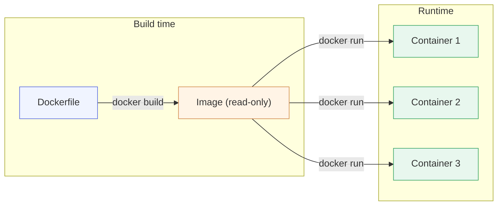
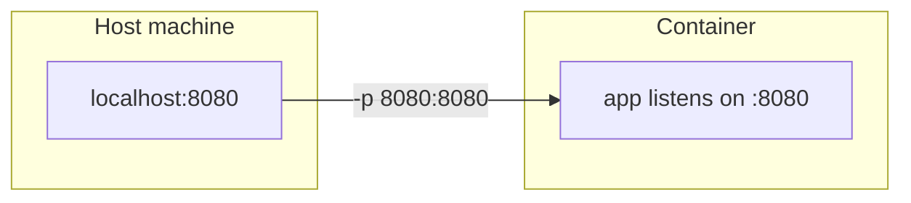
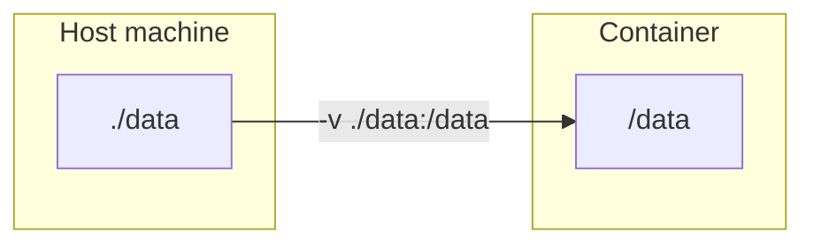
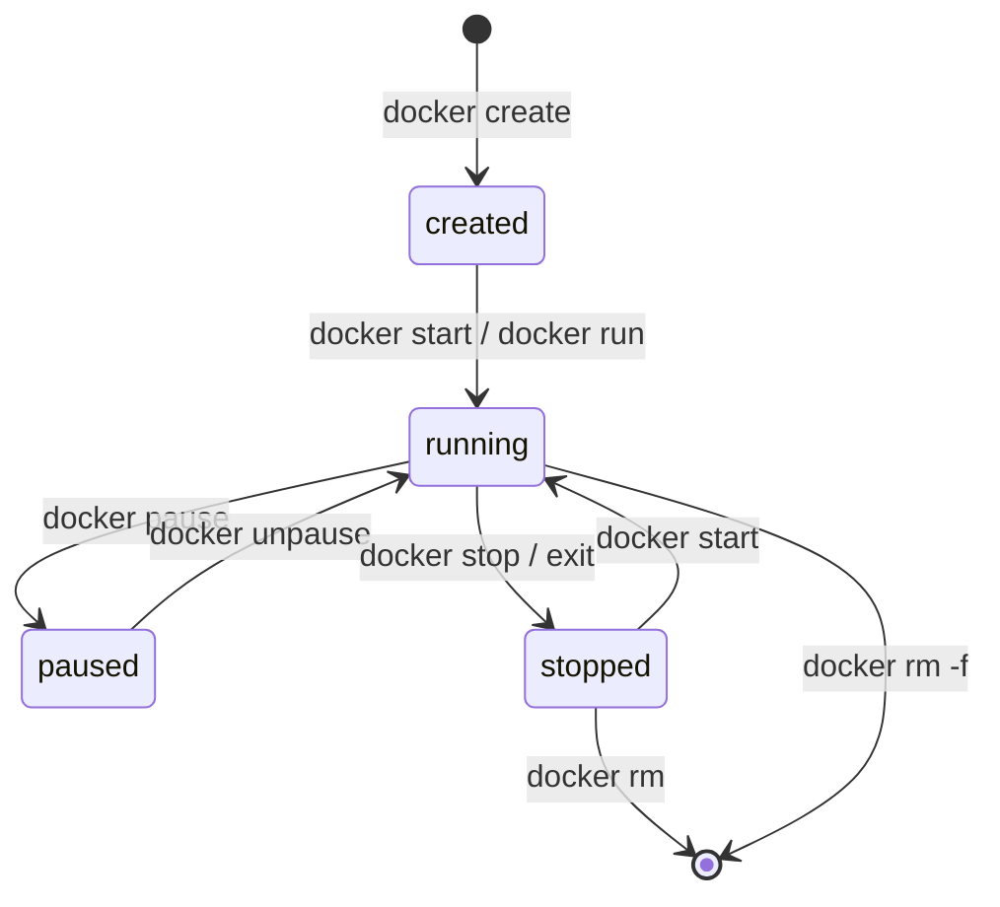

# Chapter 2 — Lesson 5: `docker run`

> **Learning goal:** Run, manage, and inspect containers from an image using
> the everyday `docker run` flags and lifecycle commands.

This lesson focuses on the runtime side of Docker: taking an image
and turning it into one or more running **containers**.

The goal is to leave you with a working mental model of the flags
you will type the most and the lifecycle commands you need to manage
containers day-to-day.

---

## 1. Image vs. container, one more time



* The image is a read-only template.
* Each container gets its own writable layer, its own PID space,
  its own filesystem view, and its own (virtual) network interface.
* You can start, stop, and delete containers freely — the image is
  unaffected.

---

## 2. The command, broken down

```bash
docker run [OPTIONS] IMAGE[:TAG] [COMMAND] [ARG...]
```

* `OPTIONS` — runtime flags (ports, volumes, env vars, …).
* `IMAGE[:TAG]` — which image to base the container on.
* `COMMAND [ARG...]` — *optional*. Overrides the image's `CMD`.

Example:

```bash
docker run --rm python:3.11-slim python -c "print('hi')"
```

This pulls `python:3.11-slim` (if not already local), starts a
container, runs `python -c "print('hi')"`, and removes the container
when it exits — all in one line.

---

## 3. The flags you'll use 90% of the time

| Flag                | What it does                                                        |
| ------------------- | ------------------------------------------------------------------- |
| `-d`                | Detached mode — run in the background, return the container ID.     |
| `--rm`              | Auto-remove the container when it exits.                            |
| `-it`               | Interactive (`-i`) + TTY (`-t`) — needed for shells.                |
| `--name NAME`       | Give the container a stable, human-readable name.                   |
| `-p HOST:CTR`       | Publish a container port to the host.                               |
| `-v SRC:DST`        | Mount a volume or bind a host path into the container.              |
| `-e KEY=VALUE`      | Set an environment variable inside the container.                   |
| `--env-file FILE`   | Load env vars from a `.env`-style file.                             |
| `--network NAME`    | Attach the container to a specific Docker network.                  |
| `--restart policy`  | Restart policy: `no` (default), `on-failure`, `always`, `unless-stopped`. |
| `-w /path`          | Set the working directory (overrides `WORKDIR`).                    |
| `-u UID[:GID]`      | Run the process as a specific user (overrides `USER`).              |

### Ports — `-p`

```bash
docker run -p 8080:8080 rag-api:0.1     # host 8080 -> container 8080
docker run -p 9000:8080 rag-api:0.1     # host 9000 -> container 8080
docker run -p 127.0.0.1:8080:8080 ...   # bind to loopback only
```

`EXPOSE` in the Dockerfile is documentation. `-p` is what actually
opens the port. The container port must match what the app
*actually* listens on, not what `EXPOSE` claims.



The two ports don't have to match — `-p 9000:8080` maps host 9000 to
the container's 8080.

### Volumes — `-v`

Three forms you'll see often:

```bash
# 1. Bind mount: host directory -> container path
docker run -v "$(pwd)/data:/data" rag-api:0.1

# 2. Named volume (Docker manages where the data lives)
docker run -v rag-data:/data rag-api:0.1

# 3. Anonymous volume (use sparingly)
docker run -v /data rag-api:0.1
```

Bind mounts are perfect during development for live-editing source.
Named volumes are better for persistent app state.



### Environment variables — `-e` and `--env-file`

```bash
# Pass a specific variable
docker run -e LOG_LEVEL=debug rag-api:0.1

# Pass through a host env var
docker run -e OPENAI_API_KEY rag-api:0.1

# Load a whole .env file
docker run --env-file .env rag-api:0.1
```

Never bake secrets into the image. Always inject them at run time.

### Interactive — `-it`

```bash
docker run -it --rm python:3.11-slim bash
```

`-i` keeps stdin open; `-t` allocates a TTY. You almost always want
both for an interactive shell.

---

## 4. The full "real-world" command

This is what a production-ish run command looks like:

```bash
docker run -d \
  --name rag-api \
  --restart unless-stopped \
  -p 8080:8080 \
  -v "$(pwd)/data:/data" \
  -e OPENAI_API_KEY="$OPENAI_API_KEY" \
  -e LOG_LEVEL=info \
  rag-api:0.1
```

Detached, named, auto-restarts on failure, publishes one port,
mounts persistent storage, and injects two env vars.

A development equivalent might add `-it` and a bind mount of the
source code:

```bash
docker run -it --rm \
  --name rag-dev \
  -p 8080:8080 \
  -v "$(pwd):/workspace" \
  -w /workspace \
  rag-dev:0.1 \
  bash
```

---

## 5. Lifecycle commands

Once a container is running, these are the commands you'll use to
manage it:

| Command                        | What it does                                            |
| ------------------------------ | ------------------------------------------------------- |
| `docker ps`                    | List running containers.                                |
| `docker ps -a`                 | List all containers (including stopped).                |
| `docker logs <name>`           | Print the container's stdout/stderr.                    |
| `docker logs -f <name>`        | Follow logs in real time.                               |
| `docker exec -it <name> bash`  | Open a shell inside a running container.                |
| `docker exec <name> <cmd>`     | Run a one-off command inside a running container.       |
| `docker stop <name>`           | Send SIGTERM, then SIGKILL after a grace period.        |
| `docker start <name>`          | Start a previously-stopped container.                   |
| `docker restart <name>`        | Stop + start.                                           |
| `docker rm <name>`             | Remove a stopped container.                             |
| `docker rm -f <name>`          | Force-remove (stops first).                             |
| `docker stats`                 | Live CPU/memory/io usage per container.                 |
| `docker inspect <name>`        | Full JSON metadata about the container.                 |



---

## 6. Try it yourself

After building the image from Lesson 3:

```bash
# Start it detached and publish the port
docker run -d --name rag-api -p 8080:8080 demo:0.1

# Check it's listed (note the 0.0.0.0:8080->8080/tcp mapping)
docker ps

# Hit the app from the host
curl http://localhost:8080/

# ...or open it in the browser:
#   http://localhost:8080/        -> JSON from the FastAPI app
#   http://localhost:8080/docs    -> auto-generated Swagger UI

# Look at the logs
docker logs rag-api

# Drop into a shell inside the running container
docker exec -it rag-api bash

# Stop and remove when done
docker rm -f rag-api
```

The script `run.sh` in this folder bundles a typical detached
launch (`docker run -d ...`) so you can see the pattern in one
place.

### Why this pattern matters for AI applications

The `demo:0.1` image is a tiny **FastAPI** app — and that is exactly
how we package and run AI services throughout this course. A
real-world **RAG data-ingestion** service is the same shape: a
FastAPI app exposing an endpoint like `POST /ingest` that chunks
documents, generates embeddings, and writes them to a vector store.

You run it with the *same* `docker run` flags — only the image and
configuration change:

```bash
docker run -d --name rag-ingest \
  -p 8080:8080 \
  -v "$(pwd)/data:/data" \
  -e OPENAI_API_KEY="$OPENAI_API_KEY" \
  rag-ingest:0.1
```

* `-p` publishes the API so you can call `/ingest` and browse `/docs`.
* `-v` mounts the folder of documents to ingest.
* `-e` injects the embedding API key without baking it into the image.

Build the FastAPI image once, then `docker run` it — published,
mounted, and configured — wherever the work needs to happen.

In the next lesson, we will look at **managing containers and images** —
listing, inspecting, debugging, and cleaning up the objects Docker
creates as you work.
