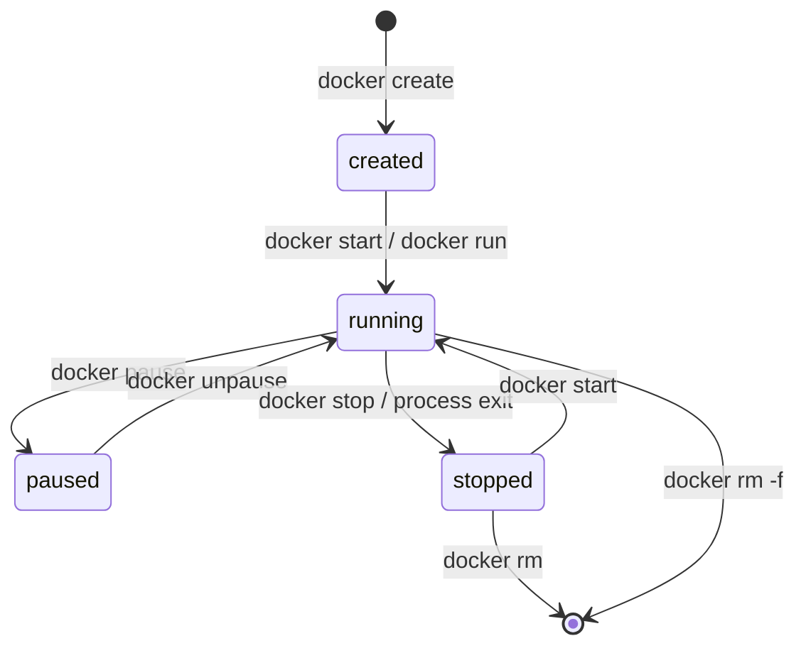

# Chapter 2 — Lesson 6: Managing containers and images

> **Learning goal:** List, inspect, debug, and clean up Docker images,
> containers, volumes, and networks using the `docker` CLI.

By now we can build images and start containers. This lesson is
about everything *between* those two actions: listing, inspecting,
debugging, cleaning up. These are the commands you'll type dozens
of times a day once Docker is part of your workflow.

---

## 1. The four object types

Docker manages four kinds of objects. Each has the same little family
of subcommands (`ls`, `inspect`, `rm`, `prune`).

```mermaid
flowchart TD
    D[Docker engine] --> I[Images]
    D --> C[Containers]
    D --> V[Volumes]
    D --> N[Networks]

    I --> I1["docker images / docker image ls"]
    I --> I2["docker image inspect"]
    I --> I3["docker rmi / docker image rm"]
    I --> I4["docker image prune"]

    C --> C1["docker ps / docker container ls"]
    C --> C2["docker inspect / container inspect"]
    C --> C3["docker rm / docker container rm"]
    C --> C4["docker container prune"]

    V --> V1["docker volume ls"]
    V --> V2["docker volume inspect"]
    V --> V3["docker volume rm"]
    V --> V4["docker volume prune"]

    N --> N1["docker network ls"]
    N --> N2["docker network inspect"]
    N --> N3["docker network rm"]
    N --> N4["docker network prune"]
```



This lesson focuses on **images** and **containers**, the two you
touch every day. Volumes and networks come back in Chapter 3 when
the RAG project introduces multi-service setups.

---

## 2. Listing what's on your machine

### Containers

```bash
docker ps           # running containers only
docker ps -a        # all containers, including stopped
docker ps -q        # just the IDs (handy for scripting)
docker ps -s        # include the writable layer size
docker ps --filter "status=exited"   # filter by status
```

Sample output:

```
CONTAINER ID   IMAGE          COMMAND                  STATUS         PORTS                    NAMES
3b9f1c2a4d5e   demo:0.1       "python main.py"         Up 12 minutes  0.0.0.0:8080->8080/tcp   demo
9a8b7c6d5e4f   chromadb:1.3   "chroma run ..."         Up 12 minutes  0.0.0.0:8000->8000/tcp   chromadb
```

### Images

```bash
docker images                  # short form
docker image ls                # same thing, long form
docker images --filter "dangling=true"   # untagged leftovers
docker image ls --digests      # show content digests
```

Sample output:

```
REPOSITORY      TAG     IMAGE ID       CREATED         SIZE
demo            0.1     7c4e8a1b9f23   3 minutes ago   145MB
python          3.11    a1b2c3d4e5f6   2 weeks ago     1.02GB
<none>          <none>  e5d4c3b2a1f0   1 hour ago      420MB   <-- dangling
```

A `<none>:<none>` entry is a **dangling image** — an old build that
has been replaced. Safe to remove with `docker image prune`.

---

## 3. Looking inside a container

Three commands cover 95% of debugging.

### `docker logs` — see what the app is saying

```bash
docker logs demo                # everything written so far
docker logs -f demo             # follow in real time (like tail -f)
docker logs --tail 100 demo     # only the last 100 lines
docker logs --since 10m demo    # only the last 10 minutes
```

### `docker exec` — run a command inside a running container

```bash
docker exec -it demo bash       # interactive shell
docker exec demo ls -la /app    # one-off command
docker exec demo env            # show env vars actually visible
docker exec -u root demo bash   # exec as a different user
```

This is the single most useful debugging tool in Docker. If
something looks wrong, get inside and look around.

### `docker inspect` — full JSON metadata

```bash
docker inspect demo
docker inspect demo | jq '.[0].Config.Env'
docker inspect demo | jq '.[0].NetworkSettings.IPAddress'
docker inspect demo | jq '.[0].Mounts'
```

Anything Docker knows about the container is in there: mounts, env,
network, the exact command being run, restart policy, etc.

### Bonus: live resource use

```bash
docker stats              # live CPU / memory / I/O for all containers
docker stats demo         # just one container
docker top demo           # the processes running inside the container
```

---

## 4. Container lifecycle commands



| Command                  | What it does                                              |
| ------------------------ | --------------------------------------------------------- |
| `docker stop <name>`     | SIGTERM, then SIGKILL after `--time` (default 10s).        |
| `docker kill <name>`     | Immediate SIGKILL.                                        |
| `docker start <name>`    | Start a stopped container with its original config.       |
| `docker restart <name>`  | Stop + start.                                             |
| `docker pause <name>`    | Freeze all processes inside (rare).                       |
| `docker unpause <name>`  | Resume from `pause`.                                      |
| `docker rename old new`  | Change the friendly name without restarting.              |
| `docker rm <name>`       | Remove a stopped container.                               |
| `docker rm -f <name>`    | Force remove (stops first).                               |

---

## 5. Removing images

```bash
docker rmi demo:0.1             # remove one image
docker image rm demo:0.1        # same thing, long form
docker rmi -f demo:0.1          # force, even if a container uses it
```

Docker refuses to remove an image if **any** container — running or
stopped — depends on it. The fix is usually `docker rm` first, then
`docker rmi`.

---

## 6. Cleaning up disk space

Builds and runs accumulate quickly. After a few weeks of active
development it is normal to have 50+ GB of unused Docker data on
disk.

### Step 1 — see what's using the space

```bash
docker system df
```

```
TYPE            TOTAL     ACTIVE    SIZE      RECLAIMABLE
Images          24        4         18.2GB    14.1GB (77%)
Containers      9         2         142MB     128MB (90%)
Local Volumes   12        3         3.4GB     2.1GB (61%)
Build Cache     188       0         9.7GB     9.7GB
```

Add `-v` for a per-object breakdown.

### Step 2 — targeted prunes

```bash
docker container prune          # remove all stopped containers
docker image prune              # remove dangling images only
docker image prune -a           # remove every image not used by a container
docker volume prune             # remove volumes not used by any container
docker network prune            # remove unused custom networks
docker builder prune            # remove the BuildKit cache
```

Each command prompts for confirmation. Add `-f` to skip the prompt.

### Step 3 — the nuclear option

```bash
docker system prune             # containers + networks + dangling images
docker system prune -a          # ... and all unused images
docker system prune -a --volumes # ... and all unused volumes
```

`--volumes` is irreversible — it deletes named volumes that aren't
attached to any container, including the `chroma_data` volume from
this project if the chroma container is down. Use with care.

---

## 7. A handful of quality-of-life flags

| Flag / variant                           | Why                                                       |
| ---------------------------------------- | --------------------------------------------------------- |
| `docker ps --format '{{.Names}}\t{{.Status}}'` | Clean tabular output without the noise.             |
| `docker logs --timestamps demo`          | Prefix each log line with a timestamp.                    |
| `docker exec -e DEBUG=1 demo my-cmd`     | Set an env var just for this one `exec` call.             |
| `docker container ls --filter "name=rag"`| Show only containers whose name matches `rag`.            |
| `docker image ls --filter "reference=rag-*"` | Filter images by name pattern.                        |
| `docker inspect --format '{{.State.Health.Status}}' demo` | Pull a single field without `jq`.       |

---

## 8. Try it yourself

After running the container from Lesson 5:

```bash
# What's running?
docker ps

# What does it have to say?
docker logs -f demo

# Get inside and poke around
docker exec -it demo bash
> env
> ps aux
> exit

# Find the IP and port mappings
docker inspect demo | jq '.[0].NetworkSettings'

# Check disk usage
docker system df

# Tidy up
docker stop demo
docker rm demo
docker image prune
```

A handful of commands, but together they cover the day-to-day
operational side of Docker.

---

## 9. Cheat sheet

| Question                                 | Command                              |
| ---------------------------------------- | ------------------------------------ |
| What containers are running?             | `docker ps`                          |
| What containers exist at all?            | `docker ps -a`                       |
| What images do I have?                   | `docker images`                      |
| What is this container doing?            | `docker logs -f <name>`              |
| Let me into the container.               | `docker exec -it <name> bash`        |
| What is this container's config?         | `docker inspect <name>`              |
| Stop / start / restart.                  | `docker stop|start|restart <name>`   |
| Remove a container.                      | `docker rm <name>`                   |
| Remove an image.                         | `docker rmi <image>`                 |
| Live resource usage.                     | `docker stats`                       |
| How much disk am I using?                | `docker system df`                   |
| Clean up safely.                         | `docker container prune` + `docker image prune` |
| Clean up aggressively.                   | `docker system prune -a`             |

In the next lesson — the last in this chapter — we turn to Dockerfile
**best practices**: how to write Dockerfiles that produce smaller,
faster, more reproducible, and more secure images.
