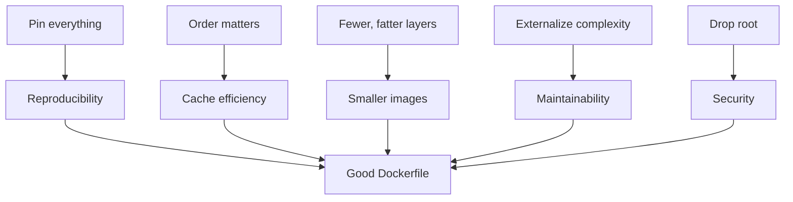
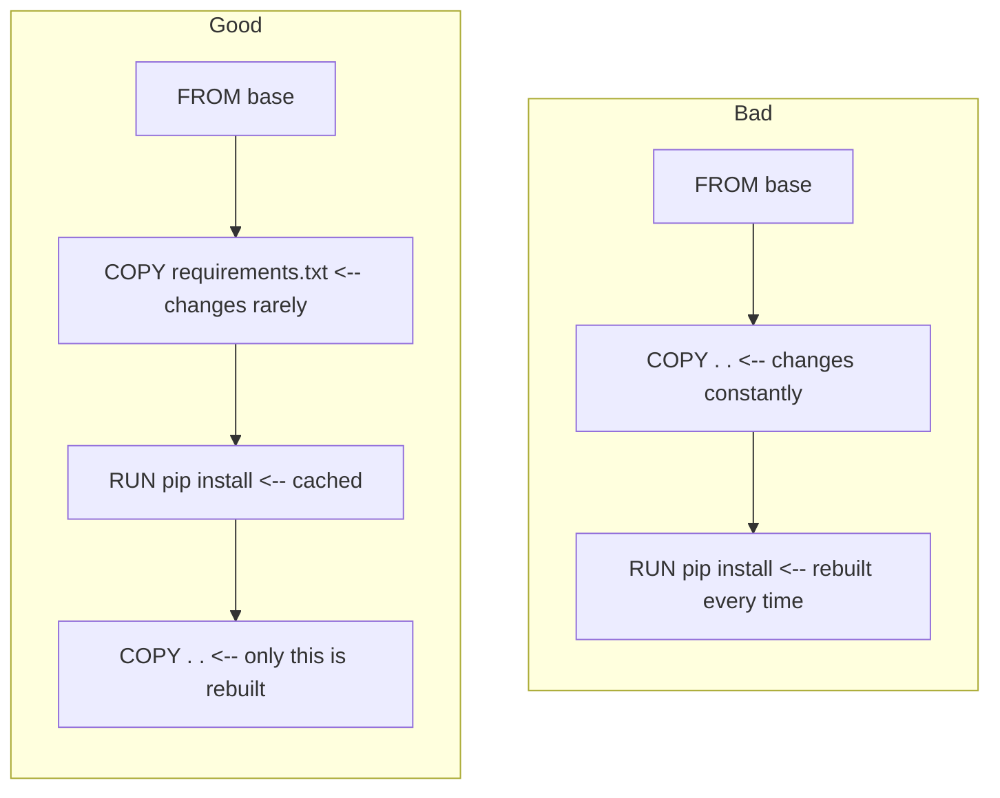
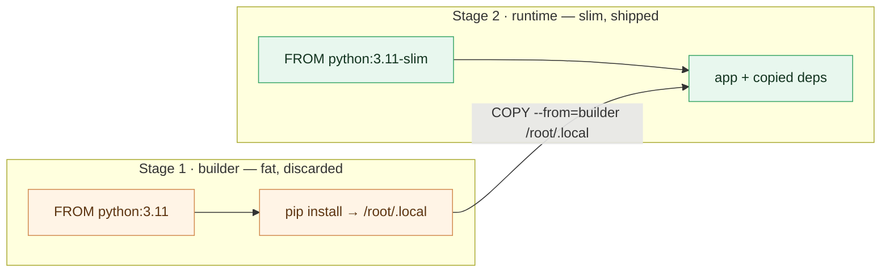

# Chapter 2 — Lesson 7: Dockerfile best practices

> **Learning goal:** Apply Dockerfile best practices to produce images that
> are smaller, faster to build, more reproducible, and more secure.

The previous lessons showed how to write, build, and run a Dockerfile.
This lesson is about *how to write a Dockerfile well*: smaller images,
faster builds, fewer surprises in production.

Each section pairs a rule with a short before/after example and, where
relevant, points at the version of that pattern actually used in this
repo's `docker/` folder.

---

## 1. The mental model: layers, cache, and reproducibility



Every "best practice" below maps to one of these five outcomes. Keep
them in mind when reading the rules.

---

## 2. Pin everything

**Rule.** Never depend on `latest`. Pin base images, system packages,
and language dependencies.

```dockerfile
# Bad
FROM python
RUN apt-get install -y curl
RUN pip install fastapi

# Good
FROM python:3.11-slim
RUN apt-get update && apt-get install -y --no-install-recommends \
        curl=7.88.* \
    && rm -rf /var/lib/apt/lists/*
RUN pip install --no-cache-dir fastapi==0.115.0
```

For maximum reproducibility, pin the base image by digest:

```dockerfile
FROM python:3.11-slim@sha256:<digest>
```

In this repo, the API image pins to a slim, versioned base
(`docker/Dockerfile_API` → `FROM python:3.11-slim`) and Python deps
live in `docker/requirements-api.txt`.

---

## 3. Order for cache efficiency

**Rule.** Put rarely-changing instructions at the top, frequently-
changing ones at the bottom.



The "Good" layout reinstalls dependencies only when
`requirements.txt` actually changes.

---

## 4. `ARG` and `ENV`, used deliberately

**Rule.** `ARG` for build-time knobs, `ENV` for runtime configuration.
Use both when a value is set at build time but must be visible at
runtime.

```dockerfile
ARG PYTHON_VER="3.11"
ARG VENV_NAME="my_project"

ENV PYTHON_VER=$PYTHON_VER
ENV VENV_NAME=$VENV_NAME

COPY install_uv.sh settings/
RUN bash ./settings/install_uv.sh $VENV_NAME $PYTHON_VER
```

Override at build time without editing the Dockerfile:

```bash
docker build --build-arg PYTHON_VER=3.12 -t dev:0.1 .
```

This is exactly the pattern in `docker/Dockerfile_Dev` /
`docker/build_dev_docker.sh`.

| Use case                         | Use `ARG`? | Use `ENV`? |
| -------------------------------- | ---------- | ---------- |
| Tool / language version          | ✓          | (optional) |
| Feature flag for the build       | ✓          | ✗          |
| Build-time secret                | ✓ (or `--mount=type=secret`) | ✗ |
| Runtime config (paths, URLs)     | ✗          | ✓          |
| Runtime secret                   | ✗          | inject via `-e` at run |

---

## 5. One `RUN`, not five

**Rule.** Group related commands into a single `RUN` and clean up in
the same layer.

```dockerfile
# Bad — three layers, apt cache left behind
RUN apt-get update
RUN apt-get install -y curl git
RUN rm -rf /var/lib/apt/lists/*

# Good — one layer, no leftover cache
RUN apt-get update \
    && apt-get install -y --no-install-recommends curl git \
    && rm -rf /var/lib/apt/lists/*
```

Why this matters: `rm -rf /var/lib/apt/lists/*` in a *later* layer
does not shrink the image. The cache is already baked into the
previous layer.

Same idea for `pip`:

```dockerfile
# Good
RUN pip install --no-cache-dir -r requirements.txt
```

`--no-cache-dir` prevents pip from writing its wheel cache into the
image.

---

## 6. Move complex setup into scripts

**Rule.** When a `RUN` grows past ~5 lines, extract it.

```dockerfile
# Before — 30-line RUN inside the Dockerfile
RUN apt-get update && apt-get install -y curl git zsh ... \
    && sh -c "$(curl -fsSL .../oh-my-zsh/install.sh)" -s --batch \
    && chsh -s $(which zsh) \
    && ... 30 more lines ...

# After — Dockerfile stays readable
COPY install_dependencies.sh settings/
RUN bash ./settings/install_dependencies.sh
```

Benefits:

* The script is easy to test on its own.
* The Dockerfile becomes a high-level outline of what's installed.
* The script is editable without re-reading the whole Dockerfile.

This is exactly how `docker/Dockerfile_Base` is structured: the
heavy lifting lives in `install_dependencies.sh`, `install_quarto.sh`,
and `setting_git.sh`.

---

## 7. `.dockerignore` is non-optional

**Rule.** Always have a `.dockerignore` and exclude anything that
isn't needed for the build.

```text
# .dockerignore
.git
__pycache__/
*.pyc
.venv/
node_modules/
.env
.env.*
chroma_data/
*.log
.DS_Store
.pytest_cache/
.ruff_cache/
```

Benefits:

* Faster builds — less data sent to the build engine.
* Smaller images — `COPY . .` no longer drags in caches and secrets.
* Better cache hits — irrelevant file changes no longer invalidate
  the layer.

---

## 8. Drop root

**Rule.** Production containers should not run as root.

```dockerfile
RUN useradd -m -u 1000 -s /bin/bash appuser \
    && chown -R appuser:appuser /app
USER appuser
```

Even better, use a fixed UID/GID so the user ID is predictable when
bind-mounting host directories.

For development containers, root is often acceptable (it keeps bind
mounts simple). The trade-off should be a conscious one.

---

## 9. Keep secrets and data out of the image

**Rule.** Never bake secrets or data into the image.

API keys, passwords, and credentials must never be hard-coded into a
Dockerfile — not via `ENV OPENAI_API_KEY=...`, and not by `COPY`-ing a
`.env` file. Image layers are cached, shared, and pushed to registries,
and anyone who has the image can read them back:

```dockerfile
# Bad — the key is baked into a layer, visible via `docker history`
ENV OPENAI_API_KEY=sk-...
COPY .env /app/.env
```

```bash
# Good — inject secrets at runtime; keep data in a mounted volume
docker run -e OPENAI_API_KEY --env-file .env \
    -v "$PWD/data:/app/data" my-image
```

The same logic applies to application data: an image is a static,
shareable artifact, not a datastore. Combined with a `.dockerignore`
that excludes `.env` (practice 7), a secret can't even reach the build
context. Chapter 5 takes image security further — pinned bases and
vulnerability scanning.

---

## 10. Exec form for `CMD` and `ENTRYPOINT`

**Rule.** Always use the JSON array form.

```dockerfile
# Bad — wrapped in /bin/sh -c, SIGTERM not forwarded
CMD python main.py

# Good — exec form, app receives signals directly
CMD ["python", "main.py"]
```

Why it matters: when you `docker stop` a container running under
`/bin/sh -c ...`, the shell receives `SIGTERM`, not your app, and
your app gets killed ungracefully 10 seconds later.

---

## 11. A few smaller habits

| Habit                                       | Reason                                                      |
| ------------------------------------------- | ----------------------------------------------------------- |
| Prefer `COPY` over `ADD`.                   | `ADD` has hidden behaviors (URL fetch, tarball extraction). |
| Add a `HEALTHCHECK`.                        | Docker / orchestrators can know when the app is ready.      |
| Add OCI `LABEL`s.                           | Searchable, inspectable metadata.                           |
| Use `--no-install-recommends` with `apt`.   | Skips optional packages, often halves install size.         |
| Set `PYTHONDONTWRITEBYTECODE=1`.            | No `.pyc` files written into the image.                     |
| Set `PYTHONUNBUFFERED=1`.                   | Real-time log output, no buffering surprises.               |
| Multi-stage builds for compiled languages.  | Build in a fat image, copy artifacts into a slim one.       |

### A multi-stage example

```dockerfile
# --- builder stage ---
FROM python:3.11 AS builder
WORKDIR /app
COPY requirements.txt .
RUN pip install --user --no-cache-dir -r requirements.txt

# --- runtime stage ---
FROM python:3.11-slim
WORKDIR /app
COPY --from=builder /root/.local /root/.local
COPY . .
ENV PATH=/root/.local/bin:$PATH
EXPOSE 8080
CMD ["python", "main.py"]
```



The build toolchain stays in `builder` and never ships to
production.

---

## 12. Putting it all together

The `Dockerfile.good` in this folder is the "after" version of a
small Python API. The `Dockerfile.bad` is the same thing written
without any of these rules. Read them side by side:

```bash
diff chapter_2/l5/Dockerfile.bad chapter_2/l5/Dockerfile.good
```

You will see in one place:

* Pinned base image and pinned dependencies.
* Dependency layer separated from source layer.
* Single `RUN` for `apt-get`, with cleanup.
* `ARG` + `ENV` pair for the Python version.
* `.dockerignore` keeping the context small.
* Non-root user.
* Exec-form `CMD`.

---

## 13. Cheat sheet

| Rule                                | Why                                  |
| ----------------------------------- | ------------------------------------ |
| Pin base images and packages.        | Reproducibility.                     |
| Stable instructions first, volatile last. | Cache efficiency.                |
| Use `ARG` + `--build-arg` for build knobs. | Configurable builds.            |
| Use `ENV` for runtime config.        | Override with `docker run -e`.       |
| One `RUN` with cleanup.              | Smaller images.                      |
| Extract long `RUN`s into scripts.    | Readability.                         |
| Maintain a `.dockerignore`.          | Faster builds, smaller images.       |
| Run as non-root.                     | Security.                            |
| Exec form for `CMD`/`ENTRYPOINT`.    | Signal handling.                     |
| Multi-stage when compiling.          | Drop the toolchain from runtime.     |

Apply these and your Dockerfile will already be in the top decile
of what most teams ship. In the next chapter, we return to the RAG
project and put every one of these rules into practice on a real
application.
