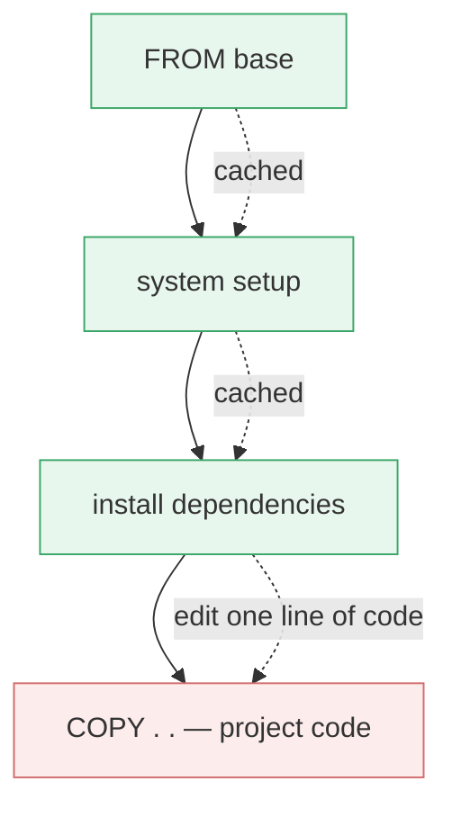
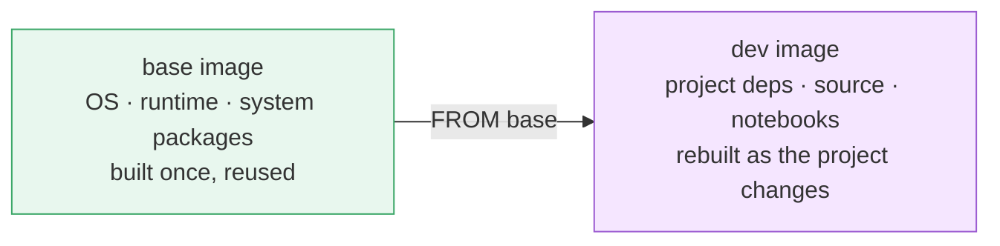

# Chapter 3 — Lesson 1: Designing Images for Change

> **Learning goal:** Structure a Docker image so the elements most likely to
> change sit in the last layers, and use the build cache to keep rebuilds fast
> as requirements evolve during development.

Chapter 3 is where we start building. Over the next five lessons we take the
RAG application from idea to a working prototype, developed entirely inside
containers. This first lesson is a strategy lesson: how to design an image so
that the constant churn of prototyping doesn't cost you a slow rebuild every
time.

---

## 1. Requirements change — constantly

You start a project with a set of requirements, but they never hold still.
During a prototype you add a library, bump a version, pull in a model,
restructure the code — many times a day. Every change means rebuilding the
image.

The question this lesson answers is not *how* to rebuild (we covered
`docker build` in Chapter 2), but how to structure the image so rebuilds stay
**fast** while the requirements keep moving.

---

## 2. The cache cascade

Recall from Chapter 2 that Docker turns most Dockerfile instructions into a
read-only **layer**, and that on a rebuild it reuses cached layers until it
hits one whose inputs changed. From that point down, **everything is
rebuilt**.



A change at the bottom only rebuilds the bottom. A change near the top
rebuilds the top **and everything below it**. The order of instructions
decides how expensive a change is.

---

## 3. The principle: stable on top, volatile on the bottom

> Put the things that rarely change at the **top** of the Dockerfile, and the
> things that change constantly at the **bottom**.

You want the parts you touch every hour to live in the last possible layer,
so a change there invalidates as little as possible.

The textbook case is dependencies versus source code:

```dockerfile
# Fragile — code copied before dependencies.
# Editing any code re-runs pip install for everything.
COPY . .
RUN pip install -r requirements.txt
```

```dockerfile
# Cache-friendly — dependencies first, code last.
# pip install only re-runs when requirements.txt changes.
COPY requirements.txt .
RUN pip install -r requirements.txt
COPY . .
```

In the fragile version, a one-line code edit invalidates the `pip install`
layer and reinstalls every dependency. In the cache-friendly version, the same
edit only rebuilds the final `COPY` — a sub-second rebuild.

---

## 4. The three tiers of our dev image

Map the principle onto what we're building. Our RAG development image has
roughly three tiers of stability:

| Tier | What's in it | How often it changes | Where it goes |
| ---- | ------------ | -------------------- | ------------- |
| Foundation | Base OS, system packages, language runtime, shell | Rarely | Top |
| Dependencies | Python libraries (`requirements.txt`) | Sometimes | Middle |
| Project code | Our own modules and notebooks | Constantly | Bottom |

Order the Dockerfile to match. The further down a change lives, the cheaper
the rebuild — and during a prototype, where the bottom tier changes most, that
is most of your rebuilds.

---

## 5. The next move: split the stable tier out entirely

If the foundation almost never changes, why rebuild it at all? We can split
the work into **two images**:

* A **base image** carrying the heavy, stable tooling — built once, reused.
* A **dev image** built `FROM` the base, carrying only the project-specific
  pieces — rebuilt as the project changes.



This is exactly how the project is structured (`docker/Dockerfile_Base` and
`docker/Dockerfile_Dev`). We'll cover the split in detail in **Lesson 5**; for
now, just note that "stable on top, volatile on the bottom" eventually scales
into "stable in one image, volatile in another."

---

## 6. Takeaways

* Every rebuild reuses cached layers until the first changed instruction, then
  rebuilds the rest. Order is everything.
* Stable instructions first, volatile instructions last.
* Copy dependency manifests and install **before** copying source code.
* Think in tiers: foundation → dependencies → project code.
* When the foundation is stable enough, lift it into its own base image.

---

## What's next

Our application is more than one image. **Lesson 2** introduces **Docker
Compose** to define and orchestrate the multi-container RAG environment — a
Python development container and a ChromaDB vector database.
