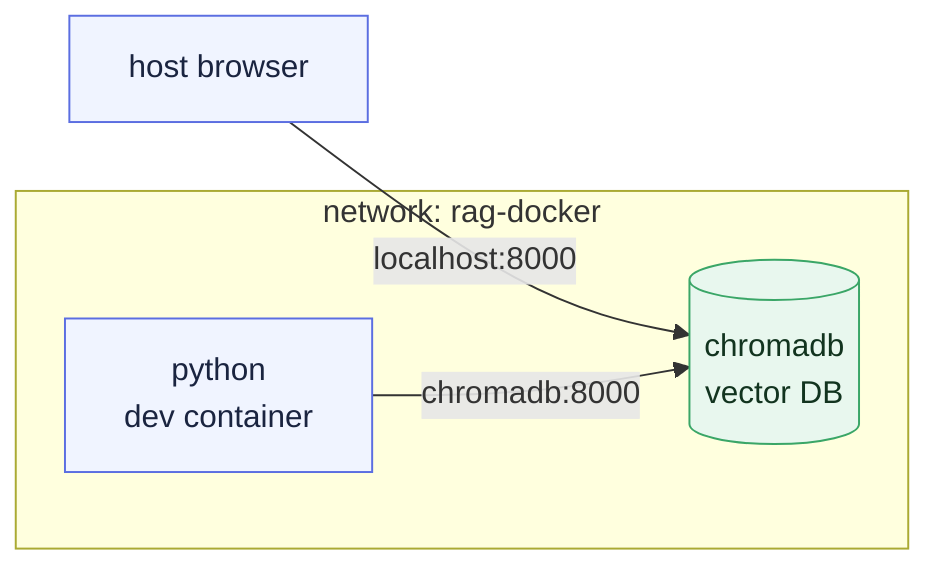

# Chapter 3 — Lesson 2: Docker Compose

> **Learning goal:** Use Docker Compose to define and orchestrate the
> multi-container RAG environment (a Python dev container and a ChromaDB
> container), and bring it up, verify it, and tear it down from the terminal.

Our RAG application is not a single container. This lesson introduces **Docker
Compose** — the tool that defines and runs a multi-container environment from
one declarative file. It has two parts: the concepts (the slides), then a
hands-on terminal walkthrough using the `docker-compose.yaml` in this folder.

---

## 1. Why Compose

A single container is easy: one `docker run` with some flags. The moment you
have two or three containers that must start together, talk to each other, and
share configuration, juggling individual `docker run` commands becomes
painful.

Docker Compose replaces those commands with a single **declarative** file.
Everything you used to pass as a flag — image, ports, volumes, environment,
network — becomes a line in `docker-compose.yaml`. The file is
version-controlled and reproducible: everyone on the team gets the identical
environment with one command.

---

## 2. Anatomy of a Compose file

A Compose file describes a set of **services**. Each service becomes a
container.

```yaml
networks:
  rag-docker:
    driver: bridge

services:
  python:
    image: docker.io/rkrispin/python-dev-rag-docker:0.0.3
    volumes:
      - .:/workspace:cached
    command: sleep infinity
    depends_on:
      - chromadb
    networks:
      - rag-docker

  chromadb:
    image: chromadb/chroma:1.3.5
    ports:
      - 8000:8000
    volumes:
      - ./chroma_data:/chroma/chroma
    networks:
      - rag-docker
```

| Key | What it does |
| --- | ------------ |
| `image` | Which image backs the service. |
| `volumes` | Bind-mount host paths into the container (code, data). |
| `command` | Override the container's default command. |
| `depends_on` | Start order — `python` waits for `chromadb`. |
| `ports` | Publish a container port to the host. |
| `networks` | The shared network the services join. |

> The `python` service runs `sleep infinity`. We don't give the dev container
> a job — we keep it alive so we can attach to it and develop inside it.

---

## 3. The two services of our RAG prototype

| Service | Role | Where the image comes from |
| ------- | ---- | -------------------------- |
| `python` | Development container — where we write and run code | **We build it** (our dev image) |
| `chromadb` | Vector database — stores embeddings | **Off-the-shelf** prebuilt image |

This split is a pattern worth internalizing:

* **Infrastructure** — databases, queues, caches — are usually **dedicated,
  prebuilt images** maintained by their authors. You don't Dockerize ChromaDB
  or Postgres; you pin a known-good version and run it.
* **Your application** goes in images **you** build.

Compose is what stitches the two kinds together into one environment.

---

## 4. How the containers talk

Both services join the user-defined `rag-docker` network. On that network,
each service is reachable by its **service name** as a hostname — no IP
addresses required.



Our Python code connects to the database at host `chromadb`, port `8000`.
Because we also published port `8000`, the host can reach it at
`localhost:8000` for inspection.

---

## 5. Hands-on: bring it up, check it, tear it down

Run these from the `chapter_3/l2` folder, where the example
`docker-compose.yaml` lives.

```bash
# Start the whole environment in the background
docker compose up -d

# Confirm both containers are running
docker compose ps

# Check the database is responding (from the host)
curl http://localhost:8000/api/v2/heartbeat

# Look at a service's logs
docker compose logs chromadb

# Prove service-name networking from inside the python container
docker compose exec python bash
#   then, inside the container:
curl http://chromadb:8000/api/v2/heartbeat   # note: hostname is "chromadb"
exit

# Stop and remove the containers and the network
docker compose down
```

`docker compose ps` should show two services, `python` and `chromadb`, both in
the `running`/`Up` state. The heartbeat endpoint returns a JSON timestamp when
the database is alive.

> `docker compose down` removes the containers and network, but the ingested
> data survives because it lives in the mounted `./chroma_data` volume.

### Common gotcha: port 8000 is already in use

If `docker compose up -d` fails with an error like:

```text
Bind for 0.0.0.0:8000 failed: port is already allocated
```

it means another process or container is already using port `8000` on your
host machine. First, check what is using the port:

```bash
lsof -i :8000
```

If the port belongs to another Docker container, you can also inspect running
containers:

```bash
docker ps --format "table {{.Names}}\t{{.Ports}}"
```

Then choose one of these fixes:

* Stop the process or container that is already using port `8000`.
* Or change only the **host** side of the port mapping in
  `docker-compose.yaml`.

For example, change:

```yaml
ports:
  - 8000:8000
```

to:

```yaml
ports:
  - 8001:8000
```

The left side is the host port, and the right side is the container port. With
this change, ChromaDB still listens on port `8000` inside the Docker network,
but your host reaches it at `localhost:8001`.

After editing the compose file, restart the environment:

```bash
docker compose down
docker compose up -d
```

### Compose command cheat sheet

| Intent | Command |
| ------ | ------- |
| Start everything (detached) | `docker compose up -d` |
| Are the containers alive? | `docker compose ps` |
| Follow logs | `docker compose logs -f <service>` |
| Shell into a service | `docker compose exec <service> bash` |
| Restart one service | `docker compose restart <service>` |
| Stop and remove | `docker compose down` |

---

## What's next

We can start the environment, but to run code we still have to shell into the
container. **Lesson 3** connects our editor directly to this environment with
**Dev Containers**, so development feels local while running fully inside the
container.
