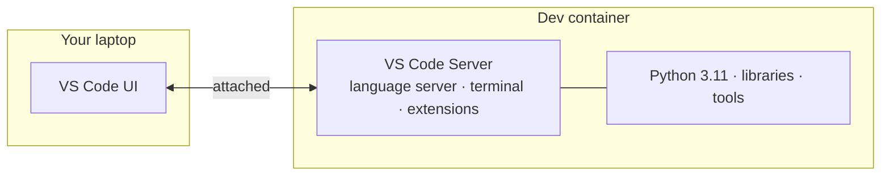
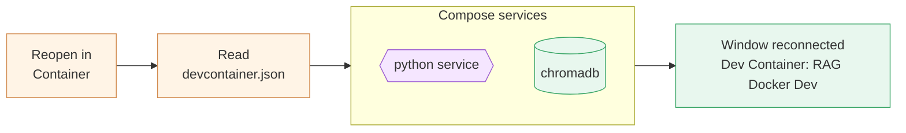

# Chapter 3 — Lesson 3: Dev Containers

> **Learning goal:** Configure a VS Code Dev Container that attaches your
> editor to the containerized environment — with project-level extensions and
> mounts — backed by the same Docker Compose setup.

Compose brings the environment up, but to run anything we had to shell into
the container; our editor stayed on the host, disconnected from where the code
runs. This lesson closes that gap with **Dev Containers**. Concepts first (the
slides), then a hands-on walkthrough opening the project as a dev container.
The example config is in this folder (`devcontainer.json`); the project's real
one lives at `.devcontainer/devcontainer.json`.

---

## 1. What a Dev Container is

A Dev Container moves the development experience *into* the container. VS Code
keeps its window on your host, but the **server side** of the editor — the
language server, the integrated terminal, the debugger, notebook kernels, and
the extensions — all run inside the container.



The result is **full isolation**: the container has the exact runtime,
libraries, and tools; your laptop stays clean; and the environment your editor
sees is identical to the one that runs in test and production.

---

## 2. Why it matters: one world, not two

| | Without a dev container | With a dev container |
| --- | --- | --- |
| Editor runs against | Whatever is on your host | The container's environment |
| Reaching the container | `docker exec` into it | You're already inside |
| IntelliSense / go-to-def | Host's interpreter & libs | Container's interpreter & libs |
| "Works on my machine" | Still possible | Eliminated for the editor too |

Without it, the editor and the runtime are two different worlds. With it,
there's one — what you see is what runs.

---

## 3. The configuration

Everything lives in `.devcontainer/devcontainer.json`. The features that make
it powerful:

### a. Build on what you already have

Instead of defining a new environment, point at the **same
`docker-compose.yaml`** from Lesson 2 and pick a service:

```json
"dockerComposeFile": ["../docker-compose.yaml"],
"service": "python",
"workspaceFolder": "/workspace/"
```

A dev container can attach to a Compose service **or** to a plain image —
either works.

### b. Project-level extensions

List the extensions the project needs; they're installed **inside the
container**, scoped to this project, so every teammate gets the same editor
toolchain:

```json
"customizations": {
  "vscode": {
    "settings": {
      "python.defaultInterpreterPath": "/opt/python-3.11-dev/bin/python3"
    },
    "extensions": [
      "ms-python.python",
      "charliermarsh.ruff",
      "ms-toolsai.jupyter"
    ]
  }
}
```

### c. Mounts and forwarded ports

Mount folders from **beyond** the project directory (a shared cache, a
credentials file, shell history) and auto-publish app ports to your browser:

```json
"mounts": [
  "source=${localEnv:HOME}/.zsh_history_dev,target=/root/.zsh_history,type=bind"
],
"forwardPorts": [8501, 8080]
```

`forwardPorts` means a Streamlit app on `8501` simply opens on the host — no
manual port mapping.

---

## 4. Hands-on: reopen in container

1. Open the project in VS Code (with the **Dev Containers** extension
   installed).
2. Click the green remote indicator in the bottom-left corner.
3. Choose **"Reopen in Container."**

VS Code reads `.devcontainer/devcontainer.json`, starts the Compose services
(`python` plus `chromadb`), and reconnects the window to the running
container. The first time it builds; afterwards it's quick. The remote
indicator now reads **"Dev Container: RAG Docker Dev"** — you're inside.



### Verify you're really inside the container

Open the integrated terminal (it runs in the container) and check the
interpreter:

```bash
which python        # /opt/python-3.11-dev/bin/python
python --version    # the version we pinned in the image
```

The Extensions panel shows Python, Ruff, and Jupyter installed **in the
container**. From here, opening a file gives full IntelliSense against the
container's libraries, the database is reachable at `chromadb:8000`, and
forwarded ports open in the browser.

---

## What's next

Our editor and runtime are finally the same environment. **Lesson 4** puts it
to work — developing the RAG application inside this container, with notebooks,
a dashboard, and an AI coding assistant in the loop.
