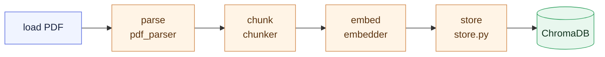
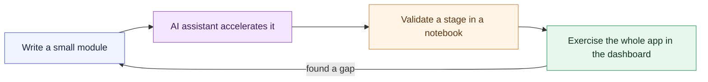

# Chapter 3 — Lesson 4: Developing Inside the Container

> **Learning goal:** Develop the RAG application inside the dev container —
> writing modules and validating them with notebooks and a Streamlit
> dashboard — with an AI coding assistant in the loop.

The environment is ready: Compose brings up the services, and the dev
container wires the editor into them. Now we do the thing all of that was for —
**develop the application**. A short setup on the slides, then we move into VS
Code and work with the real RAG project.

---

## 1. No gap between writing and running

Developing inside the container removes the gap between writing code and
running it. The interpreter, the libraries, and the database are all already
here — you import a library and it's the pinned version, you connect to
ChromaDB and it's on the network.

There's only one environment to maintain, and it's the one that ships. That
tight loop is what makes a containerized prototype productive.

---

## 2. AI assistants in the loop

AI coding assistants — **Claude Code**, or in-editor assistants — run in the
same workspace and see the same files. They're excellent at:

* scaffolding a new module,
* drafting a first version of a function,
* generating tests,
* explaining unfamiliar code.

The design is still yours. Assistants are fastest when you've already decided
*what* the pieces are and *how* they connect (the strategy work from Chapters 1
and 3). **You bring the architecture; the assistant accelerates the typing.**

---

## 3. Two practices that keep a prototype clean

### Develop in modules, not one giant script

The RAG code is split by responsibility — each a small, importable piece:

| Module | Responsibility |
| ------ | -------------- |
| `rag/ingestion/pdf_parser.py` | Parse a PDF into structured elements |
| `rag/ingestion/chunker.py` | Split elements into chunks |
| `rag/ingestion/embedder.py` | Turn chunks into embeddings |
| `rag/store.py` | Read/write vectors in ChromaDB |
| `rag/retrieval/chain.py` | Retrieve context and query the LLM |

Small modules are easier to test, easier to reason about, and easier to ask an
assistant to change without breaking everything else.

### Validate as you go, interactively

Two tools make a prototype fast to verify:

* **Notebooks** — step through a pipeline cell by cell, inspecting each stage's
  output before wiring stages together.
* **An interactive dashboard** — exercise the whole system end to end, the way
  a user would.

---

## 4. Hands-on: notebook → dashboard

Everything below runs inside the dev container.

### a. Step through the ingestion notebook

Open `notebooks/01_pdf_ingestion.ipynb`. Because we're in the container, the
Jupyter kernel **is** the container's interpreter — the same one the modules
run under. Step through the cells:



The notebook is where we *develop and verify* the pipeline a stage at a time.
Note the boundary crossing: the notebook runs in the `python` container, and
the store step writes to the `chromadb` container over the network from Lesson
2 — the whole multi-container environment is exercised from one cell.

> See also `notebooks/02_pdf_ingestion.ipynb` and
> `notebooks/03_query_the_pdf.ipynb` for the query side.

### b. Run the Streamlit dashboard

Once the pipeline works, test the full application through the dashboard in
`clients/streamlit_app.py`. From the integrated terminal:

```bash
bash clients/run_streamlit.sh
```

This launches Streamlit on port `8501`. Because the dev container forwards that
port, VS Code opens it in the host browser. In the app you can:

* upload a PDF and watch it get parsed, chunked, embedded, and stored — the
  same pipeline as the notebook, now driven through a UI;
* ask questions and get answers with cited sources.

The dashboard stands in for a real user, letting you feel the whole system
end to end before any of it is "productionized."

---

## 5. The development loop



Small modules, an assistant to accelerate them, notebooks to validate each
stage, a dashboard to exercise the whole — all inside the container, against
the real database.

---

## What's next

We now have a working prototype. **Lesson 5** steps back to the best practices
that keep a containerized development environment maintainable as the project
grows.
