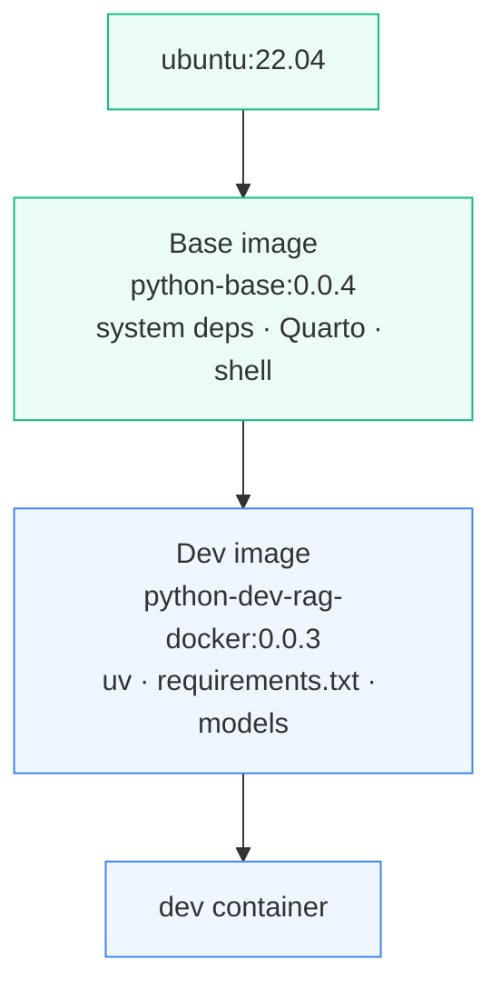

# Chapter 3 — Lesson 5: Development Environment Best Practices

> **Learning goal:** Apply best practices for a containerized development
> environment — version and tag images, script the builds, split a base image
> from a project dev image, and start new projects from a GitHub template.

We have a working prototype: a multi-container environment, an editor wired
into it, and a development loop that runs against the real database. This final
lesson of the chapter steps back to the practices that keep that environment
**maintainable** as the project grows — four habits the RAG project already
follows.

---

## 1. Version your images with meaningful tags

An image without a version is a moving target — `latest` today is not `latest`
next week, and "it worked yesterday" becomes impossible to reproduce.

**Give every image a real tag and bump it deliberately.**

```
rkrispin/python-dev-rag-docker:0.0.3
                               ^^^^^
                               bump when the environment changes
```

A new dependency or a base-image change earns a new tag. The tag is a **pin**:
a teammate, a CI job, or your future self can pull that exact environment and
get exactly what you had. This is the same pinning discipline from Chapter 2,
applied to your own images.

---

## 2. Script your builds

Build commands grow long — platforms, build args, tags, a push at the end.
Typing that by hand is error-prone and undocumented, so put it in a script.

```bash
# docker/build_dev_docker.sh  (abridged)
user_name=rkrispin
image_label=python-dev-rag-docker
tag=0.0.3
python_ver=3.11
venv_name="python-$python_ver-dev"

docker buildx build . -f Dockerfile_Dev \
    --platform linux/amd64,linux/arm64 \
    --build-arg VENV_NAME=$venv_name \
    --build-arg PYTHON_VER=$python_ver \
    -t "$user_name/$image_label:$tag"
```

Benefits:

* The script **is** the documentation of how the image is built.
* Image settings live as variables at the top — bumping a version is a
  one-line edit.
* Anyone can rebuild the exact image without knowing the incantation.

This repo ships `docker/build_base_docker.sh` and `docker/build_dev_docker.sh`
for exactly this reason.

---

## 3. Split into a base image and a dev image

This is the big one, and it builds directly on Lesson 1's stability tiers.
Some things almost never change (the OS, system tools, the language
toolchain); others change with the project (its dependencies and code). Put
them in **two separate images**.



### The base image — stable, project-agnostic

`docker/Dockerfile_Base` carries the foundation: Ubuntu, system dependencies,
Quarto, shell setup. Built once, tagged, pushed to a registry. It rarely
changes.

```dockerfile
# docker/Dockerfile_Base
FROM ubuntu:22.04
RUN bash ./settings/install_dependencies.sh
RUN bash ./settings/install_quarto.sh $QUARTO_VER
```

### The dev image — project-specific

`docker/Dockerfile_Dev` builds `FROM` the base and adds only what's specific to
this project: the `uv` Python environment, `requirements.txt`, the project's
models and tooling.

```dockerfile
# docker/Dockerfile_Dev
FROM docker.io/rkrispin/python-base:0.0.4
COPY install_uv.sh requirements.txt settings/
RUN bash ./settings/install_uv.sh $VENV_NAME $PYTHON_VER $RUFF_VER
```

**The win:** when a dependency changes, you rebuild only the thin dev image on
top of the already-built base. You never reinstall the OS and system tools just
to add a Python package. The expensive, stable work is done once.

| | Base image | Dev image |
| --- | --- | --- |
| Contents | OS, system tools, toolchain | `uv` env, deps, project tooling |
| Changes | Rarely | With the project |
| Built | Once, pushed to registry | Often, on top of the base |
| File | `docker/Dockerfile_Base` | `docker/Dockerfile_Dev` |

---

## 4. Start new projects from a template

Once you've built a good containerized setup — Dockerfiles, build scripts,
Compose file, `devcontainer.json` — you don't want to recreate it from scratch
every time.

Capture it as a **GitHub template repository**. A new project starts as a copy
of the template, already wired for containerized development: you change the
project name and dependencies and you're developing in minutes instead of
re-deriving the whole setup.

---

## 5. Takeaways

| Practice | Why |
| -------- | --- |
| Tag images, bump deliberately | Reproducible environments |
| Script the build | Documented, repeatable, one-line version bumps |
| Base image + dev image split | Cheap rebuilds; stable work done once |
| GitHub template | Next project starts where this one finished |

Together these make the environment durable: tagged images you can reproduce,
scripted builds you can rerun, a base/dev split that keeps rebuilds cheap, and
a template that bootstraps the next project.

---

## What's next — Chapter 4

That closes Chapter 3. We've taken the RAG application from idea to a working
prototype, developed entirely inside containers.

**Chapter 4** moves from prototyping to **testing** — splitting the prototype
into dedicated, single-purpose containers and running them in an environment
close to production.
