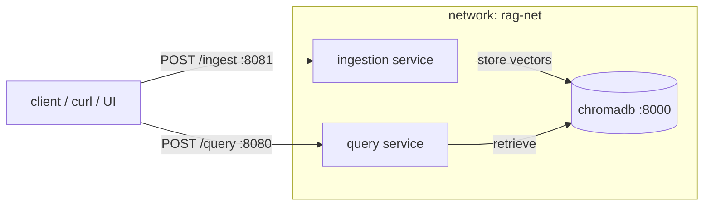

# Chapter 4 — Lesson 1: From One Container to Many

> **Learning goal:** Explain why a multi-container, one-service-per-container
> architecture beats a single prototype container, and identify the RAG
> services to split out.

Chapter 3 left us with a working prototype where **everything ran in one
container** — ingestion, query, and our code sharing a single image and
process. That was right for prototyping and wrong for production. Chapter 4 is
the move from that single container to **one dedicated container per service**,
tested together in an environment close to production.

---

## 1. One responsibility per container

A container should do one job and do it well. Cramming the whole application
into one container ties together parts of the system that have nothing in
common, and throws away the things containers are good at — independent
scaling, isolation, and small, focused images.

---

## 2. Why split into services

| Reason | Single container | One container per service |
| ------ | ---------------- | ------------------------- |
| **Scaling** | Scale everything or nothing | Scale ingestion and query independently |
| **Failure isolation** | A stuck parse can stall the whole app | A stuck parse can't take down query |
| **Deployment** | Rebuild everything for any change | Redeploy one service in seconds |
| **Image size** | One image carries every dependency | Each image carries only what it needs |
| **Security** | One blast radius | Separate secrets, ports, limits |

The two pipelines have opposite load profiles: ingestion is **bursty and
CPU-heavy** (batch parsing + embedding); query is **steady and
latency-sensitive** (a user waiting). Those want different replica counts and
resources — impossible when they share a container.

---

## 3. The RAG services



Three services:

* **Ingestion** — parse → chunk → embed → store.
* **Query** — retrieve → rerank → call the LLM → answer.
* **Vector DB** — ChromaDB, its own container since Chapter 3.

The prototype API already drew the seam — we just cut along it:

```text
ingestion : POST /ingest, GET /ingest/jobs/{id}, GET /ingest/jobs
query     : POST /query,  GET /documents,        GET /config
```

---

## 4. What "testing near production" means

In one process, every part can reach every other for free. Split into
containers, the services must talk over a **network** — hostnames, ports,
access rules. That's exactly where the interesting bugs live, and exactly
what a single-container prototype hides. Running this topology now surfaces
those issues while they're cheap to fix.

---

## What's next

The rest of the chapter builds this out: **Lesson 2** gives each service its
own image; **Lesson 3** orchestrates them with Compose; **Lesson 4** tests the
stack end to end; **Lesson 5** covers the testing practices that keep it
reliable.
