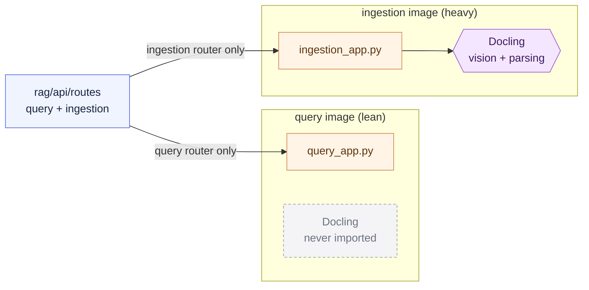

# Chapter 4 — Lesson 2: Dedicated Images per Service

> **Learning goal:** Build a dedicated, right-sized image for each service,
> each with its own Dockerfile and dependency set.

We decided to split the prototype into one container per service. This lesson
builds the images — **two dedicated images**, one heavy (ingestion), one lean
(query) — each with its own Dockerfile and requirements. Concepts first, then
a hands-on build. The supporting files live in this folder.

---

## 1. Split the dependencies first

This is where the split pays off. The **ingestion** service parses PDFs, which
means **Docling** — a large stack of vision models, parsing libraries, and
system graphics libraries. The **query** service never parses anything; it
retrieves and calls an LLM.

So we write two requirements files:

| | `requirements-ingestion.txt` | `requirements-query.txt` |
| --- | --- | --- |
| Web framework | FastAPI, uvicorn | FastAPI, uvicorn |
| Parsing | **Docling**, text-splitters | — |
| Embedding | sentence-transformers | — (API embeddings) |
| LLM clients | — | langchain-openai/anthropic/google |
| Vector DB client | chromadb | chromadb |

The single biggest difference: **Docling is absent from the query image.**
That's most of the size difference between the two.

---

## 2. Split the entry points (the two-app pattern)

Today all routes live in one FastAPI app. To serve only half the routes per
image, we extract them into two routers and create two small app modules —
each mounting only its own router, both keeping `/health`:

```python
# rag/api/routes/query.py
from fastapi import APIRouter
router = APIRouter()

@router.post("/query")      ...
@router.get("/documents")   ...
```

```python
# rag/api/query_app.py
from fastapi import FastAPI
from rag.api.routes import query
app = FastAPI(title="RAG Query")
app.include_router(query.router)
```

`ingestion_app.py` is the mirror image, mounting the ingestion router. The
point is more than tidiness: because `query_app` never imports the ingestion
module, it **never imports Docling** — the lean image is lean *because the code
says so*, not just because a requirements file omits a line.

> Chosen over a single `main:app` gated by a `ROLE` env var, which would keep
> the heavy imports one stray `import` away from the lean image.

The shared codebase fans out into two entry points, and the import boundary is
what keeps Docling out of the lean image:



---

## 3. The two Dockerfiles

Both follow the Chapter 2 best practices (pinned base, dependencies before
code, exec-form `CMD`) and the Chapter 3 layer ordering. They differ only in
requirements file, entry-point module, and port.

```dockerfile
# Dockerfile_Query — lean
FROM python:3.11-slim
WORKDIR /app
COPY chapter_4/l2/requirements-query.txt requirements.txt
RUN pip install --no-cache-dir -r requirements.txt
COPY rag/ /app/rag/
COPY config/ /app/config/
EXPOSE 8080
CMD ["uvicorn", "rag.api.query_app:app", "--host", "0.0.0.0", "--port", "8080"]
```

```dockerfile
# Dockerfile_Ingestion — heavy (note the extra system libs)
FROM python:3.11-slim
WORKDIR /app
RUN apt-get update && apt-get install -y --no-install-recommends \
        libgl1 libglib2.0-0 \
    && rm -rf /var/lib/apt/lists/*
COPY chapter_4/l2/requirements-ingestion.txt requirements.txt
RUN pip install --no-cache-dir -r requirements.txt
COPY rag/ /app/rag/
COPY config/ /app/config/
EXPOSE 8081
CMD ["uvicorn", "rag.api.ingestion_app:app", "--host", "0.0.0.0", "--port", "8081"]
```

---

## 4. Hands-on: build and compare

From the project root:

```bash
# Lean query image
docker build -f chapter_4/l2/Dockerfile_Query -t rag-query:0.1.0 .

# Heavy ingestion image (slower — Docling installing)
docker build -f chapter_4/l2/Dockerfile_Ingestion -t rag-ingestion:0.1.0 .

# The payoff — compare sizes
docker images | grep rag-
```

The query image is a fraction of the ingestion image's size. That delta is the
parsing stack the query service never carries — weight you don't ship on every
query-service deploy, plus a smaller attack surface.

---

## What's next

Two right-sized images, built one at a time. **Lesson 3** stops building images
by hand and orchestrates all three containers — ingestion, query, and the
database — into one running stack with Docker Compose.
