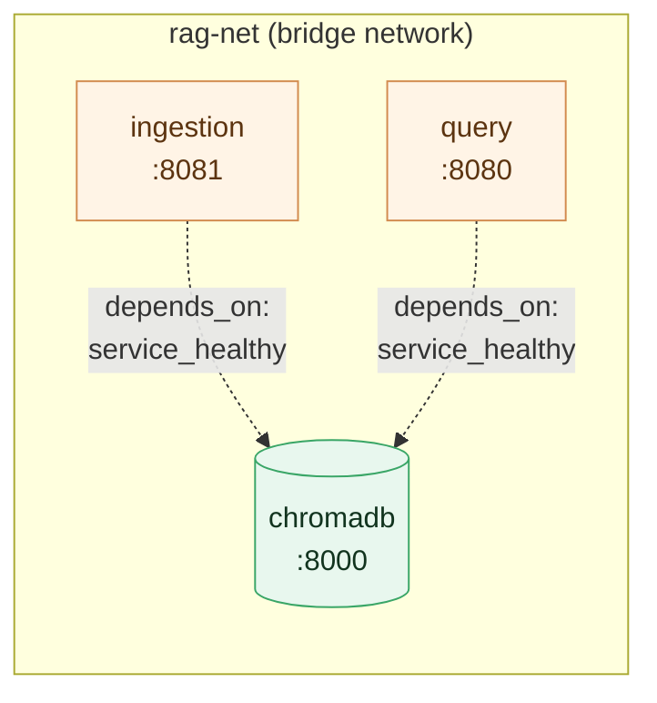

# Chapter 4 — Lesson 3: Orchestrating the Stack with Compose

> **Learning goal:** Orchestrate the per-service containers into one running
> stack with Compose, configured like production.

We have two service images and the database image. This lesson wires them into
one running stack with Docker Compose — the topology the app will have in
production. Concepts first, then a hands-on bring-up. The
`docker-compose.test.yaml` for this lesson is in this folder.

---

## 1. A *test* compose, not a *dev* compose

We used Compose in Chapter 3, but this is a different kind of file:

| | Chapter 3 dev compose | This test compose |
| --- | --- | --- |
| Source code | Bind-mounted into the container | Baked into the image |
| Command | `sleep infinity` (attach + live-edit) | the service's real `CMD` |
| Image | A dev image you develop in | The **built artifact** you'd ship |
| Purpose | Iterate on code | Test the thing you'd deploy |

We're testing the artifact, not a development shell.

---

## 2. The stack

Three services on a shared network — `ingestion` (8081), `query` (8080),
`chromadb` (8000):

```yaml
services:
  ingestion:
    build: { context: ../.., dockerfile: chapter_4/l2/Dockerfile_Ingestion }
    image: rag-ingestion:0.1.0
    ports: ["8081:8081"]
    environment:
      - CHROMA_HOST=chromadb
      - CHROMA_PORT=8000
      - OPENAI_API_KEY=${OPENAI_API_KEY}
      - RAG_API_KEYS=${RAG_API_KEYS:-dev-key}
    volumes: ["../../pdf:/app/pdf:ro"]   # PDFs the ingestion API reads
    depends_on: { chromadb: { condition: service_healthy } }
    networks: [rag-net]

  query:
    build: { context: ../.., dockerfile: chapter_4/l2/Dockerfile_Query }
    image: rag-query:0.1.0
    ports: ["8080:8080"]
    environment:
      - CHROMA_HOST=chromadb
      - CHROMA_PORT=8000
      - OPENAI_API_KEY=${OPENAI_API_KEY}
      - RAG_API_KEYS=${RAG_API_KEYS:-dev-key}
    depends_on: { chromadb: { condition: service_healthy } }
    networks: [rag-net]

  chromadb:
    image: chromadb/chroma:1.3.5
    volumes: ["./chroma_data:/chroma/chroma"]
    healthcheck:
      test: ["CMD", "bash", "-c", "exec 3<>/dev/tcp/localhost/8000 && printf 'GET /api/v2/heartbeat HTTP/1.1\r\nHost: localhost\r\nConnection: close\r\n\r\n' >&3 && grep -q '200 OK' <&3"]
      interval: 10s
      timeout: 5s
      retries: 5
      start_period: 20s
    networks: [rag-net]
```

Three things to notice:

* **`build:`** — the app services build from the Lesson 2 Dockerfiles and tag
  the result. The context is `../..` (the repo root, relative to this compose
  file) so the Dockerfiles' `COPY` paths (`rag/`, `config/`, `chapter_4/l2/…`)
  resolve. Compose builds as well as runs.
* **`healthcheck` + `depends_on: service_healthy`** — see below.
* **ingestion `volumes` + `RAG_API_KEYS`** — the ingestion API reads PDFs from a
  server-side directory, so the repo's `pdf/` is mounted read-only at
  `/app/pdf`; both services require an API key (`dev-key` by default) on every
  non-health request.

The two app services sit on the same `rag-net` bridge network as the database,
reach it by name (`chromadb`), and only start once its healthcheck passes:



---

## 3. Why a healthcheck

`depends_on` on its own only waits for a container to **start**, not to be
**ready**. A database is often "started" a second or two before it accepts
connections — long enough for an app service to come up, try to connect, and
crash.

The healthcheck closes the gap: we tell Compose how to ask the database "are
you ready?" (here, its heartbeat endpoint), and the app services wait until
that check passes. No more startup race.

> **Probing a minimal image.** Chroma 1.x is a compiled server on a stripped-down
> Debian base — it ships no `curl`, no `wget`, and no Python. The one HTTP-capable
> tool inside is `bash`, so we probe with its built-in `/dev/tcp`: open a socket to
> the heartbeat endpoint and match an HTTP `200 OK`. The lesson: check what's
> actually in an off-the-shelf image before assuming a probe tool exists.
>
> `start_period: 20s` gives Chroma time to boot before failed probes count
> against the retry budget.

---

## 4. Hands-on: bring it up

From the project root:

```bash
# Build images and start all three containers
docker compose -f chapter_4/l3/docker-compose.test.yaml up -d --build

# Confirm the stack — db should read "healthy", not just "running"
docker compose -f chapter_4/l3/docker-compose.test.yaml ps

# Check a service started cleanly
docker compose -f chapter_4/l3/docker-compose.test.yaml logs query
```

**Test that the services are working** — hit each `/health` (no API key needed):

```bash
curl localhost:8081/health     # ingestion -> {"status":"healthy","chromadb":"connected",...}
curl localhost:8080/health     # query     -> {"status":"healthy","chromadb":"connected",...}
```

`healthy` with `"chromadb":"connected"` means the service is up *and* can reach
the database. If `curl` hangs here, it's almost always a host port conflict, not
the container — see §6.

Tear down (removing volumes) when done:

```bash
docker compose -f chapter_4/l3/docker-compose.test.yaml down -v
```

---

## 5. Ingest and query from the terminal

With the stack healthy, run the full pipeline with `curl`: check the store is
empty, ingest a PDF, confirm it landed, then query it. Ingest goes through the
ingestion service on **8081**, queries through the query service on **8080**;
they never call each other — they meet only at the shared `chromadb`.

**Two different keys — don't mix them up:**

* **`X-API-Key: dev-key`** authenticates you *to* the API. Every route except
  `/health` needs it (set by `RAG_API_KEYS`, default `dev-key`).
* **`OPENAI_API_KEY`** is used *by the service, inside the container*, to embed
  chunks and call the LLM. It comes from your `.env`; you never send it in a
  request. (Passing it as `X-API-Key` returns `401` — a common slip.)

### 5.1 Before: confirm the store is empty

The query service's `/documents` lists what's in ChromaDB (files + chunk
counts). On a fresh stack it's empty:

```bash
curl -H "X-API-Key: dev-key" localhost:8080/documents
# []      (nothing ingested yet)
```

To look at ChromaDB directly — list its collections and chunk counts (it isn't
published to the host, so go through a container):

```bash
docker compose -f chapter_4/l3/docker-compose.test.yaml exec query python -c \
  "import chromadb; c=chromadb.HttpClient(host='chromadb',port=8000); print([(getattr(x,'name',x), c.get_collection(getattr(x,'name',x)).count()) for x in c.list_collections()])"
# []      (or [('financial_reports', 0)] if the collection exists but is empty)
```

### 5.2 Ingest a PDF (ingestion service, :8081)

`/ingest` takes a **directory** (`source_dir`) and ingests every `*.pdf` in it —
not a single file. `source_dir` resolves *inside the container* under
`/app/pdf`, which is your repo's `pdf/` folder (mounted read-only). The work
runs in the background, so the call returns a job to poll:

```bash
curl -X POST localhost:8081/ingest \
  -H "X-API-Key: dev-key" -H "Content-Type: application/json" \
  -d '{"source_dir": "pdf/"}'
# -> 202 {"job_id":"j_…","status":"pending","poll_url":"/ingest/jobs/j_…"}
```

> **Want just one file?** Point `source_dir` at a folder containing only that
> file — the API globs a directory, so `"pdf/form-10-q.pdf"` fails with *"No PDF
> files found."* Isolate it first (the `pdf/` mount reflects host changes live):
> `mkdir -p pdf/one && cp pdf/form-10-q.pdf pdf/one/`, then `"source_dir": "pdf/one"`.

### 5.3 Poll the job until it's `completed`

```bash
curl -H "X-API-Key: dev-key" localhost:8081/ingest/jobs/<job_id>
# status:        pending -> running -> completed
# progress:      {chunks_done, chunks_total, current_file}   (while embedding)
# result:        {documents_ingested, total_chunks, files}   (when completed)
# error_message: set instead when status is "failed" (e.g. OPENAI_API_KEY missing)
```

Docling parses on CPU, so a large 10-Q takes a little while — keep polling until
`completed`. (`GET /ingest/jobs` lists recent jobs if you lose the id.)

### 5.4 After: confirm the data landed

Re-run the checks from 5.1 — now they show the ingested files and a non-zero
chunk count:

```bash
curl -H "X-API-Key: dev-key" localhost:8080/documents
# [{"file":"form-10-q.pdf","chunks":128}, ...]

curl -H "X-API-Key: dev-key" localhost:8080/health
# {"status":"healthy","chromadb":"connected","documents":128}   (total chunks stored)
```

The jump from `[]` / `0` to real files and chunk counts is your proof the
ingestion service wrote to the shared ChromaDB — and that the query service,
reading the same database, can now see it.

### 5.5 Query the data (query service, :8080)

```bash
curl -X POST localhost:8080/query \
  -H "X-API-Key: dev-key" -H "Content-Type: application/json" \
  -d '{"question": "What was the total revenue?"}'
# -> {"answer":"…", "sources":[{file,page,section,excerpt}, …], "metadata":{…}}
```

**How the answer is built — and `top_k`.** The query service embeds your
question, retrieves the **`top_k`** most similar chunks from ChromaDB (default
`5`, from `config/settings.yaml`), optionally reranks them, and the LLM answers
using **only those chunks** — which come back to you in `sources`. You can raise
`top_k` per request for more context (at the cost of more tokens and latency):

```bash
curl -X POST localhost:8080/query \
  -H "X-API-Key: dev-key" -H "Content-Type: application/json" \
  -d '{"question": "What were total revenues for the quarter?", "top_k": 15}'
```

`GET /config` shows the active providers, chunking, and rerank settings in
effect. If a query returns "No relevant information found," nothing matched —
make sure your ingest job reached `completed` (5.3) and shows up in `/documents`
(5.4) first.

---

## 6. Troubleshooting: common gotchas

When a service *"is running"* but doesn't behave, debug **outward** — from the
container to the host. These are the failures you're most likely to hit.

### A service is missing from `ps`

`docker compose … ps` lists only **running** containers. If one is absent, it
started and then crashed — usually a missing dependency or a bad env var. Add
`-a` to see exited containers, then read its logs:

```bash
docker compose -f chapter_4/l3/docker-compose.test.yaml ps -a        # includes Exited
docker compose -f chapter_4/l3/docker-compose.test.yaml logs ingestion
```

A traceback like `ModuleNotFoundError: No module named 'slowapi'` means the
image is missing a runtime dependency — add it to that service's requirements
and rebuild: `up -d --build <service>`.

### `curl localhost:PORT` connects but hangs (no response)

The tell-tale symptom: `curl` prints `Connected`, then times out with
`0 bytes received`. The container is usually fine — **another process on your
host owns that port** and is shadowing Docker's forwarder. Ports like `8080`
are routinely grabbed by editors (VS Code port-forwarding), other dev servers,
or a stale container.

See who's actually listening on the host port:

```bash
lsof -nP -iTCP:8080 -sTCP:LISTEN
```

If a non-Docker process is bound to `127.0.0.1:8080`, it *wins* over Docker's
wildcard `*:8080` for `localhost` connections — so your request never reaches
the container. Fix by freeing the port (stop that process, or remove the
editor's forwarded port) or remap the service to a free host port in the
compose file (`ports: ["8090:8080"]`) and hit that instead.

### Is it the app or the networking? Test from inside the container

To tell whether a hang is in the app or in the host→container path, hit the
endpoint from **inside** the container. The image is lean and ships no `curl`,
so use the Python it already has:

```bash
docker compose -f chapter_4/l3/docker-compose.test.yaml exec query \
  python -c "import urllib.request; print(urllib.request.urlopen('http://127.0.0.1:8080/health', timeout=5).status)"
```

`200` from inside but a hang from `localhost:8080` on the host points at a host
port problem (above), **not** the app.

### `401 Invalid or missing API key`

Every route except `/health` needs `-H "X-API-Key: dev-key"` (or whatever you
set `RAG_API_KEYS` to before `up`). This is the **API's own** key — **not** your
`OPENAI_API_KEY`. Sending the OpenAI key as `X-API-Key` is a common slip and
returns this 401.

### `/ingest` returns `404`, or a query finds nothing

- `404 No PDF files found in: /app/pdf/…` → you pointed `source_dir` at a
  **file**, not a folder. `/ingest` globs `*.pdf` inside a **directory** — pass a
  folder (e.g. `"pdf/"`), or isolate one file in its own subfolder (§5.2).
- `404 Source directory not found` → the folder doesn't exist **inside the
  container**. It resolves under `/app/pdf`; confirm the `pdf/` bind-mount is
  present (§2).
- Query answers "No relevant information found" → nothing is stored yet, or the
  ingest job hasn't reached `completed`. Verify with `/documents` (§5.4) first.

---

## What's next

The system is running as separate containers — but "running" isn't "working."
**Lesson 4** tests that the containers actually cooperate: networking, health
and readiness, and the end-to-end ingest → query flow.
