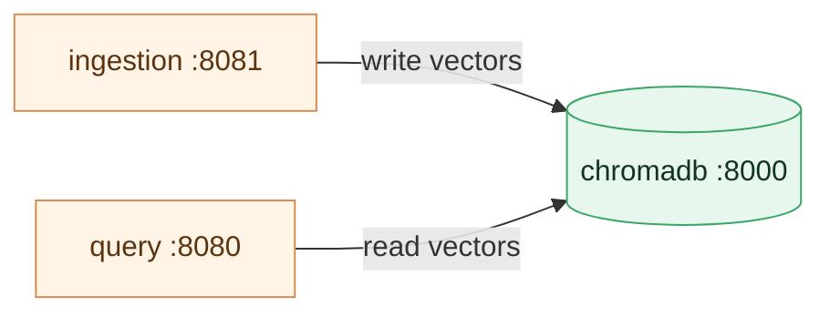
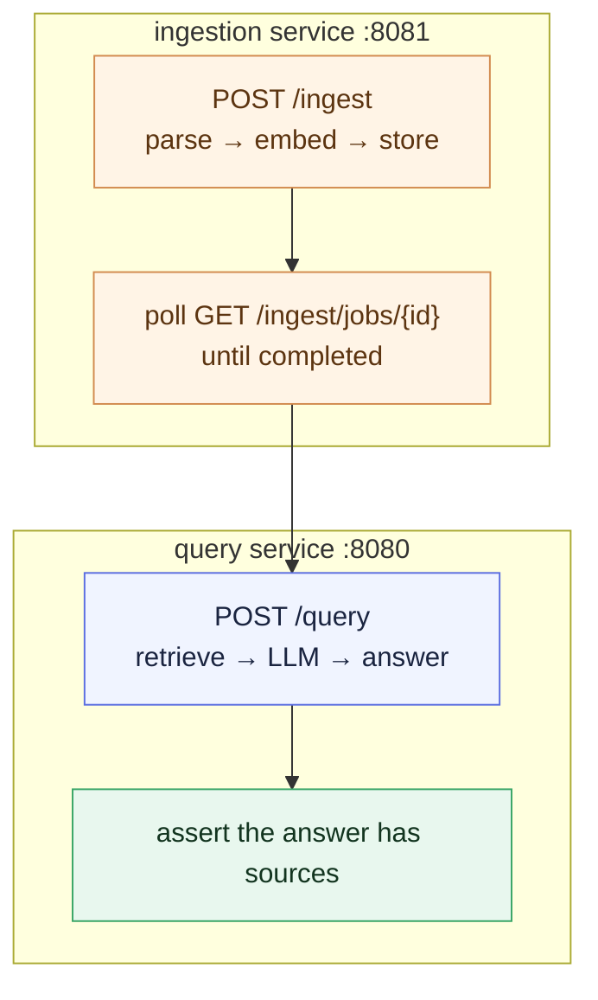

# Chapter 4 — Lesson 4: Networking, Health & Integration Testing

> **Learning goal:** Validate the multi-container system end to end in an
> environment close to production.

The stack is running — but running is not working. This lesson tests that our
separate containers actually cooperate, the thing a single-container prototype
could never reveal. Concepts first, then hands-on. The integration test for
this lesson is in this folder (`test_integration.py`).

---

## 1. How the services talk

In the prototype, everything shared one process and could call anything
directly. Now the services are separate containers communicating over the
network.

The key design point: **the ingestion and query services don't call each
other.** They share state through the database — ingestion writes vectors to
ChromaDB, query reads them back. **The database is the contract between them.**

Both reach the database by its **service name** (`chromadb:8000`) via Compose
DNS — no IP addresses.



---

## 2. Health and readiness

Each service exposes `/health`. We use it two ways:

* The database's healthcheck **gates startup** (Lesson 3).
* Hitting each service's `/health` confirms it's **ready** before sending real
  traffic — the same signal a load balancer or orchestrator uses in
  production.

---

## 3. The integration test that matters

The flow only a multi-container setup can exercise:



If the answer comes back with sources from the document we just ingested,
we've proven two independent containers — talking only through a shared
database over the network — cooperate correctly. Networking works, the
shared-state contract works, the services are genuinely integrated.

---

## 4. Hands-on

> **Prerequisite — the Lesson 3 stack must be running.** Everything below talks
> to the containers started in Lesson 3. Bring them up first (from the project
> root) and confirm they're healthy:
>
> ```bash
> docker compose -f chapter_4/l3/docker-compose.test.yaml up -d --build
> docker compose -f chapter_4/l3/docker-compose.test.yaml ps    # chromadb should read "healthy"
> curl localhost:8081/health && curl localhost:8080/health      # both -> {"status":"healthy",...}
> ```
>
> If a `/health` call hangs or a service is missing, see Lesson 3 §6
> (Troubleshooting) — it's usually a host port conflict or a crashed container.

### Manual walk-through with curl

Ingestion is **asynchronous**: `POST /ingest` returns a job you must poll to
`completed` before querying, or the query finds nothing. Every route except
`/health` needs `-H "X-API-Key: dev-key"` (the API's key — *not* your
`OPENAI_API_KEY`). See Lesson 3 §5 for the full request/response details and the
before/after ChromaDB checks.

```bash
# 1. Ingest — ingestion service on 8081 (returns a job to poll)
curl -X POST localhost:8081/ingest \
  -H "X-API-Key: dev-key" -H "Content-Type: application/json" \
  -d '{"source_dir":"pdf/"}'
# -> 202 {"job_id":"j_…","status":"pending","poll_url":"/ingest/jobs/j_…"}

# 2. Poll the job until status is "completed"
curl -H "X-API-Key: dev-key" localhost:8081/ingest/jobs/<job_id>

# 3. Query — query service on 8080 (reads the same chromadb)
curl -X POST localhost:8080/query \
  -H "X-API-Key: dev-key" -H "Content-Type: application/json" \
  -d '{"question":"What is this document about?"}'

# Prove service-name DNS from inside the query container.
# (The image is lean and has no curl — we use the Python it already ships.)
docker compose -f chapter_4/l3/docker-compose.test.yaml exec query \
  python -c "import urllib.request; print(urllib.request.urlopen('http://chromadb:8000/api/v2/heartbeat').status)"
```

### Automated integration test

The test in this folder (`test_integration.py`) checks both services are
healthy, ingests through one service, polls the job, queries through the other,
and asserts the answer has sources — the same flow, runnable on every change.

Run it with `pytest` from the project's dev environment (where `pytest` and
`httpx` are installed):

```bash
pytest chapter_4/l4/test_integration.py -v
```

**No virtualenv? Run the same flow as a shell script.** `run_integration_test.sh`
performs the identical steps (health → ingest → poll → query → assert sources)
using only `curl` and `python3` (standard library) — nothing to `pip install`:

```bash
# ingest a single PDF (staged automatically so the container can read it)
bash chapter_4/l4/run_integration_test.sh --pdf pdf/q2-fy26-financial-reconciliations.pdf

# or a folder already under pdf/
bash chapter_4/l4/run_integration_test.sh --dir pdf/sample

# or, with no argument, the whole pdf/ folder
bash chapter_4/l4/run_integration_test.sh
```

It prints a description, a `PASS`/`FAIL` per step, and a summary, exiting
non-zero on the first failure. It honors the same env overrides as the test —
`INGESTION_URL`, `QUERY_URL`, `RAG_API_KEY`, `SAMPLE_PDF_DIR` — plus
`POLL_TIMEOUT_S` (default 300s) and `POLL_INTERVAL_S` (default 15s).

> **Re-running the same PDF reports "0 new chunks."** The store skips documents
> it already holds (matched by filename), so a repeat ingest embeds nothing —
> that's expected, not a failure. The data is still there; the query step
> confirms it. (Delete it first with `DELETE /documents/<file>` on `:8081` to
> force a fresh ingest.)

> **Ingestion is CPU-bound.** Docling parses each PDF on the CPU, so ingesting
> the whole `pdf/` folder (several large 10-Qs) can exceed the poll timeout — the
> test then reports a timeout at the poll step even though the container is still
> working. Use `--pdf` for a quick single-file run, or give it more time:
> `POLL_TIMEOUT_S=900 bash chapter_4/l4/run_integration_test.sh`.

A passing run ends like this (a first-time ingest shows the chunk count; a
re-run shows the "0 new chunks — already stored" note instead, then still
passes on the query):

```text
[1/4] Health — both services answer /health before we send real traffic
  PASS  ingestion /health -> 200
  PASS  query /health -> 200
[2/4] Ingest — POST /ingest {"source_dir":"pdf/.integration-test"} ...
  PASS  job accepted (202), job_id=j_8f635c9cc3e5
[3/4] Poll — wait for the ingestion job to reach 'completed'
  ... status=completed  (15s / 300s)
  PASS  completed — 38 new chunks written to ChromaDB
[4/4] Query — POST /query ...; expect an answer WITH sources
  PASS  answer received, backed by 5 source(s)
=====================================================================
  RESULT: PASSED
=====================================================================
```

---

## What's next

We verified the containers work **together** — networking, the shared-DB
contract, and the full ingest-to-query path. **Lesson 5** steps back to the
testing practices that keep a multi-container app reliable: the testing
pyramid, fixtures, and CI.
