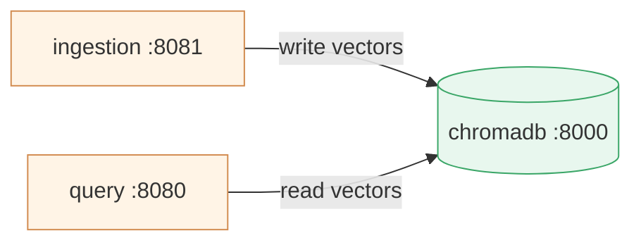
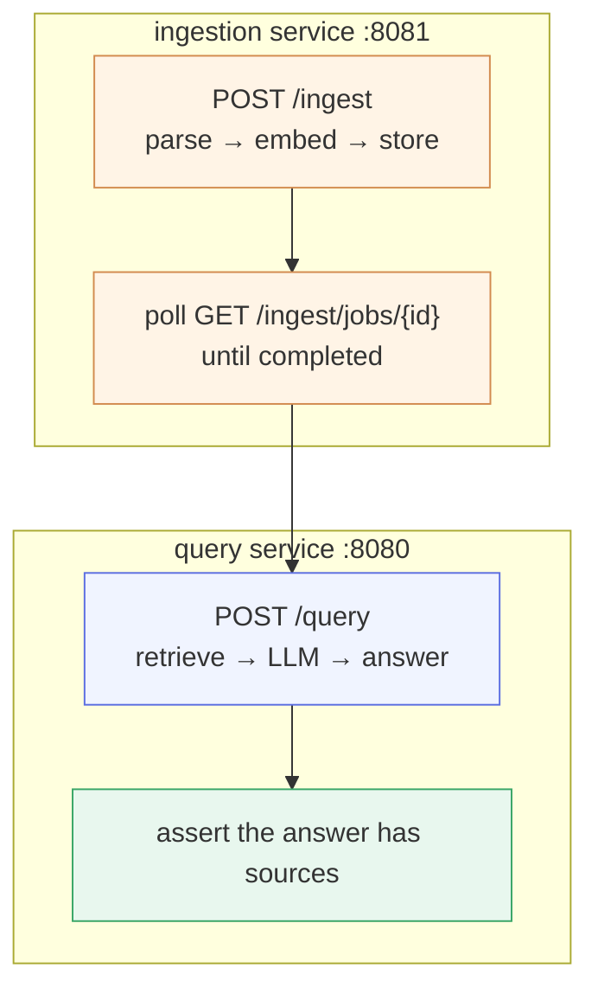

# Chapter 4 — Lesson 4: Networking, Health & Integration Testing

> **Learning goal:** Validate the multi-container system end to end in an
> environment close to production.

The stack is running — but running is not working. This lesson tests that our
separate containers actually cooperate, the thing a single-container prototype
could never reveal. Concepts first, then hands-on. The integration test for
this lesson is in this folder (`test_integration.py`).

---

## 1. How the services talk

In the prototype, everything shared one process and could call anything
directly. Now the services are separate containers communicating over the
network.

The key design point: **the ingestion and query services don't call each
other.** They share state through the database — ingestion writes vectors to
ChromaDB, query reads them back. **The database is the contract between them.**

Both reach the database by its **service name** (`chromadb:8000`) via Compose
DNS — no IP addresses.



---

## 2. Health and readiness

Each service exposes `/health`. We use it two ways:

* The database's healthcheck **gates startup** (Lesson 3).
* Hitting each service's `/health` confirms it's **ready** before sending real
  traffic — the same signal a load balancer or orchestrator uses in
  production.

---

## 3. The integration test that matters

The flow only a multi-container setup can exercise:



If the answer comes back with sources from the document we just ingested,
we've proven two independent containers — talking only through a shared
database over the network — cooperate correctly. Networking works, the
shared-state contract works, the services are genuinely integrated.

---

## 4. Hands-on

### Manual walk-through with curl

```bash
# Ingest — ingestion service on 8081
curl -X POST localhost:8081/ingest \
  -H "X-API-Key: dev-key" -d '{"source_dir":"pdf/"}'

# Query — query service on 8080 (reads the same chromadb)
curl -X POST localhost:8080/query \
  -H "X-API-Key: dev-key" -d '{"question":"What is this document about?"}'

# Prove service-name DNS from inside the query container.
# (The image is lean and has no curl — we use the Python it already ships.)
docker compose -f chapter_4/l3/docker-compose.test.yaml exec query \
  python -c "import urllib.request; print(urllib.request.urlopen('http://chromadb:8000/api/v2/heartbeat').status)"
```

### Automated integration test

```bash
pytest chapter_4/l4/test_integration.py -v
```

The test checks both services are healthy, ingests through one service, polls
the job, queries through the other, and asserts the answer has sources — the
same flow, now runnable on every change.

### Interactive (Streamlit client)

```bash
bash clients/run_streamlit_services.sh
```

Ingest from the sidebar, watch the job poll to completion, then ask a question
in the chat — a human-friendly mirror of the automated test, handy for demos
and exploratory testing.

---

## What's next

We verified the containers work **together** — networking, the shared-DB
contract, and the full ingest-to-query path. **Lesson 5** steps back to the
testing practices that keep a multi-container app reliable: the testing
pyramid, fixtures, and CI.
