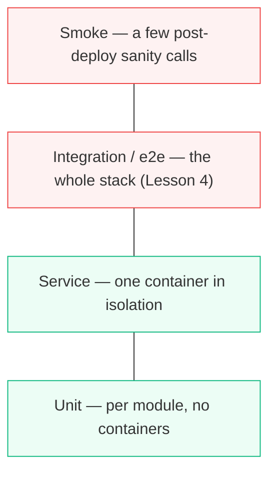

# Chapter 4 — Lesson 5: Testing Best Practices for Multi-Container Apps

> **Learning goal:** Apply testing best practices that keep a multi-container
> app reliable and reproducible.

We've split the prototype into services, orchestrated them, and tested the
end-to-end flow. This final lesson of the chapter steps back to the practices
that keep a multi-container application reliable and reproducible.

---

## 1. The testing pyramid, mapped onto containers



| Layer | Scope | Speed | Count |
| ----- | ----- | ----- | ----- |
| **Unit** | One module, no containers (`tests/test_ingestion.py`, `test_retrieval.py`) | Fast | Many |
| **Service** | One container's routes/contracts | Medium | Some |
| **Integration / e2e** | The whole stack (Lesson 4) | Slow | Few |
| **Smoke** | A couple of post-deploy sanity calls | Fast | A handful |

The rule: **lots of fast unit tests at the bottom, a few expensive
integration tests at the top.**

---

## 2. Health and readiness checks, everywhere

We added a healthcheck to the database in Lesson 3; the same belongs on every
service:

```dockerfile
HEALTHCHECK --interval=30s --timeout=3s \
  CMD curl -f http://localhost:8080/health || exit 1
```

It gates startup ordering, tells an orchestrator a container is ready for
traffic, and tells *you* which service is down when something breaks.

---

## 3. Manage test data

Integration tests need predictable data:

* **Small, fixed sample** — not a 500-page report that makes every run slow.
  Reuse a file already under `pdf/`.
* **Ephemeral collection per run** — so runs don't contaminate each other.
* **Tear down** — `docker compose down -v` removes the volumes, so the next
  run starts clean.

Reproducibility is the goal: the same test, run twice, gives the same result.

---

## 4. Run the whole stack in CI

This ties it together — bring the stack up, test against it, tear it down:

```yaml
# .github/workflows/integration.yml (excerpt)
- run: docker compose -f chapter_4/l3/docker-compose.test.yaml up -d --build
- run: pytest chapter_4/l4/test_integration.py
- run: docker compose -f chapter_4/l3/docker-compose.test.yaml down -v
```

Because the stack is a Compose file and the images are pinned, CI runs the same
environment you ran locally — and close to production. Every change is tested
against the real multi-container topology, automatically.

---

## 5. Takeaways

| Practice | Why |
| -------- | --- |
| Testing pyramid (many unit, few integration) | Fast feedback, reliable coverage |
| Health/readiness on every service | Startup gating + production-shaped |
| Small, ephemeral, torn-down test data | Reproducible runs |
| Whole stack in CI | Every change tested on the real topology |

---

## What's next — Chapter 5

That closes Chapter 4. We took a single-container prototype, split it into
dedicated services (a lean query image, a heavy ingestion image), orchestrated
them with Compose, and proved they cooperate over the network close to
production.

But "close to production" is not production: the images aren't optimized for
size or security, nothing is deployed, and there's no scaling or real
observability. **Chapter 5 — Preparing AI Applications for Production with
Docker** — takes the system the rest of the way: optimizing the containers,
deploying to a server or the cloud, and validating it in its target
environment.
