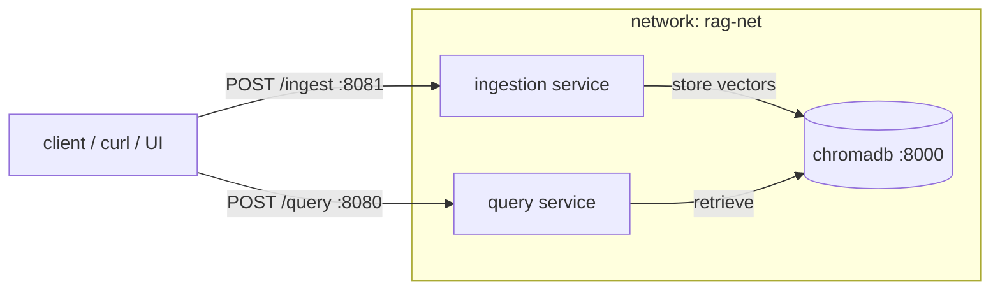

# Chapter 4 — Scope: Testing Multi-Container AI Applications with Docker

> **Status:** scope / plan. Short form: *Testing Multi-Container Apps*.
> This document scopes the five lessons (≤500 words each, with code examples
> where applicable). Each lesson will later be expanded into the standard
> `README.md` + `script_c4_l{M}.md` + `slides_c4_l{M}.html` set (see
> `chapter_0/naming_convention.md`).

## Chapter arc

Chapter 3 left us with a working prototype where **everything ran in one
container**. Chapter 4 splits that prototype into **one dedicated container
per service** and tests the whole thing in an environment close to
production. For the RAG system that means two application services plus the
database:



Packaging decision (confirmed): **two dedicated images** — a heavy ingestion
image and a lean query image — not one shared image run two ways. Service
entry points use the **two-app split** (`rag/api/ingestion_app.py`,
`rag/api/query_app.py`) — see "Resolved decisions" below.

A thin **multi-service Streamlit client** (`clients/streamlit_services_app.py`,
already added) talks to both services over HTTP — used from Lesson 3 onward to
smoke-test and drive the stack.

---

## Lesson 1 — From One Container to Many

**Learning goal:** explain why a multi-container, one-service-per-container
architecture beats a single prototype container, and identify the RAG
services to split out.

**Format:** slides (conceptual).

**Scope.** Recap Chapter 3: ingestion, query, and our code all shared one
process and one image — great for iteration, wrong for production. Introduce
the principle: **one responsibility per container.** Then the *why*:

- **Independent scaling** — ingestion is bursty and CPU-heavy (batch parsing
  and embedding); query is steady and latency-sensitive (online). They want
  different replica counts and resources.
- **Failure isolation** — a stuck 500-page parse can't take down query.
- **Independent deploy & versioning** — ship a query fix without rebuilding
  the Docling stack.
- **Right-sized images & dependencies** — each image carries only what its
  service needs (smaller, faster, smaller attack surface).
- **Clear security boundaries** — separate secrets and network exposure.

Map RAG to services: **ingestion** (parse → chunk → embed → store),
**query** (retrieve → rerank → LLM → answer), and the **vector DB**
(chromadb, already its own container). The prototype API already partitions
along this line:

```text
ingestion : POST /ingest, GET /ingest/jobs/{id}, GET /ingest/jobs
query     : POST /query,  GET /documents,        GET /config
```

Close on the target topology (diagram above) and what "testing near
production" means: run the services as separate containers wired over a
network, exactly as production will, so integration issues surface now
instead of at deploy time.

**Repo artifacts:** `rag/ingestion/*` vs `rag/retrieval/*`; `rag/api/main.py`
endpoints.

---

## Lesson 2 — Dedicated Images per Service

**Learning goal:** build a dedicated, right-sized image for each service,
each with its own Dockerfile and dependency set.

**Format:** slides + hands-on (build & tag both images).

**Scope.** Each service gets its own Dockerfile and requirements file. The
**ingestion** image carries the heavy stack (Docling, sentence-transformers,
text splitters) and the OS libs parsing needs; the **query** image stays lean
(FastAPI, LangChain LLM clients, retrieval). Reuse Chapter 2 best practices
(pin versions, order layers, `.dockerignore`, exec-form `CMD`) and Chapter 3's
base/dev thinking. Define a service entry point per image — introduce
`rag/api/ingestion_app.py` and `rag/api/query_app.py` so each image serves
only its routes.

Split requirements:

```text
# requirements-query.txt (lean)          # requirements-ingestion.txt (heavy)
fastapi==0.115.0                         fastapi==0.115.0
uvicorn==0.30.0                          uvicorn==0.30.0
langchain-openai>=0.3.0                  docling==2.93.0
langchain-anthropic>=0.3.0               sentence-transformers==3.0.0
chromadb>=1.3.5                          langchain-text-splitters==1.1.2
slowapi==0.1.9                           chromadb>=1.3.5
```

Lean query image:

```dockerfile
# docker/Dockerfile_Query
FROM python:3.11-slim
WORKDIR /app
COPY docker/requirements-query.txt .
RUN pip install --no-cache-dir -r requirements-query.txt
COPY rag/ /app/rag/
COPY config/ /app/config/
EXPOSE 8080
CMD ["uvicorn", "rag.api.query_app:app", "--host", "0.0.0.0", "--port", "8080"]
```

Heavy ingestion image (note the extra system libs and the second `EXPOSE`/port):

```dockerfile
# docker/Dockerfile_Ingestion
FROM python:3.11-slim
WORKDIR /app
RUN apt-get update && apt-get install -y --no-install-recommends \
        libgl1 libglib2.0-0 \
    && rm -rf /var/lib/apt/lists/*
COPY docker/requirements-ingestion.txt .
RUN pip install --no-cache-dir -r requirements-ingestion.txt
COPY rag/ /app/rag/
COPY config/ /app/config/
EXPOSE 8081
CMD ["uvicorn", "rag.api.ingestion_app:app", "--host", "0.0.0.0", "--port", "8081"]
```

Hands-on: `docker build -f docker/Dockerfile_Query -t rag-query:0.1.0 .` and
the same for ingestion; compare image sizes (`docker images`) to make the
"lean vs heavy" point concrete.

**Repo artifacts:** `docker/Dockerfile_API` (template), `requirements.txt` /
`requirements-api.txt`.

---

## Lesson 3 — Orchestrating the Stack with Compose

**Learning goal:** orchestrate the per-service containers into one running
stack with Compose, configured like production.

**Format:** slides + hands-on.

**Scope.** Write a dedicated `docker-compose.test.yaml` for the multi-service
app — **separate from the Chapter 3 dev compose**. Key contrast: the dev
compose bind-mounted source and ran `sleep infinity`; here each container runs
its real `CMD` against the **built image artifact**. Services: `ingestion`,
`query`, `chromadb` on a shared network, with `depends_on` gated on the DB's
health, published ports, and env/secrets.

```yaml
networks:
  rag-net: { driver: bridge }

services:
  ingestion:
    build: { context: ., dockerfile: docker/Dockerfile_Ingestion }
    image: rag-ingestion:0.1.0
    ports: ["8081:8081"]
    environment:
      - CHROMA_HOST=chromadb
      - OPENAI_API_KEY=${OPENAI_API_KEY}
    depends_on: { chromadb: { condition: service_healthy } }
    networks: [rag-net]

  query:
    build: { context: ., dockerfile: docker/Dockerfile_Query }
    image: rag-query:0.1.0
    ports: ["8080:8080"]
    environment:
      - CHROMA_HOST=chromadb
      - OPENAI_API_KEY=${OPENAI_API_KEY}
    depends_on: { chromadb: { condition: service_healthy } }
    networks: [rag-net]

  chromadb:
    image: chromadb/chroma:1.3.5
    volumes: ["./chroma_data:/chroma/chroma"]
    healthcheck:
      test: ["CMD", "python", "-c", "import urllib.request; urllib.request.urlopen('http://localhost:8000/api/v2/heartbeat')"]
      interval: 10s
      timeout: 5s
      retries: 5
    networks: [rag-net]
```

Hands-on: `docker compose -f docker-compose.test.yaml up -d --build`,
`docker compose ps` (all healthy), `docker compose logs query`. Then a first
smoke test from the multi-service Streamlit client
(`bash clients/run_streamlit_services.sh` → "Check health") to confirm both
services answer over HTTP.

---

## Lesson 4 — Networking, Health & Integration Testing

**Learning goal:** validate the multi-container system end to end in an
environment close to production.

**Format:** slides + hands-on.

**Scope.** Cover service-to-service networking: both app services reach
`chromadb` by service name; they don't call each other directly but **share
state through the DB** — a contract worth making explicit. Discuss ports,
access, and secrets crossing container boundaries, and **health/readiness**
(`/health` endpoints, compose `healthcheck`, `depends_on: service_healthy`).

The payoff is the integration test a single-container prototype can't reveal —
ingest through one service, query through another, both hitting the same DB:

```bash
curl -X POST localhost:8081/ingest -d '{"path":"pdf/sample.pdf"}'   # ingestion
curl -X POST localhost:8080/query  -d '{"question":"What was revenue?"}'  # query
docker compose exec query python -c "import urllib.request; print(urllib.request.urlopen('http://chromadb:8000/api/v2/heartbeat').status)"  # DNS works
```

```python
# tests/test_integration.py — runs against the live stack
import time, httpx
INGEST, QUERY = "http://localhost:8081", "http://localhost:8080"

def test_ingest_then_query():
    job = httpx.post(f"{INGEST}/ingest", json={"path": "pdf/sample.pdf"}).json()["job_id"]
    for _ in range(60):
        if httpx.get(f"{INGEST}/ingest/jobs/{job}").json()["status"] == "completed":
            break
        time.sleep(2)
    ans = httpx.post(f"{QUERY}/query", json={"question": "What was revenue?"})
    assert ans.status_code == 200 and ans.json()["sources"]
```

This exercises networking, the shared DB, and the inter-service contract. The
same flow can be driven interactively from the multi-service Streamlit client
(`clients/streamlit_services_app.py`): ingest from its sidebar, watch the job
poll to completion, then ask a question in the chat — a human-friendly mirror
of the automated test, useful for demos and exploratory testing.

**Repo artifacts:** `tests/`, `tests/conftest.py`,
`clients/streamlit_services_app.py`.

---

## Lesson 5 — Testing Best Practices for Multi-Container Apps

**Learning goal:** apply testing best practices that keep a multi-container
app reliable and reproducible.

**Format:** slides (+ light hands-on with `tests/`).

**Scope.** Close the chapter with the testing pyramid mapped onto containers:

- **Unit** — per module, no containers (`tests/test_ingestion.py`,
  `test_retrieval.py`).
- **Service/contract** — one container in isolation.
- **Integration / e2e** — the whole stack (Lesson 4).
- **Smoke** — a couple of post-deploy sanity calls.

Then the operational habits: health & readiness gating; ephemeral test data
(a small sample PDF, a fresh chromadb collection per run, teardown with
`down -v`); and running the stack in CI so tests run against the real
topology:

```dockerfile
HEALTHCHECK --interval=30s --timeout=3s \
  CMD curl -f http://localhost:8080/health || exit 1
```

```yaml
# .github/workflows/integration.yml (excerpt)
- run: docker compose -f docker-compose.test.yaml up -d --build
- run: pytest tests/test_integration.py
- run: docker compose -f docker-compose.test.yaml down -v
```

End by naming what's still **not** production — image size/security
optimization, real deployment and scaling, observability — and hand off to
**Chapter 5 (Preparing AI Applications for Production with Docker)**.

**Repo artifacts:** `tests/`, `tests/conftest.py`, `tests/TEST_INDEX.md`.

---

## Resolved decisions

1. **Service entry points → two-app split.** Each image serves only its own
   routes via `rag/api/ingestion_app.py` and `rag/api/query_app.py` (routes
   extracted into `rag/api/routes/ingestion.py` and `routes/query.py`, both
   apps keeping `/health`). The lean query image never imports the ingestion
   code path, so it never pulls in Docling/sentence-transformers — which makes
   Lesson 2's image-size comparison honest. (Chosen over a single `main:app`
   gated by a `ROLE` env var.)
2. **Integration-test fixture → reuse a PDF already under `pdf/`.** No new
   binary fixture; the test points `source_dir`/`path` at an existing file.
3. **Streamlit client → added as a thin HTTP client, not a stack service.**
   `clients/streamlit_services_app.py` (+ `run_streamlit_services.sh`) talks to
   both services over HTTP and is used from Lesson 3 (smoke-test) and Lesson 4
   (interactive ingest → query). It stays *outside* `docker-compose.test.yaml`
   so the test stack is exactly the two services + DB; containerizing the
   client is left as an optional extension (and a natural Chapter 5 topic).
