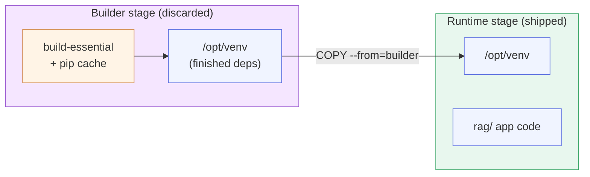

# Chapter 5 — Lesson 2: Slimming Images with Multi-Stage Builds

> **Learning goal:** use multi-stage builds, a minimal base, and `.dockerignore`
> to ship only runtime artifacts, and quantify the size reduction.

The first checklist column is **size**, and the biggest lever on it is the
**multi-stage build**. The demo assets for this lesson live in this folder; the
runbook is [`DEMO.md`](DEMO.md).

---

## 1. The problem: single-stage images ship the build

A normal image keeps everything the build needed — compilers, build tools,
package caches, dev headers. None of it runs in production. It's dead weight and
extra attack surface.

---

## 2. The fix: build in one stage, run in another

A multi-stage build uses a throwaway **builder** stage to install/compile, and a
clean **runtime** stage that copies only the finished artifacts:



```dockerfile
FROM python:3.11-slim AS builder
RUN apt-get update && apt-get install -y --no-install-recommends build-essential
RUN python -m venv /opt/venv
ENV PATH="/opt/venv/bin:$PATH"
COPY requirements-ingestion.txt .
RUN pip install -r requirements-ingestion.txt

FROM python:3.11-slim          # clean runtime — no compilers, no pip cache
COPY --from=builder /opt/venv /opt/venv
ENV PATH="/opt/venv/bin:$PATH"
COPY rag/ /app/rag/
```

The compiler toolchain and pip cache live only in the builder, which is discarded.

---

## 3. Supporting levers

- **Smaller base** — `slim` over the full image; `distroless` ships no shell or
  package manager at all.
- **Layer order** — least-changing layers lowest (the Chapter 3 cache idea).
- **`.dockerignore`** — keep `.venv`, `chroma_data/`, tests, and `.git` out of
  the build context. The repo had none before this chapter; see
  [`.dockerignore`](.dockerignore).

---

## 4. Demo: measure the win

```bash
docker build -f chapter_5/l2/Dockerfile_Ingestion.singlestage -t rag-ingestion:single .
docker build -f chapter_5/l2/Dockerfile_Ingestion            -t rag-ingestion:multi  .
docker images rag-ingestion
docker run --rm rag-ingestion:multi --pdf pdf/form-10-q.pdf   # still does real work, offline
```

Full steps in [`DEMO.md`](DEMO.md).

---

## 5. AI note: weights are data, not build output

For our images the torch and Docling layers are the dramatic win. But model
**weights** are *data* — don't bake gigabytes into a layer blindly. Handle them
at runtime (mounted or downloaded), which connects to the next lesson.

---

Next: locking the image down — **securing production images**.
