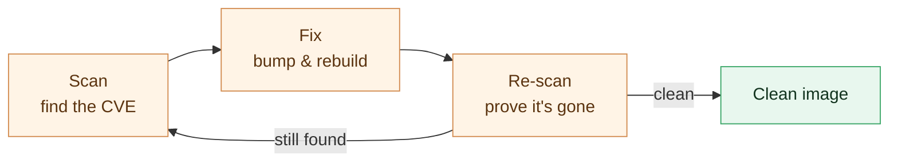

# Chapter 5 — Lesson 3: Securing Production Images

> **Learning goal:** reduce attack surface and run with least privilege
> (non-root, pinned base, no baked secrets), and scan for and triage
> vulnerabilities.

The image is smaller (Lesson 2); now make it **safe**. This is column 2 of the
production checklist — **security** — and the slides frame it as
*minimal surface, least privilege*. In practice that's three habits plus a loop:
run with least privilege, shrink the surface, keep secrets out of layers, and
scan for known vulnerabilities. The demo assets for this lesson live in this
folder; the runbook is [`DEMO.md`](DEMO.md).

---

## 1. Least privilege — don't run as root

A container process is root by default. Create an unprivileged user and switch to
it, so a compromise doesn't start with root:

```dockerfile
RUN useradd --create-home --uid 10001 appuser
USER appuser
```

---

## 2. Minimal surface — pin the base, keep it lean

A floating tag (`python:3.11-slim`) moves under you. Pin by **digest** for a
reproducible, verifiable build, and prefer a minimal base:

```dockerfile
FROM python:3.11-slim@sha256:<digest>
```

`slim` or `distroless` means less in the image to attack. Install only the
runtime libraries you actually need — no compilers, no `curl`/`vim`/`git` — and a
multi-stage build (Lesson 2) keeps the toolchain and pip cache out of the final
image entirely. Fewer packages = smaller surface and fewer CVEs to triage.

```dockerfile
RUN apt-get update && apt-get install -y --no-install-recommends libgl1 libglib2.0-0 \
    && rm -rf /var/lib/apt/lists/*
```

---

## 3. No secrets in layers

API keys and tokens must never be baked in — layers are cached, shared, and
pushed, so a baked secret leaks with the image. Pass them at runtime and verify
nothing leaked:

```bash
docker run -e OPENAI_API_KEY rag-query:0.1.0            # injected, not baked
docker history --no-trunc rag-query:0.1.0               # no secret should appear
```

A `.dockerignore` at the build-context root is part of this: it keeps `.env`,
`*.key`, and `*.pem` out of the context so a broad `COPY` can't sweep them in.

---

## 4. Scan, fix, re-scan

A scanner reports known CVEs in your image's packages:

```bash
docker scout cves rag-query:0.1.0
# or:  trivy image --severity HIGH,CRITICAL rag-query:0.1.0
```

Act on it: bump the offending base or dependency to a fixed version, rebuild,
and **re-scan** to prove the CVE is gone. That loop is the habit.



> We lead with `docker scout` (bundled with Docker Desktop); `trivy` is the
> common CI alternative. At runtime you can tighten further:
> `docker run --read-only --cap-drop ALL rag-query:0.1.0`.

---

## 5. Demo: harden the query image (before → after)

The example in this folder secures the **query** image — the component that
handles the `OPENAI_API_KEY` secret — with an insecure "before" for contrast:

```bash
# before: root user, a baked (fake) secret, extra tools
docker build -f chapter_5/l3/Dockerfile_Query.insecure -t rag-query:insecure .
# after: pinned/slim, minimal surface, non-root, no baked secret
docker build -f chapter_5/l3/Dockerfile_Query           -t rag-query:0.1.0  .

docker run --rm rag-query:0.1.0 --whoami                             # non-root (uid 10001)
docker history --no-trunc rag-query:insecure | grep -i openai_api_key   # secret leaks here...
docker history --no-trunc rag-query:0.1.0    | grep -i openai_api_key   # ...but not here
docker scout quickview rag-query:insecure                            # compare CVE surface
docker scout quickview rag-query:0.1.0                               #   against the hardened one
```

Full steps in [`DEMO.md`](DEMO.md).

---

## 6. AI note

Never bake `OPENAI_API_KEY` or downloaded **model weights** into the image.
Confirm the leak with `docker history`, then inject the key at runtime and treat
weights as mounted/downloaded data — not a baked layer.

---

Next: making the image run anywhere — **multi-platform builds with Buildx**.
