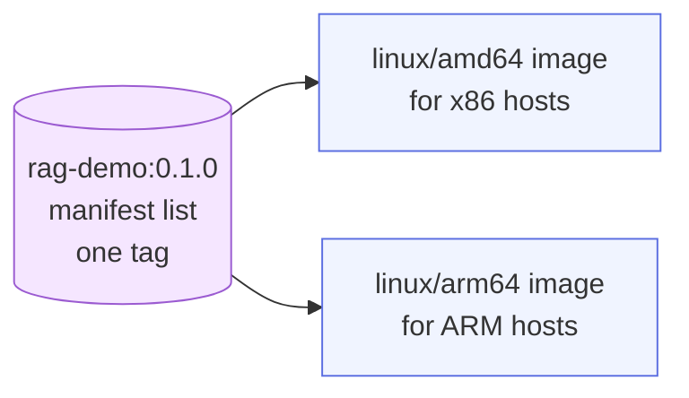

# Chapter 5 — Lesson 4: Multi-Platform Builds with Buildx

> **Learning goal:** build images that run on multiple CPU architectures
> (amd64/arm64) from one source using Buildx and BuildKit.

The **portability** column. You develop on one CPU architecture and deploy on
another — Apple Silicon (`arm64`) laptop, `amd64` cloud, or ARM cloud. The image
has to match. The demo assets are in this folder; the runbook is
[`DEMO.md`](DEMO.md).

---

## 1. The problem

An image built only for `amd64` won't start on `arm64` — or silently emulates
and crawls. Build for the wrong architecture and you find out in production.

---

## 2. Buildx and a multi-platform builder

The default `docker` builder targets only your architecture. A
`docker-container` builder can target many:

```bash
docker buildx create --name multiarch --driver docker-container --use --bootstrap
docker buildx inspect --bootstrap        # lists targetable platforms
```

---

## 3. One source, many platforms

```bash
docker buildx build --platform linux/amd64,linux/arm64 -t rag-demo:0.1.0 .
```

Building `arm64` on an `amd64` host (or vice versa) uses **QEMU emulation** —
bundled with Docker Desktop, convenient but slow. Native builders are faster at
scale.

---

## 4. Manifest lists

A multi-platform build under one tag produces a **manifest list**: one name
pointing at one image per architecture. A plain `docker pull` auto-selects the
right one.



---

## 5. Demo

The demo image prints the architecture it runs on, so the result is visible:

```bash
docker buildx build --platform linux/amd64 --load -t rag-demo:amd64 chapter_5/l4
docker run --rm --platform linux/amd64 rag-demo:amd64    # -> x86_64
docker buildx build --platform linux/arm64 --load -t rag-demo:arm64 chapter_5/l4
docker run --rm --platform linux/arm64 rag-demo:arm64    # -> aarch64
```

Full steps in [`DEMO.md`](DEMO.md). The same commands apply to the heavier
`rag-ingestion` image — with the caveat below.

---

## 6. AI caveat

Multi-platform isn't free for heavy images: not every dependency publishes
wheels for every architecture (some native/torch builds fail or fall back to a
slow source compile under emulation). Know this before promising an ARM build.

---

Next: a multi-arch tag only lives in a registry — **publishing**.
