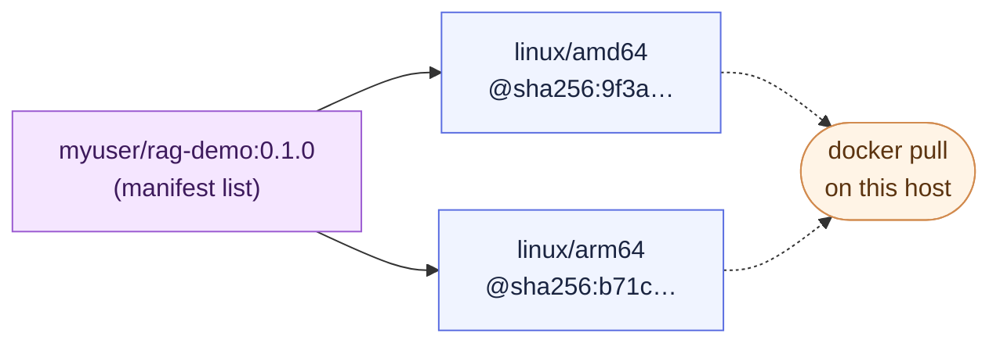

# Chapter 5 — Lesson 5: Publishing to a Registry

> **Learning goal:** version, tag, and publish images to a registry — including
> a multi-arch manifest — with a sound tagging strategy and image provenance.

The **distribution** column. A production image must live somewhere a deploy
target can pull it. We covered pull/push basics in Chapter 2; this is publishing
*for production*. Demo runbook: [`DEMO.md`](DEMO.md). It targets **Docker Hub**.

---

## 1. Registries and naming

Docker Hub is the default; GHCR ties into GitHub Actions; clouds have their own.
The image is named `registry/namespace/repository:tag`, with your username as
the namespace.

---

## 2. Tagging strategy (the production habit)

Push an **immutable version** — `0.1.0` or the git SHA — never just `latest`.
`latest` is a *moving* tag: it changes silently, so "which build is in prod?"
becomes unanswerable. Version tags are how you roll back with confidence.

---

## 3. Log in, tag, push

```bash
docker login
docker tag rag-demo:0.1.0 myuser/rag-demo:0.1.0
docker push myuser/rag-demo:0.1.0
```

Only layers the registry lacks are uploaded — the same caching idea as builds,
over the network.

---

## 4. Build and publish multi-arch in one step

`buildx --push` builds every platform **and** publishes the manifest list at
once — no intermediate `--load`:

```bash
docker buildx build --platform linux/amd64,linux/arm64 \
  -t myuser/rag-demo:0.1.0 --push chapter_5/l4
docker buildx imagetools inspect myuser/rag-demo:0.1.0   # one tag, many arches
docker pull myuser/rag-demo:0.1.0                         # Docker picks your arch
```

The registry receives a **manifest list**: one tag that fans out to a
per-architecture image, and a pull resolves to the variant matching the host.



---

## 5. Provenance and integrity

Every image has a content **digest** (`@sha256:...`) that pins an exact build.
Tools like cosign or `docker scout` can **sign** images and attach attestations,
so a consumer can verify what they pull is what you published.

---

## 6. AI note

Large images make push/pull slow and bump into registry **storage** and
**pull-rate** limits. With multi-gigabyte AI images, tag hygiene and layer
caching matter more, not less.

---

Next: operating the image in production — **best practices & going live**.
