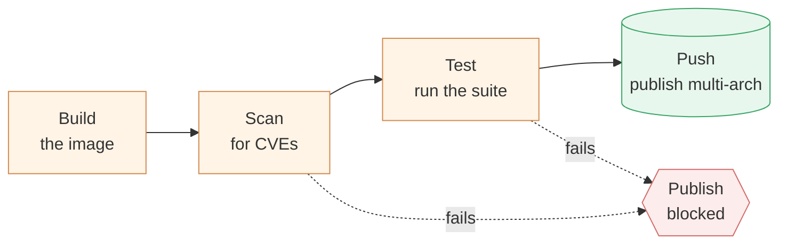

# Chapter 5 — Lesson 6: Best Practices & Going Live

> **Learning goal:** apply the operational practices that keep a published image
> reliable (resource limits, health, graceful shutdown) and validate the
> production artifact in a build → scan → test → push pipeline.

The image is built, hardened, portable, and published. The last column is
**operability** — keeping it reliable while running — plus **validation** before
it ships. This lesson ties the chapter together and closes the course.

---

## 1. Runtime guardrails

A container with no limits can consume the whole host. Cap it and define failure
behavior:

```bash
docker run --memory 1g --cpus 1.5 --restart unless-stopped \
  --read-only myuser/rag-query:0.1.0
```

---

## 2. Graceful shutdown and health

Handle `SIGTERM` so in-flight work finishes when the platform stops the
container, and add a `HEALTHCHECK` so the orchestrator knows it's *ready*, not
just *started*:

```dockerfile
HEALTHCHECK --interval=30s --timeout=3s \
  CMD python -c "import urllib.request; urllib.request.urlopen('http://localhost:8080/health')" || exit 1
```

---

## 3. Validate the built artifact

Test the **production image**, not a dev shell: run it, hit `/health`, send a
real query, scan it. This is distinct from Chapter 4's integration tests — those
checked *behavior*; this checks the *image you're about to ship*.

---

## 4. Put it in CI

Make it happen on every change: **build → scan → test → publish** — one ordered
gate where a failing scan or test stops the publish, so bad images never reach
the registry. Wired into the project's existing `.github/workflows/main.yml`:



```yaml
- run: docker build -f docker/Dockerfile_Query -t rag-query:${{ github.sha }} .
- run: docker scout cves --exit-code --only-severity critical,high rag-query:${{ github.sha }}
- run: pytest tests/
- run: docker buildx build --platform linux/amd64,linux/arm64 \
         -t myuser/rag-query:${{ github.ref_name }} --push docker/
```

---

## 5. Readiness checklist — checked off

| Column | Delivered by |
| ------ | ------------ |
| Size | multi-stage builds (L2) |
| Security | non-root, pinned, scanned (L3) |
| Portability | buildx multi-arch (L4) |
| Distribution | versioned + published (L5) |
| Operability | limits, health, CI (this lesson) |

---

## 6. What's next (beyond this course)

Not covered here: orchestration at scale (Kubernetes), autoscaling, and a full
observability stack. Those are the natural next steps now that your images are
production-ready.

---

That's the journey — from "why containers" in Chapter 1, through building,
developing, and testing, to production-ready AI images here. **That's the
course.**
