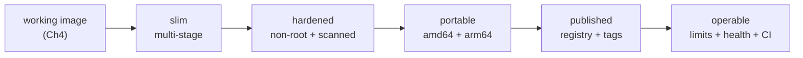

# Chapter 5 — Scope: Preparing AI Applications for Production with Docker

> **Status:** BUILT (2026-05-29). All six lessons have their
> `README.md` + `script_c5_l{M}.md` + `slides_c5_l{M}.html`; demo assets exist
> for L2 (multi-stage), L4 (buildx), and L5 (publish). Short form:
> *Preparing for Production*. This document is the original scope; the open
> decisions at the bottom are now resolved.
> This document scopes the six lessons (≤500 words each, with code examples
> where applicable). Each lesson will later be expanded into the standard
> `README.md` + `script_c5_l{M}.md` + `slides_c5_l{M}.html` set (see
> `chapter_0/naming_convention.md`).
>
> **Framing (confirmed):** teach the Docker techniques **generically** so they
> transfer to any application; use the RAG app's images (the heavy ingestion
> image, the lean query image from Chapter 4) as recurring, concrete examples.

## Chapter arc

Chapter 4 left us with a multi-container app that **runs and passes its tests**
— but "runs on my machine and in CI" is not "production-ready." Chapter 5 takes
those images the last mile: make them **small, secure, portable, published, and
operable**. The arc moves from *what production-ready means* → the techniques
that get us there (multi-stage, security, multi-platform, publishing) → the
operational habits that keep it that way.



The running example throughout is the Chapter 4 **ingestion** image (heavy:
Docling, torch, sentence-transformers — lots to slim and scan) contrasted with
the **query** image (already lean) — but every technique is presented as a
general Docker practice first.

---

## Lesson 1 — What "Production-Ready" Means

**Learning goal:** define production-readiness for a containerized app and
baseline the current images against that bar.

**Format:** slides (conceptual) + light hands-on (measure).

**Scope.** Establish the mental model: a *working* image is not a *production*
image. Introduce the production-readiness checklist this chapter delivers
against — **size** (faster pulls, smaller attack surface, cheaper storage),
**security** (minimal surface, no secrets, no known CVEs, least privilege),
**portability** (runs on the CPU architecture you deploy to), **distribution**
(versioned and published to a registry), and **operability** (resource limits,
health, graceful shutdown, observability).

Then *baseline* to motivate the rest of the chapter — measure where the Ch4
images stand today:

```bash
docker images rag-ingestion rag-query        # how big are we starting?
docker history rag-ingestion:0.1.0           # which layers dominate?
dive rag-ingestion:0.1.0                      # wasted space, layer-by-layer
docker scout quickview rag-ingestion:0.1.0   # CVE count at a glance
```

The point: the heavy image is large and has a wide surface; each remaining
lesson attacks one column of the checklist, and we'll re-measure to prove it.

**Repo artifacts:** `docker/Dockerfile_API`, the Ch4 `chapter_4/l2/Dockerfile_*`.

---

## Lesson 2 — Slimming Images with Multi-Stage Builds

**Learning goal:** use multi-stage builds to ship only runtime artifacts, and
quantify the size reduction.

**Format:** slides + hands-on (build & compare).

**Scope.** The core size technique. Explain the problem: build tools, compilers,
caches, and dev headers bloat a single-stage image and never run in production.
A **multi-stage build** compiles/installs in a `builder` stage and copies only
the finished artifacts into a clean, minimal final stage.

```dockerfile
# Stage 1: build — has compilers, build deps, caches
FROM python:3.11-slim AS builder
WORKDIR /app
COPY requirements-query.txt .
RUN pip install --no-cache-dir --prefix=/install -r requirements-query.txt

# Stage 2: runtime — only what's needed to run
FROM python:3.11-slim
WORKDIR /app
COPY --from=builder /install /usr/local
COPY rag/ /app/rag/
EXPOSE 8080
CMD ["uvicorn", "rag.api.query_app:app", "--host", "0.0.0.0", "--port", "8080"]
```

Cover the supporting levers: choosing a smaller base (`slim` vs full vs
`distroless`), layer ordering for cache hits, and **`.dockerignore`** (the repo
has none yet — add one so build context, `.venv`, `chroma_data/`, and tests stay
out of the image). Hands-on: build before/after and compare with
`docker images`. AI example: the ingestion image's torch/Docling layers are the
dramatic win; note that model *weights* are data, not build output — covered in
L3/L6, not baked blindly here.

**Repo artifacts:** new `.dockerignore`, Ch4 Dockerfiles refactored to two-stage.

---

## Lesson 3 — Securing Production Images

**Learning goal:** reduce attack surface and run with least privilege; scan for
and triage vulnerabilities.

**Format:** slides + hands-on (scan & fix).

**Scope.** Generic container-security baseline, applied to our images:

- **Run as non-root** — create and switch to an unprivileged user.
- **Pin the base** by digest, not just tag; prefer minimal/distroless bases.
- **Keep secrets out of layers** — no API keys baked in; pass at runtime
  (env / secrets), and confirm with `docker history` that nothing leaked.
- **Drop what you don't need** — `--no-install-recommends`, clean apt lists,
  read-only root filesystem and dropped capabilities at runtime.
- **Scan** — `docker scout cves` / `trivy image`, read the report, bump a base
  or dependency to clear a fixable CVE, re-scan to prove it.

```dockerfile
RUN useradd --create-home --uid 10001 appuser
USER appuser
# ... pinned base, e.g. python:3.11-slim@sha256:<digest>
```

```bash
docker scout cves rag-query:0.1.0          # what's vulnerable?
trivy image --severity HIGH,CRITICAL rag-query:0.1.0
```

AI example: never bake `OPENAI_API_KEY` or downloaded model weights into the
image — show the `docker history` leak and the runtime-injection fix.

**Repo artifacts:** Ch4 Dockerfiles, `docker/cache_docling_models.py` (weights as
runtime data, not a baked layer).

---

## Lesson 4 — Multi-Platform Builds with Buildx

**Learning goal:** build images that run on multiple CPU architectures from one
source.

**Format:** slides + hands-on (`buildx`).

**Scope.** Why it matters generically: you develop on one architecture and
deploy on another (Apple Silicon `arm64` laptop → `amd64` cloud, or ARM-based
cloud instances). An image built for the wrong arch fails to run or silently
emulates and crawls. Introduce **Buildx** and BuildKit:

```bash
docker buildx create --name rag-builder --use         # a multi-arch builder
docker buildx build --platform linux/amd64,linux/arm64 \
  -f docker/Dockerfile_Query -t rag-query:0.1.0 .      # one source, two arches
```

Cover: native builders vs QEMU emulation (and the speed cost), the resulting
**manifest list** that lets `docker pull` pick the right arch automatically, and
build caching across platforms. Note the catch for AI images — some wheels
(torch, native libs) aren't published for every arch, so multi-platform isn't
free; show how a missing-wheel build fails and how to reason about it. Building
*and pushing* a multi-arch manifest is the bridge to Lesson 5 (`--push`).

**Repo artifacts:** Ch4 Dockerfiles; `docker/build_base_docker.sh` (existing
single-arch build, contrasted).

---

## Lesson 5 — Publishing to a Registry

**Learning goal:** version, tag, and publish images to a registry so they can be
deployed.

**Format:** slides + hands-on (tag & push).

**Scope.** A production image has to live somewhere a deploy target can pull it.
Cover registries generically (Docker Hub, GHCR, cloud registries), then:

- **Tagging strategy** — immutable version tags (`0.1.0`, git SHA) vs moving
  tags (`latest`); why `latest` is dangerous in production.
- **Login & push** — `docker login`, namespacing (`ghcr.io/<org>/rag-query`).
- **Buildx push** — build the multi-arch manifest from L4 straight to the
  registry in one step.
- **Provenance & integrity** — image digests, and a brief look at signing /
  attestations (`docker scout`, cosign) so consumers can verify what they pull.

```bash
docker tag rag-query:0.1.0 ghcr.io/acme/rag-query:0.1.0
docker push ghcr.io/acme/rag-query:0.1.0
# or build + push multi-arch in one shot:
docker buildx build --platform linux/amd64,linux/arm64 \
  -t ghcr.io/acme/rag-query:0.1.0 --push -f docker/Dockerfile_Query .
```

AI example note: large AI images make tag hygiene and layer caching matter more
(slow pushes/pulls), and public registries have pull-rate and storage limits
worth planning around.

**Repo artifacts:** `docker/build_*` scripts; image names from Ch4 compose.

---

## Lesson 6 — Best Practices & Going Live

**Learning goal:** apply the operational practices that keep a published image
reliable, and validate the production artifact before it ships.

**Format:** slides + hands-on (validate + CI excerpt).

**Scope.** Tie the chapter together with run-time and process practices:

- **Resource limits & runtime** — memory/CPU limits, restart policy, read-only
  fs, graceful shutdown (handle SIGTERM), `HEALTHCHECK` for the orchestrator.
- **Validate the built artifact** — smoke-test the *production* image (not a dev
  shell): run it, hit `/health`, run a query, and scan it — distinct from Ch4's
  integration tests, which tested behavior, not the shipped image.
- **CI pipeline** — wire it into the existing `.github/workflows/main.yml`:
  build → scan → test → (on tag) buildx push.
- **Recap the readiness checklist** from L1 and check off each column; name what
  this course did *not* cover (orchestration/K8s, autoscaling, full
  observability stacks) as next steps.

```yaml
# .github/workflows/main.yml (excerpt) — build → scan → push
- run: docker build -f docker/Dockerfile_Query -t rag-query:${{ github.sha }} .
- run: docker scout cves --exit-code --only-severity critical,high rag-query:${{ github.sha }}
- run: docker buildx build --platform linux/amd64,linux/arm64 \
         -t ghcr.io/acme/rag-query:${{ github.ref_name }} --push -f docker/Dockerfile_Query .
```

```dockerfile
HEALTHCHECK --interval=30s --timeout=3s \
  CMD python -c "import urllib.request; urllib.request.urlopen('http://localhost:8080/health')" || exit 1
```

Close the chapter — and the course.

**Repo artifacts:** `.github/workflows/main.yml`, Ch4 compose/Dockerfiles,
`tests/`.

---

## Resolved decisions

1. **Hands-on depth for L4/L5 → hybrid.** The L4/L5 demos use a tiny,
   dependency-free image (`chapter_5/l4/`) that prints its CPU architecture, so
   the multi-arch build and the registry push are fast and reliable to record.
   Real local multi-arch builds run on screen; the push targets a real account.
   The runbooks note the identical commands apply to the heavy `rag-ingestion`
   image (with the torch/arm64 wheel caveat).
2. **`.dockerignore` + two-stage refactor → teaching copies.** The improved
   Dockerfiles live under `chapter_5/l{M}/` (consistent with Ch4); adopting them
   into the repo's real `docker/` files is a tracked open item.
3. **Scanner → `docker scout` leads**, `trivy` mentioned as the CI alternative.
4. **Registry → Docker Hub** for the demos (GHCR noted as the GitHub-Actions
   alternative). L6 shows the CI workflow excerpt and runs build+scan; the push
   step is demonstrated, not wired into this repo's CI.
