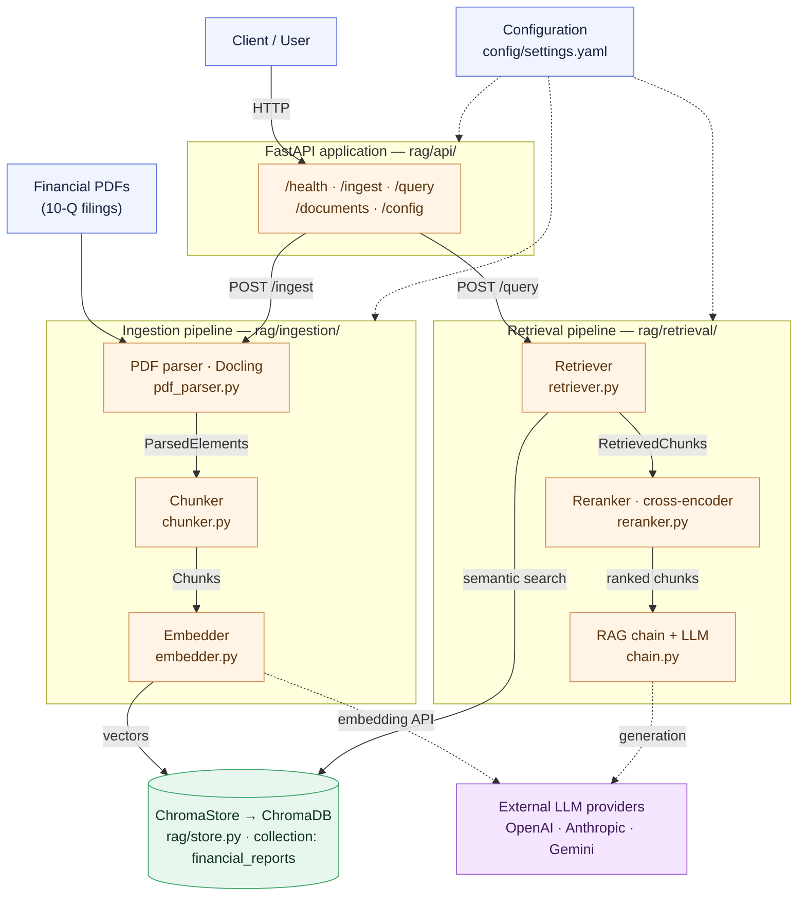

# The RAG System (`rag/`)

The `rag/` package is a self-contained **Retrieval-Augmented Generation (RAG)**
library for question-answering over financial PDFs (10-Q filings). This document
introduces RAG, maps the architecture, and summarizes the core functions.

---

## 1. What is RAG?

A large language model only knows what it was trained on. **Retrieval-Augmented
Generation** grounds the model in *your* documents by splitting them into
chunks, storing those chunks as vector embeddings, and — at question time —
retrieving the most relevant chunks and passing them to the LLM as context. The
model answers from that retrieved evidence and cites its sources, which reduces
hallucination and lets you answer questions about private or up-to-date data.

This project splits that into two pipelines that share a vector database:

- **Ingestion** — parse a PDF → chunk it → embed the chunks → store the vectors.
- **Retrieval (query)** — embed the question → retrieve similar chunks → rerank
  them → generate a grounded answer with an LLM.

The two never call each other; the **vector database (ChromaDB) is the contract
between them** — ingestion writes, query reads.

---

## 2. Architecture



*(Adapted from `docs_archive/rag_system_architecture.drawio`.)*

Two supporting modules sit alongside the pipelines:

- **`rag/observability/`** — structured `logging.py` and optional `tracing.py`
  (LangSmith or Phoenix via OpenTelemetry), gated by `observability.enabled`.
- **`rag/evaluation/`** — `metrics.py` and a `test_set.yaml` for measuring
  retrieval/answer quality.

---

## 3. Package layout

| Path | Responsibility |
| ---- | -------------- |
| `rag/config.py` | Load and validate `config/settings.yaml` into a typed `Settings` object; resolve provider API keys. |
| `rag/ingestion/pdf_parser.py` | Parse a PDF into structured elements (headings, text, tables) with Docling. |
| `rag/ingestion/chunker.py` | Split parsed elements into chunks (`recursive` / `by_title` / `semantic`). |
| `rag/ingestion/embedder.py` | Build the embedding client for the active provider. |
| `rag/store.py` | `ChromaStore` — upsert, query, list, delete vectors in ChromaDB. |
| `rag/retrieval/retriever.py` | Embed a question and fetch the most similar chunks. |
| `rag/retrieval/reranker.py` | Reorder retrieved chunks (cross-encoder / llm / none). |
| `rag/retrieval/chain.py` | End-to-end query: retrieve → rerank → generate the answer. |
| `rag/api/` | FastAPI app exposing the pipelines over HTTP (split into ingestion and query services — see `chapter_4/`). |

---

## 4. Settings

All runtime behavior is driven by [`config/settings.yaml`](../config/settings.yaml)
— active providers, chunking parameters, retrieval `top_k` / rerank / threshold,
the ChromaDB host/port/collection, and observability. Provider **API keys** come
from environment variables (never the YAML).

To get a working environment with all dependencies and a running ChromaDB,
choose one of:

- **Option 1 — Dev Container (recommended).** Open the project in the VS Code
  Dev Container; it provides the full Python stack, ChromaDB, and the
  environment variables. See **[`01_settings.md`](01_settings.md)**.
- **Option 2 — Install the dependencies yourself.** Use
  **[`docker/requirements.txt`](../docker/requirements.txt)** (the complete dev
  stack) in your own Python 3.11 environment, and run a ChromaDB instance
  reachable at the host/port in `settings.yaml`.

`CHROMA_HOST` / `CHROMA_PORT`, if set, override the `chromadb` host/port from the
YAML (so the containerized services can point at the `chromadb` service by name).

---

## 5. Core functions

The library is small and composable. The key entry points:

```python
from rag.config import load_config
config = load_config()          # -> Settings (validated from config/settings.yaml)
```

**Ingestion**

- `parse_pdf(path, *, do_ocr=False, do_table_structure=True, ...) -> list[ParsedElement]`
  — Docling parse into headings/text/tables (`rag/ingestion/pdf_parser.py`).
- `chunk_elements(elements, *, method="recursive", chunk_size=1000, chunk_overlap=200, keep_tables_intact=True) -> list[Chunk]`
  — split elements into chunks (`rag/ingestion/chunker.py`).
- `get_embedder(config) -> Embeddings`
  — embedding client for the active provider (`rag/ingestion/embedder.py`).

**Storage** — `ChromaStore(config)` (`rag/store.py`)

- `ingest_chunks(chunks, embedder, source_file=..., overwrite=False) -> int`
  — embed and upsert chunks; **skips a document already stored** (returns 0)
  unless `overwrite=True`.
- `query(query_text, n_results=5, where=None) -> dict` · `list_documents()` ·
  `count()` · `delete_by_source(source_file)`.

**Retrieval / query**

- `retrieve(question, config, top_k=...) -> list[RetrievedChunk]`
  (`rag/retrieval/retriever.py`).
- `rerank(question, chunks, *, method="cross-encoder", top_k=5) -> list[RetrievedChunk]`
  (`rag/retrieval/reranker.py`).
- `query_rag(question, config, *, top_k=None, rerank_method=None, chat_provider=None) -> QueryResponse`
  — the full retrieve → rerank → generate flow; returns `answer`, `sources`, and
  `metadata` (`rag/retrieval/chain.py`).

For runnable command-line examples of ingesting a PDF and querying, see
**[`03_rag_cli.md`](03_rag_cli.md)**.
