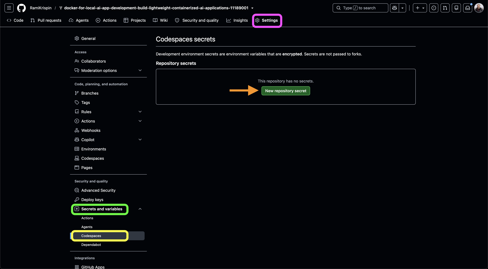
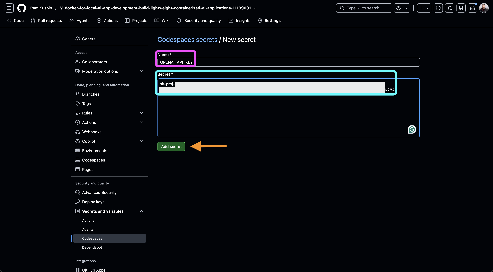
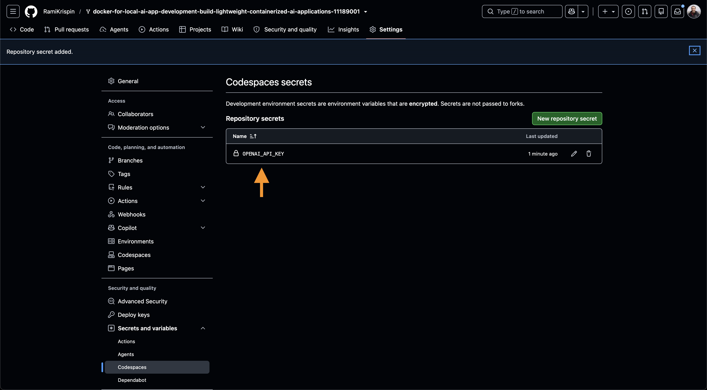
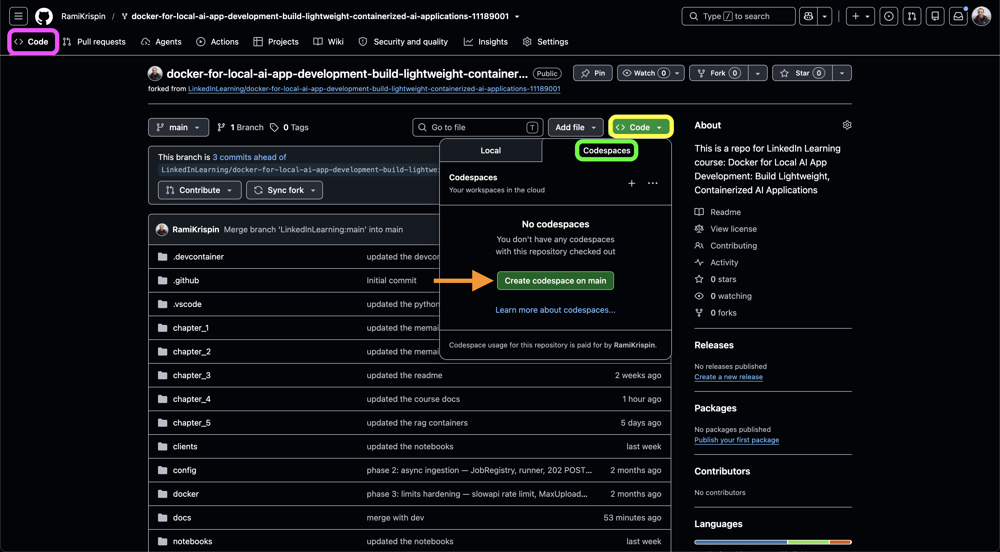
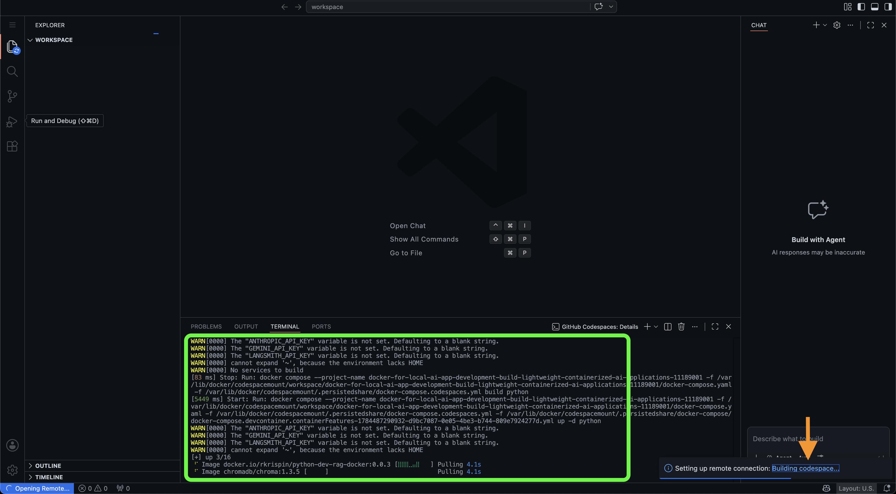
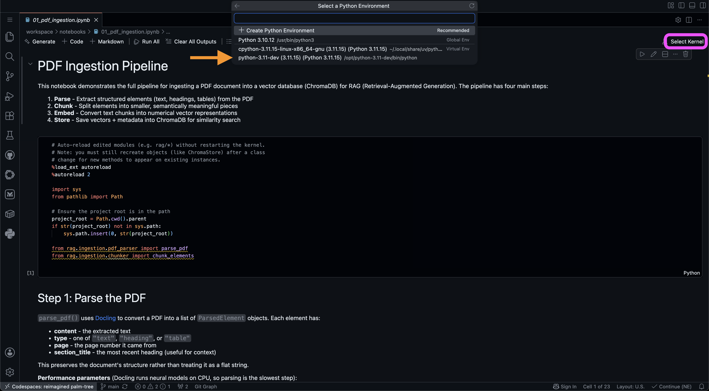
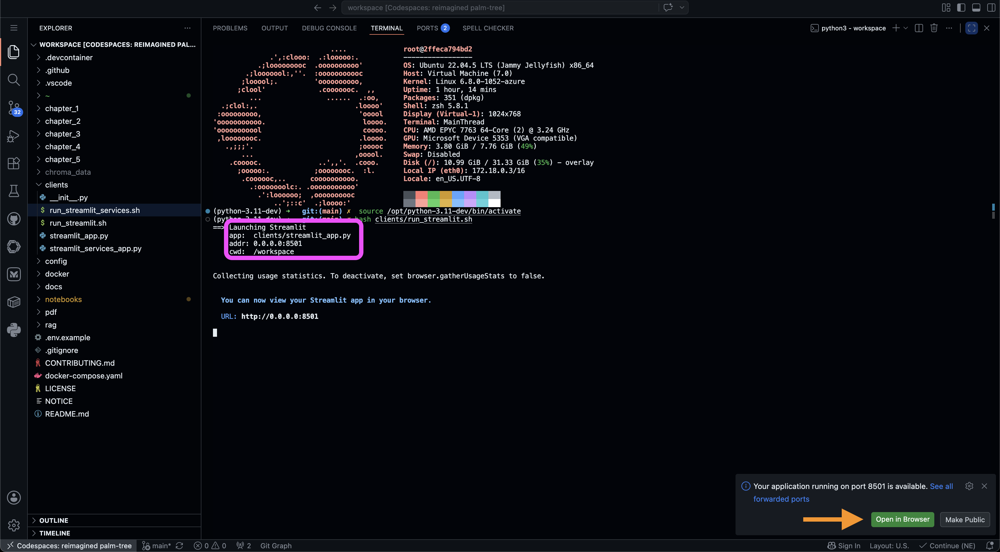
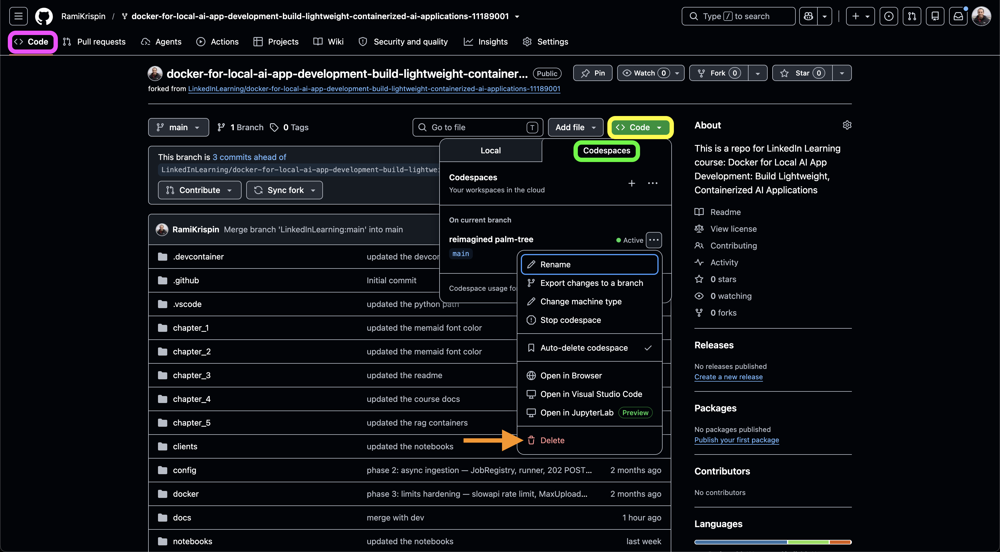

# Launching the course with GitHub Codespaces

GitHub Codespaces lets you open this repository in VS Code running on a
GitHub-hosted virtual machine. The Codespace uses the repository's existing
[Dev Container configuration](../.devcontainer/devcontainer.json) and
[Docker Compose configuration](../docker-compose.yaml) to start two services:

- `python`: the course development environment, notebooks, command-line tools,
  and Streamlit application.
- `chromadb`: the vector database used by the RAG workflows.

The first launch can take several minutes while Codespaces downloads the
course images and creates the development container.

## Prerequisites

Before starting, make sure you have:

- A GitHub account with access to GitHub Codespaces.
- A fork of the course repository in your GitHub account. A fork is
  recommended so that you can commit your own notes and changes.
- An API key for the model provider you plan to use. This guide uses the
  default OpenAI embedding and chat models, which you can change in the
  [model configuration file](../config/settings.yaml).
- Internet access during the first launch and when downloading any missing
  document-processing models.

## Step 1: Store the API key as a Codespaces secret

Do not add API keys directly to the repository or commit them in a `.env`
file. GitHub Codespaces secrets make sensitive values available as environment
variables inside your Codespace.

In your fork of the repository:

1. Open the repository's **Settings** tab.
2. In the left menu, expand **Secrets and variables**.
3. Select **Codespaces**.
4. Select **New repository secret**.

<!-- Image placeholder: replace with docs/assets/github-codespaces-01-secrets-settings.png -->


Add the API key for your selected model provider as a Codespaces secret. Here
are the supported options:

| Name | Required | Purpose |
| --- | --- | --- |
| `OPENAI_API_KEY` | Yes, for the default course configuration | OpenAI embeddings and chat |
| `RAG_API_KEYS` | Only when running the FastAPI service | Comma-separated keys accepted by the local RAG API |
| `ANTHROPIC_API_KEY` | Optional | Anthropic chat models |
| `GEMINI_API_KEY` | Optional | Gemini embedding and chat models |
| `LANGSMITH_API_KEY` | Optional | LangSmith tracing when observability is enabled |

In this example, we use OpenAI as the model provider. Enter `OPENAI_API_KEY`
as the secret name, paste your OpenAI API key into the value field, and select
**Add secret**.

<!-- Image placeholder: replace with docs/assets/github-codespaces-02-add-secret.png -->


Repeat these steps for any optional providers you plan to use. You do not need
to create secrets for `CHROMA_DATA_PATH` or `HF_HOME`; the Compose configuration
sets appropriate defaults for both.

<!-- Image placeholder: replace with docs/assets/github-codespaces-03-secret-list.png -->


For more information, see GitHub's guide to
[managing Codespaces secrets](https://docs.github.com/en/codespaces/managing-codespaces-for-your-organization/managing-development-environment-secrets-for-your-repository-or-organization).

## Step 2: Create the Codespace

After configuring the secret:

1. Return to the repository's **Code** tab.
2. Select the green **Code** button.
3. Select the **Codespaces** tab.
4. Select **Create codespace on main**.

If you use **New with options**, choose the `main` branch and the repository's
default Dev Container configuration. A machine with at least 8 GB of memory is
recommended. Additional CPU cores will make PDF processing faster but can use
your Codespaces compute allowance more quickly.

<!-- Image placeholder: replace with docs/assets/github-codespaces-04-create-codespace.png -->


Codespaces will open VS Code in the browser and read
`.devcontainer/devcontainer.json`. It then pulls the Python development image
and the ChromaDB image and starts the Compose services.

To follow the initial setup, select the **Building codespace...** link in the
VS Code notification. The creation log displays the image download and
container startup progress.

<!-- Image placeholder: replace with docs/assets/github-codespaces-05-build-progress.png -->


## Step 3: Verify the environment

When the Codespace is ready, open a terminal in VS Code. The terminal runs
inside the `python` development container, and its working directory should be
`/workspace`.

Check the Python environment:

```bash
pwd
which python
python --version
```

The expected interpreter is:

```text
/opt/python-3.11-dev/bin/python
```

Confirm that the OpenAI secret is available without printing its value:

```bash
python -c 'import os; print("OPENAI_API_KEY configured:", bool(os.getenv("OPENAI_API_KEY")) and os.getenv("OPENAI_API_KEY") != "key_is_missing")'
```

Confirm that the Python container can reach ChromaDB over the Compose network:

```bash
python -c 'import urllib.request; print(urllib.request.urlopen("http://chromadb:8000/api/v2/heartbeat").read().decode())'
```

If ChromaDB has only just started, wait a few seconds and run the heartbeat
command again.

## Step 4: Prepare the Hugging Face model cache

The development image already contains the required Python packages, including
Docling and `sentence-transformers`. These packages use additional model files
for PDF layout analysis, table extraction, and cross-encoder reranking.

`HF_HOME` tells Hugging Face libraries where to find and store these downloaded
model files. Inside the development container it is set to:

```text
/opt/hf-cache
```

The current Compose configuration mounts a Codespace-side cache directory at
that location. On a new Codespace this directory can be empty, so prepare it
before the first ingestion:

```bash
bash docker/cache_models.sh
```

The initial download is approximately 330 MB and can take several minutes.
Verify the cache afterward:

```bash
echo "$HF_HOME"
du -sh "$HF_HOME/hub"
```

The cache is normally reused while you continue working in the same Codespace.
A new Codespace, a deleted Codespace, or some full rebuild scenarios can require
the models to be downloaded again.

## Step 5: Run the RAG notebooks

The notebooks provide the most direct course workflow:

1. Open `notebooks/01_pdf_ingestion.ipynb` to parse and ingest a PDF.
2. Open `notebooks/02_query_the_pdf.ipynb` to query the ingested collection.
3. Open `notebooks/03_review_chromadb.ipynb` to inspect the stored collections
   and records.

When prompted to select a notebook kernel:

1. Select **Select Kernel** in the upper-right corner of the notebook.
2. Choose **Python Environments**.
3. Select the `python-3.11-dev` environment at
   `/opt/python-3.11-dev/bin/python`.

<!-- Image placeholder: replace with docs/assets/github-codespaces-06-select-kernel.png -->


See the [notebook guide](../notebooks/README.md) for the purpose and expected
order of each notebook.

## Step 6: Run the Streamlit application

From the Codespaces terminal, run:

```bash
bash clients/run_streamlit.sh
```

The application listens on port `8501`, which is already listed in the Dev
Container's forwarded ports. Open the VS Code **Ports** panel and select the
browser icon next to port `8501`. Codespaces opens the application through an
authenticated forwarded URL.

<!-- Image placeholder: replace with docs/assets/github-codespaces-07-streamlit-port.png -->


## ChromaDB persistence and ingestion data

The Compose configuration stores ChromaDB files in `./chroma_data`, which is
mounted into the ChromaDB container at `/chroma/chroma`. Within a Codespace,
the data is also visible from the development container at:

```text
/workspace/chroma_data
```

The important persistence boundary is the Codespace instance:

- Stopping and later reopening the same Codespace preserves the ChromaDB data.
- Closing the browser tab does not delete the data and does not necessarily
  stop the Codespace immediately.
- Rebuilding the same Codespace normally preserves `chroma_data` because it is
  stored under the persistent repository workspace.
- Deleting the Codespace removes its local ChromaDB data.
- Creating a new Codespace creates a separate environment with an empty
  ChromaDB database.
- If a stopped Codespace is automatically deleted after its retention period,
  its ChromaDB data is also deleted.

> **Important:** ChromaDB ingestion data is not persistent across different or
> deleted Codespace instances. If you delete the Codespace and later create a
> new one, you must run the ingestion notebook again before querying the data.

To avoid unnecessary re-ingestion while completing the course, stop the
Codespace when you are finished and reopen that same instance for the next
session. A stopped Codespace does not incur compute usage, but it continues to
consume Codespaces storage until it is deleted.

## Step 7: Stop, reopen, or delete the Codespace

When you finish a study session:

1. Open [github.com/codespaces](https://github.com/codespaces), or open the
   repository's **Code > Codespaces** menu.
2. Select the `...` menu beside the Codespace.
3. Select **Stop codespace** to preserve the environment for another session.
4. Select **Delete** only when you no longer need its ChromaDB data, model
   cache, or uncommitted work.

<!-- Image placeholder: replace with docs/assets/github-codespaces-08-stop-delete.png -->


To continue the course later, return to
[github.com/codespaces](https://github.com/codespaces) and open the existing
Codespace instead of creating a new one.

Only running Codespaces incur compute usage. Stopped Codespaces continue to
incur storage usage. See GitHub's documentation on
[stopping and starting a Codespace](https://docs.github.com/en/codespaces/developing-in-a-codespace/stopping-and-starting-a-codespace)
and [Codespaces billing](https://docs.github.com/en/billing/concepts/product-billing/github-codespaces).

## Troubleshooting

### The API key is missing

If the verification command prints `False`, make sure `OPENAI_API_KEY` is a
Codespaces secret for the fork you launched. After adding or changing a secret,
stop and restart the Codespace so the new value is loaded.

### ChromaDB is unavailable

Retry the heartbeat command after a few seconds. If it remains unavailable,
open the Codespace creation log and confirm that the `chromadb` service started
successfully and that port `8000` is not already assigned to another process.

### Models download during the first ingestion

This is expected when `/opt/hf-cache` is empty. Run
`bash docker/cache_models.sh`, wait for it to complete, and restart the notebook
kernel or Streamlit application.

### RAG data ingestion fails because of insufficient memory

PDF parsing, table extraction, and model inference can require more memory than
the smallest Codespaces machine provides. Insufficient memory can cause the
notebook kernel to restart, the ingestion process to be killed, or the
Codespace to become unresponsive.

Stop the Codespace and change it to a machine type with more RAM. From
[github.com/codespaces](https://github.com/codespaces), open the `...` menu next
to the Codespace, select **Change machine type**, and choose a higher-memory
option. Restart the Codespace and run the ingestion workflow again.

> **Billing note:** Higher-resource machine types consume your Codespaces
> allowance more quickly. Depending on your available quota and repository
> ownership, using one may require enabling paid Codespaces usage on your
> GitHub account or using a Codespace paid for by an organization. See GitHub's
> guide to [changing the machine type](https://docs.github.com/en/codespaces/customizing-your-codespace/changing-the-machine-type-for-your-codespace)
> and [Codespaces billing](https://docs.github.com/en/billing/concepts/product-billing/github-codespaces).

### The Streamlit page does not open

Confirm that the terminal still shows Streamlit running, then open the VS Code
**Ports** panel and verify that port `8501` is forwarded. Keep the forwarded
port private unless you intentionally want to share the application.

### Previously ingested documents are missing

Check whether you opened the same Codespace instance. A newly created
Codespace has its own empty `chroma_data` directory. Run the ingestion notebook
again, or reopen the original Codespace if it has not been deleted.
