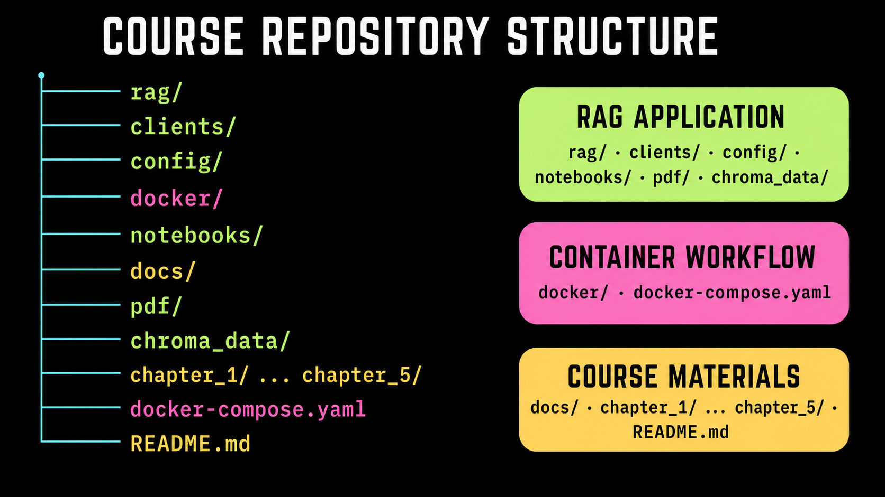

# Course Documentation

## Overview

Throughout this course, you will use Docker, Docker Compose, VS Code, Dev
Containers, and the terminal to learn how Docker works and explore the
development workflow for containerized AI applications. A
retrieval-augmented generation (RAG) application serves as the running example
as you move from defining dependencies and building images to developing,
testing, securing, and preparing a multi-container AI application for release.
For detailed guidance, see [Course Settings](01_settings.md),
[The RAG System](02_rag.md), and [Command-Line Usage](03_rag_cli.md).

## Course repository structure



## Requirements

### Tools

| Tool | Purpose |
| --- | --- |
| [Docker Desktop](https://www.docker.com/products/docker-desktop/) or Docker Engine | Build images and run the course containers and Compose services. |
| [Visual Studio Code](https://code.visualstudio.com/) | Edit course files and connect to the development container. |
| [Dev Containers extension](https://marketplace.visualstudio.com/items?itemName=ms-vscode-remote.remote-containers) | Open the RAG development environment inside VS Code. |
| Terminal | Run Docker, Docker Compose, and course commands. |
| Git | Clone the repository and track your changes. |
| Internet access | Download container images, model files, extensions, and Python dependencies when required. |

No local Python installation is required for the RAG workflows because the
Python environment is included in the development container. See
[Course Settings](01_settings.md), [The RAG System](02_rag.md), and
[Command-Line Usage](03_rag_cli.md) for more details.

### Environment variable settings

Configure the API key for each model provider you plan to use. The default
course configuration uses OpenAI for embeddings and chat.

| Variable | When it is needed |
| --- | --- |
| `OPENAI_API_KEY` | OpenAI embedding or chat models. Required by the default configuration. |
| `ANTHROPIC_API_KEY` | Anthropic chat models. |
| `GEMINI_API_KEY` | Gemini embedding or chat models. |
| `LANGSMITH_API_KEY` | Optional LangSmith tracing. |
| `RAG_API_KEYS` | Authentication when running the FastAPI service. |
| `CHROMA_DATA_PATH` | Optional host location for ChromaDB data. Defaults to `./chroma_data`. |
| `HF_HOME` | Optional host location for the Hugging Face model cache. Defaults to `~/.cache/huggingface`. |

You only need to set the API key for the model provider you plan to use. For
example, if you keep the default OpenAI embedding and chat models, you only
need to set `OPENAI_API_KEY`.

For the VS Code Dev Container, export the provider API key from your host
terminal before opening the container:

```bash
export OPENAI_API_KEY="your-api-key"
```

To persist these variables, add the export commands to `~/.zshenv` on macOS
or to the equivalent startup file for your Linux shell, such as `~/.bashrc`.
On Windows, define them as user environment variables through **System
Properties** or PowerShell, and then restart VS Code so it receives the updated
environment.

For direct Docker Compose use, copy `../.env.example` to `.env` in the
repository root and add the required values. The `.env` file is gitignored and
must not be committed. See [Course Settings](01_settings.md) for additional
environment and storage options.

### Model settings

Model providers and model names are configured in
[`config/settings.yaml`](../config/settings.yaml). The default settings are:

| Role | Default provider and model |
| --- | --- |
| Embeddings | OpenAI `text-embedding-3-small` |
| Chat | OpenAI `gpt-4o` |
| Retrieval reranking | `cross-encoder` |

```yaml
active:
  embedding_provider: "openai"
  chat_provider: "openai"
```

The course supports OpenAI or Gemini embeddings and OpenAI, Anthropic, or
Gemini chat models. To use another provider, update the corresponding value in
the `active` section, review its model name under `providers`, and set the
matching API key environment variable before launching the environment.
