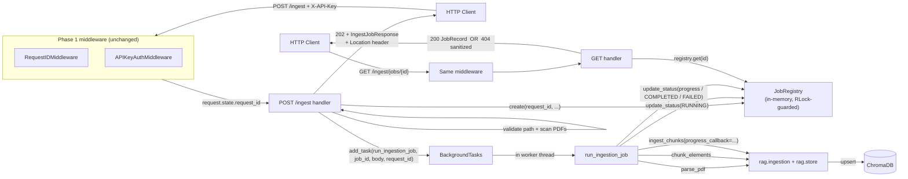
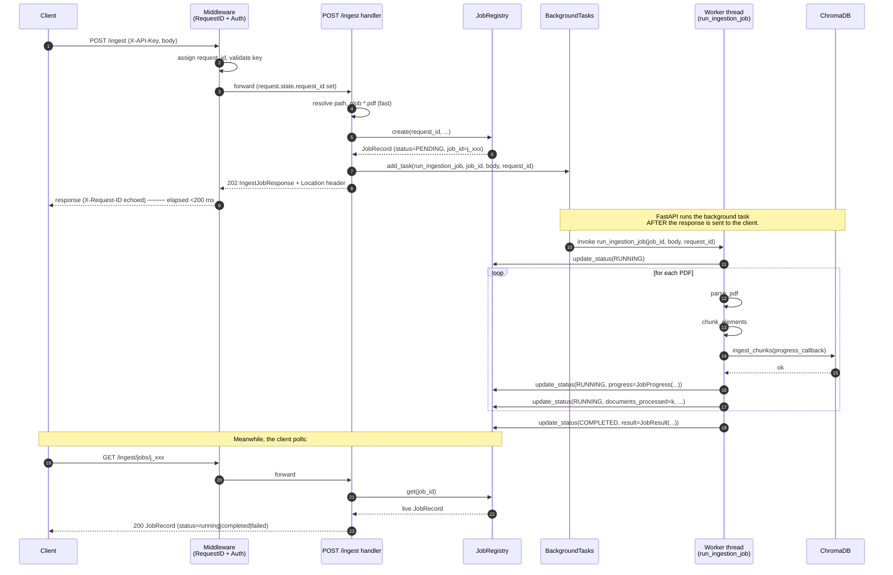

# Phase 2 — Async Ingestion: Architecture Specification

**Project**: RAG API Tier 1 Hardening (v0.1.0)
**Phase**: 2 of 4
**Source plan**: `docs/tier1_ingestion_plan.md` §9 Phase 2
**Phase 1 contract**: `docs/architecture/phase1_middleware.md` (especially §5 ordering, §8.1 downstream contracts)
**Targets**: FastAPI 0.115.x / Starlette 0.38.x, Python 3.12 stdlib only (no new third-party deps)
**Status**: Ready for Builder
**Intended save path**: `/Users/ramikrispin/Personal/courses/docker-local-ai-11189001/docs/architecture/phase2_async_ingestion.md`

---

## 1. Phase Overview

### Goal
Convert `POST /ingest` from a synchronous, blocking handler (1–5 min for a 500-page PDF) into a non-blocking submission that returns `202 Accepted` with a job ID in < 200 ms. The actual parse → chunk → embed → upsert pipeline runs in a FastAPI `BackgroundTasks` worker thread. Add `GET /ingest/jobs/{job_id}` (status polling) and `GET /ingest/jobs` (recent-job listing) for observability.

### Dependencies on previous phases
- **Phase 1 (completed)** — middleware stack already wired (`RequestIDMiddleware`, `APIKeyAuthMiddleware`, `register_exception_handlers`). This phase reuses:
  - `request.state.request_id` (set by `RequestIDMiddleware`) → passed explicitly into the background runner.
  - `build_error_response()` from `rag/api/middleware/errors.py` → reused for 404 responses from `GET /ingest/jobs/{job_id}` so the envelope shape (`{request_id, error}`) is uniform.
  - Phase 1 §8.1 contract: **ContextVar does NOT propagate through `BackgroundTasks`**. The runner therefore takes `request_id` as an explicit argument and passes it as `extra={"trace_id": request_id}` in all log calls inside the background thread.

### What this phase delivers
- New package `rag/api/jobs/` with three modules (`models.py`, `registry.py`, `runner.py`).
- New `IngestJobResponse` Pydantic model (the new shape returned by `POST /ingest`).
- New `JobRecord` / `JobStatus` / `JobProgress` / `JobResult` models.
- Two new endpoints (`GET /ingest/jobs/{job_id}`, `GET /ingest/jobs`) plus a rewritten `POST /ingest`.
- `get_job_registry()` `@lru_cache` singleton in `rag/api/dependencies.py`.
- New env var `RAG_API_JOB_REGISTRY_SIZE` (default `500`) for bounded LRU eviction.

### Streamlit constraint (re-confirmed)
`clients/streamlit_app.py` imports `rag.ingestion.*`, `rag.store.ChromaStore`, and `rag.retrieval.chain.query_rag` **directly** (see lines 25–30 of the Streamlit file). It does NOT touch any code under `rag/api/`. Phase 2 changes are confined to `rag/api/`; the underlying ingestion primitives (`ChromaStore.ingest_chunks`, `parse_pdf`, `chunk_elements`) remain byte-for-byte identical. **Streamlit keeps working unchanged.** Verified that `ChromaStore.ingest_chunks` already accepts `progress_callback`; both Streamlit (with its `_on_progress` lambda updating `st.progress`) and the new background runner (with a registry-update lambda) call into the same code path.

### What this phase does NOT do
- Rate limiting, max upload size, path-traversal hardening → Phase 3.
- New test files → Phase 4 (the §10 "Test surface" section below only describes them).
- Touch any code under `rag/store.py`, `rag/ingestion/`, `rag/retrieval/`, or `clients/streamlit_app.py`.
- Change `/query`, `/documents`, `/config`, `/health` — these stay synchronous.
- Persist jobs across process restarts — explicitly documented v1 limitation (§11).

---

## 2. Module Specifications

### 2.1 `rag/api/jobs/__init__.py`

Re-export the public API of the package.

```python
from rag.api.jobs.models import (
    JobStatus,
    JobProgress,
    JobResult,
    JobRecord,
    IngestJobResponse,
)
from rag.api.jobs.registry import JobRegistry, JobNotFoundError
from rag.api.jobs.runner import run_ingestion_job

__all__ = [
    "JobStatus",
    "JobProgress",
    "JobResult",
    "JobRecord",
    "IngestJobResponse",
    "JobRegistry",
    "JobNotFoundError",
    "run_ingestion_job",
]
```

**Why it lives here**: package marker + curated surface. Keeps `from rag.api.jobs import JobRegistry` short for the main module.

---

### 2.2 `rag/api/jobs/models.py`

**Purpose**: Pydantic models + enum that define every shape the registry, runner, and HTTP layer share.

**Dependencies**:
```python
from __future__ import annotations
from datetime import datetime
from enum import Enum
from pydantic import BaseModel, Field
```

**Why a separate file** (not in `rag/api/models.py`): jobs are a self-contained concept with their own state machine; co-locating them with `IngestRequest`/`QueryRequest` would muddle the import graph and grow `models.py` past readability. Pattern matches the existing `rag/ingestion/` package layout.

#### `JobStatus`

```python
class JobStatus(str, Enum):
    """Lifecycle states for an ingestion job. String enum so it serializes
    to a plain JSON string."""
    PENDING = "pending"
    RUNNING = "running"
    COMPLETED = "completed"
    FAILED = "failed"
```

**Notes**: subclassing `str, Enum` (NOT `StrEnum`) keeps Python 3.10+ compatibility and matches the plan's `Literal["pending","running","completed","failed"]` over the wire. Pydantic v2 serializes `str` enums as the string value by default.

#### `JobProgress`

```python
class JobProgress(BaseModel):
    """Per-file embedding progress. Updated by the progress_callback hook
    inside ChromaStore.ingest_chunks. None until the runner reaches the
    embed/store stage of the first file."""
    chunks_done: int = Field(ge=0)
    chunks_total: int = Field(ge=0)
    current_file: str | None = None
```

#### `JobResult`

```python
class JobResult(BaseModel):
    """Final aggregate output. Populated only when status == COMPLETED.
    Shape intentionally mirrors the old (Phase 1) IngestResponse so
    clients that already consumed that body need only adapt to the new
    poll-based flow, not to a new field schema."""
    status: str = "success"
    documents_ingested: int = Field(ge=0)
    total_chunks: int = Field(ge=0)
    files: list[str] = Field(default_factory=list)
```

#### `JobRecord`

```python
class JobRecord(BaseModel):
    """The full server-side state for one ingestion job. This IS the
    response model for GET /ingest/jobs/{job_id}.

    Field-level concurrency note: every mutation goes through
    JobRegistry.update_status() under an RLock. Callers MUST NOT mutate
    a JobRecord instance returned by registry.get() — treat as
    read-only; the registry hands out the live object but the caller
    should copy if it needs a stable snapshot.
    """

    # Identity
    job_id: str
    status: JobStatus = JobStatus.PENDING
    request_id: str = Field(
        description="Correlation ID of the POST /ingest call that "
                    "created this job. Matches the X-Request-ID header "
                    "on the 202 response."
    )

    # Inputs (echoed for diagnostics)
    source_dir: str
    chunking_method: str
    chunk_size: int
    chunk_overlap: int
    keep_tables_intact: bool

    # Lifecycle timestamps (UTC, ISO-8601 via Pydantic default)
    created_at: datetime
    started_at: datetime | None = None
    finished_at: datetime | None = None

    # Progress (updated as embedding batches complete)
    documents_processed: int = 0
    total_chunks: int = 0
    files_ingested: list[str] = Field(default_factory=list)
    progress: JobProgress | None = None

    # Terminal-state fields
    result: JobResult | None = None
    error_message: str | None = Field(
        default=None,
        description="Sanitized human-readable failure reason. Full "
                    "traceback is in server logs under error_request_id."
    )
    error_request_id: str | None = Field(
        default=None,
        description="The request_id used in the structured log entry "
                    "for the failure. Equal to `request_id` in nearly "
                    "all cases; surfaced separately so future "
                    "implementations (retries, fan-out) can attach a "
                    "different log correlation token."
    )
```

#### `IngestJobResponse`

```python
class IngestJobResponse(BaseModel):
    """Response body for POST /ingest. Returned with status 202.
    Replaces the prior synchronous IngestResponse on this endpoint.

    IngestResponse is NOT deleted: its shape is now reused INSIDE
    JobResult so polling clients see the same field names they
    previously saw on the synchronous 200 response. See §7.3.
    """
    job_id: str
    request_id: str
    status: JobStatus = JobStatus.PENDING
    poll_url: str = Field(
        description="Relative URL the client should poll for status. "
                    "Always /ingest/jobs/{job_id}. Echoed in the "
                    "Location header of the 202 response."
    )
```

**Error handling**: pure data classes; Pydantic raises `ValidationError` on construction with bad types. No try/except needed inside the module.

---

### 2.3 `rag/api/jobs/registry.py`

**Purpose**: Thread-safe, bounded, in-memory store for `JobRecord` instances. The ONE place that touches the underlying `OrderedDict` under the RLock.

**Dependencies**:
```python
from __future__ import annotations
import os
import threading
import uuid
from collections import OrderedDict
from datetime import datetime, timezone
from typing import Any
from rag.api.jobs.models import (
    JobRecord, JobStatus, JobProgress, JobResult,
)
```

**Why it lives here**: separates concurrency / storage concerns from request-handling logic. The interface (create / get / update / list) is deliberately narrow so it can later be swapped for a Redis-backed implementation behind a `Protocol` (see §12 Future migration).

#### Module constants

```python
DEFAULT_REGISTRY_SIZE: int = 500
ENV_REGISTRY_SIZE: str = "RAG_API_JOB_REGISTRY_SIZE"
```

#### `JobNotFoundError`

```python
class JobNotFoundError(KeyError):
    """Raised by JobRegistry.update_status() when the job_id is unknown.
    NOT raised by .get() — callers must check None and decide whether
    to 404 themselves (the registry doesn't know HTTP semantics)."""
```

#### `JobRegistry`

```python
class JobRegistry:
    """Bounded thread-safe in-memory registry of ingestion jobs.

    Concurrency model
    -----------------
    All access to the underlying OrderedDict goes through `self._lock`
    (a threading.RLock). The lock is held for the DURATION of each
    public method — there is no lock-free fast path. JobRecord
    instances returned by .get() are the LIVE objects, not copies; the
    registry trusts callers to treat them read-only. Mutations must
    go through .update_status().

    Eviction
    --------
    Insertion-ordered OrderedDict + popitem(last=False) gives FIFO
    eviction. When the registry hits `max_size`, the OLDEST job
    (by insertion order) is evicted regardless of status. Bounded
    growth is the whole point — there is no separate TTL/GC pass in
    v1 (the TTL-based gc() listed in the plan §9 step 2 is dropped:
    bounded size is sufficient and simpler; TTL is a v2 concern when
    a real backing store exists).

    Process-lifetime caveat
    -----------------------
    All state is lost on uvicorn restart. Multi-worker deployments
    each have their own registry. Documented at the API surface
    (404 hint) and in README. See §11.
    """

    def __init__(self, *, max_size: int = DEFAULT_REGISTRY_SIZE) -> None:
        if max_size < 1:
            raise ValueError(f"max_size must be >= 1, got {max_size}")
        self._max_size: int = max_size
        self._jobs: OrderedDict[str, JobRecord] = OrderedDict()
        self._lock: threading.RLock = threading.RLock()

    # ─── Construction helpers ──────────────────────────────────────

    @staticmethod
    def _new_job_id() -> str:
        """Stable opaque ID. 'j_' prefix matches plan §6.1 example;
        12-char hex matches the request_id format from Phase 1."""
        return f"j_{uuid.uuid4().hex[:12]}"

    @staticmethod
    def _now() -> datetime:
        return datetime.now(timezone.utc)

    # ─── Public API ────────────────────────────────────────────────

    def create(
        self,
        *,
        request_id: str,
        source_dir: str,
        chunking_method: str,
        chunk_size: int,
        chunk_overlap: int,
        keep_tables_intact: bool,
    ) -> JobRecord:
        """Create a new PENDING JobRecord, insert it, evict oldest if
        we're over capacity, and return the (live) record.

        Thread-safety: full method runs under RLock.
        """
        record = JobRecord(
            job_id=self._new_job_id(),
            status=JobStatus.PENDING,
            request_id=request_id,
            source_dir=source_dir,
            chunking_method=chunking_method,
            chunk_size=chunk_size,
            chunk_overlap=chunk_overlap,
            keep_tables_intact=keep_tables_intact,
            created_at=self._now(),
        )
        with self._lock:
            self._jobs[record.job_id] = record
            while len(self._jobs) > self._max_size:
                self._jobs.popitem(last=False)  # FIFO eviction
        return record

    def get(self, job_id: str) -> JobRecord | None:
        """Return the (live) JobRecord or None if unknown.
        Treat the returned object as read-only."""
        with self._lock:
            return self._jobs.get(job_id)

    def update_status(
        self,
        job_id: str,
        status: JobStatus,
        **fields: Any,
    ) -> JobRecord:
        """Mutate the named job: set `status` and assign any extra
        fields by name. Returns the updated (live) record.

        Raises JobNotFoundError if job_id is unknown.

        Auto-stamps started_at when transitioning to RUNNING and
        finished_at when transitioning to COMPLETED or FAILED, unless
        the caller supplied those values explicitly.

        Thread-safety: full method runs under RLock. The model_copy
        + update pattern is intentional — we replace the record in
        the OrderedDict so any caller holding a prior reference sees
        the OLD snapshot (immutable from their view) rather than a
        torn write.
        """
        with self._lock:
            current = self._jobs.get(job_id)
            if current is None:
                raise JobNotFoundError(job_id)

            updates: dict[str, Any] = {"status": status, **fields}
            if status == JobStatus.RUNNING and "started_at" not in updates:
                updates["started_at"] = self._now()
            if status in (JobStatus.COMPLETED, JobStatus.FAILED) \
                    and "finished_at" not in updates:
                updates["finished_at"] = self._now()

            new_record = current.model_copy(update=updates)
            self._jobs[job_id] = new_record
            return new_record

    def list(self, *, limit: int = 50) -> list[JobRecord]:
        """Return up to `limit` most recent jobs, newest-first.
        Returns a SHALLOW list of the live records (snapshot of the
        list order, not deep copy of each record). Auth-gated by the
        endpoint, intended for debugging."""
        if limit < 1:
            return []
        with self._lock:
            # OrderedDict insertion order: oldest first; reverse for newest first.
            return list(reversed(self._jobs.values()))[:limit]

    def __len__(self) -> int:
        with self._lock:
            return len(self._jobs)

    # ─── Construction from env ─────────────────────────────────────

    @classmethod
    def from_env(cls) -> "JobRegistry":
        raw = os.environ.get(ENV_REGISTRY_SIZE, "").strip()
        if not raw:
            return cls(max_size=DEFAULT_REGISTRY_SIZE)
        try:
            size = int(raw)
        except ValueError:
            # Fail-loud at startup rather than silently use default.
            raise RuntimeError(
                f"{ENV_REGISTRY_SIZE} must be an integer >= 1, "
                f"got {raw!r}"
            )
        return cls(max_size=size)
```

**Error handling**:
- `__init__` and `from_env`: `RuntimeError` / `ValueError` on bad config (fail at startup, not at request time).
- `update_status`: `JobNotFoundError` (subclass of `KeyError`) — only raised by the runner if it tries to update a record that was evicted while running. Documented edge case: with the default `max_size=500`, an evict-during-run requires more than 500 concurrent or recent jobs; not a v1 concern. The runner catches this and logs at WARNING (no client surface — the original `POST /ingest` already returned 202).
- `.get()`: returns `None`, never raises. The route handler converts to `HTTPException(404)`.

**Concurrency model (one sentence)**: Every read or write to the underlying `OrderedDict` happens under a single `threading.RLock` held for the full duration of each public method; `JobRecord` instances themselves are immutable from the caller's perspective (mutations go through `model_copy(update=...)` and replace the slot atomically).

---

### 2.4 `rag/api/jobs/runner.py`

**Purpose**: The background callable executed by `BackgroundTasks.add_task`. Wraps the existing parse → chunk → embed pipeline, updates the registry as it goes, catches every exception, and never re-raises into the worker thread.

**Dependencies**:
```python
from __future__ import annotations
from pathlib import Path
from rag.api.dependencies import get_embedder_instance, get_store
from rag.api.jobs.models import (
    JobRecord, JobStatus, JobProgress, JobResult,
)
from rag.api.jobs.registry import JobNotFoundError, JobRegistry
from rag.api.models import IngestRequest
from rag.ingestion.chunker import chunk_elements
from rag.ingestion.pdf_parser import parse_pdf
from rag.observability.logging import get_logger
```

**Why it lives here** (separate from `main.py`): keeps the route handler in `main.py` slim (validate + enqueue + return), and lets the runner be unit-tested in isolation against an in-memory registry without spinning up the ASGI app.

#### Public function signature

```python
def run_ingestion_job(
    job_id: str,
    request_body: IngestRequest,
    request_id: str,
    *,
    registry: JobRegistry | None = None,
) -> None:
    """Execute the full ingestion pipeline for `job_id` in the
    BackgroundTasks worker thread. NEVER raises — every exception is
    caught, logged with the supplied request_id for log correlation,
    and the JobRecord is marked FAILED.

    Args:
        job_id: ID of an already-created PENDING JobRecord in the
            registry.
        request_body: The original POST /ingest body, echoed for
            chunking parameters.
        request_id: The inbound HTTP request's correlation ID
            (request.state.request_id). Phase 1 contract §8.1: the
            ContextVar may NOT propagate into BackgroundTasks, so
            this is passed EXPLICITLY and threaded into every log
            call as extra={"trace_id": request_id, ...}.
        registry: Optional registry override for tests. Defaults
            to the lru_cache singleton from get_job_registry().

    Side effects:
        - Mutates the JobRecord via registry.update_status() at four
          checkpoints: RUNNING (start), per-file progress updates,
          COMPLETED, FAILED.
        - Calls ChromaStore.ingest_chunks() which upserts to the
          live ChromaDB collection.
        - Emits structured log lines under `request_id` at INFO and
          ERROR levels.
    """
    ...
```

#### Behavioral contract — execution flow

The runner replicates the body of the original (Phase 0/1) `ingest_documents` route, with state-machine bookkeeping interleaved:

```
1. registry = registry or get_job_registry()
2. try:
       record = registry.update_status(job_id, JobStatus.RUNNING)
   except JobNotFoundError:
       logger.warning("ingest.job.evicted_before_start", ...)
       return  # nothing to do

3. log "ingest.job.started" {trace_id, stage, source_dir, ...}

4. source_dir = Path(request_body.source_dir).resolve()
   # NOTE: path validation already happened in the route. The runner
   # trusts the input here. Phase 3 will tighten the route-side check
   # (ALLOWED_UPLOAD_DIR + resolve_under); the runner contract does
   # not change.

5. pdf_files = sorted(source_dir.glob("*.pdf"))
   # The route ALSO checks this and 404s on empty. The runner
   # double-checks defensively — if the directory was emptied between
   # the route accept and the worker pickup, that's a FAILED job, not
   # an unhandled exception.

   if not pdf_files:
       registry.update_status(
           job_id, JobStatus.FAILED,
           error_message="No PDF files found in source_dir",
           error_request_id=request_id,
       )
       return

6. store = get_store(); embedder = get_embedder_instance()
   total_chunks = 0
   ingested_files: list[str] = []

7. for pdf_path in pdf_files:
       try:
           elements = parse_pdf(pdf_path)
           chunks = chunk_elements(
               elements,
               method=request_body.chunking_method,
               chunk_size=request_body.chunk_size,
               chunk_overlap=request_body.chunk_overlap,
               keep_tables_intact=request_body.keep_tables_intact,
           )

           def _on_progress(done: int, total: int,
                            _pdf=pdf_path.name) -> None:
               # Updates JobProgress; bound default arg captures the
               # current pdf filename to avoid late-binding bugs.
               registry.update_status(
                   job_id, JobStatus.RUNNING,
                   progress=JobProgress(
                       chunks_done=done,
                       chunks_total=total,
                       current_file=_pdf,
                   ),
               )

           count = store.ingest_chunks(
               chunks, embedder,
               source_file=pdf_path.name,
               progress_callback=_on_progress,
           )
           total_chunks += count
           ingested_files.append(pdf_path.name)

           # Per-file checkpoint — visible to pollers immediately
           registry.update_status(
               job_id, JobStatus.RUNNING,
               documents_processed=len(ingested_files),
               total_chunks=total_chunks,
               files_ingested=list(ingested_files),
           )

       except Exception as exc:
           logger.error(
               "ingest.job.file_failed",
               exc_info=exc,
               extra={
                   "trace_id": request_id,
                   "stage": "ingest.job.file_failed",
                   "extra_data": {
                       "job_id": job_id,
                       "pdf": pdf_path.name,
                   },
               },
           )
           # File-level failure aborts the whole job. Partial state
           # already in registry is preserved (documents_processed,
           # total_chunks, files_ingested reflect what succeeded).
           registry.update_status(
               job_id, JobStatus.FAILED,
               error_message=f"Failed processing {pdf_path.name}: "
                             f"{type(exc).__name__}",
               error_request_id=request_id,
           )
           return

8. result = JobResult(
       status="success",
       documents_ingested=len(ingested_files),
       total_chunks=total_chunks,
       files=ingested_files,
   )
   registry.update_status(
       job_id, JobStatus.COMPLETED,
       result=result,
       documents_processed=len(ingested_files),
       total_chunks=total_chunks,
       files_ingested=ingested_files,
       progress=None,  # done — clear the live counter
   )
   logger.info("ingest.job.completed", extra={
       "trace_id": request_id,
       "stage": "ingest.job.completed",
       "extra_data": {
           "job_id": job_id,
           "documents_ingested": len(ingested_files),
           "total_chunks": total_chunks,
       },
   })
```

Wrap steps 4–8 in a top-level `try/except Exception as exc:` that catches anything not caught inside the per-file loop (e.g. `get_store()` failure, configuration errors) and marks the job FAILED with `error_message="Ingestion failed: " + type(exc).__name__` plus `logger.error(..., exc_info=exc, extra={"trace_id": request_id, "stage": "ingest.job.failed"})`.

**Error handling matrix**:

| Failure point | Caught by | JobRecord state | Log stage |
|---|---|---|---|
| Job ID evicted before runner starts | inner try around `update_status(RUNNING)` | (unchanged — record gone) | `ingest.job.evicted_before_start` (WARN) |
| `source_dir` emptied between route accept and runner start | inline check | FAILED, `error_message="No PDF files found in source_dir"` | (none — informational, written to record) |
| Single PDF fails (parse / chunk / embed / upsert) | per-file `try/except Exception` | FAILED, partial counters preserved | `ingest.job.file_failed` (ERROR + traceback) |
| Anything else (e.g. `get_store()` raises, registry full when re-saving) | outer `try/except Exception` | FAILED | `ingest.job.failed` (ERROR + traceback) |

**Notes**:
- The runner uses the existing `ChromaStore.ingest_chunks` `progress_callback` parameter — it does NOT reimplement the embedding loop. This is the same code path the Streamlit app uses; correctness is shared.
- All log calls pass `extra={"trace_id": request_id, ...}`. Inside the background thread, the Phase 1 `RequestIDLogFilter` will see the default `"-"` sentinel from the ContextVar (since the context is the worker's, not the request's); the explicit `trace_id` extra is what makes the logs greppable back to the inbound request.
- The runner does NOT call `time.sleep` or any artificial pacing — embedding latency naturally dominates.
- `pdf_path.name` is captured into the closure via default arg (`_pdf=pdf_path.name`) — a common Python footgun guard so the callback doesn't always report the LAST filename if multiple PDFs are processed.

---

### 2.5 `rag/api/jobs/runner.py` — wiring back into `rag/api/dependencies.py`

The runner imports `get_embedder_instance` and `get_store` from `rag.api.dependencies`. Both already exist as `@lru_cache` singletons. They are reused from the worker thread; `lru_cache` is thread-safe for the lookup itself, but the underlying `ChromaStore` / embedder objects are accessed concurrently in v1 (the route thread reads from store for `/documents`, the worker writes via `ingest_chunks`). `chromadb.HttpClient` is documented thread-safe (HTTP client backed by a connection pool); LangChain embedder wrappers are stateless beyond the API key. No new locking introduced here. **This is an explicit risk — see §11 row 3.**

---

### 2.6 Additive edit to `rag/api/dependencies.py`

**Add** to existing file:

```python
from rag.api.jobs.registry import JobRegistry


@lru_cache
def get_job_registry() -> JobRegistry:
    """Process-wide singleton JobRegistry.

    Cached for process lifetime. Tests that need a fresh registry
    must call `get_job_registry.cache_clear()` (and accept that any
    in-flight BackgroundTasks holding the old reference will write
    to the old, now-orphaned registry).
    """
    return JobRegistry.from_env()
```

**Purpose**: single source of truth; same pattern as `get_store`, `get_config`, `get_api_keys`. Lazy construction means the env var is read at first call, not at import.

---

### 2.7 Additive edits to `rag/api/models.py`

Add the new response model AND a brief import line. The existing `IngestRequest` and `IngestResponse` stay untouched.

```python
# At the top of models.py, add a forward-import comment block:
# Note: job-related models (JobRecord, JobStatus, IngestJobResponse,
# JobProgress, JobResult) live in rag/api/jobs/models.py — kept
# separate to localize the async-ingestion concern. They are re-exported
# from rag.api.jobs.

# No new symbols are added to this file in Phase 2. IngestResponse stays
# as-is because it is REUSED structurally inside JobResult (same field
# names — see rag/api/jobs/models.py JobResult). Keeping the name
# avoids breaking any out-of-tree consumer that imported IngestResponse
# from rag.api.models directly.
```

**Why this approach**: the plan §6.1 contract change deprecates `IngestResponse` for the live `POST /ingest` response, but its SHAPE (`{status, documents_ingested, total_chunks, files}`) is the same as what `JobResult` carries. Rather than rename or import-cycle, the two definitions stand alone and accept the redundancy. Phase 4 documentation will note that `IngestResponse` is now "vestigial" in `rag/api/models.py` — kept for back-compat with any external import. **No symbol deletion in Phase 2.**

---

### 2.8 Modified `rag/api/main.py`

The Phase 1 middleware stack and `register_exception_handlers` call stay intact above the route block. Three changes inside the routes section:

1. New imports.
2. `POST /ingest` rewritten.
3. Two new endpoints added.

#### Imports to add

```python
from fastapi import BackgroundTasks, Request, Response, status

from rag.api.dependencies import (
    get_api_keys,
    get_config,
    get_embedder_instance,    # still used? remove if no longer
    get_job_registry,         # NEW
    get_store,
)
from rag.api.jobs import (
    IngestJobResponse,
    JobRecord,
    JobStatus,
    run_ingestion_job,
)
```

**Note on `get_embedder_instance`**: after Phase 2, the route handler no longer imports it directly (the runner does). Builder should DROP the unused import from `main.py` to keep the file tidy. The function itself stays in `dependencies.py`.

#### Rewritten `POST /ingest`

```python
@app.post(
    "/ingest",
    response_model=IngestJobResponse,
    status_code=status.HTTP_202_ACCEPTED,
    responses={
        404: {"model": SanitizedErrorResponse,
              "description": "source_dir not found or contains no PDFs"},
        403: {"model": SanitizedErrorResponse,
              "description": "source_dir outside allowed root"},
    },
)
def ingest_documents(
    request: Request,
    body: IngestRequest,
    background_tasks: BackgroundTasks,
    response: Response,
) -> IngestJobResponse:
    """Submit an ingestion job. Returns 202 immediately; the actual
    parse/chunk/embed work runs in a BackgroundTasks worker. Poll
    GET /ingest/jobs/{job_id} for status."""
    request_id: str = request.state.request_id

    # ─── Synchronous validation (must fail fast, before job creation) ───
    source_dir = Path(body.source_dir).resolve()

    allowed_base = Path.cwd().resolve()
    try:
        source_dir.relative_to(allowed_base)
    except ValueError:
        # Phase 3 will replace this with resolve_under(ALLOWED_UPLOAD_DIR, ...)
        raise HTTPException(
            status_code=403,
            detail="Source directory must be within the project",
        )

    if not source_dir.exists():
        raise HTTPException(
            status_code=404,
            detail=f"Source directory not found: {source_dir}",
        )

    pdf_files = list(source_dir.glob("*.pdf"))
    if not pdf_files:
        raise HTTPException(
            status_code=404,
            detail=f"No PDF files found in: {source_dir}",
        )

    # ─── Enqueue ─────────────────────────────────────────────────────────
    registry = get_job_registry()
    record = registry.create(
        request_id=request_id,
        source_dir=body.source_dir,
        chunking_method=body.chunking_method,
        chunk_size=body.chunk_size,
        chunk_overlap=body.chunk_overlap,
        keep_tables_intact=body.keep_tables_intact,
    )

    background_tasks.add_task(
        run_ingestion_job,
        record.job_id,
        body,
        request_id,
    )

    poll_url = f"/ingest/jobs/{record.job_id}"
    response.headers["Location"] = poll_url

    return IngestJobResponse(
        job_id=record.job_id,
        request_id=request_id,
        status=record.status,
        poll_url=poll_url,
    )
```

**Critical points**:
- Validation runs BEFORE `registry.create()`. An empty source_dir fails with 404 without spawning a phantom job.
- No `parse_pdf`, `chunk_elements`, or `ingest_chunks` calls in this function — total latency dominated by `Path.glob("*.pdf")` (a single readdir). Should always be well under 200 ms even on a directory with hundreds of PDFs.
- `Location` header points to the poll URL (REST convention for 202).
- `request_id` is read from `request.state.request_id` (set by `RequestIDMiddleware` in Phase 1) and passed explicitly to both the registry and the background task — never relied on via ContextVar inside the background runner.

#### New `GET /ingest/jobs/{job_id}`

```python
@app.get(
    "/ingest/jobs/{job_id}",
    response_model=JobRecord,
    responses={
        404: {"model": SanitizedErrorResponse,
              "description": "Unknown job_id (note: jobs are not "
                             "persisted across process restarts in v1)"},
    },
)
def get_ingest_job(job_id: str) -> JobRecord:
    """Return the current state of an ingestion job."""
    registry = get_job_registry()
    record = registry.get(job_id)
    if record is None:
        # Goes through Phase 1's http_exception_handler — gets the
        # sanitized {request_id, error} envelope and X-Request-ID
        # header automatically.
        raise HTTPException(
            status_code=404,
            detail=(
                f"Job not found: {job_id}. "
                f"Note: jobs are not persisted across API process "
                f"restarts in v1."
            ),
        )
    return record
```

#### New `GET /ingest/jobs` (optional, debug-friendly)

```python
@app.get("/ingest/jobs", response_model=list[JobRecord])
def list_ingest_jobs(limit: int = 50) -> list[JobRecord]:
    """List up to `limit` most recent ingestion jobs, newest first.
    Auth-gated (the middleware already enforces this). Intended for
    debugging — not a stable contract."""
    if limit < 1 or limit > 500:
        raise HTTPException(
            status_code=400,
            detail="limit must be between 1 and 500",
        )
    registry = get_job_registry()
    return registry.list(limit=limit)
```

**Behavioral notes**:
- All three endpoints sit BELOW the Phase 1 middleware stack — they inherit auth, request-ID, and sanitized errors for free. No bypass.
- `/health`, `/query`, `/documents`, `DELETE /documents/{source_file}`, `/config` stay byte-for-byte the same. Phase 2 makes ZERO changes outside the `/ingest*` path.

---

## 3. Updated `rag/api/main.py` skeleton

```python
import os
from contextlib import asynccontextmanager
from pathlib import Path

from fastapi import (
    BackgroundTasks, FastAPI, HTTPException, Request, Response, status,
)

from rag.api.dependencies import (
    get_api_keys,
    get_config,
    get_job_registry,         # NEW
    get_store,
)
from rag.api.jobs import (    # NEW
    IngestJobResponse,
    JobRecord,
    JobStatus,
    run_ingestion_job,
)
from rag.api.middleware import (
    APIKeyAuthMiddleware,
    RequestIDMiddleware,
    register_exception_handlers,
)
from rag.api.models import (
    ConfigResponse,
    DocumentInfo,
    HealthResponse,
    IngestRequest,
    QueryRequest,
    QueryResponse,
    QueryMetadataResponse,
    SanitizedErrorResponse,
    SourceResponse,
)
# Note: parse_pdf, chunk_elements, get_embedder_instance imports
# REMOVED from main.py — they moved to rag/api/jobs/runner.py.

from rag.observability.logging import setup_logging
from rag.observability.tracing import configure_tracing
from rag.retrieval.chain import query_rag


def _require_auth() -> bool:
    return os.environ.get("RAG_API_REQUIRE_AUTH", "true").lower() != "false"


@asynccontextmanager
async def lifespan(app: FastAPI):
    setup_logging()
    config = get_config()
    configure_tracing(config)

    if _require_auth() and not get_api_keys():
        raise RuntimeError(
            "RAG_API_KEYS env var is empty. Set a comma-separated list "
            "of API keys or export RAG_API_REQUIRE_AUTH=false for local dev."
        )

    # Eagerly instantiate the JobRegistry so RAG_API_JOB_REGISTRY_SIZE
    # parse errors fail at startup, not on the first ingest call.
    get_job_registry()

    yield


app = FastAPI(
    title="RAG Docker API",
    description="RAG system for financial PDF reports",
    version="0.1.0",
    lifespan=lifespan,
)

# Phase 1 middleware stack — UNCHANGED.
if _require_auth():
    app.add_middleware(APIKeyAuthMiddleware, api_keys=get_api_keys())
app.add_middleware(RequestIDMiddleware)
register_exception_handlers(app)


# ─── Routes ─────────────────────────────────────────────────────────────
@app.get("/health", response_model=HealthResponse)
def health_check():
    ...  # unchanged


@app.post(
    "/ingest",
    response_model=IngestJobResponse,
    status_code=status.HTTP_202_ACCEPTED,
)
def ingest_documents(
    request: Request,
    body: IngestRequest,
    background_tasks: BackgroundTasks,
    response: Response,
) -> IngestJobResponse:
    ...  # see §2.8


@app.get("/ingest/jobs/{job_id}", response_model=JobRecord)
def get_ingest_job(job_id: str) -> JobRecord:
    ...  # see §2.8


@app.get("/ingest/jobs", response_model=list[JobRecord])
def list_ingest_jobs(limit: int = 50) -> list[JobRecord]:
    ...  # see §2.8


@app.post("/query", response_model=QueryResponse)
def query_documents(request: QueryRequest):
    ...  # unchanged


@app.get("/documents", response_model=list[DocumentInfo])
def list_documents():
    ...  # unchanged


@app.delete("/documents/{source_file}")
def delete_document(source_file: str):
    ...  # unchanged


@app.get("/config", response_model=ConfigResponse)
def get_configuration():
    ...  # unchanged
```

---

## 4. Data flow



---

## 5. Sequence diagram — 202 in < 200 ms



---

## 6. Job-status state machine

```mermaid
stateDiagram-v2
    [*] --> pending: JobRegistry.create()<br/>(POST /ingest handler)
    pending --> running: update_status(RUNNING)<br/>(runner start;<br/>auto-stamps started_at)
    running --> running: update_status(RUNNING, progress=...)<br/>(per-batch progress_callback)
    running --> running: update_status(RUNNING, documents_processed=...,<br/>files_ingested=...)<br/>(per-file checkpoint)
    running --> completed: update_status(COMPLETED, result=...)<br/>(all PDFs done;<br/>auto-stamps finished_at)
    running --> failed: update_status(FAILED, error_message=...,<br/>error_request_id=...)<br/>(any exception;<br/>auto-stamps finished_at)
    pending --> failed: update_status(FAILED)<br/>(rare: source_dir emptied between accept and runner start)
    completed --> [*]
    failed --> [*]

    note right of failed
      error_message is sanitized
      ("Failed processing X.pdf: ValueError").
      Full traceback is in server logs
      under error_request_id.
    end note
```

**Invariants**:
- `pending` is only ever set by `JobRegistry.create()`.
- `running` is a self-loop for progress updates — re-entering RUNNING does NOT re-stamp `started_at` (the registry checks `"started_at" not in updates` before stamping).
- Terminal states (`completed`, `failed`) never transition out. The runner exits after setting either.
- An evicted record is "as if it never existed" — the runner that updates an evicted record catches `JobNotFoundError` and logs at WARN; the poll endpoint returns 404.

---

## 7. Interface contracts

### 7.1 `JobRegistry` ↔ caller

| Method | Input | Output | Raises | Side effects |
|---|---|---|---|---|
| `create(**kwargs)` | kw-only: request_id, source_dir, chunking_method, chunk_size, chunk_overlap, keep_tables_intact | `JobRecord` (status=PENDING) | nothing under normal use; `ValidationError` from Pydantic on bad types | inserts into OrderedDict; FIFO evicts when over `max_size` |
| `get(job_id)` | `str` | `JobRecord | None` | never | none (read) |
| `update_status(job_id, status, **fields)` | str, JobStatus, arbitrary JobRecord field updates | `JobRecord` (new, replaces slot) | `JobNotFoundError` if job_id unknown | replaces dict slot atomically |
| `list(limit=50)` | optional int | `list[JobRecord]` (newest first) | never | none (snapshot) |
| `__len__()` | — | `int` | never | none |
| `from_env()` classmethod | — | `JobRegistry` | `RuntimeError` if env var unparseable | reads `RAG_API_JOB_REGISTRY_SIZE` |

### 7.2 `run_ingestion_job` ↔ FastAPI BackgroundTasks

- **Input**: `job_id: str`, `request_body: IngestRequest`, `request_id: str`. Optionally `registry: JobRegistry | None`.
- **Output**: `None` (return value ignored by `BackgroundTasks`).
- **Raises**: never — top-level `try/except Exception` ensures the worker thread sees no propagated exception.
- **Side effects**:
  - 1 `update_status(RUNNING)` call at start.
  - N `update_status(RUNNING, progress=...)` calls per `progress_callback` invocation (one per embedding batch of 50 chunks, default).
  - N `update_status(RUNNING, documents_processed=...)` calls (one per PDF).
  - 1 terminal `update_status(COMPLETED, result=...)` OR `update_status(FAILED, error_message=..., error_request_id=...)`.
  - 1 or more `ChromaStore.ingest_chunks` calls → ChromaDB writes.
  - Structured log lines under `extra={"trace_id": request_id, ...}` at INFO and ERROR.

### 7.3 HTTP contract changes (vs. Phase 0/1)

#### `POST /ingest`

**Before (Phase 1)**:
- Status: `200`
- Body: `IngestResponse{status, documents_ingested, total_chunks, files}`
- Behavior: synchronous, blocks for full embedding duration.

**After (Phase 2)**:
- Status: `202`
- Body: `IngestJobResponse{job_id, request_id, status, poll_url}`
- Headers: `Location: /ingest/jobs/{job_id}`, `X-Request-ID: <id>`
- Behavior: returns in < 200 ms; embedding happens in background thread.
- Errors (sanitized envelope from Phase 1):
  - 401 missing/invalid `X-API-Key` (from middleware)
  - 403 `source_dir` outside project (current narrow check; Phase 3 tightens)
  - 404 `source_dir` missing OR contains no PDFs
  - 422 Pydantic validation failure on request body
  - 500 unexpected exception in the route (NOT the runner — runner exceptions land in the JobRecord, not the response)

#### `GET /ingest/jobs/{job_id}` (NEW)

- Status: `200` with `JobRecord` body, or `404` with `SanitizedErrorResponse`.
- 404 detail string includes the v1-limitation hint ("jobs are not persisted across API process restarts in v1") so curl users immediately understand why a job they polled 30 minutes ago is gone after a restart.

#### `GET /ingest/jobs` (NEW)

- Status: `200` with `list[JobRecord]`, newest first.
- Query param: `limit` (int, 1–500, default 50). `400` outside that range.
- Auth-gated by Phase 1 middleware.

#### What happens to the OLD `IngestResponse`?

- **Not deleted, not renamed, not deprecated in code** (no `DeprecationWarning`).
- Still defined in `rag/api/models.py` for back-compat with any out-of-tree import.
- Its structural shape is mirrored by `JobResult` (same four fields). Polling clients that previously consumed `IngestResponse{status, documents_ingested, total_chunks, files}` from the synchronous endpoint now find that exact shape inside `JobRecord.result` after status flips to `completed`.
- Documentation note (Phase 4 README) will say "the `IngestResponse` Pydantic model is no longer the response type of `POST /ingest`; it remains in `models.py` as a structural alias for `JobResult`".

---

## 8. Concurrency model

**What is protected by the RLock**:
- All access to `JobRegistry._jobs` (the OrderedDict).
- The read-modify-write pattern in `update_status` (`get` current → `model_copy` → re-assign).
- The eviction loop in `create()` (`while len > max_size: popitem(last=False)`).
- The snapshot read in `list()` and `__len__()`.

**What is NOT protected**:
- The `JobRecord` instances themselves once returned. They are Pydantic models with no methods that mutate state; the contract is "treat as read-only".
- `ChromaStore` access from the worker thread. `chromadb.HttpClient` is HTTP-pooled and documented thread-safe. The embedder objects from `langchain_openai`/`langchain_google_genai` are also thread-safe (stateless wrappers around HTTP calls). See §11 risk row 3.
- The FastAPI `BackgroundTasks` queue itself — handled by FastAPI/Starlette.

**Why RLock and not Lock**:
- `update_status` is the only public method that could re-enter (a Pydantic validator on `JobRecord` that called back into the registry would deadlock under a plain `Lock`). RLock is the safe default and the cost is negligible.

**Critical-section duration**:
- All registry methods hold the lock for O(1) work (dict insert/get/delete) except `list(limit=N)` which is O(min(N, len(_jobs))). With `max_size=500` the worst case is microseconds. The background runner calls `update_status` once per embedding batch (~once per 50 chunks); contention with the poll endpoint is negligible.

---

## 9. Configuration

### New environment variables

| Name | Type | Default | Required? | Validation |
|---|---|---|---|---|
| `RAG_API_JOB_REGISTRY_SIZE` | int (as string) | `500` | No | Parsed by `JobRegistry.from_env()`. Non-integer → `RuntimeError` at startup. `< 1` → `ValueError`. |

### `RAG_API_JOB_TTL_SECONDS` — NOT introduced in Phase 2

The plan §8 lists `RAG_API_JOB_TTL_SECONDS` (default `3600`). **This spec drops it.** Justification: the bounded-size FIFO registry already prevents unbounded memory growth, and adding a TTL would require a background sweeper thread (timer or async task) — extra complexity for no v1 benefit. TTL is reintroduced when the registry moves to Redis (v2), at which point Redis handles expiry natively. **Flagged as open question §13.1 for orchestrator confirmation.**

### No `config/settings.yaml` changes in Phase 2

Pure env-var configuration keeps the registry size operationally tunable without a code redeploy in v2 container deployments.

---

## 10. Test surface (Phase 4 writes the actual files)

### 10.1 `tests/test_job_registry.py` — pure unit tests

| Test name | Assertion |
|---|---|
| `test_create_returns_pending_record` | `record.status == JobStatus.PENDING`; `created_at` set; `started_at` is None |
| `test_get_returns_none_for_unknown_id` | `registry.get("does-not-exist") is None` |
| `test_update_status_auto_stamps_started_at` | RUNNING transition stamps `started_at`; second RUNNING does not re-stamp |
| `test_update_status_auto_stamps_finished_at` | COMPLETED and FAILED both stamp `finished_at` |
| `test_update_status_unknown_id_raises` | `update_status("missing", ...)` → `JobNotFoundError` |
| `test_update_status_explicit_started_at_wins` | passing `started_at=...` overrides auto-stamp |
| `test_create_evicts_oldest_when_full` | with `max_size=3`, fourth create evicts first; `len(registry) == 3` |
| `test_list_returns_newest_first` | order matches insertion-reversed |
| `test_list_respects_limit` | `list(limit=2)` returns 2 items |
| `test_list_limit_zero_returns_empty` | `list(limit=0) == []` |
| `test_from_env_uses_default_when_unset` | `from_env()._max_size == DEFAULT_REGISTRY_SIZE` |
| `test_from_env_parses_valid_int` | env=`"42"` → `_max_size == 42` |
| `test_from_env_rejects_non_int` | env=`"abc"` → `RuntimeError` |
| **Thread-safety smoke tests (`concurrent.futures.ThreadPoolExecutor`)** | |
| `test_concurrent_creates_no_lost_records` | 200 threads × 5 creates each → exactly `min(1000, max_size)` records in registry |
| `test_concurrent_updates_no_torn_writes` | spawn a writer thread updating progress + a reader thread calling `get` 10k times; reader never sees inconsistent state (all reads parse as `JobRecord`) |
| `test_concurrent_create_and_evict_consistent_len` | with `max_size=50` and 500 concurrent creates, final `len(registry) == 50` |

### 10.2 `tests/test_jobs.py` — endpoint integration

Uses Phase 1 `client` fixture (auto-injects `X-API-Key`).

| Test name | Assertion |
|---|---|
| `test_post_ingest_returns_202` | status code 202; body has `job_id`, `request_id`, `poll_url`, `status="pending"` |
| `test_post_ingest_has_location_header` | `response.headers["Location"] == f"/ingest/jobs/{body['job_id']}"` |
| `test_post_ingest_echoes_request_id` | `response.headers["X-Request-ID"] == body["request_id"]` |
| `test_post_ingest_returns_under_200ms` | timed in TestClient; `< 0.2s` even with a 50 MB PDF in source_dir (the work happens after the response) |
| `test_post_ingest_missing_dir_404` | `source_dir="/tmp/does-not-exist"` → 404, sanitized envelope |
| `test_post_ingest_empty_dir_404` | dir exists but no PDFs → 404 |
| `test_post_ingest_outside_project_403` | `source_dir="/etc"` → 403 |
| `test_post_ingest_no_auth_401` | unauth client → 401 |
| `test_get_job_unknown_id_404` | sanitized envelope; detail mentions "not persisted" |
| `test_get_job_pending_then_completed` | poll loop reaches `completed` for a real ingestion of a tiny PDF; result.documents_ingested ≥ 1 |
| `test_get_job_failed_records_error_message` | monkeypatch `parse_pdf` to raise; poll shows `status=failed` and `error_message` set |
| `test_get_job_failed_error_message_sanitized` | `error_message` does NOT contain raw exception `str()` — should be `"Failed processing X.pdf: ValueError"` form |
| `test_get_jobs_list_returns_newest_first` | submit 3 jobs; `GET /ingest/jobs` returns them in reverse-submission order |
| `test_get_jobs_list_respects_limit` | `?limit=1` returns one record |
| `test_get_jobs_list_invalid_limit_400` | `?limit=0` and `?limit=501` → 400 |

### 10.3 `tests/test_ingestion_runner.py` — runner in isolation

Direct unit tests against `run_ingestion_job` with a fresh `JobRegistry()` (no HTTP layer).

| Test name | Assertion |
|---|---|
| `test_runner_marks_running_then_completed_on_success` | use a fake parser + fake store; final status is COMPLETED, result populated |
| `test_runner_marks_failed_on_parse_exception` | inject parser that raises; status FAILED, error_message non-empty, error_request_id matches |
| `test_runner_progress_callback_updates_registry` | fake store calls progress_callback(10, 100); record.progress.chunks_done == 10 |
| `test_runner_preserves_partial_counts_on_failure` | first PDF succeeds, second fails; record.files_ingested has one entry, status FAILED |
| `test_runner_handles_evicted_job` | registry.create then evict, then run; runner returns cleanly, no exception |
| `test_runner_log_lines_include_request_id` | `caplog` shows `extra["trace_id"]` equals the explicit request_id arg |
| `test_runner_never_raises` | even if `get_store()` raises, runner returns None |

### 10.4 NOT in Phase 2 test surface

- Multi-uvicorn-worker behavior — explicitly out of scope for v1.
- Job persistence across restart — v1 has none.
- Cancellation / kill — no API surface yet.
- Concurrent job submission throughput — Phase 3 rate limiting changes the picture.

---

## 11. Migration note: Streamlit and notebooks

**Streamlit** (`clients/streamlit_app.py`):
- Imports `rag.ingestion.chunker.chunk_elements`, `rag.ingestion.pdf_parser.parse_pdf`, `rag.ingestion.embedder.get_embedder`, `rag.store.ChromaStore`.
- Calls `store.ingest_chunks(chunks, embedder, source_file=label, progress_callback=_on_progress)` directly.
- **Phase 2 makes no changes to any of those modules.** The `progress_callback` parameter that the new background runner uses is the SAME parameter Streamlit already uses.
- **Confirmed unchanged.**

**Notebooks** (`notebooks/*`):
- Tier 1 plan §7.3 lists notebooks under "Files NOT modified".
- Use the `rag/` engine directly, never the API.
- **Confirmed unchanged.**

---

## 12. Future migration path (v2+)

When the in-memory `JobRegistry` becomes a liability (multi-worker deployment in Tier 2), the migration is mostly a swap of the registry implementation. The narrow interface (`create`, `get`, `update_status`, `list`, `__len__`) is deliberately shaped to be a `Protocol`:

```python
# v2 sketch — rag/api/jobs/registry.py
from typing import Protocol

class JobRegistryProtocol(Protocol):
    def create(self, **kwargs) -> JobRecord: ...
    def get(self, job_id: str) -> JobRecord | None: ...
    def update_status(self, job_id: str, status: JobStatus, **fields) -> JobRecord: ...
    def list(self, *, limit: int = 50) -> list[JobRecord]: ...

class InMemoryJobRegistry(JobRegistryProtocol):
    """v1 implementation (the one this phase ships)."""
    ...

class RedisJobRegistry(JobRegistryProtocol):
    """v2 implementation. Same interface, Redis HASH per job_id +
    sorted-set index on created_at for `list`."""
    ...
```

**What changes when v2 lands**:
- `get_job_registry()` in `dependencies.py` returns a `RedisJobRegistry` instead.
- `JobRegistry.from_env()` selects implementation based on `RAG_API_JOB_BACKEND=memory|redis`.
- `run_ingestion_job` and the route handlers are unchanged — they only use the Protocol methods.
- `BackgroundTasks` is also swapped for Celery/RQ at the same time; the runner function becomes a Celery `@task` with the same signature.

**What does NOT change**: `JobRecord` Pydantic model (still JSON-serializable, now also Redis-storable), `IngestJobResponse`, the route handler signatures.

---

## 13. Risks and mitigations

| # | Risk | Likelihood | Impact | Mitigation |
|---|---|---|---|---|
| 1 | `BackgroundTasks` exception escapes silently | Med | High | Runner has TWO layers of try/except (per-file + top-level). All exceptions land in `JobRecord.error_message`. |
| 2 | ContextVar `request_id_ctx_var` is `"-"` in worker thread logs | High | Low | Per Phase 1 §8.1: runner passes `request_id` explicitly as `extra={"trace_id": request_id}`. Log filter still adds `"-"` to the `request_id` field, but the `trace_id` field is the grep target. Documented in §2.4. |
| 3 | `ChromaStore` / embedder thread-safety | Low | High | `chromadb.HttpClient` is HTTP-based and documented thread-safe. LangChain embedder wrappers are stateless. No locking added; if a future embedder is stateful, wrap its call site with a `threading.Lock`. Phase 4 integration test runs concurrent ingestion + query to smoke-check. |
| 4 | Job evicted mid-run by FIFO eviction | Low | Low | Default `max_size=500` is well above any realistic concurrent job count. Runner catches `JobNotFoundError` from `update_status`, logs WARN, exits cleanly. |
| 5 | Uvicorn `--reload` (dev) wipes the registry on every code change | High | Low | Documented in README. 404 detail string says "not persisted across restarts". |
| 6 | Multi-worker deployment (uvicorn `--workers 4`) → each worker has its own registry → polls hit the wrong worker | Med (when team enables it) | High | Plan §11 calls this out. v1 deployment is single-worker. Multi-worker is the v2 trigger. README adds a `--workers 1` advisory. |
| 7 | `BackgroundTasks` runs AFTER response is sent but BEFORE the request is fully done from FastAPI's perspective — could delay graceful shutdown | Low | Low | Uvicorn waits for in-flight tasks on `SIGTERM`. For a 5-minute embedding, this is OK in v1; in v2 with proper queue, shutdown is instant (worker is a separate process). |
| 8 | `IngestRequest.source_dir` default `"pdf/"` resolves relative to `cwd`, which depends on how uvicorn is launched | Low | Med | Existing behavior; not changed in Phase 2. Phase 3 introduces `ALLOWED_UPLOAD_DIR`. |

---

## 14. Files summary

### To be created (4 files)
1. `rag/api/jobs/__init__.py` — re-export public API.
2. `rag/api/jobs/models.py` — `JobStatus`, `JobProgress`, `JobResult`, `JobRecord`, `IngestJobResponse`.
3. `rag/api/jobs/registry.py` — `JobRegistry`, `JobNotFoundError`, env loader.
4. `rag/api/jobs/runner.py` — `run_ingestion_job`.

### To be modified (2 files)
1. `rag/api/main.py` — drop `parse_pdf`/`chunk_elements`/`get_embedder_instance` imports; add `BackgroundTasks`/`Request`/`Response`/`status` imports + `get_job_registry`/jobs-package imports; rewrite `POST /ingest`; add `GET /ingest/jobs/{job_id}` and `GET /ingest/jobs`; eagerly call `get_job_registry()` in `lifespan`.
2. `rag/api/dependencies.py` — add `get_job_registry()` `@lru_cache` singleton + import.

### Untouched (constraints)
- `clients/streamlit_app.py` — Streamlit bypasses the API.
- `rag/store.py`, `rag/ingestion/*`, `rag/retrieval/*` — engine unchanged.
- `rag/api/middleware/*` — Phase 1 deliverable, used as-is.
- `rag/api/models.py` — no symbol changes (decision in §2.7).
- `rag/observability/logging.py` — Phase 1 contract is sufficient; the runner uses `get_logger()` and threads `trace_id` through `extra`.
- `config/settings.yaml`, `docker-compose.yaml`, `docker/Dockerfile_API`, `notebooks/*`.

---

## 15. Open questions for the orchestrator

1. **Drop `RAG_API_JOB_TTL_SECONDS`?** This spec drops the TTL env var from plan §8 in favor of pure FIFO eviction by `RAG_API_JOB_REGISTRY_SIZE`. Justification: avoids a sweeper thread; TTL is naturally handled by Redis in v2. **Confirm or push back.**
2. **Drop `IngestResponse` deletion?** This spec keeps the old `IngestResponse` in `rag/api/models.py` untouched (no `DeprecationWarning`, no rename) — its shape is structurally mirrored inside `JobResult`. The plan §6.4 phrases it as "old `IngestResponse` becomes the response model for the eventual job-completion polling"; my reading is that `JobResult` IS that model under a different name, and keeping both stand-alone avoids import cycles. **Confirm the naming + duplication is acceptable, or instruct to rename `IngestResponse` → `JobResult` and re-export from `rag.api.models`.**
3. **`GET /ingest/jobs` (list endpoint) — keep or drop?** The plan calls it "optional convenience" and "out of scope if time is tight". I included it because the LOE is low (~15 lines) and it pays for itself in dev-loop debugging. **Confirm keep.**
4. **Eager `get_job_registry()` in `lifespan`?** I want to call it inside `lifespan` so a bad `RAG_API_JOB_REGISTRY_SIZE` value fails at startup, not on the first `/ingest`. This means the registry singleton is constructed before any request, which is the desired behavior — but it does mean the `from_env` parse runs at import-time-ish. **Confirm acceptable.**
5. **Per-file failure aborts the whole job vs. continues?** The runner currently treats a single PDF parse/chunk/embed failure as fatal to the entire job. Alternative: skip the failed PDF, continue with the rest, surface failures in a `failed_files: list[str]` field on `JobRecord`. The plan does not specify. v1 default of "fail fast" matches the current synchronous behavior. **Confirm fail-fast.**
6. **Should the runner re-validate `source_dir`?** The route already validates path-under-project and PDF count. The runner re-globs defensively (in case the directory was emptied between accept and worker pickup). This is duplicated logic but safe. **Confirm OK.**

---

## Summary for the orchestrator

**Intended save path**: `/Users/ramikrispin/Personal/courses/docker-local-ai-11189001/docs/architecture/phase2_async_ingestion.md` (the tools available to this agent do not include a Write tool, so the full spec is delivered above as the assistant message text — the orchestrator should persist it to the file system).

**New files (4)**: `rag/api/jobs/{__init__,models,registry,runner}.py`.

**Modified files (2)**: `rag/api/main.py` (rewrite `/ingest` for 202, add two GET endpoints, swap imports, eager-init registry in lifespan), `rag/api/dependencies.py` (add `get_job_registry()`).

**Public API — `JobRegistry`**: `create(*, request_id, source_dir, chunking_method, chunk_size, chunk_overlap, keep_tables_intact) -> JobRecord`; `get(job_id) -> JobRecord | None`; `update_status(job_id, status, **fields) -> JobRecord` (raises `JobNotFoundError`); `list(*, limit=50) -> list[JobRecord]`; `__len__()`; classmethod `from_env() -> JobRegistry`.

**Public API — new endpoints**: `POST /ingest` → `202` `IngestJobResponse{job_id, request_id, status, poll_url}` + `Location` header; `GET /ingest/jobs/{job_id}` → `200` `JobRecord` or `404` sanitized envelope with restart hint; `GET /ingest/jobs?limit=N` → `200` `list[JobRecord]` newest-first.

**Concurrency model in one sentence**: A single `threading.RLock` guards all access to the registry's `OrderedDict`, with mutations performed as `model_copy(update=...)`+slot-replace under the lock so callers either see a complete prior snapshot or a complete updated one — never a torn read.

**Open questions needing orchestrator decision before Builder runs**: (1) drop `RAG_API_JOB_TTL_SECONDS` in favor of pure FIFO; (2) keep `IngestResponse` untouched in `rag/api/models.py` rather than rename to `JobResult`; (3) keep the optional `GET /ingest/jobs` list endpoint; (4) eager `get_job_registry()` in `lifespan`; (5) per-file failure aborts whole job (fail-fast) vs. continue; (6) runner re-globs `source_dir` defensively. Items (1) and (2) are the only ones with real downstream impact.
---

## 16. Orchestrator decisions on the open questions

These resolve §15 — Builder treats these as binding:

1. **Drop `RAG_API_JOB_TTL_SECONDS`** → pure FIFO eviction by `RAG_API_JOB_REGISTRY_SIZE`. No sweeper thread in v1; Redis TTL handles it in v2.
2. **Keep `IngestResponse` untouched in `rag/api/models.py`** → `JobResult` lives in `rag/api/jobs/models.py` independently. No rename, no deprecation, no re-export gymnastics. Both stand alone.
3. **Keep `GET /ingest/jobs` list endpoint** → ship it. Default `limit=50`, newest-first. ~15 lines, pays for itself in debugging.
4. **Eager `get_job_registry()` in `lifespan`** → call it; bad `RAG_API_JOB_REGISTRY_SIZE` fails at startup, not on first `/ingest`.
5. **Per-file failure is fail-fast for the whole job** → matches the current synchronous behavior. `JobRecord.failed_files` is not added in v1. If a future requirement wants per-file partial success, that's a behavior change and gets its own spec.
6. **Runner re-globs `source_dir`** → defensive duplicate of the route's check; preserves correctness if the directory mutates between accept and worker pickup. Cheap.
