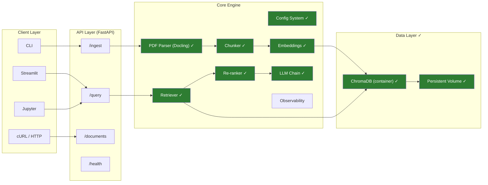
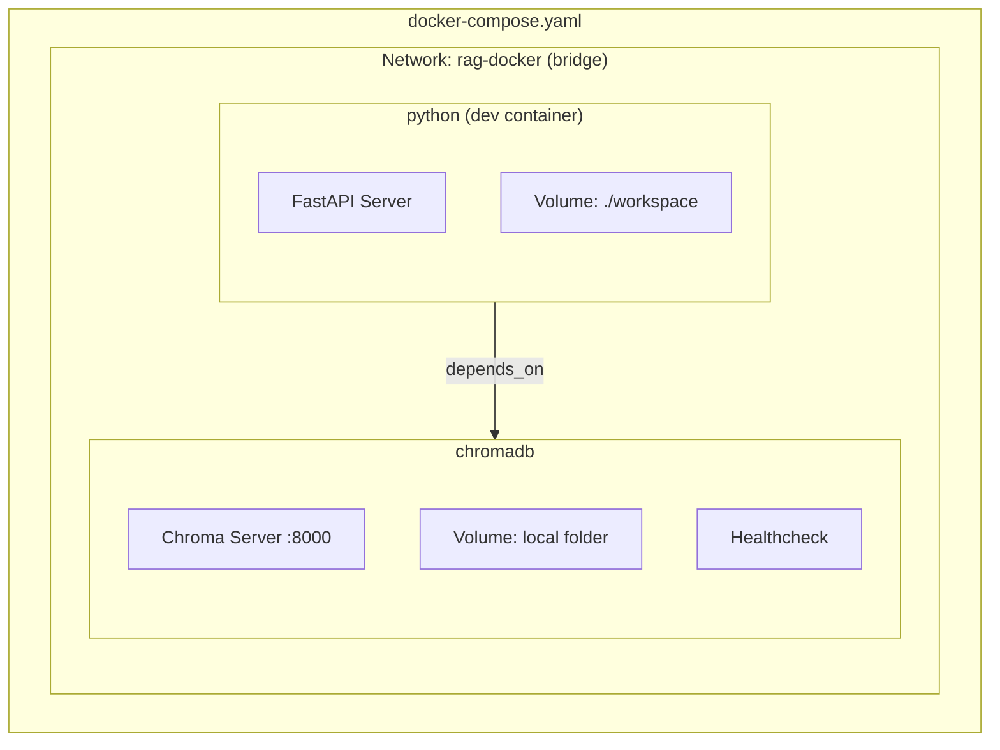
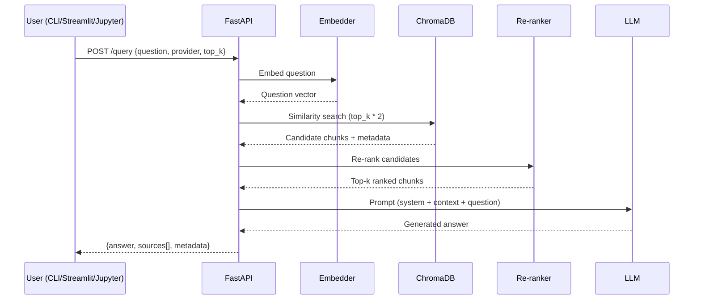
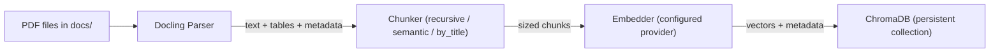
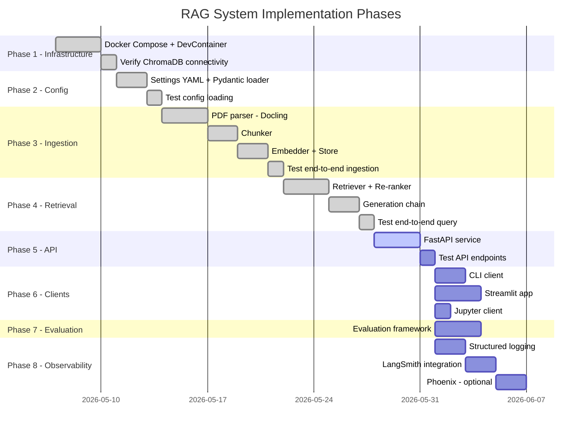
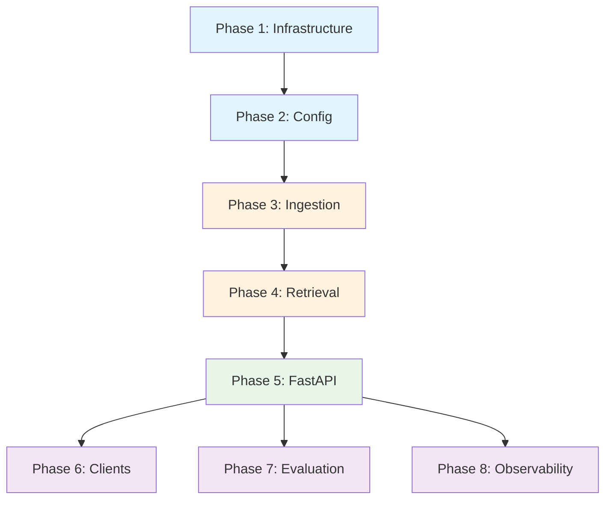
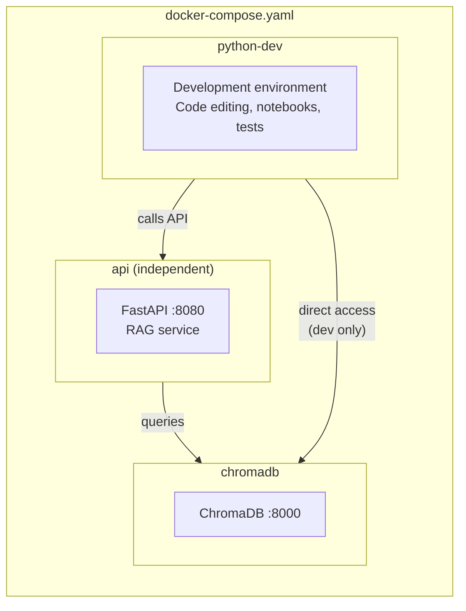

# RAG System Development Plan

## 1. Overview

A Retrieval-Augmented Generation (RAG) system for ingesting financial PDF reports (10-Q filings containing text, tables, and structured data) into ChromaDB and enabling natural language Q&A over the documents. The system is built as a FastAPI service with pluggable LLM providers, containerized with Docker Compose.

---

## 2. User Requirements

- **Document ingestion**: Ingest PDF files from the `docs/` folder — primarily financial reports (10-Q filings) containing text, tables, and structured data — into ChromaDB
- **Q&A capability**: Enable users to ask natural language questions about the content of the ingested PDFs and receive answers with source citations
- **Multi-provider configuration**: Support multiple LLM providers (OpenAI, Anthropic, Gemini) via a config file, allowing the user to set and switch between providers and their corresponding model settings
- **PDF parsing**: Use Docling as the PDF parser for robust table and structured content extraction
- **FastAPI backend**: Build the RAG engine behind a FastAPI service, enabling multiple client interfaces (CLI, Streamlit, Jupyter) to call it via HTTP
- **Containerized ChromaDB**: Run ChromaDB in its own container with a persistent volume mapped to a local folder, so data survives container restarts. Use Docker Compose with a similar pattern to the [sql-ai-agent](https://github.com/RamiKrispin/sql-ai-agent/blob/main/docker-compose.yaml) project
- **Configurable chunking**: Expose chunking method as an argument so the user can select their preferred strategy (recursive, semantic, by_title)
- **Evaluation & metrics**: Include retrieval precision/recall, answer faithfulness/relevancy measurement
- **Multi-document comparison**: Support queries that span and compare across multiple documents
- **Source citations**: Include document sources, page numbers, and excerpts in answers
- **Re-ranking**: Add a re-ranking step to improve retrieval quality
- **Observability**: Plan for pipeline tracing and monitoring (structured logging, LangSmith, optional self-hosted Phoenix)
- **Environment variables**: Inject API keys and secrets via `devcontainer.json` `remoteEnv` (reading from host environment), following the pattern in the [sql-ai-agent devcontainer](https://github.com/RamiKrispin/sql-ai-agent/blob/d7741e9cd32aca108d6750ee12bf66ea33f1b4db/.devcontainer/devcontainer.json#L49)

---

## 3. Project Status

- [x] Phase 1: Infrastructure Setup — completed (2026-05-08)
- [x] Phase 2: Configuration System — completed (2026-05-08)
- [x] Phase 3: Ingestion Pipeline — completed (2026-05-08)
- [x] Phase 4: Retrieval & Generation — completed (2026-05-08)
- [x] Phase 5: FastAPI Service — completed (2026-05-08)
- [x] Phase 6: Client Interfaces — completed (2026-05-08)
- [x] Phase 7: Evaluation — completed (2026-05-08)
- [x] Phase 8: Observability — completed (2026-05-08)

---

## 4. Architecture

### System Architecture



### Container Architecture (Docker Compose)



### RAG Query Flow



### Ingestion Flow



---

## 5. Core Components

### 5.1 Configuration System

**File**: `config/settings.yaml`

A YAML-based configuration file supporting multiple LLM providers and model settings.

```yaml
# config/settings.yaml
providers:
  openai:
    api_key_env: "OPENAI_API_KEY"
    models:
      embedding:
        name: "text-embedding-3-small"
        dimensions: 1536
      chat:
        name: "gpt-4o"
        temperature: 0.0
        max_tokens: 2048

  anthropic:
    api_key_env: "ANTHROPIC_API_KEY"
    models:
      chat:
        name: "claude-sonnet-4-20250514"
        temperature: 0.0
        max_tokens: 2048

  gemini:
    api_key_env: "GEMINI_API_KEY"
    models:
      embedding:
        name: "text-embedding-004"
        dimensions: 768
      chat:
        name: "gemini-2.5-flash"
        temperature: 0.0
        max_tokens: 2048

# Active provider selection
active:
  embedding_provider: "openai"
  chat_provider: "openai"

# Chunking settings
chunking:
  method: "recursive"  # Options: recursive, semantic, by_title
  chunk_size: 1000
  chunk_overlap: 200
  keep_tables_intact: true

# Retrieval settings
retrieval:
  top_k: 5
  rerank: true
  rerank_model: "cross-encoder"
  score_threshold: 0.3

# ChromaDB settings
chromadb:
  host: "chromadb"
  port: 8000
  collection_name: "financial_reports"

# Observability
observability:
  enabled: false
  provider: "langsmith"  # Options: langsmith, phoenix, custom
  project_name: "rag-docker"
```

**Python config loader**: `rag/config.py` — Pydantic-based settings model that reads the YAML, resolves environment variables, and provides validated config to all components.

---

### 5.2 PDF Ingestion Pipeline (Docling)

**Purpose**: Parse financial PDFs preserving tables, headings, and document structure.

**Module**: `rag/ingestion/`

| Component | Responsibility |
|-----------|---------------|
| `pdf_parser.py` | Uses Docling to extract structured content (text + tables) from PDFs |
| `chunker.py` | Splits parsed content into chunks; respects table boundaries |
| `embedder.py` | Generates embeddings using the configured provider |
| `store.py` | Writes chunks + embeddings + metadata to ChromaDB |

**Flow**:
```
PDF file(s) in docs/
    --> Docling parser (extracts text, tables, metadata)
    --> Chunker (splits by method: recursive / semantic / by_title)
    --> Embedder (configured provider)
    --> ChromaDB (persistent collection)
```

**Metadata stored per chunk**:
- `source_file`: filename
- `page_number`: page within PDF
- `chunk_type`: "text" | "table" | "heading"
- `section_title`: nearest heading
- `ingestion_timestamp`: when ingested

---

### 5.3 Retrieval & Generation Engine

**Module**: `rag/retrieval/`

| Component | Responsibility |
|-----------|---------------|
| `retriever.py` | Queries ChromaDB with embedded user question, returns top-k |
| `reranker.py` | Re-ranks retrieved chunks using cross-encoder or LLM-based scoring |
| `chain.py` | Constructs prompt with context + question, calls LLM, returns answer with citations |

**Retrieval Pipeline**:
```
User question
    --> Embed question (same embedding model)
    --> ChromaDB similarity search (top_k * 2 candidates)
    --> Re-ranker (scores and filters to top_k)
    --> Prompt construction (system prompt + context chunks + question)
    --> LLM generation
    --> Response with source citations
```

**Citation format**: Each answer includes references to source documents, page numbers, and relevant chunk excerpts.

---

### 5.4 FastAPI Service

**Module**: `rag/api/`

**Endpoints**:

| Method | Path | Description |
|--------|------|-------------|
| `POST` | `/ingest` | Ingest PDF(s) from docs/ or uploaded file |
| `POST` | `/query` | Ask a question, get answer + sources |
| `GET` | `/documents` | List ingested documents and their metadata |
| `DELETE` | `/documents/{doc_id}` | Remove a document from the collection |
| `GET` | `/health` | Health check (API + ChromaDB connectivity) |
| `GET` | `/config` | Return active configuration (redacted keys) |

**Request/Response examples**:

```python
# POST /query
{
    "question": "What was Apple's revenue in Q1 2026?",
    "chat_provider": "openai",      # optional override
    "top_k": 5,                     # optional override
    "chunking_method": "recursive"  # optional override
}

# Response
{
    "answer": "Apple's revenue in Q1 2026 was...",
    "sources": [
        {
            "file": "10Q-Q1-2026-as-filed.pdf",
            "page": 5,
            "section": "Revenue Summary",
            "excerpt": "..."
        }
    ],
    "metadata": {
        "provider": "openai",
        "model": "gpt-4o",
        "retrieval_count": 5,
        "latency_ms": 1230
    }
}
```

---

### 5.5 Client Interfaces

All clients communicate with the FastAPI backend via HTTP.

| Client | Location | Description |
|--------|----------|-------------|
| CLI | `clients/cli.py` | Click-based CLI: `rag ingest`, `rag query "..."`, `rag docs` |
| Streamlit | `clients/streamlit_app.py` | Chat-style UI with document upload and source viewer |
| Jupyter | `clients/notebook_client.py` | Helper class for use in notebooks |

---

### 5.6 Re-ranking

**Options** (configurable):
1. **Cross-encoder** (default): Uses `sentence-transformers` cross-encoder model for accurate relevance scoring
2. **LLM-based**: Uses the configured chat LLM to score relevance (higher quality, higher cost)
3. **None**: Disable re-ranking, use raw similarity scores

---

### 5.7 Evaluation & Metrics

**Module**: `rag/evaluation/`

| Metric | Description |
|--------|-------------|
| Retrieval precision | % of retrieved chunks that are relevant |
| Retrieval recall | % of relevant chunks that are retrieved |
| Answer faithfulness | Is the answer grounded in retrieved context? |
| Answer relevancy | Does the answer address the question? |
| Latency | End-to-end response time |

**Approach**: Use RAGAS framework or custom evaluation with a set of test questions and expected answers stored in `evaluation/test_set.yaml`.

---

### 5.8 Observability

**Module**: `rag/observability/`

**Purpose**: Trace and monitor the RAG pipeline (ingestion, retrieval, generation).

| Provider | Integration |
|----------|-------------|
| LangSmith | LangChain native tracing (set `LANGCHAIN_TRACING_V2=true`) |
| Arize Phoenix | Open-source, self-hosted option via additional container |
| Custom logging | Structured JSON logs with trace IDs |

**Tracked signals**:
- Query latency breakdown (embedding, retrieval, reranking, generation)
- Token usage per query
- Retrieval quality scores
- Error rates and types
- Document ingestion status

**Implementation plan for observability**:
1. Phase 1: Structured logging with Python `logging` + JSON formatter
2. Phase 2: LangSmith integration (add `LANGSMITH_API_KEY` to env)
3. Phase 3 (optional): Self-hosted Phoenix container in docker-compose

---

## 6. Infrastructure

### 6.1 Docker Compose

**File**: `docker-compose.yaml`

```yaml
networks:
  rag-docker:
    driver: bridge

services:
  python:
    image: docker.io/rkrispin/python-dev-rag-docker:0.0.2
    volumes:
      - .:/workspace:cached
      - ${HF_HOME:-~/.cache/huggingface}:/root/.cache/huggingface
    command: sleep infinity
    depends_on:
      chromadb:
        condition: service_healthy
    environment:
      - OPENAI_API_KEY=${OPENAI_API_KEY}
      - ANTHROPIC_API_KEY=${ANTHROPIC_API_KEY}
      - GEMINI_API_KEY=${GEMINI_API_KEY}
      - LANGSMITH_API_KEY=${LANGSMITH_API_KEY}
    networks:
      - rag-docker

  chromadb:
    image: chromadb/chroma:latest
    ports:
      - 8000:8000
    healthcheck:
      test: ["CMD-SHELL", "curl -f http://localhost:8000/api/v1/heartbeat || exit 1"]
      interval: 5s
      timeout: 5s
      retries: 5
      start_period: 10s
    volumes:
      - ${CHROMA_DATA_PATH:-./chroma_data}:/chroma/chroma
    environment:
      - ANONYMIZED_TELEMETRY=false
    networks:
      - rag-docker
```

### 6.2 DevContainer Configuration

**File**: `.devcontainer/devcontainer.json`

Updated to reference docker-compose and inject env vars from the host:

```json
{
    "name": "RAG Docker Dev",
    "dockerComposeFile": ["../docker-compose.yaml"],
    "service": "python",
    "shutdownAction": "none",
    "workspaceFolder": "/workspace/",
    "customizations": { ... },
    "remoteEnv": {
        "OPENAI_API_KEY": "${localEnv:OPENAI_API_KEY:key_is_missing}",
        "ANTHROPIC_API_KEY": "${localEnv:ANTHROPIC_API_KEY:key_is_missing}",
        "GEMINI_API_KEY": "${localEnv:GEMINI_API_KEY:key_is_missing}",
        "LANGSMITH_API_KEY": "${localEnv:LANGSMITH_API_KEY:key_is_missing}",
        "CHROMA_DATA_PATH": "${localEnv:CHROMA_DATA_PATH:./chroma_data}"
    }
}
```

### 6.3 Additional Python Dependencies

Add to `docker/requirements.txt`:
```
fastapi==0.115.0
uvicorn==0.30.0
pydantic-settings==2.5.0
pyyaml==6.0.2
httpx==0.27.0
click==8.1.7
sentence-transformers==3.0.0
ragas==0.2.0
streamlit==1.38.0
```

---

## 7. Project Structure

```
rag-docker/
├── config/
│   └── settings.yaml              # Multi-provider LLM configuration
├── rag/
│   ├── __init__.py
│   ├── config.py                  # Pydantic config loader
│   ├── ingestion/
│   │   ├── __init__.py
│   │   ├── pdf_parser.py          # Docling-based PDF extraction
│   │   ├── chunker.py             # Configurable chunking strategies
│   │   ├── embedder.py            # Multi-provider embedding
│   │   └── store.py               # ChromaDB write operations
│   ├── retrieval/
│   │   ├── __init__.py
│   │   ├── retriever.py           # ChromaDB query + filtering
│   │   ├── reranker.py            # Cross-encoder / LLM reranking
│   │   └── chain.py               # Prompt + LLM generation
│   ├── api/
│   │   ├── __init__.py
│   │   ├── main.py                # FastAPI app + routes
│   │   ├── models.py              # Pydantic request/response schemas
│   │   └── dependencies.py        # Shared dependencies (config, db client)
│   ├── evaluation/
│   │   ├── __init__.py
│   │   ├── metrics.py             # RAGAS / custom metrics
│   │   └── test_set.yaml          # Test questions + expected answers
│   └── observability/
│       ├── __init__.py
│       ├── tracing.py             # LangSmith / Phoenix integration
│       └── logging.py             # Structured JSON logging
├── clients/
│   ├── cli.py                     # Click CLI client
│   ├── streamlit_app.py           # Streamlit chat UI
│   └── notebook_client.py         # Jupyter helper class
├── docs/                          # PDF documents to ingest
│   ├── 10Q-Q1-2026-as-filed.pdf
│   ├── 10Q-Q2-2026-as-filed.pdf
│   ├── GOOG-10-Q-Q1-2026.pdf
│   └── form-10-q.pdf
├── dev/                           # Development / experimentation scripts
├── docker/
│   ├── Dockerfile_Base
│   ├── Dockerfile_Dev
│   ├── build_base_docker.sh
│   ├── build_dev_docker.sh
│   ├── install_uv.sh
│   ├── install_dependencies.sh
│   ├── install_quarto.sh
│   └── requirements.txt
├── .devcontainer/
│   └── devcontainer.json
├── docker-compose.yaml
├── ruff.toml
└── README.md
```

---

## 8. Implementation Plan

### Phase Overview



### Level of Effort Estimate (LLM-Assisted Implementation)

| Phase | Component | Complexity | Est. Tokens | Model | Rationale |
|-------|-----------|------------|-------------|-------|-----------|
| **1 - Infrastructure** | Docker Compose + DevContainer | Low | ~4K | Sonnet | Boilerplate config; adapting known pattern from sql-ai-agent |
| | Verify ChromaDB connectivity | Low | ~1K | Sonnet | Short test script |
| | **Phase 1 subtotal** | | **~5K** | | |
| **2 - Config** | Settings YAML + Pydantic loader | Medium | ~6K | Sonnet | Schema design + validation logic; well-defined task |
| | Test config loading | Low | ~3K | Sonnet | Formulaic unit tests |
| | **Phase 2 subtotal** | | **~9K** | | |
| **3 - Ingestion** | PDF parser (Docling) | High | ~10K | Opus | Complex integration: Docling API, table extraction, error handling for varied PDF layouts |
| | Chunker | Medium | ~8K | Opus | Three strategies + table-aware logic requires careful design decisions |
| | Embedder + Store | Medium | ~6K | Sonnet | Standard LangChain patterns, multi-provider wiring |
| | Test end-to-end ingestion | Low | ~4K | Sonnet | Integration test, straightforward assertions |
| | **Phase 3 subtotal** | | **~28K** | | |
| **4 - Retrieval** | Retriever + Re-ranker | High | ~10K | Opus | Cross-encoder integration, scoring logic, filtering strategies |
| | Generation chain | Medium | ~8K | Opus | Prompt engineering, citation extraction, multi-provider LLM calls |
| | Test end-to-end query | Low | ~4K | Sonnet | Integration test |
| | **Phase 4 subtotal** | | **~22K** | | |
| **5 - API** | FastAPI service | Medium | ~10K | Sonnet | 6 endpoints, Pydantic models, dependency injection; well-structured task |
| | Test API endpoints | Low | ~5K | Sonnet | httpx TestClient, standard patterns |
| | **Phase 5 subtotal** | | **~15K** | | |
| **6 - Clients** | CLI client (Click) | Low | ~4K | Sonnet | Thin HTTP wrapper, formatted output |
| | Streamlit app | Medium | ~8K | Sonnet | Chat UI, sidebar, source viewer; well-documented framework |
| | Jupyter client | Low | ~3K | Sonnet | Helper class with display methods |
| | **Phase 6 subtotal** | | **~15K** | | |
| **7 - Evaluation** | Evaluation framework | Medium | ~10K | Opus | Metric design, LLM-as-judge prompts, reporting logic |
| | **Phase 7 subtotal** | | **~10K** | | |
| **8 - Observability** | Structured logging | Low | ~4K | Sonnet | JSON formatter + trace ID propagation |
| | LangSmith integration | Low | ~3K | Sonnet | Mostly configuration, LangChain native |
| | Phoenix (optional) | Low | ~3K | Sonnet | Docker container config + basic setup |
| | **Phase 8 subtotal** | | **~10K** | | |
| | | | | | |
| **Total** | All phases | | **~114K** | | |

> **Model selection guide**:
> - **Opus** — Use for components requiring architectural decisions, complex integrations, nuanced error handling, or prompt engineering (Phases 3, 4, 7)
> - **Sonnet** — Use for well-defined tasks with clear patterns: config files, API boilerplate, tests, thin clients, and standard library integrations (Phases 1, 2, 5, 6, 8)
>
> **Token estimates** reflect output tokens (generated code + explanation). Actual usage will include input tokens (context from existing files, instructions) which typically add 2-3x on top.

---

### Phase 1: Infrastructure Setup

**Goal**: Get containers running with ChromaDB accessible from the dev container.

**Dependencies**: None (starting point)

| Step | Task | Files |
|------|------|-------|
| 1.1 | Create `docker-compose.yaml` with python + chromadb services, bridge network, health checks, and persistent volume | `docker-compose.yaml` |
| 1.2 | Update `.devcontainer/devcontainer.json` to reference compose file, set `workspaceFolder`, and inject env vars via `remoteEnv` | `.devcontainer/devcontainer.json` |
| 1.3 | Add new dependencies to `docker/requirements.txt` (fastapi, uvicorn, httpx, pydantic-settings, pyyaml, click, sentence-transformers, streamlit) | `docker/requirements.txt` |
| 1.4 | Update `docker/build_dev_docker.sh` with new image tag | `docker/build_dev_docker.sh` |
| 1.5 | Add `chroma_data/` to `.gitignore` | `.gitignore` |

**Test checkpoint**:
```bash
# 1. Rebuild and start containers
docker compose up -d

# 2. Verify ChromaDB is healthy
curl http://localhost:8000/api/v1/heartbeat
# Expected: {"nanosecond heartbeat": <timestamp>}

# 3. From inside dev container, verify network connectivity
python -c "
import chromadb
client = chromadb.HttpClient(host='chromadb', port=8000)
print(client.heartbeat())
print('ChromaDB collections:', client.list_collections())
"

# 4. Verify persistent volume
# - Create a test collection, add a document
# - Restart containers: docker compose down && docker compose up -d
# - Verify the collection and document still exist
```

**Done when**: Both containers start, ChromaDB healthcheck passes, dev container can connect to ChromaDB by hostname, and data survives a container restart.

---

### Phase 2: Configuration System

**Goal**: Multi-provider config with runtime selection, fully validated.

**Dependencies**: Phase 1 (containers running)

| Step | Task | Files |
|------|------|-------|
| 2.1 | Create `config/settings.yaml` with providers (openai, anthropic, gemini), chunking, retrieval, chromadb, and observability sections | `config/settings.yaml` |
| 2.2 | Build Pydantic config loader that reads YAML, resolves `api_key_env` references to actual env vars, and validates all fields | `rag/config.py` |
| 2.3 | Write unit tests for config loading, validation errors, and env var resolution | `tests/test_config.py` |

**Test checkpoint**:
```bash
# 1. Unit tests pass
pytest tests/test_config.py -v

# 2. Manual validation in Python
python -c "
from rag.config import load_config

config = load_config('config/settings.yaml')
print('Active embedding provider:', config.active.embedding_provider)
print('Active chat provider:', config.active.chat_provider)
print('Chunk size:', config.chunking.chunk_size)
print('ChromaDB host:', config.chromadb.host)

# Verify provider switching
config.active.chat_provider = 'anthropic'
provider = config.get_chat_provider()
print('Switched to:', provider.models.chat.name)
"

# 3. Test that missing env vars raise clear errors
OPENAI_API_KEY="" python -c "
from rag.config import load_config
config = load_config('config/settings.yaml')
config.resolve_api_keys()  # Should raise informative error
"
```

**Done when**: Config loads from YAML, Pydantic validates all fields, env var resolution works, and switching between providers is seamless.

---

### Phase 3: Ingestion Pipeline

**Goal**: Parse PDFs with Docling, chunk them, embed, and store in ChromaDB. Each sub-component is testable independently.

**Dependencies**: Phase 2 (config system working)

#### Step 3.1 — PDF Parser

| Task | Files |
|------|-------|
| Implement Docling-based parser that extracts text blocks, tables, headings, and metadata (page number, section title) from a PDF | `rag/ingestion/pdf_parser.py` |

**Test checkpoint**:
```bash
# Parse a single PDF and inspect output structure
python -c "
from rag.ingestion.pdf_parser import parse_pdf

result = parse_pdf('docs/10Q-Q1-2026-as-filed.pdf')
print(f'Total elements extracted: {len(result)}')
for elem in result[:5]:
    print(f'  Type: {elem.type}, Page: {elem.page}, '
          f'Content preview: {elem.content[:80]}...')

# Verify tables are extracted
tables = [e for e in result if e.type == 'table']
print(f'Tables found: {len(tables)}')
if tables:
    print(f'Sample table:\n{tables[0].content[:200]}')
"
```

**Done when**: Parser returns structured elements with type, page number, section title, and content. Tables are extracted as coherent blocks.

#### Step 3.2 — Chunker

| Task | Files |
|------|-------|
| Implement configurable chunking: `recursive` (character-based with overlap), `semantic` (embedding-based boundary detection), `by_title` (split on headings). Tables kept intact when `keep_tables_intact=true`. | `rag/ingestion/chunker.py` |

**Test checkpoint**:
```bash
# Test each chunking method on parsed output
python -c "
from rag.ingestion.pdf_parser import parse_pdf
from rag.ingestion.chunker import chunk_elements

elements = parse_pdf('docs/10Q-Q1-2026-as-filed.pdf')

for method in ['recursive', 'semantic', 'by_title']:
    chunks = chunk_elements(elements, method=method,
                            chunk_size=1000, chunk_overlap=200)
    print(f'{method}: {len(chunks)} chunks')
    # Verify no chunk exceeds max size (except intact tables)
    oversized = [c for c in chunks
                 if len(c.content) > 1200 and c.type != 'table']
    print(f'  Oversized non-table chunks: {len(oversized)}')

# Verify tables stay intact
chunks = chunk_elements(elements, method='recursive',
                        chunk_size=1000, keep_tables_intact=True)
table_chunks = [c for c in chunks if c.type == 'table']
print(f'Intact table chunks: {len(table_chunks)}')
"
```

**Done when**: All three chunking methods produce reasonably-sized chunks, tables are preserved as single chunks when configured, and metadata (page, section, type) flows through.

#### Step 3.3 — Embedder

| Task | Files |
|------|-------|
| Implement multi-provider embedding that reads provider from config. Support OpenAI and Gemini embedding models. | `rag/ingestion/embedder.py` |

**Test checkpoint**:
```bash
# Embed a few sample chunks and verify dimensions
python -c "
from rag.config import load_config
from rag.ingestion.embedder import get_embedder

config = load_config('config/settings.yaml')
embedder = get_embedder(config)

texts = ['Revenue increased by 12%', 'Net income was 5.2 billion']
vectors = embedder.embed(texts)
print(f'Embedded {len(vectors)} texts')
print(f'Vector dimensions: {len(vectors[0])}')
print(f'Expected dimensions: {config.get_embedding_provider().models.embedding.dimensions}')
assert len(vectors[0]) == config.get_embedding_provider().models.embedding.dimensions
print('Dimensions match config.')
"
```

**Done when**: Embedder produces vectors of the correct dimension for the configured provider.

#### Step 3.4 — ChromaDB Store

| Task | Files |
|------|-------|
| Implement ChromaDB write operations: create/get collection, upsert chunks with embeddings and metadata, delete by document ID | `rag/ingestion/store.py` |

**Test checkpoint**:
```bash
# Store and retrieve chunks from ChromaDB
python -c "
from rag.config import load_config
from rag.ingestion.store import ChromaStore

config = load_config('config/settings.yaml')
store = ChromaStore(config)

# Upsert test data
store.upsert(
    ids=['test-1', 'test-2'],
    documents=['Revenue was 50B', 'Net income was 5B'],
    metadatas=[
        {'source_file': 'test.pdf', 'page_number': 1, 'chunk_type': 'text'},
        {'source_file': 'test.pdf', 'page_number': 2, 'chunk_type': 'text'}
    ]
)
print(f'Collection count: {store.count()}')

# Query
results = store.query('What was the revenue?', n_results=2)
print(f'Query returned {len(results[\"documents\"][0])} results')
print(f'Top result: {results[\"documents\"][0][0]}')

# Cleanup
store.delete(ids=['test-1', 'test-2'])
print(f'After delete: {store.count()}')
"
```

**Done when**: Chunks can be stored, queried by similarity, and deleted. Collection persists across container restarts.

#### Step 3.5 — End-to-End Ingestion Test

| Task | Files |
|------|-------|
| Integration test: parse a real PDF, chunk it, embed, store in ChromaDB, and verify retrieval | `tests/test_ingestion.py` |

**Test checkpoint**:
```bash
# Full pipeline test
python -c "
from rag.config import load_config
from rag.ingestion.pdf_parser import parse_pdf
from rag.ingestion.chunker import chunk_elements
from rag.ingestion.embedder import get_embedder
from rag.ingestion.store import ChromaStore

config = load_config('config/settings.yaml')

# Parse
elements = parse_pdf('docs/10Q-Q1-2026-as-filed.pdf')
print(f'1. Parsed: {len(elements)} elements')

# Chunk
chunks = chunk_elements(elements, method='recursive',
                        chunk_size=1000, chunk_overlap=200)
print(f'2. Chunked: {len(chunks)} chunks')

# Store (embedder runs inside store or called separately)
store = ChromaStore(config)
embedder = get_embedder(config)
store.ingest_chunks(chunks, embedder)
print(f'3. Stored: {store.count()} vectors in ChromaDB')

# Verify retrieval
results = store.query('What was the total revenue?', n_results=3)
print(f'4. Query test: {len(results[\"documents\"][0])} results returned')
for i, doc in enumerate(results['documents'][0]):
    print(f'   Result {i+1}: {doc[:100]}...')
"

# Also run pytest
pytest tests/test_ingestion.py -v
```

**Done when**: A real PDF goes from file on disk to queryable vectors in ChromaDB in a single pipeline run.

---

### Phase 4: Retrieval & Generation

**Goal**: Query pipeline that retrieves relevant chunks, optionally re-ranks them, and generates answers with source citations.

**Dependencies**: Phase 3 (ingested documents in ChromaDB)

#### Step 4.1 — Retriever

| Task | Files |
|------|-------|
| Implement retriever: embed the user question, query ChromaDB for `top_k * 2` candidates, apply optional score threshold filtering | `rag/retrieval/retriever.py` |

**Test checkpoint**:
```bash
# Test retrieval quality with known questions
python -c "
from rag.config import load_config
from rag.retrieval.retriever import retrieve

config = load_config('config/settings.yaml')

results = retrieve('What was the quarterly revenue?', config, top_k=5)
print(f'Retrieved {len(results)} chunks')
for r in results:
    print(f'  Score: {r.score:.4f} | Source: {r.metadata[\"source_file\"]}:'
          f'p{r.metadata[\"page_number\"]} | {r.content[:80]}...')
"
```

#### Step 4.2 — Re-ranker

| Task | Files |
|------|-------|
| Implement re-ranker with three modes: `cross-encoder` (sentence-transformers), `llm` (use chat model to score relevance), `none` (skip). Selectable via config or per-query argument. | `rag/retrieval/reranker.py` |

**Test checkpoint**:
```bash
# Compare retrieval with and without re-ranking
python -c "
from rag.config import load_config
from rag.retrieval.retriever import retrieve
from rag.retrieval.reranker import rerank

config = load_config('config/settings.yaml')
question = 'What were the operating expenses?'

# Raw retrieval
raw = retrieve(question, config, top_k=10)
print('=== Without re-ranking ===')
for r in raw[:5]:
    print(f'  Score: {r.score:.4f} | {r.content[:60]}...')

# With cross-encoder re-ranking
reranked = rerank(question, raw, method='cross-encoder', top_k=5)
print('\n=== With re-ranking ===')
for r in reranked:
    print(f'  Score: {r.score:.4f} | {r.content[:60]}...')
"
```

#### Step 4.3 — Generation Chain

| Task | Files |
|------|-------|
| Implement the LLM generation chain: construct prompt with system instructions, retrieved context chunks, and user question. Return structured response with answer text and source citations. | `rag/retrieval/chain.py` |

**Test checkpoint**:
```bash
# End-to-end query with citations
python -c "
from rag.config import load_config
from rag.retrieval.chain import query_rag

config = load_config('config/settings.yaml')

response = query_rag(
    question='What was Apple total revenue in Q1 2026?',
    config=config,
    top_k=5,
    rerank_method='cross-encoder'
)

print('Answer:', response.answer)
print('\nSources:')
for src in response.sources:
    print(f'  - {src.file} (page {src.page}, section: {src.section})')
    print(f'    Excerpt: {src.excerpt[:100]}...')
print(f'\nMetadata: provider={response.metadata.provider}, '
      f'model={response.metadata.model}, '
      f'latency={response.metadata.latency_ms}ms')
"
```

#### Step 4.4 — Integration Test

| Task | Files |
|------|-------|
| Automated tests: query with different providers, verify citations reference real pages, test with different re-ranking modes | `tests/test_retrieval.py` |

**Test checkpoint**:
```bash
pytest tests/test_retrieval.py -v

# Test multi-provider switching
python -c "
from rag.config import load_config
from rag.retrieval.chain import query_rag

config = load_config('config/settings.yaml')
question = 'What were the risk factors mentioned?'

for provider in ['openai', 'anthropic']:
    config.active.chat_provider = provider
    resp = query_rag(question, config=config, top_k=3)
    print(f'\n--- {provider} ({resp.metadata.model}) ---')
    print(f'Answer: {resp.answer[:150]}...')
"
```

**Done when**: Queries return accurate answers with proper source citations, re-ranking improves result relevance, and provider switching works.

---

### Phase 5: FastAPI Service

**Goal**: HTTP API wrapping the RAG engine, testable with curl/httpx.

**Dependencies**: Phase 4 (retrieval pipeline working)

| Step | Task | Files |
|------|------|-------|
| 5.1 | Define Pydantic request/response models for all endpoints | `rag/api/models.py` |
| 5.2 | Implement shared dependencies: config singleton, ChromaDB client, embedder | `rag/api/dependencies.py` |
| 5.3 | Implement all API routes: `/ingest`, `/query`, `/documents`, `/health`, `/config` | `rag/api/main.py` |
| 5.4 | Automated API tests using httpx TestClient | `tests/test_api.py` |

**Test checkpoint**:
```bash
# 1. Start the server
uvicorn rag.api.main:app --host 0.0.0.0 --port 8080 --reload &

# 2. Health check
curl http://localhost:8080/health
# Expected: {"status": "healthy", "chromadb": "connected", "documents": <count>}

# 3. Ingest a document
curl -X POST http://localhost:8080/ingest \
  -H "Content-Type: application/json" \
  -d '{"source_dir": "docs/", "chunking_method": "recursive"}'
# Expected: {"status": "success", "documents_ingested": 4, "total_chunks": <N>}

# 4. Query
curl -X POST http://localhost:8080/query \
  -H "Content-Type: application/json" \
  -d '{"question": "What was the revenue?", "top_k": 5}'
# Expected: {"answer": "...", "sources": [...], "metadata": {...}}

# 5. List documents
curl http://localhost:8080/documents
# Expected: [{"file": "10Q-Q1-2026-as-filed.pdf", "chunks": <N>, ...}, ...]

# 6. View config (keys redacted)
curl http://localhost:8080/config

# 7. Automated tests
pytest tests/test_api.py -v
```

**Done when**: All endpoints respond correctly, error cases return proper HTTP status codes, and the test suite passes.

---

### Phase 6: Client Interfaces

**Goal**: Multiple client interfaces calling the FastAPI backend.

**Dependencies**: Phase 5 (API running)

#### Step 6.1 — CLI Client

| Task | Files |
|------|-------|
| Build Click-based CLI with commands: `rag ingest`, `rag query "..."`, `rag docs`, `rag config` | `clients/cli.py` |

**Test checkpoint**:
```bash
# Ingest documents
python clients/cli.py ingest --source-dir docs/ --method recursive
# Expected: progress bar, summary of ingested documents

# Query
python clients/cli.py query "What was Apple's revenue in Q1 2026?" --top-k 5 --provider openai
# Expected: formatted answer with source citations

# List documents
python clients/cli.py docs
# Expected: table of ingested documents with chunk counts

# Query with different provider
python clients/cli.py query "Summarize the risk factors" --provider anthropic
# Expected: answer generated by Claude
```

#### Step 6.2 — Streamlit App

| Task | Files |
|------|-------|
| Build chat-style Streamlit app: document upload sidebar, chat interface, expandable source viewer per answer | `clients/streamlit_app.py` |

**Test checkpoint**:
```bash
# Start the app
streamlit run clients/streamlit_app.py

# Manual testing:
# 1. Verify the app loads and connects to the API
# 2. Upload/ingest a document via sidebar
# 3. Ask a question in the chat interface
# 4. Verify answer appears with expandable sources
# 5. Switch provider in sidebar, ask again
# 6. Verify conversation history is maintained
```

#### Step 6.3 — Jupyter Client

| Task | Files |
|------|-------|
| Build helper class for notebook use: `RAGClient` with `.ingest()`, `.query()`, `.documents()` methods | `clients/notebook_client.py` |

**Test checkpoint**:
```python
# In a Jupyter notebook
from clients.notebook_client import RAGClient

client = RAGClient(api_url="http://localhost:8080")

# Check health
client.health()

# Ingest
result = client.ingest(source_dir="docs/")
print(result)

# Query
response = client.query("What was the net income?", top_k=5)
print(response.answer)
response.show_sources()  # Pretty-prints sources in notebook
```

**Done when**: All three clients can ingest documents and query the RAG system through the FastAPI backend.

---

### Phase 7: Evaluation

**Goal**: Measure and benchmark RAG quality with reproducible metrics.

**Dependencies**: Phase 5 (API working with ingested documents)

| Step | Task | Files |
|------|------|-------|
| 7.1 | Create a test question set with expected answers and relevant source pages, based on the actual financial PDFs | `rag/evaluation/test_set.yaml` |
| 7.2 | Implement evaluation metrics: retrieval precision/recall, answer faithfulness (LLM-as-judge), answer relevancy, latency | `rag/evaluation/metrics.py` |
| 7.3 | Build evaluation runner script that iterates over the test set, collects metrics, and outputs a summary report | `dev/02_evaluation.py` |

**Test checkpoint**:
```bash
# Run evaluation suite
python dev/02_evaluation.py --test-set rag/evaluation/test_set.yaml --provider openai

# Expected output:
# ┌─────────────────────────────┬──────────┐
# │ Metric                      │ Score    │
# ├─────────────────────────────┼──────────┤
# │ Retrieval Precision@5       │ 0.82     │
# │ Retrieval Recall@5          │ 0.75     │
# │ Answer Faithfulness         │ 0.91     │
# │ Answer Relevancy            │ 0.88     │
# │ Avg Latency (ms)            │ 1450     │
# └─────────────────────────────┴──────────┘

# Compare chunking methods
python dev/02_evaluation.py --method recursive --provider openai
python dev/02_evaluation.py --method by_title --provider openai
# Compare the summary tables to identify best chunking strategy

# Compare providers
python dev/02_evaluation.py --provider openai
python dev/02_evaluation.py --provider anthropic
```

**Done when**: Baseline metrics are documented, and you can compare chunking methods and providers quantitatively.

---

### Phase 8: Observability

**Goal**: Trace, monitor, and debug the RAG pipeline in development and production.

**Dependencies**: Phase 5 (API working)

#### Step 8.1 — Structured Logging

| Task | Files |
|------|-------|
| Add JSON-formatted structured logging across all modules with trace IDs, latency, and token counts | `rag/observability/logging.py` |

**Test checkpoint**:
```bash
# Make a query and verify structured logs
curl -X POST http://localhost:8080/query \
  -H "Content-Type: application/json" \
  -d '{"question": "What was the revenue?"}'

# Check logs for structured output
# Expected log lines (JSON):
# {"trace_id": "abc123", "stage": "embed_query", "latency_ms": 45, ...}
# {"trace_id": "abc123", "stage": "retrieve", "latency_ms": 120, "candidates": 10, ...}
# {"trace_id": "abc123", "stage": "rerank", "latency_ms": 230, "top_k": 5, ...}
# {"trace_id": "abc123", "stage": "generate", "latency_ms": 890, "tokens_in": 1200, "tokens_out": 350, ...}
```

#### Step 8.2 — LangSmith Integration

| Task | Files |
|------|-------|
| Add LangSmith tracing (opt-in via config). When enabled, all LangChain calls are traced and visible in the LangSmith dashboard. | `rag/observability/tracing.py` |

**Test checkpoint**:
```bash
# Enable tracing in config/settings.yaml:
#   observability:
#     enabled: true
#     provider: "langsmith"

# Set env var
export LANGSMITH_API_KEY="your-key"

# Make a query
curl -X POST http://localhost:8080/query \
  -H "Content-Type: application/json" \
  -d '{"question": "What was the revenue?"}'

# Verify trace appears in LangSmith dashboard at smith.langchain.com
# Check that the trace shows: embedding, retrieval, reranking, generation steps
```

#### Step 8.3 — Phoenix (Optional)

| Task | Files |
|------|-------|
| Add Arize Phoenix as an optional container in docker-compose for self-hosted observability | `docker-compose.yaml` |

**Test checkpoint**:
```bash
# Start with Phoenix profile
docker compose --profile observability up -d

# Verify Phoenix UI is accessible
curl http://localhost:6006
# Open browser to http://localhost:6006 for trace visualization
```

#### Step 8.4 — Observability Dashboard

| Task | Files |
|------|-------|
| Document how to access traces, interpret latency breakdowns, and debug retrieval quality issues | `docs/observability.md` |

**Done when**: Every query produces structured logs with trace IDs, LangSmith traces show the full pipeline, and (optionally) Phoenix provides a self-hosted dashboard.

---

### Phase Dependency Graph



> **Note**: Phases 6, 7, and 8 can be worked on in parallel once Phase 5 is complete.

---

## 9. Key Design Decisions

| Decision | Choice | Rationale |
|----------|--------|-----------|
| PDF parser | Docling | Best table extraction for financial docs |
| Vector DB | ChromaDB (containerized) | Simple, persistent, good LangChain integration |
| Architecture | FastAPI backend + thin clients | Decouples RAG logic from UI; testable via HTTP |
| Config | YAML + Pydantic | Human-readable, validated, supports multiple providers |
| Chunking | User-selectable at query/ingest time | Financial docs vary; no one-size-fits-all |
| Re-ranking | Cross-encoder default, LLM optional | Good accuracy/cost tradeoff |
| Observability | Layered (logging -> LangSmith -> Phoenix) | Start simple, add complexity as needed |
| Env vars | Via devcontainer.json remoteEnv | Consistent with existing patterns, no secrets in repo |

---

## 10. Environment Variables

| Variable | Purpose | Source |
|----------|---------|--------|
| `OPENAI_API_KEY` | OpenAI API access | Host env via devcontainer |
| `ANTHROPIC_API_KEY` | Anthropic API access | Host env via devcontainer |
| `GEMINI_API_KEY` | Google Gemini API access | Host env via devcontainer |
| `LANGSMITH_API_KEY` | LangSmith tracing | Host env via devcontainer |
| `CHROMA_DATA_PATH` | Local path for ChromaDB persistence | Host env (default: `./chroma_data`) |
| `HF_HOME` | HuggingFace model cache (Docling ML models) | Host env (default: `~/.cache/huggingface`) |

---

## 11. Success Criteria

- [ ] PDFs are ingested with tables preserved as coherent chunks
- [ ] Users can query and get accurate answers with source citations
- [ ] Multiple LLM providers work via config switch
- [ ] ChromaDB data persists across container restarts
- [ ] API is accessible from CLI, Streamlit, and Jupyter
- [ ] Evaluation metrics provide baseline quality measurement
- [ ] Observability traces are available for debugging

---

## 12. Future Roadmap

Items below are out of scope for the initial 8-phase implementation but planned for subsequent iterations.

| # | Item | Description | Priority |
|---|------|-------------|----------|
| 1 | **API as independent service container** | Refactor the FastAPI service from running inside the dev container to its own standalone container. Add `Dockerfile_API` and a separate `api` service in docker-compose. Enables independent scaling, versioning, and deployment without the dev environment. | High |
| 2 | Docling model evaluation | Compare Docling table extraction quality against PyMuPDF/pdfplumber baselines; benchmark accuracy on financial tables | Medium |
| 3 | LLM-based re-ranking | Implement the `method="llm"` re-ranker (currently `NotImplementedError`); use the chat model to score relevance | Medium |
| 4 | Authentication & rate limiting | Add API key auth and rate limiting to the FastAPI service for multi-user deployment | Medium |
| 5 | Async ingestion | Make the `/ingest` endpoint async with background tasks and progress reporting | Low |
| 6 | Multi-tenant collections | Support multiple ChromaDB collections for different document sets or users | Low |
| 7 | Production deployment | Kubernetes/Cloud Run manifests, health probes, auto-scaling, CI/CD pipeline | Low |

### Roadmap Item 1: API as Independent Service Container

**Current state**: FastAPI runs inside the dev container via `uvicorn rag.api.main:app`

**Target state**: Three-container architecture:



**Implementation steps**:
1. Create `docker/Dockerfile_API` — lightweight image with only runtime deps (no jupyter, no dev tools)
2. Add `api` service to `docker-compose.yaml` with health check, port 8080, depends_on chromadb
3. Update `config/settings.yaml` to support `API_HOST` env var for client connection
4. Update clients to connect to `http://api:8080` (internal) or `http://localhost:8080` (external)
5. Keep dev container ability to run uvicorn locally for hot-reload during development
