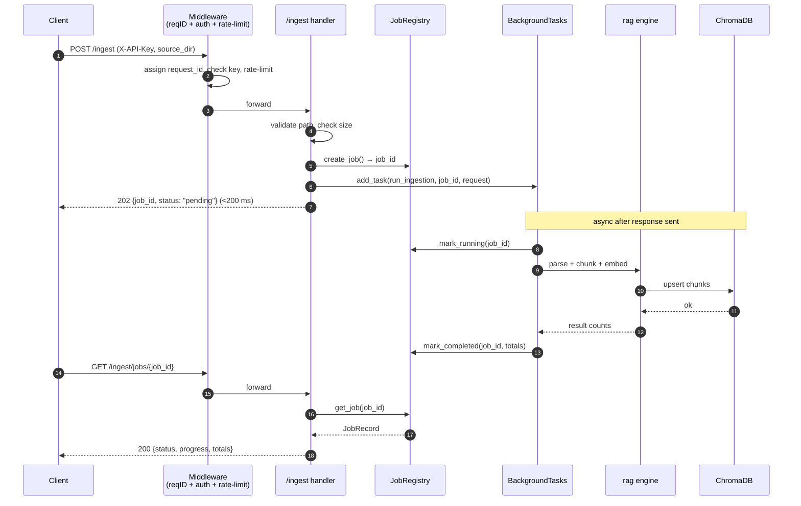
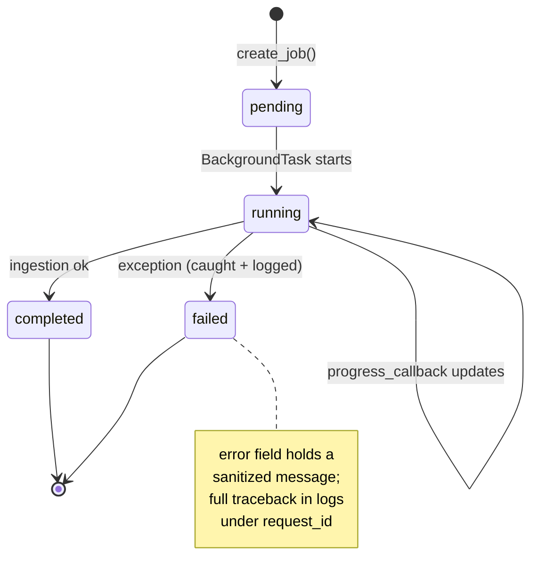

# Tier 1 Production-Ready Ingestion Pipeline — Development Plan

**Project**: RAG API Tier 1 Hardening
**Version**: v0.1.0
**DRI**: RamiKrispin
**Start date**: 2026-05-28
**Source-of-truth roadmap**: `docs/api_production_roadmap.md` (§2 Tier 1, §3 Week 1, §5 Tier 1 acceptance)
**Plan status**: Draft — pending user approval

---

## 1. Overview

### What we are building

Tier 1 hardening of the FastAPI service in `rag/api/`. The current implementation is a synchronous, unauthenticated, error-leaking endpoint that is fine for the course demo but unsafe for any external user. This plan takes it to the bar set in `docs/api_production_roadmap.md` §5 — "you'd let a friend use this".

Concretely, by the end of this work the API will:

1. Accept `/ingest` as a non-blocking call — return `202 Accepted` with a job ID in under 200 ms regardless of PDF size, run the actual ingestion in a FastAPI `BackgroundTasks` worker, and expose `GET /ingest/jobs/{job_id}` for polling.
2. Reject any request without a valid `X-API-Key` header with `401`.
3. Enforce per-IP rate limits on `/ingest` and `/query` via `slowapi`.
4. Reject uploads larger than a configurable max size with `413` **before** any disk write.
5. Restrict ingestion source paths to a single allowed upload directory (tightening the current "anywhere under project root" check).
6. Stop leaking exception strings to clients — log server-side with a request ID, return `{request_id, error: "Internal server error"}`.
7. Attach an `X-Request-ID` to every request (generated if not supplied) and propagate it through structured logs.

### Why now

The synchronous `/ingest` is the highest-risk gap in the current codebase. A 500-page 10-Q blocks the only uvicorn worker for 1–5 minutes, during which every other client (Streamlit, curl, future web UI) gets a connection timeout from the load balancer. Combined with no auth and no upload cap, the surface is wide enough that this should not be put in front of anyone outside the dev container.

### Explicit non-goals (Tier 2+ — out of scope)

- **No Celery / Redis / RQ** — job state lives in an in-memory `dict` for v1. Jobs are lost on process restart; this is documented in `GET /ingest/jobs/{job_id}` responses and in the README section we will add.
- **No JWT / OAuth / multi-tenancy** — single shared API key set.
- **No streaming responses** on `/query` — stays synchronous; streaming is Tier 2 item #9.
- **No new container in docker-compose.yaml** — v1 runs inside the existing `python` dev container under uvicorn. `docker/Dockerfile_API` stays unwired; we will document the lift in §12.
- **No Prometheus / OpenTelemetry** — observability beyond structured logs is Tier 2 items #8–#11.
- **No retry-with-backoff** on embedding calls — Tier 2 item #8.

### Constraint: Streamlit must not break

`clients/streamlit_app.py` bypasses the API entirely and imports `rag/` modules directly (see lines 25–30 — `from rag.ingestion.chunker import chunk_elements`, etc.). Nothing in this plan touches `rag/store.py`, `rag/ingestion/`, or `rag/retrieval/`. All new code lives under `rag/api/`. Streamlit continues to work unchanged.

---

## 2. Architecture

### 2.1 System architecture — new components in green

```mermaid
graph TB
    Client[HTTP Client<br/>curl / browser / SDK]
    Streamlit[Streamlit UI<br/>bypasses API]

    subgraph FastAPI["FastAPI process (uvicorn in python dev container)"]
        subgraph MW["Middleware stack (outer → inner)"]
            RID[X-Request-ID middleware]
            AUTH[API-key auth middleware]
            ERR[Error-sanitization handler]
            RL[slowapi rate limiter]
        end

        subgraph Routes["Route handlers"]
            INGEST[POST /ingest<br/>returns 202 + job_id]
            JOBS[GET /ingest/jobs/&#123;id&#125;]
            QUERY[POST /query<br/>synchronous]
            HEALTH[GET /health]
            DOCS[/documents, /config/]
        end

        REG[(JobRegistry<br/>thread-safe dict)]
        BG[BackgroundTasks runner<br/>FastAPI built-in]
    end

    RAG[rag/ engine<br/>parse → chunk → embed]
    CHROMA[(ChromaDB container)]

    Client -- X-API-Key --> RID
    RID --> AUTH
    AUTH --> ERR
    ERR --> RL
    RL --> Routes

    INGEST -- enqueue --> REG
    INGEST -- schedule --> BG
    BG -- run_ingestion_job --> RAG
    BG -- update status --> REG
    JOBS -- read --> REG

    QUERY --> RAG
    RAG --> CHROMA

    Streamlit -.imports directly.-> RAG

    classDef new fill:#c8e6c9,stroke:#2e7d32,color:#000
    class RID,AUTH,ERR,RL,INGEST,JOBS,REG,BG new
```



### 2.2 Async ingestion — sequence diagram



### 2.3 Job state machine



---

## 3. Project status

- [ ] **Phase 1** — Middleware stack (request ID, API-key auth, error sanitization)
- [ ] **Phase 2** — Async ingestion (job registry, background runner, new endpoints)
- [ ] **Phase 3** — Rate limiting, max upload size, path hardening
- [ ] **Phase 4** — Tests, documentation, acceptance checklist verification

---

## 4. Gantt chart

```mermaid
gantt
    title Tier 1 Ingestion Pipeline — v0.1.0
    dateFormat YYYY-MM-DD
    axisFormat %m-%d

    section Phase 1 — Middleware
    Request-ID middleware           :p1a, 2026-05-28, 1d
    API-key auth middleware         :p1b, after p1a, 2d
    Error sanitization handler      :p1c, after p1b, 1d
    Phase 1 integration test        :p1t, after p1c, 1d

    section Phase 2 — Async ingestion
    JobRegistry + JobRecord model   :p2a, after p1t, 2d
    Background task runner          :p2b, after p2a, 2d
    POST /ingest 202 contract       :p2c, after p2b, 1d
    GET /ingest/jobs/&#123;id&#125;          :p2d, after p2c, 1d
    Phase 2 integration test        :p2t, after p2d, 1d

    section Phase 3 — Limits and hardening
    slowapi rate limiter wiring     :p3a, after p2t, 1d
    MAX_UPLOAD_SIZE + 413           :p3b, after p3a, 1d
    Upload-dir path hardening       :p3c, after p3b, 1d
    Phase 3 integration test        :p3t, after p3c, 1d

    section Phase 4 — Tests and docs
    pytest expansion                :p4a, after p3t, 2d
    README + .env.example updates   :p4b, after p4a, 1d
    Acceptance checklist run        :p4c, after p4b, 1d
```



---

## 5. Level of Effort (LOE) estimates

Token estimates are for code generation (Builder Agent) and review. Model choice follows the repo convention: Opus for design / cross-cutting changes / prompt-engineering-adjacent work, Sonnet for boilerplate and well-defined tests.

| Phase | Component | Complexity | Est. Tokens | Model | Agent | Rationale |
|-------|-----------|-----------:|------------:|-------|-------|-----------|
| **1** | `RequestIDMiddleware` + log filter | Low | 6k | Sonnet | Builder | Boilerplate Starlette middleware + `logging.Filter`. Well-defined pattern. |
| **1** | `APIKeyAuthMiddleware` + key loader | Medium | 10k | Opus | Builder | Security-sensitive: constant-time compare, env parsing, allowlist for `/health`. Worth Opus review. |
| **1** | `RFC7807`-ish error handler + 500 sanitizer | Medium | 8k | Opus | Builder | Needs to catch every exception path, preserve request_id, never leak. |
| **1** | Phase 1 wiring + smoke test | Low | 4k | Sonnet | Builder | Hook middleware into `app`, run `pytest tests/test_api.py`. |
| | **Phase 1 subtotal** | | **28k** | | | |
| **2** | `JobRecord` Pydantic model + `JobStatus` enum | Low | 4k | Sonnet | Builder | Pure data classes. |
| **2** | `JobRegistry` (thread-safe dict, `RLock`) | Medium | 8k | Opus | Builder | Concurrency correctness matters; needs careful method boundaries. |
| **2** | `run_ingestion_job()` background function | High | 14k | Opus | Builder | Wraps existing pipeline, must catch all exceptions, update registry, log under request_id. |
| **2** | `POST /ingest` rewrite returning 202 | Medium | 8k | Opus | Builder | Contract change; need to preserve back-compat-ish response shape OR document break. |
| **2** | `GET /ingest/jobs/{job_id}` + list endpoint | Low | 6k | Sonnet | Builder | Straightforward read from registry. |
| **2** | Phase 2 integration test (async polling loop) | Medium | 8k | Sonnet | Builder | TestClient + `BackgroundTasks` interaction is fiddly; follow existing patterns. |
| | **Phase 2 subtotal** | | **48k** | | | |
| **3** | `slowapi` setup + decorators on `/ingest`, `/query` | Low | 6k | Sonnet | Builder | Library-driven. |
| **3** | `MAX_UPLOAD_SIZE_MB` env var + 413 reject middleware | Medium | 8k | Opus | Builder | Must reject before disk write — Content-Length check + streaming guard. |
| **3** | Upload directory hardening (`ALLOWED_UPLOAD_DIR`) | Medium | 8k | Opus | Builder | Security-sensitive path resolution; symlink-aware. |
| **3** | Phase 3 integration test | Low | 6k | Sonnet | Builder | curl + pytest assertions. |
| | **Phase 3 subtotal** | | **28k** | | | |
| **4** | Expand `tests/test_api.py` — auth, jobs, rate-limit, 413, path | Medium | 16k | Sonnet | Builder | Boilerplate tests following existing fixture patterns. |
| **4** | New `tests/test_job_registry.py` (thread-safety) | Medium | 8k | Sonnet | Builder | `concurrent.futures` smoke tests. |
| **4** | Update `README.md` + `docs/overview.md` API section | Low | 6k | Sonnet | Docs | Add API key setup, job polling example, env-var table. |
| **4** | Create `.env.example` for API keys | Low | 2k | Sonnet | Builder | Trivial. |
| **4** | Run Tier 1 acceptance checklist (§5 in roadmap) | Low | 4k | Opus | Reviewer | Cross-check each criterion is satisfied. |
| | **Phase 4 subtotal** | | **36k** | | | |
| | **Grand total** | | **140k** | | | Roughly 3 days of focused engineer + agent time. |

---

## 6. API contract changes

### 6.1 Changed: `POST /ingest`

**Before**
```http
POST /ingest
Content-Type: application/json

{"source_dir": "pdf/", "chunking_method": "recursive"}

→ 200 OK (blocks 1–5 min)
{"status": "success", "documents_ingested": 3, "total_chunks": 412, "files": [...]}
```

**After**
```http
POST /ingest
X-API-Key: <required>
X-Request-ID: <optional, generated if absent>
Content-Type: application/json

{"source_dir": "uploads/", "chunking_method": "recursive"}

→ 202 Accepted (<200 ms)
{
  "job_id": "j_8f3a1c2b",
  "status": "pending",
  "request_id": "r_2026052801a3",
  "poll_url": "/ingest/jobs/j_8f3a1c2b"
}
```

**Errors**
| Code | When |
|-----:|------|
| 401 | Missing or invalid `X-API-Key` |
| 403 | `source_dir` outside `ALLOWED_UPLOAD_DIR` |
| 404 | `source_dir` does not exist or contains no PDFs |
| 413 | Aggregate upload size exceeds `MAX_UPLOAD_SIZE_MB` |
| 429 | Rate limit tripped (per-IP) |
| 500 | Sanitized `{request_id, error: "Internal server error"}` |

### 6.2 New: `GET /ingest/jobs/{job_id}`

```http
GET /ingest/jobs/j_8f3a1c2b
X-API-Key: <required>

→ 200 OK
{
  "job_id": "j_8f3a1c2b",
  "status": "running" | "pending" | "completed" | "failed",
  "created_at": "2026-05-28T14:02:11Z",
  "started_at": "2026-05-28T14:02:11Z" | null,
  "completed_at": "..." | null,
  "request_id": "r_2026052801a3",
  "progress": {"chunks_done": 412, "chunks_total": 1342} | null,
  "result": {"documents_ingested": 3, "total_chunks": 1342, "files": [...]} | null,
  "error": "Internal server error" | null
}
```

**Errors**: `401`, `404` (unknown `job_id` — note: jobs lost on process restart).

### 6.3 New (optional convenience): `GET /ingest/jobs`

Lists last N (default 50) jobs for debugging. Auth-gated. Out of scope if time is tight.

### 6.4 Unchanged but now auth-gated and rate-limited

- `POST /query` — adds `X-API-Key` requirement, `X-Request-ID` echo, rate limit, sanitized 500s. Stays synchronous.
- `GET /documents`, `DELETE /documents/{source_file}`, `GET /config` — all gain auth + request IDs.
- `GET /health` — **stays unauthenticated** (load balancers and k8s probes need it).

### 6.5 New response headers (all routes)

- `X-Request-ID: <uuid>` — echoed or generated.

---

## 7. Files: new + modified

### 7.1 New files

| Path | Purpose |
|---|---|
| `rag/api/middleware/__init__.py` | Package marker |
| `rag/api/middleware/request_id.py` | `RequestIDMiddleware` — generate/propagate `X-Request-ID`, attach to `request.state`, set logging context |
| `rag/api/middleware/auth.py` | `APIKeyAuthMiddleware` — env-loaded set, constant-time compare, allowlist `/health` |
| `rag/api/middleware/errors.py` | `register_exception_handlers(app)` — catch-all → sanitized `{request_id, error}` |
| `rag/api/middleware/upload_limit.py` | `MaxUploadSizeMiddleware` — Content-Length check + streaming guard, 413 |
| `rag/api/jobs/__init__.py` | Package marker |
| `rag/api/jobs/registry.py` | `JobRegistry` — thread-safe in-memory dict, `create / get / update / list` |
| `rag/api/jobs/models.py` | `JobRecord`, `JobStatus`, `JobProgress`, `JobResult` Pydantic models |
| `rag/api/jobs/runner.py` | `run_ingestion_job(job_id, request, registry, ...)` background callable |
| `rag/api/security/paths.py` | `resolve_under(allowed_root, candidate)` — symlink-aware path validator |
| `rag/api/rate_limit.py` | `slowapi` `Limiter` factory + decorator helpers |
| `tests/test_middleware.py` | Auth + request-ID + error-sanitization tests |
| `tests/test_jobs.py` | Endpoint-level tests for `/ingest` 202 + `/ingest/jobs/{id}` polling |
| `tests/test_job_registry.py` | Thread-safety smoke tests for `JobRegistry` |
| `tests/test_security.py` | Path-traversal + 413 + rate-limit tests |
| `.env.example` | Sample env vars (no real keys) |

### 7.2 Modified files

| Path | Change |
|---|---|
| `rag/api/main.py` | Wire middleware stack, register error handlers, register slowapi, rewrite `/ingest` to return 202, add `GET /ingest/jobs/{job_id}`, add `X-API-Key` to all existing routes |
| `rag/api/models.py` | Add `IngestJobResponse`, `JobStatusResponse`, `SanitizedErrorResponse`; mark old `IngestResponse` as deprecated (kept for shape reuse inside `JobResult`) |
| `rag/api/dependencies.py` | Add `@lru_cache get_job_registry()`, `get_api_keys()`, `get_rate_limiter()`, `get_upload_settings()` |
| `rag/config.py` | Add `api: APIConfig` block (max_upload_size_mb, allowed_upload_dir, rate_limits, api_key_env) — defaults so YAML stays optional |
| `config/settings.yaml` | Add `api:` section with sensible defaults (commented examples) |
| `docker/requirements-api.txt` | Add `slowapi>=0.1.9` |
| `tests/test_api.py` | Update existing tests to send `X-API-Key`; assert `X-Request-ID` echo; loosen `/ingest` assertions to 202 contract |
| `README.md` | Add "Running the API" section with curl examples, env-var setup, job polling |
| `docs/overview.md` | Cross-link to this plan and to the new API section |

### 7.3 Files NOT modified (explicit list — these are constraints)

- `clients/streamlit_app.py` — Streamlit bypasses the API, must keep working
- `rag/store.py`, `rag/ingestion/*`, `rag/retrieval/*` — core engine unchanged
- `docker-compose.yaml` — no new service for v1
- `docker/Dockerfile_API` — exists, stays unwired (Tier 2)
- `notebooks/*` — irrelevant to API

---

## 8. Environment variables introduced

| Name | Purpose | Set in | Default | Required? |
|---|---|---|---|---|
| `RAG_API_KEYS` | Comma-separated list of valid API keys. Empty/unset → API refuses to boot. | host shell, `.env`, docker-compose `environment:` | _none_ | **Yes** |
| `RAG_API_REQUIRE_AUTH` | If `false`, auth middleware logs but does not reject. For local dev only. | env | `true` | No |
| `RAG_API_MAX_UPLOAD_MB` | Max aggregate upload size before 413 | env | `100` | No |
| `RAG_API_ALLOWED_UPLOAD_DIR` | Single absolute directory under which `source_dir` must resolve | env | `/workspace/uploads` (container) | No |
| `RAG_API_RATE_LIMIT_INGEST` | slowapi rate string for `/ingest` | env | `5/minute` | No |
| `RAG_API_RATE_LIMIT_QUERY` | slowapi rate string for `/query` | env | `30/minute` | No |
| `RAG_API_LOG_LEVEL` | Log level for the `rag.api` logger | env | `INFO` | No |
| `RAG_API_JOB_TTL_SECONDS` | How long completed jobs stay queryable before GC | env | `3600` | No |

All of the above will be documented in `.env.example` and added to `docker-compose.yaml` `environment:` block for the `python` service. None overlap with existing names (`OPENAI_API_KEY`, etc.).

---

## 9. Phase details

### Phase 1 — Middleware stack

**Goal**: Every request gets a request ID, requires a valid API key (except `/health`), and any uncaught exception is converted to a sanitized response without leaking internals.

**Dependencies**: None. Existing tests must continue to pass once updated to send the API key.

**Steps**

| # | Step | Output |
|--:|------|--------|
| 1 | Add `RequestIDMiddleware` (Starlette `BaseHTTPMiddleware`) generating UUID if `X-Request-ID` absent; stash on `request.state.request_id`; echo in response. | `rag/api/middleware/request_id.py` |
| 2 | Add a `logging.Filter` that pulls `request_id` from a `contextvars.ContextVar` set by the middleware. Wire into `setup_logging()`. | edit `rag/observability/logging.py` |
| 3 | Add `APIKeyAuthMiddleware`. Load `RAG_API_KEYS` once at startup. Use `hmac.compare_digest` for comparison. Allowlist exact paths: `/health`, `/docs`, `/openapi.json`, `/redoc`. | `rag/api/middleware/auth.py` |
| 4 | Add `register_exception_handlers(app)`. Catch `Exception` last — log full traceback under `request_id`, return `500 {request_id, error: "Internal server error"}`. Preserve `HTTPException` 4xx codes but strip `detail` to a generic message for 5xx. | `rag/api/middleware/errors.py` |
| 5 | Wire all three into `rag/api/main.py` lifespan. Order matters: RequestID outermost → Auth → Errors innermost so errors get the request_id. | edit `rag/api/main.py` |
| 6 | Update `tests/test_api.py` fixtures to set `X-API-Key` header in `TestClient` default headers. | edit `tests/test_api.py` |

**Test checkpoint** (copy-paste):
```bash
cd /workspace
export RAG_API_KEYS=test-key-1,test-key-2
uvicorn rag.api.main:app --host 0.0.0.0 --port 8080 &
API_PID=$!
sleep 2

# 1. /health is open
curl -s -o /dev/null -w "%{http_code}\n" http://localhost:8080/health
# expect: 200

# 2. /config requires auth
curl -s -o /dev/null -w "%{http_code}\n" http://localhost:8080/config
# expect: 401

# 3. /config with valid key works
curl -s -o /dev/null -w "%{http_code}\n" -H "X-API-Key: test-key-1" http://localhost:8080/config
# expect: 200

# 4. X-Request-ID is echoed (generated)
curl -sI -H "X-API-Key: test-key-1" http://localhost:8080/config | grep -i x-request-id
# expect: x-request-id: <uuid>

# 5. X-Request-ID is echoed (passed)
curl -sI -H "X-API-Key: test-key-1" -H "X-Request-ID: my-trace-123" http://localhost:8080/config | grep -i x-request-id
# expect: x-request-id: my-trace-123

# 6. Induced 500 is sanitized — temporarily break ChromaDB host to trigger
curl -s -H "X-API-Key: test-key-1" http://localhost:8080/documents | jq .
# expect: {"request_id": "...", "error": "Internal server error"} — NOT a Python traceback

kill $API_PID
pytest tests/test_api.py tests/test_middleware.py -v
# expect: all green
```

**Done when**:
- All test-checkpoint commands pass
- No raw `str(e)` reaches a client response in any endpoint
- Logs (stderr) contain matching `request_id` for the induced 500

---

### Phase 2 — Async ingestion

**Goal**: `/ingest` returns 202 with a job ID in under 200 ms regardless of PDF size. Background task runs the full parse → chunk → embed pipeline. `/ingest/jobs/{job_id}` returns live status.

**Dependencies**: Phase 1 (middleware must be in place so the new endpoints are auth-gated and have request IDs).

**Steps**

| # | Step | Output |
|--:|------|--------|
| 1 | Define `JobStatus = Literal["pending","running","completed","failed"]`, `JobProgress`, `JobResult`, `JobRecord` in `rag/api/jobs/models.py`. | new file |
| 2 | Implement `JobRegistry` with `RLock`, methods: `create()`, `get(id)`, `update(id, **fields)`, `mark_running`, `mark_completed`, `mark_failed`, `list(limit=50)`, `gc(ttl_seconds)`. | new file |
| 3 | Add `get_job_registry()` `@lru_cache` singleton in `dependencies.py`. | edit |
| 4 | Write `run_ingestion_job(job_id, ingest_request, request_id)` in `rag/api/jobs/runner.py`. Wrap existing parse/chunk/store logic. Use `progress_callback` to update registry per-batch. Catch every exception, log under `request_id`, mark `failed`. | new file |
| 5 | Rewrite `POST /ingest` handler: validate (path + count + size), `registry.create()`, `background_tasks.add_task(run_ingestion_job, ...)`, return 202. **Must complete in <200ms** — no parse/chunk/embed in the request thread. | edit `main.py` |
| 6 | Add `GET /ingest/jobs/{job_id}` returning the `JobRecord` shape; 404 on unknown id with a hint about process restart. | edit `main.py` |
| 7 | Add optional `GET /ingest/jobs` listing (limit param, auth-gated). | edit `main.py` |
| 8 | Document in API response and README: **jobs are lost on process restart**. Multi-worker deployments need Tier 2 Redis/DB migration. | edit `README.md` |

**Test checkpoint**:
```bash
cd /workspace
export RAG_API_KEYS=test-key-1
mkdir -p uploads
cp pdf/*.pdf uploads/ 2>/dev/null || echo "(no PDFs yet — drop one in uploads/)"

uvicorn rag.api.main:app --host 0.0.0.0 --port 8080 &
API_PID=$!
sleep 2

# 1. Submission is fast
time curl -s -X POST http://localhost:8080/ingest \
  -H "X-API-Key: test-key-1" \
  -H "Content-Type: application/json" \
  -d '{"source_dir": "uploads/"}' | tee /tmp/ingest.json
# expect: HTTP 202, response body has job_id, total request time < 0.5s

JOB_ID=$(jq -r .job_id /tmp/ingest.json)
echo "Job: $JOB_ID"

# 2. Poll until done
for i in $(seq 1 60); do
  STATUS=$(curl -s -H "X-API-Key: test-key-1" http://localhost:8080/ingest/jobs/$JOB_ID | jq -r .status)
  echo "[$i] status=$STATUS"
  [ "$STATUS" = "completed" ] && break
  [ "$STATUS" = "failed" ] && { echo "FAILED"; exit 1; }
  sleep 2
done

# 3. Final record has result counts
curl -s -H "X-API-Key: test-key-1" http://localhost:8080/ingest/jobs/$JOB_ID | jq .
# expect: status=completed, result.documents_ingested >= 1

# 4. Unknown job → 404
curl -s -o /dev/null -w "%{http_code}\n" -H "X-API-Key: test-key-1" \
  http://localhost:8080/ingest/jobs/does-not-exist
# expect: 404

kill $API_PID
pytest tests/test_jobs.py tests/test_job_registry.py -v
```

**Done when**:
- `time curl ... /ingest` consistently under 200 ms for any-sized PDF set
- Polling shows `pending → running → completed` progression with progress updates
- `pytest tests/test_jobs.py tests/test_job_registry.py` passes
- README documents the in-memory-registry limitation

---

### Phase 3 — Rate limiting, max upload size, path hardening

**Goal**: Reject oversized uploads with 413 before disk write, enforce per-IP rate limits, restrict ingestion to a single allowed directory.

**Dependencies**: Phase 1 (so 429 / 413 / 403 go through the sanitized error path with request IDs).

**Steps**

| # | Step | Output |
|--:|------|--------|
| 1 | Add `slowapi` to `docker/requirements-api.txt`. Run `pip install -r docker/requirements-api.txt` inside dev container. | edit |
| 2 | Create `rag/api/rate_limit.py`: `limiter = Limiter(key_func=get_remote_address)`. Register on `app.state.limiter`, add `SlowAPIMiddleware`, register `RateLimitExceeded` handler that uses our sanitized error envelope but with the proper 429 code. | new |
| 3 | Decorate `/ingest` with `@limiter.limit(settings.api.rate_limit_ingest)` and `/query` with `@limiter.limit(settings.api.rate_limit_query)`. | edit `main.py` |
| 4 | Implement `MaxUploadSizeMiddleware`: read `Content-Length` header first (fast path → 413 immediately). For chunked uploads, wrap `request.stream()` and count bytes; abort with 413 once limit is exceeded. Skip for non-`/ingest` routes. | new |
| 5 | Implement `resolve_under(allowed_root, candidate)` in `rag/api/security/paths.py`: resolve both to absolute, `os.path.realpath` to follow symlinks, then check `commonpath`. Reject on mismatch. Reject relative components that escape (`..`). | new |
| 6 | Rewrite the path check in `POST /ingest` to use `resolve_under(get_upload_settings().allowed_dir, request.source_dir)`. Default upload dir = `/workspace/uploads`. Create the dir at startup if missing. | edit `main.py` |
| 7 | Add a startup banner log: `INFO rag.api: upload_dir=/workspace/uploads max_upload_mb=100 rate_ingest=5/minute rate_query=30/minute`. | edit `main.py` |

**Test checkpoint**:
```bash
cd /workspace
export RAG_API_KEYS=test-key-1
export RAG_API_MAX_UPLOAD_MB=10
export RAG_API_RATE_LIMIT_INGEST="3/minute"
export RAG_API_ALLOWED_UPLOAD_DIR=/workspace/uploads
mkdir -p uploads

uvicorn rag.api.main:app --host 0.0.0.0 --port 8080 &
API_PID=$!
sleep 2

# 1. 413 on oversized upload (use a dummy 50MB body)
dd if=/dev/zero of=/tmp/big.pdf bs=1M count=50 2>/dev/null
curl -s -o /dev/null -w "%{http_code}\n" -X POST http://localhost:8080/ingest \
  -H "X-API-Key: test-key-1" \
  -H "Content-Type: application/octet-stream" \
  --data-binary @/tmp/big.pdf
# expect: 413

# 2. Path-traversal rejected
curl -s -o /dev/null -w "%{http_code}\n" -X POST http://localhost:8080/ingest \
  -H "X-API-Key: test-key-1" -H "Content-Type: application/json" \
  -d '{"source_dir": "/etc"}'
# expect: 403

# Also: symlink escape
ln -sf /etc uploads/etc-link
curl -s -o /dev/null -w "%{http_code}\n" -X POST http://localhost:8080/ingest \
  -H "X-API-Key: test-key-1" -H "Content-Type: application/json" \
  -d '{"source_dir": "uploads/etc-link"}'
# expect: 403
rm uploads/etc-link

# 3. Rate limit trips at 4th call within a minute
for i in 1 2 3 4; do
  CODE=$(curl -s -o /dev/null -w "%{http_code}" -X POST http://localhost:8080/ingest \
    -H "X-API-Key: test-key-1" -H "Content-Type: application/json" \
    -d '{"source_dir": "uploads/"}')
  echo "[$i] $CODE"
done
# expect: 202, 202, 202, 429

kill $API_PID
pytest tests/test_security.py -v
```

**Done when**:
- 1 GB-equivalent upload returns 413 before any bytes hit disk (verify with `ls -la /tmp/uploads/` — empty)
- Path-traversal probes return 403 (both `..` and symlink variants)
- 4th call in a minute returns 429
- `pytest tests/test_security.py` passes

---

### Phase 4 — Tests, docs, acceptance verification

**Goal**: Test coverage of every new code path; user-facing docs explain the new contract; Tier 1 acceptance checklist passes end-to-end.

**Dependencies**: Phases 1–3 complete.

**Steps**

| # | Step | Output |
|--:|------|--------|
| 1 | Expand `tests/test_api.py` for the new auth requirements; ensure every existing test sends `X-API-Key`. | edit |
| 2 | Add `tests/test_middleware.py` (request ID echo, auth allowlist, error sanitization, log capture under request_id). | new |
| 3 | Add `tests/test_jobs.py` (202 contract, polling, failed-job path, unknown-id 404). | new |
| 4 | Add `tests/test_job_registry.py` (concurrent `create()` + `update()` from threads; no lost updates). | new |
| 5 | Add `tests/test_security.py` (413 fast path via Content-Length, 413 streaming path, path-traversal `..` and symlink, rate-limit 429). | new |
| 6 | Run full suite: `pytest tests/ -v --tb=short`. Target: 0 failures, coverage of new files >= 80%. | command |
| 7 | Write `README.md` "Running the API" section: env-var setup, curl examples for ingest + poll, sample `.env`, link to this plan. | edit |
| 8 | Update `docs/overview.md` §1 diagram to mention the API path alongside Streamlit; add a pointer to this plan. | edit |
| 9 | Walk through `docs/api_production_roadmap.md` §5 Tier 1 acceptance checklist and mark each item. | section 10 below |

**Test checkpoint**:
```bash
cd /workspace
pytest tests/ -v --tb=short
# expect: all green

pytest tests/ --cov=rag/api --cov-report=term-missing
# expect: rag/api/ coverage >= 80%

# Manual smoke of every acceptance item — see §10 below
```

**Done when**:
- `pytest tests/ -v` is fully green
- Every checkbox in §10 below is ticked
- README has working copy-paste examples

---

## 10. Tier 1 acceptance criteria (from `docs/api_production_roadmap.md` §5)

Each item below maps to a verification command. All must pass before this plan is considered done.

- [ ] **Ingestion endpoint returns `202` with a job ID in < 200 ms regardless of PDF size.**
  Verify: `time curl -X POST .../ingest -H "X-API-Key:..." -d '{"source_dir":"uploads/"}'` consistently < 0.2 s.
- [ ] **All endpoints reject requests without a valid API key with `401`.**
  Verify: `for ep in /query /ingest /documents /config /ingest/jobs/x; do curl -s -o /dev/null -w "%{http_code} $ep\n" http://localhost:8080$ep; done` — every line starts with `401` (except `/health` which is intentionally open).
- [ ] **Upload of a 1 GB file is rejected with `413` before any disk write.**
  Verify: see Phase 3 test checkpoint step 1; `ls /tmp/uploads/` shows nothing was written.
- [ ] **Rate limiting trips at the documented threshold under load.**
  Verify: Phase 3 step 3 loop returns `429` at the configured threshold.
- [ ] **Path-traversal probe against `/ingest` is rejected.**
  Verify: Phase 3 step 2 — both `..` traversal and symlink escape return `403`.
- [ ] **An induced exception returns a generic error to the client; the stack trace is in server logs with a matching request ID.**
  Verify: temporarily set `chromadb.host=bad` in config, call `/documents`, confirm response is `{request_id, error: "Internal server error"}` and matching `request_id` appears in stderr logs with the full traceback.

> **NOT in scope for v1**: "The API process is a separate container — `docker compose ps` shows `api`, not `python` running uvicorn." This is the Tier 2 lift documented in §12 below. v1 runs uvicorn inside the existing `python` dev container. This deliberate trade-off is called out in the user-facing README.

---

## 11. Out of scope (explicit, with pointers)

| Deferred to | Item | Why deferred |
|---|---|---|
| Tier 2 (roadmap §3 Week 2) | Celery / RQ / Redis-backed job queue | `BackgroundTasks` is "good enough" for single-process; durable queues are not needed until multi-worker |
| Tier 2 (#7) | Multi-tenancy (`tenant_id`) | Adds auth complexity prematurely |
| Tier 2 (#9) | SSE streaming on `/query` | Synchronous query is fine until first-token latency becomes user-visible |
| Tier 2 (#8) | Retry-with-backoff on embedding/chat calls | `tenacity` integration is its own Phase |
| Tier 2 (#11) | Prometheus + OpenTelemetry tracing | Structured logs with request IDs are the v1 floor |
| Tier 2 (#6) | Lifting API into `docker/Dockerfile_API` as a compose service | See §12 — almost-zero code change, mostly compose surgery |
| Tier 3 | Idempotency keys on `/ingest`, webhook callbacks, cost tracking | Polish for paid users |

If a request comes in that touches one of these, reply: "out of scope for Tier 1, tracked in `docs/api_production_roadmap.md` §3."

---

## 12. Future migration path — lifting into `docker/Dockerfile_API`

When the team is ready for Tier 2 item #6 ("API as its own container"), the changes required are almost entirely outside the code we are writing here. Nothing in this plan creates a dependency that breaks once the API moves.

**What changes**:

1. `docker-compose.yaml` gains an `api` service:
   ```yaml
   api:
     build:
       context: .
       dockerfile: docker/Dockerfile_API
     ports:
       - "8080:8080"
     environment:
       - OPENAI_API_KEY=${OPENAI_API_KEY}
       - RAG_API_KEYS=${RAG_API_KEYS}
       - RAG_API_ALLOWED_UPLOAD_DIR=/app/uploads
       # ... rest of RAG_API_* env block
     volumes:
       - ./uploads:/app/uploads
     depends_on:
       - chromadb
     networks:
       - rag-docker
   ```
2. `RAG_API_ALLOWED_UPLOAD_DIR` flips from `/workspace/uploads` to `/app/uploads` to match the Dockerfile WORKDIR.
3. `Dockerfile_API` becomes multi-stage (separate `docs/docker_review.md` punch list item).

**What does NOT change**:

- Any code under `rag/api/` — the middleware, registry, runner, and endpoints are container-agnostic.
- `clients/streamlit_app.py` — still bypasses the API; still works.
- `rag/store.py`, `rag/ingestion/`, `rag/retrieval/` — never touched by this plan.
- Test suite — `TestClient(app)` is in-process and doesn't care about containers.

**One thing to revisit when lifting**: the in-memory `JobRegistry` becomes a real liability once compose scales the API service to >1 replica — different uvicorn processes will have different views of "what jobs exist". That is the Tier 2 trigger to swap the registry for Redis or Postgres. The `JobRegistry` interface in this plan is deliberately narrow (`create / get / update / list / gc`) so it can be reimplemented behind a Protocol without touching the runner or the endpoints.

---

## 13. Risks and mitigations

| Risk | Likelihood | Impact | Mitigation |
|---|---|---|---|
| `BackgroundTasks` exception silently lost | Med | High | `run_ingestion_job` wraps the entire pipeline in `try/except Exception`, logs under `request_id`, marks `JobStatus.failed`. |
| `MaxUploadSizeMiddleware` doesn't actually short-circuit before disk write | Low | High | Check `Content-Length` header in the middleware (before route dispatch). For chunked/streamed bodies, the middleware wraps `request.stream()` and aborts on first byte over the limit. Test asserts `/tmp/uploads/` is empty post-413. |
| Path hardening breaks Streamlit-uploaded PDFs that land in `tempfile.NamedTemporaryFile` (`/tmp/...`) | Low | Med | Streamlit bypasses the API entirely (see `clients/streamlit_app.py` lines 587–598). The path check only runs in the API. Verify: `bash clients/run_streamlit.sh` still ingests a PDF after Phase 3 ships. |
| API key in container logs via `docker compose config` interpolation | Med | High | Already documented in `docs/overview.md` §10 troubleshooting. `.env.example` will say "never commit". |
| In-memory registry loses jobs on uvicorn auto-reload during dev | High | Low | Documented in README; `/ingest/jobs/{id}` 404 response includes the hint "jobs are not persisted across process restarts in v1". |
| Slowapi key function `get_remote_address` returns `127.0.0.1` behind a reverse proxy | Med | Med | Phase 4 documentation: add "if you put nginx in front, set `X-Forwarded-For` and switch key_func to `get_ipaddr`". Out of scope to implement until there's an actual proxy. |

---

## 14. Cross-references

| Topic | Document |
|---|---|
| Source-of-truth roadmap and acceptance criteria | `docs/api_production_roadmap.md` |
| Current app behavior and dev-container setup | `docs/overview.md` |
| Existing API code | `rag/api/main.py`, `rag/api/dependencies.py`, `rag/api/models.py` |
| Long-running call we're pushing async | `rag/store.py` — `ChromaStore.ingest_chunks` |
| Streamlit path that must not break | `clients/streamlit_app.py` |
| Future API container | `docker/Dockerfile_API` (currently unwired) |
| Existing test layout | `tests/test_api.py` + `tests/TEST_INDEX.md` |
