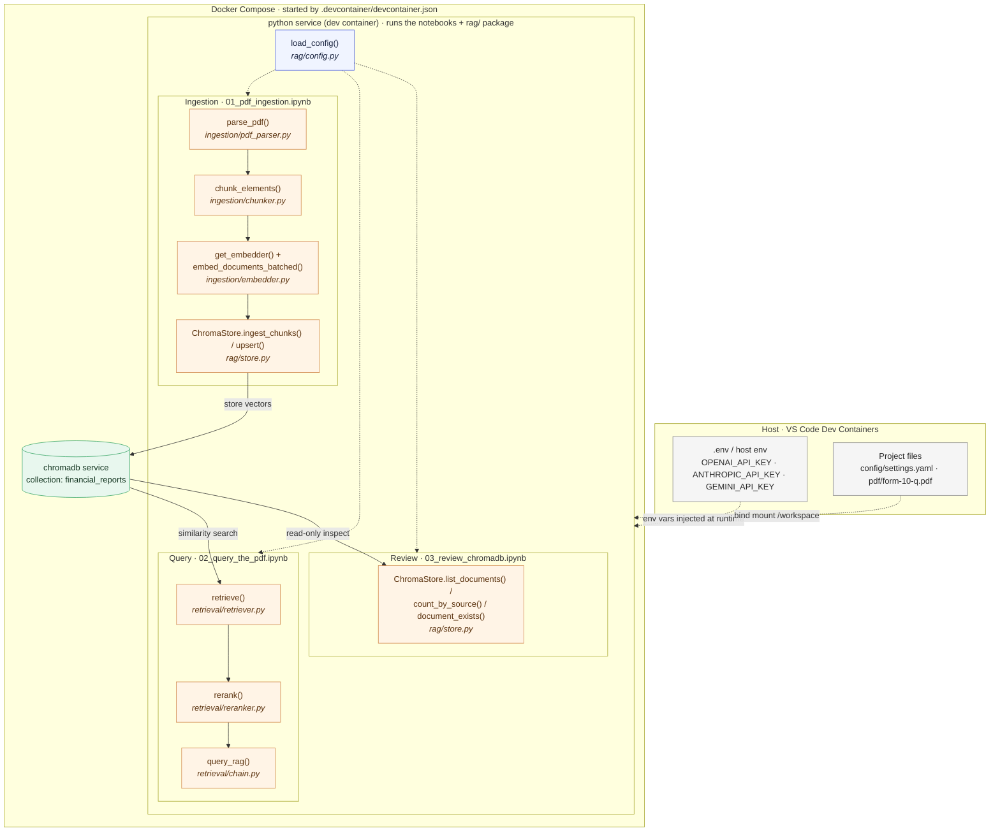

# Notebooks

Interactive walkthroughs of the RAG (Retrieval-Augmented Generation) pipeline used in this
project. They take a financial PDF (a Disney 10-Q filing), turn it into a searchable vector
store, answer natural-language questions about it with citations, and let you review what is
stored in the vector database.

Run the first two **in order** — `01` populates the vector database that `02` queries. `03` is a
read-only inspection tool you can run any time to see what's stored.

## What the notebooks cover

| Notebook | What it does |
|----------|--------------|
| [`01_pdf_ingestion.ipynb`](01_pdf_ingestion.ipynb) | **Ingestion pipeline.** Parse the PDF into structured elements (Docling), chunk them, embed the chunks into vectors, and store them (text + metadata + embeddings) in ChromaDB. Covers document labeling and an idempotent, `overwrite`-aware store step. |
| [`02_query_the_pdf.ipynb`](02_query_the_pdf.ipynb) | **Query pipeline.** Retrieve the most relevant chunks by vector similarity, optionally rerank them with a cross-encoder, and generate a grounded answer with an LLM. Covers metadata filtering and switching the **chat** provider at query time. |
| [`03_review_chromadb.ipynb`](03_review_chromadb.ipynb) | **Review the vector database (read-only).** Inspect what's stored: list collections, see which documents (PDFs) and labels each holds, peek at raw records, survey metadata fields, and filter records by metadata. Does not modify any data. |

> **Order matters:** `02` reads from the ChromaDB collection created by `01`. Run `01`
> end-to-end first. `03` can be run any time to inspect the current state.

## The example document

Both notebooks operate on the example filing shipped in the project's [`pdf/`](../pdf) folder,
loaded at run time:

```python
parse_pdf(project_root / "pdf/form-10-q.pdf")   # Disney quarterly earnings report (10-Q)
```

`pdf/` also contains other sample filings (e.g. Google, additional Disney quarters) — point
`parse_pdf(...)` at a different file to ingest those instead.

## Where the RAG code lives (the `rag/` package)

The notebooks are thin drivers; the actual logic lives in the [`rag/`](../rag) package so it can
be reused by the notebooks **and** the FastAPI service. The modules the notebooks use:

| Area | Module | Key functions / classes |
|------|--------|-------------------------|
| Config | [`rag/config.py`](../rag/config.py) | `load_config()`, `Settings` |
| Ingestion | [`rag/ingestion/pdf_parser.py`](../rag/ingestion/pdf_parser.py) | `parse_pdf()`, `ParsedElement` |
| Ingestion | [`rag/ingestion/chunker.py`](../rag/ingestion/chunker.py) | `chunk_elements()`, `Chunk` |
| Ingestion | [`rag/ingestion/embedder.py`](../rag/ingestion/embedder.py) | `get_embedder()`, `embed_documents_batched()` |
| Storage | [`rag/store.py`](../rag/store.py) (re-exported by [`rag/ingestion/store.py`](../rag/ingestion/store.py)) | `ChromaStore` — `upsert`, `query`, `document_exists`, `count_by_source`, `list_documents`, `ingest_chunks` |
| Retrieval | [`rag/retrieval/retriever.py`](../rag/retrieval/retriever.py) | `retrieve()`, `RetrievedChunk` |
| Retrieval | [`rag/retrieval/reranker.py`](../rag/retrieval/reranker.py) | `rerank()` |
| Retrieval | [`rag/retrieval/chain.py`](../rag/retrieval/chain.py) | `query_rag()` (full retrieve → rerank → generate) |

Other subpackages (`rag/api/`, `rag/evaluation/`, `rag/observability/`) support the HTTP service
and are not required to run the notebooks.

### How it fits together

The diagram maps each pipeline step to the `rag/` function that implements it, and shows where it
all runs: inside the **dev container** brought up by Docker Compose. The `.devcontainer` settings
start two Compose services — the **`python`** service (where the notebooks and `rag/` code run) and
the **`chromadb`** service (the vector store) — on a shared network. The top row is the
**ingestion** pipeline (`01_pdf_ingestion.ipynb`); the middle row is the **query** pipeline
(`02_query_the_pdf.ipynb`); the bottom row is the read-only **review** notebook
(`03_review_chromadb.ipynb`). All read their settings from `config/settings.yaml` via
`load_config()`, and all meet at the shared ChromaDB store. API keys and the project files reach
the `python` service from the host at container run time (env vars via Compose, project folder via
a bind mount).



## RAG settings — `config/settings.yaml`

All model, provider, and pipeline behavior is driven by
[`config/settings.yaml`](../config/settings.yaml) (loaded by `rag.config.load_config()`; override
the path with the `RAG_CONFIG_PATH` env var). Edit this file to change how the pipeline behaves —
no code changes needed. The main sections:

- **`providers`** — per-provider model definitions for `openai`, `anthropic`, and `gemini`
  (embedding model + dimensions, chat model + temperature/max_tokens). Each provider names the
  environment variable that holds its API key via `api_key_env`.
- **`active`** — which provider is used for `embedding_provider` and `chat_provider` (defaults:
  both `openai`).
- **`chunking`** — `method`, `chunk_size`, `chunk_overlap`, `keep_tables_intact`.
- **`retrieval`** — `top_k`, `rerank`, `rerank_model`, `score_threshold`.
- **`chromadb`** — `host` (`chromadb`), `port` (`8000`), `collection_name`
  (`financial_reports`). The host is the Docker Compose service name.
- **`observability`** — optional LangSmith tracing.

> ⚠️ **The embedding provider is fixed once data is ingested.** Stored vectors and query vectors
> must come from the same embedding model (e.g. OpenAI `text-embedding-3-small`, 1536-dim).
> The **chat** provider can be switched per query (`query_rag(..., chat_provider=...)`), but
> changing the **embedding** provider after ingestion breaks retrieval (dimension mismatch /
> incomparable vector space). To change the embedding model, re-embed and re-ingest everything.

## How to run

These notebooks are designed to run **inside the project's dev container** (VS Code Dev
Containers extension), which brings up the Python environment **and** the ChromaDB service
together via Docker Compose.

### 1. Provide API keys as environment variables

The pipeline reads provider keys from environment variables — `OPENAI_API_KEY`,
`ANTHROPIC_API_KEY`, `GEMINI_API_KEY` (see `api_key_env` in `config/settings.yaml`). You only
need the key(s) for the provider(s) you set as `active`. The default config uses OpenAI, so
`OPENAI_API_KEY` is the minimum requirement.

These keys are injected into the container at run time by Docker Compose. The
[`docker-compose.yaml`](../docker-compose.yaml) `python` service declares:

```yaml
environment:
  - OPENAI_API_KEY=${OPENAI_API_KEY}
  - ANTHROPIC_API_KEY=${ANTHROPIC_API_KEY}
  - GEMINI_API_KEY=${GEMINI_API_KEY}
```

Docker Compose fills those `${...}` placeholders from your **host environment** or from a `.env`
file in the project root (Compose reads it automatically). The simplest setup:

```bash
# From the project root — copy the template and fill in your real key(s)
cp .env.example .env
# then edit .env:  OPENAI_API_KEY=sk-...your-real-key...
```

> 🔐 **Never commit real keys.** Keep them in your local `.env` (add `.env` to `.gitignore` if it
> isn't already) or export them in your shell.

Alternatively, export them on the host before launching the container:

```bash
export OPENAI_API_KEY="sk-...your-real-key..."
```

### 2. Open the folder in the dev container

1. Open the project in VS Code and **Reopen in Container** (Dev Containers extension). This uses
   [`.devcontainer/devcontainer.json`](../.devcontainer/devcontainer.json), which starts the
   `python` and `chromadb` services from the Compose file. The API keys from step 1 are loaded
   into the container at this point.
2. Open a notebook and select the project's Python interpreter as the kernel:
   `/opt/python-3.11-dev/bin/python`.

### 3. Run the notebooks

1. Run **`01_pdf_ingestion.ipynb`** top to bottom. This parses `pdf/form-10-q.pdf`, embeds it,
   and stores the chunks in the `financial_reports` ChromaDB collection.
2. Run **`02_query_the_pdf.ipynb`** to retrieve and answer questions against that collection.
3. Run **`03_review_chromadb.ipynb`** any time to inspect what's stored — collections, documents,
   labels, and metadata. It's read-only, so it's safe to run repeatedly.

> All notebooks call `%autoreload 2` in their first cell so edits to `rag/` modules are picked
> up without a full kernel restart. Note: after changing a **class** (e.g. `ChromaStore`), you
> must still recreate the object (`store = ChromaStore(config)`) for new methods to appear.

## Troubleshooting

- **Kernel doesn't list the venv** — select `/opt/python-3.11-dev/bin/python` manually; the venv
  lives under `/opt` (non-standard), so it may not auto-appear.
- **`AttributeError` on a `ChromaStore` method** — the cached class is stale; restart the kernel
  (or rely on `%autoreload` and recreate the `store` object).
- **Auth / missing key errors** — the API key env var isn't reaching the container. Confirm your
  `.env` (or host export) is set and rebuild/reopen the container so Compose re-reads it.
- **Empty retrieval results / dimension errors** — you likely changed the embedding provider
  after ingestion; re-ingest with the matching model (see the settings warning above).
