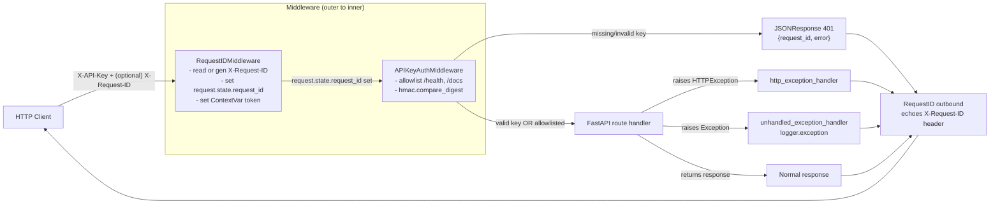

# Phase 1 — Middleware Stack: Architecture Specification

**Project**: RAG API Tier 1 Hardening (v0.1.0)
**Phase**: 1 of 4
**Source plan**: `pm/v0_1_0/development_plan.md` §9 Phase 1
**Targets**: FastAPI 0.115.0 / Starlette 0.38.x (per `docker/requirements.txt`)
**Status**: Ready for Builder

---

## Orchestrator decisions on the architect's open questions

These resolve §11 "Open questions for the orchestrator" so the Builder has a single, unambiguous spec:

1. **`request_id_ctx_var` location** → lives in `rag/observability/logging.py`. The logging subsystem owns the ContextVar; the middleware module imports it. Inverts the import direction, eliminates the lazy import, makes the symbol available to any code path that uses `rag.observability.logging.get_logger` without a circular dependency.
2. **`tests/conftest.py`** → created in Phase 1. The auth middleware otherwise breaks the existing `tests/test_api.py`.
3. **`RAG_API_REQUIRE_AUTH=false` semantics** → fully disables auth at runtime, not just the startup hard-fail. When set to `"false"`, `main.py` skips `app.add_middleware(APIKeyAuthMiddleware, ...)` entirely. Documented as **dev-only**; production deployments must leave it unset (default `"true"`). The startup check still validates that keys are present when auth is required.

These decisions update the spec below — read it as authoritative.

---

## 1. Phase Overview

### Goal
Every HTTP request to the FastAPI app must:
1. Carry a stable `X-Request-ID` (honored if the client supplied one, otherwise generated as a 12-char uuid hex matching `rag.observability.logging.generate_trace_id`).
2. Be authenticated via `X-API-Key` against `RAG_API_KEYS`, with `/health` (and OpenAPI docs paths) as the only allowlisted exceptions.
3. Never leak Python exception details: any uncaught error returns a sanitized `{request_id, error}` body while the full traceback is logged server-side under the same `request_id`.

### Dependencies on previous phases
None. This is Phase 1.

### What this phase delivers
- New package `rag/api/middleware/` with three modules.
- Additive edit to `rag/observability/logging.py` exposing a `ContextVar` + `logging.Filter` that ties log records to the active request.
- Re-wired `rag/api/main.py` lifespan that registers the middleware in the correct order and installs the exception handlers.
- New Pydantic model `SanitizedErrorResponse` in `rag/api/models.py`.
- New `@lru_cache` getter `get_api_keys()` in `rag/api/dependencies.py`.
- New `tests/conftest.py` so existing test suite keeps passing under enforced auth.

### What this phase does NOT do
- Async ingestion (Phase 2)
- Rate limiting / max-upload / path hardening (Phase 3)
- New test files for middleware itself (Phase 4) — only describes the test surface
- Touch anything under `rag/store.py`, `rag/ingestion/`, `rag/retrieval/`, or `clients/streamlit_app.py`. Streamlit imports `rag/` directly and is unaffected by changes confined to `rag/api/`.

---

## 2. Module Specifications

### 2.1 `rag/api/middleware/__init__.py`

Re-exports the public middleware classes and the exception-handler registrar.

```python
from rag.api.middleware.request_id import (
    RequestIDMiddleware,
    REQUEST_ID_HEADER,
)
from rag.api.middleware.auth import (
    APIKeyAuthMiddleware,
    API_KEY_HEADER,
    AUTH_ALLOWLIST,
)
from rag.api.middleware.errors import register_exception_handlers
from rag.observability.logging import (
    request_id_ctx_var,
    get_current_request_id,
)

__all__ = [
    "RequestIDMiddleware",
    "REQUEST_ID_HEADER",
    "request_id_ctx_var",
    "get_current_request_id",
    "APIKeyAuthMiddleware",
    "API_KEY_HEADER",
    "AUTH_ALLOWLIST",
    "register_exception_handlers",
]
```

### 2.2 `rag/api/middleware/request_id.py`

```python
import contextvars
from typing import Awaitable, Callable
from starlette.middleware.base import BaseHTTPMiddleware
from starlette.requests import Request
from starlette.responses import Response
from starlette.types import ASGIApp
from rag.observability.logging import (
    generate_trace_id,
    request_id_ctx_var,
)


REQUEST_ID_HEADER: str = "X-Request-ID"


class RequestIDMiddleware(BaseHTTPMiddleware):
    """Inbound: read or generate X-Request-ID, stash on request.state and
    in the ContextVar. Outbound: echo the same value in the response.
    """

    def __init__(self, app: ASGIApp, *, header_name: str = REQUEST_ID_HEADER) -> None:
        super().__init__(app)
        self.header_name = header_name

    async def dispatch(
        self,
        request: Request,
        call_next: Callable[[Request], Awaitable[Response]],
    ) -> Response:
        ...
```

**Behavioral contract**:
1. Read incoming `header_name` (case-insensitive — Starlette headers are case-insensitive by spec).
2. If present and non-empty (after `.strip()`), use it verbatim. If absent/empty, generate a fresh ID via `generate_trace_id()` (12-char hex).
3. Set `request.state.request_id = request_id`.
4. `token = request_id_ctx_var.set(request_id)`; reset in `finally`.
5. Call `response = await call_next(request)`.
6. Set `response.headers[header_name] = request_id` before returning.
7. Re-raise any exception from `call_next` AFTER ensuring the ContextVar is reset.

**Notes**:
- 12-char hex (not full UUID4) matches `generate_trace_id()` and keeps log lines short.
- Inbound IDs are NOT validated against a regex — clients may pass opaque correlation tokens. Only normalization is `.strip()`.
- This middleware MUST be outermost. See §6.

### 2.3 `rag/api/middleware/auth.py`

```python
import hmac
from typing import Awaitable, Callable, Iterable
from starlette.middleware.base import BaseHTTPMiddleware
from starlette.requests import Request
from starlette.responses import JSONResponse, Response
from starlette.types import ASGIApp
from rag.observability.logging import (
    get_current_request_id,
    get_logger,
)


API_KEY_HEADER: str = "X-API-Key"

AUTH_ALLOWLIST: frozenset[str] = frozenset({
    "/health",
    "/docs",
    "/redoc",
    "/openapi.json",
})


class APIKeyAuthMiddleware(BaseHTTPMiddleware):
    """Reject any non-allowlisted request lacking a valid X-API-Key."""

    def __init__(
        self,
        app: ASGIApp,
        *,
        api_keys: Iterable[str],
        header_name: str = API_KEY_HEADER,
        allowlist: frozenset[str] = AUTH_ALLOWLIST,
    ) -> None:
        super().__init__(app)
        self._keys: tuple[str, ...] = tuple(k for k in api_keys if k)
        self.header_name = header_name
        self.allowlist = allowlist

    async def dispatch(
        self,
        request: Request,
        call_next: Callable[[Request], Awaitable[Response]],
    ) -> Response:
        ...
```

**Behavioral contract**:
1. If `request.url.path` is in `allowlist`, short-circuit: `return await call_next(request)`. No header check, no log line.
2. Otherwise read `request.headers.get(header_name, "")`.
3. If the provided key is empty OR does not match any configured key using `hmac.compare_digest` against each, return:
   - `JSONResponse(status_code=401, content={"request_id": get_current_request_id(), "error": "Invalid or missing API key"})`
   - With the `X-Request-ID` header re-echoed.
4. On success: forward to `call_next`.

**Constant-time comparison** (iterate ALL keys, no short-circuit):
```python
def _matches_any(provided: str, keys: tuple[str, ...]) -> bool:
    provided_b = provided.encode("utf-8")
    matched = False
    for k in keys:
        if hmac.compare_digest(k.encode("utf-8"), provided_b):
            matched = True
    return matched
```

**Logging**:
- Missing header → `logger.warning("auth.missing_header", extra={"stage": "auth.missing_header", "extra_data": {"path": <path>}})`
- Wrong key → `logger.warning("auth.invalid_key", extra={"stage": "auth.invalid_key", "extra_data": {"path": <path>}})`
- Success → no log line.

### 2.4 `rag/api/middleware/errors.py`

```python
from typing import Any
from fastapi import FastAPI, HTTPException
from fastapi.exceptions import RequestValidationError
from starlette.requests import Request
from starlette.responses import JSONResponse
from rag.api.middleware.request_id import REQUEST_ID_HEADER
from rag.observability.logging import (
    get_current_request_id,
    get_logger,
)


GENERIC_500_MESSAGE: str = "Internal server error"


def register_exception_handlers(app: FastAPI) -> None:
    """Install three handlers on `app`:
      1. HTTPException     -> preserve status code, sanitize body
      2. RequestValidationError -> 422 with sanitized body
      3. Exception (catch-all)  -> 500, log traceback, sanitized body

    All responses include `X-Request-ID` header and
    `{"request_id": ..., "error": ...}` body.
    """
    ...


def build_error_response(
    *,
    status_code: int,
    error_message: str,
    request_id: str,
) -> JSONResponse:
    """Construct the canonical sanitized error envelope. PUBLIC so Phase 3
    middleware (rate limit 429, upload size 413) can reuse the same shape.
    """
    return JSONResponse(
        status_code=status_code,
        content={"request_id": request_id, "error": error_message},
        headers={REQUEST_ID_HEADER: request_id},
    )
```

**Handler matrix**:

| Exception type | Status | `error` field value | Log call |
|---|---:|---|---|
| `HTTPException` (status < 500) | preserve | `str(exc.detail)` | `logger.warning` |
| `HTTPException` (status >= 500) | preserve | `GENERIC_500_MESSAGE` | `logger.exception` |
| `RequestValidationError` | 422 | `"Request validation failed"` | `logger.warning` with `errors=exc.errors()` |
| Any other `Exception` | 500 | `GENERIC_500_MESSAGE` | `logger.exception` (with traceback) |

All responses include `X-Request-ID` header (from `request.state.request_id` or `get_current_request_id()` fallback) and `{request_id, error}` body.

### 2.5 Additive edits to `rag/observability/logging.py`

Per orchestrator decision: the ContextVar lives HERE so the middleware imports from logging, not the other way around. Eliminates the import cycle.

**New module-level additions**:

```python
import contextvars

# Active request_id, set by RequestIDMiddleware. Default "-" so log lines
# emitted outside a request (startup, CLI) get a stable sentinel.
request_id_ctx_var: contextvars.ContextVar[str] = (
    contextvars.ContextVar("request_id", default="-")
)


def get_current_request_id() -> str:
    """Return the request_id bound to the current async context, or '-'."""
    return request_id_ctx_var.get()


class RequestIDLogFilter(logging.Filter):
    """Attach the active request_id (from ContextVar) to every record as
    `record.request_id`.
    """

    def filter(self, record: logging.LogRecord) -> bool:
        if not hasattr(record, "request_id"):
            record.request_id = request_id_ctx_var.get()
        return True
```

**Edit to `setup_logging()`**: after attaching the handler, also attach `RequestIDLogFilter()`:

```python
def setup_logging(level: str = "INFO") -> logging.Logger:
    logger = logging.getLogger("rag")
    if logger.handlers:
        return logger

    logger.setLevel(getattr(logging, level.upper(), logging.INFO))

    handler = logging.StreamHandler()
    handler.setFormatter(JSONFormatter())
    handler.addFilter(RequestIDLogFilter())   # ← new line
    logger.addHandler(handler)
    logger.propagate = False

    return logger
```

**Edit to `JSONFormatter.format()`**: emit the `request_id` field when present:

```python
class JSONFormatter(logging.Formatter):
    def format(self, record: logging.LogRecord) -> str:
        log_data = {
            "timestamp": self.formatTime(record, self.datefmt),
            "level": record.levelname,
            "module": record.module,
            "message": record.getMessage(),
        }
        if hasattr(record, "request_id"):       # ← new
            log_data["request_id"] = record.request_id
        if hasattr(record, "trace_id"):
            log_data["trace_id"] = record.trace_id
        if hasattr(record, "stage"):
            log_data["stage"] = record.stage
        if hasattr(record, "latency_ms"):
            log_data["latency_ms"] = record.latency_ms
        if hasattr(record, "extra_data"):
            log_data["data"] = record.extra_data
        return json.dumps(log_data)
```

### 2.6 Additive edit to `rag/api/models.py`

```python
class SanitizedErrorResponse(BaseModel):
    """Canonical error envelope for all 4xx/5xx responses from the API."""

    request_id: str = Field(
        description="Correlation ID matching the X-Request-ID header.",
    )
    error: str = Field(
        description=(
            "Human-readable error category. For 5xx this is always "
            "'Internal server error' — full diagnostics are in server logs "
            "under the same request_id."
        ),
    )
```

The existing `ErrorResponse(BaseModel)` with `detail: str` stays for back-compat. Phase 4 may remove.

### 2.7 Additive edit to `rag/api/dependencies.py`

```python
import os  # add to existing imports

@lru_cache
def get_api_keys() -> tuple[str, ...]:
    """Parse RAG_API_KEYS env var into a tuple of non-empty stripped keys.

    Returns:
        Tuple of keys. Empty tuple if the env var is unset/empty.

    Notes:
        Cached for process lifetime. Tests that need to change keys must
        call `get_api_keys.cache_clear()`.
    """
    raw = os.environ.get("RAG_API_KEYS", "")
    return tuple(k.strip() for k in raw.split(",") if k.strip())
```

### 2.8 New `tests/conftest.py`

Required so the existing `tests/test_api.py` keeps passing once auth is enforced.

```python
"""Shared pytest fixtures for the RAG API test suite."""

import pytest
from fastapi.testclient import TestClient


TEST_API_KEY = "test-key-1"


@pytest.fixture(autouse=True)
def _configure_test_env(monkeypatch):
    """Set RAG_API_KEYS and clear any cached value before each test."""
    monkeypatch.setenv("RAG_API_KEYS", TEST_API_KEY)
    monkeypatch.delenv("RAG_API_REQUIRE_AUTH", raising=False)

    # Bust the lru_cache so the new env value is picked up.
    from rag.api.dependencies import get_api_keys
    get_api_keys.cache_clear()
    yield
    get_api_keys.cache_clear()


@pytest.fixture
def client():
    """TestClient that auto-injects the test API key on every request."""
    from rag.api.main import app
    return TestClient(app, headers={"X-API-Key": TEST_API_KEY})


@pytest.fixture
def unauth_client():
    """TestClient WITHOUT an auth header — for negative tests."""
    from rag.api.main import app
    return TestClient(app)
```

---

## 3. Updated `rag/api/main.py` Skeleton

```python
import os
from contextlib import asynccontextmanager
from pathlib import Path

from fastapi import FastAPI, HTTPException

from rag.api.dependencies import (
    get_api_keys,
    get_config,
    get_embedder_instance,
    get_store,
)
from rag.api.middleware import (
    APIKeyAuthMiddleware,
    RequestIDMiddleware,
    register_exception_handlers,
)
from rag.api.models import (
    ConfigResponse,
    DocumentInfo,
    HealthResponse,
    IngestRequest,
    IngestResponse,
    QueryRequest,
    QueryResponse,
    QueryMetadataResponse,
    SanitizedErrorResponse,
    SourceResponse,
)
# ...existing imports unchanged...
from rag.observability.logging import setup_logging
from rag.observability.tracing import configure_tracing


def _require_auth() -> bool:
    """`RAG_API_REQUIRE_AUTH=false` (case-insensitive) disables auth.
    Any other value (including unset) leaves auth ENABLED.
    """
    return os.environ.get("RAG_API_REQUIRE_AUTH", "true").lower() != "false"


@asynccontextmanager
async def lifespan(app: FastAPI):
    setup_logging()
    config = get_config()
    configure_tracing(config)

    if _require_auth() and not get_api_keys():
        raise RuntimeError(
            "RAG_API_KEYS env var is empty. Set a comma-separated list "
            "of API keys or export RAG_API_REQUIRE_AUTH=false for local dev."
        )
    yield


app = FastAPI(
    title="RAG Docker API",
    description="RAG system for financial PDF reports",
    version="0.1.0",
    lifespan=lifespan,
)

# ───────────────────────────────────────────────────────────────
# Middleware stack — registration order is INVERSE of runtime.
# Last-added is OUTERMOST. RequestID must be outermost so all
# responses (including 401 from auth) get a request_id header.
# ───────────────────────────────────────────────────────────────
if _require_auth():
    app.add_middleware(APIKeyAuthMiddleware, api_keys=get_api_keys())
app.add_middleware(RequestIDMiddleware)

register_exception_handlers(app)

# ...existing route definitions unchanged...
```

**Critical**: `_require_auth()` is evaluated at module import time when used in the conditional `add_middleware` call. Tests that toggle the env var must reload the module OR (preferred) rely on the `unauth_client` fixture only after restarting the process. For Phase 1, that's acceptable.

---

## 4. Data Flow



---

## 5. Middleware Ordering

**Runtime order (outer → inner):**
```
HTTP wire
   ↓
[ RequestIDMiddleware ]      ← outermost
   ↓
[ APIKeyAuthMiddleware ]
   ↓
[ FastAPI router ]
   ↓
route handler
```

**Code order (last-added is outermost):**
```python
app.add_middleware(APIKeyAuthMiddleware, api_keys=...)   # added 1st → innermost
app.add_middleware(RequestIDMiddleware)                   # added 2nd → outermost
```

Convention going forward: **RequestID is always added LAST**. Phase 3 will insert `MaxUploadSizeMiddleware` and `SlowAPIMiddleware` BEFORE the `RequestIDMiddleware` line so RequestID stays outermost.

---

## 6. Configuration

### New environment variables (Phase 1)

| Name | Type | Default | Required? | Validation |
|---|---|---|---|---|
| `RAG_API_KEYS` | comma-separated string | _none_ | Yes (unless `RAG_API_REQUIRE_AUTH=false`) | Parsed by `get_api_keys()` into `tuple[str, ...]`. Empty entries dropped. Empty tuple + auth required → `RuntimeError` at startup. |
| `RAG_API_REQUIRE_AUTH` | `"true"` / `"false"` | `"true"` | No | Lowercased; only literal `"false"` disables auth (skips middleware install AND startup hard-fail). Any other value leaves auth ENABLED — fail-safe default. **Dev-only.** |

No `config/settings.yaml` changes in Phase 1.

---

## 7. Response Shape Changes

### 7.1 New response header — every endpoint

```
X-Request-ID: <12-char-hex or client-supplied value>
```

### 7.2 New error response body — all 4xx/5xx

```json
{
  "request_id": "a1b2c3d4e5f6",
  "error": "<sanitized human-readable category>"
}
```

Replaces the prior `{"detail": "..."}` shape on error paths. **Success-path response bodies unchanged.**

### 7.3 Endpoint impact matrix

| Endpoint | New header | New auth req | New error body |
|---|:---:|:---:|:---:|
| `GET /health` | yes | NO (allowlisted) | yes (if handler raises) |
| `POST /ingest` | yes | yes (401) | yes |
| `POST /query` | yes | yes | yes |
| `GET /documents` | yes | yes | yes |
| `DELETE /documents/{f}` | yes | yes | yes |
| `GET /config` | yes | yes | yes |
| `GET /docs`, `/redoc`, `/openapi.json` | yes | NO (allowlisted) | yes |

**Streamlit impact**: zero. Streamlit talks to `rag/` modules directly, not the API.

---

## 8. Contracts for Downstream Phases

### 8.1 Phase 2 (async ingestion)

**Reading the request_id inside a handler**:
```python
@app.post("/ingest")
def ingest(request: Request, body: IngestRequest, background: BackgroundTasks):
    rid = request.state.request_id
    job_id = registry.create(request_id=rid)
    background.add_task(run_ingestion_job, job_id, body, rid)  # rid passed explicitly
    return {"job_id": job_id, "request_id": rid, ...}
```

**Inside the BackgroundTask body**: ContextVar may NOT propagate through `BackgroundTasks`. Phase 2 runner MUST receive `request_id` as an explicit argument and pass it to `extra={"trace_id": request_id, ...}` in log calls.

**New endpoints**: `/ingest/jobs/{job_id}` is auth-gated by default (no allowlist entry needed). If Phase 2 adds `/metrics` or `/ready` probes that should be public, extend `AUTH_ALLOWLIST` in `rag/api/middleware/auth.py`.

### 8.2 Phase 3 (rate limit / upload cap)

- New middleware MUST be added BEFORE `RequestIDMiddleware` in code order.
- Reuse `build_error_response()` from `rag/api/middleware/errors.py` (public) so 429 and 413 responses use the same envelope shape.
- Wiring template:
  ```python
  app.add_middleware(SlowAPIMiddleware)
  app.add_middleware(MaxUploadSizeMiddleware, ...)
  if _require_auth():
      app.add_middleware(APIKeyAuthMiddleware, api_keys=get_api_keys())
  app.add_middleware(RequestIDMiddleware)   # always last
  ```

### 8.3 Logger usage from new code

- `from rag.observability.logging import get_logger`
- `extra={"trace_id": request_id, "stage": "<phase>.<step>", "extra_data": {...}}`
- `request_id` is auto-attached to records by `RequestIDLogFilter` from the ContextVar. Passing it explicitly as `trace_id` in `extra` is still recommended for code paths outside the request context (e.g. BackgroundTasks).

---

## 9. Test Surface (Phase 4 writes the tests)

### 9.1 `RequestIDMiddleware`

| Test name | Assertion |
|---|---|
| `test_request_id_generated_when_absent` | `X-Request-ID` header present, length 12, hex |
| `test_request_id_echoed_when_present` | response echoes client-supplied value verbatim |
| `test_request_id_stripped` | leading/trailing whitespace removed |
| `test_request_id_propagates_to_handler` | route reads `request.state.request_id` matching header |
| `test_request_id_in_log_record` | captured record's `request_id` matches header |
| `test_context_var_reset_between_requests` | two sequential requests get different rids |
| `test_request_id_present_on_500` | response header AND body match on error path |

### 9.2 `APIKeyAuthMiddleware`

| Test name | Assertion |
|---|---|
| `test_missing_header_returns_401` | 401; sanitized body; `X-Request-ID` header present |
| `test_invalid_key_returns_401` | 401; identical body shape (no enumeration) |
| `test_valid_key_passes` | route returns its normal response |
| `test_health_bypasses_auth` | `GET /health` no header → 200 |
| `test_openapi_bypasses_auth` | `GET /openapi.json` no header → 200 |
| `test_constant_time_runs_all_keys` | with mocked `hmac.compare_digest`, call count == `len(keys)` |
| `test_empty_keys_at_startup_raises` | lifespan raises `RuntimeError` when `RAG_API_KEYS` empty & auth required |
| `test_require_auth_false_skips_middleware` | `RAG_API_REQUIRE_AUTH=false` → all routes 200 without header |

### 9.3 Exception handlers

| Test name | Assertion |
|---|---|
| `test_http_4xx_sanitized` | 404 with sanitized body, `detail` preserved as `error` |
| `test_http_5xx_strips_detail` | 500: detail NOT in response; replaced by GENERIC_500_MESSAGE |
| `test_unhandled_exception_returns_500` | `RuntimeError` → 500 sanitized; traceback in logs |
| `test_validation_error_returns_422` | malformed JSON → 422 with `"Request validation failed"` |
| `test_error_response_includes_request_id_header` | all error responses have matching `X-Request-ID` header & body |

### 9.4 Integration (smoke)

Mirror the plan's §9 Phase 1 test checkpoint commands as TestClient calls.

---

## 10. Files Summary

### To be created (5 files)
1. `rag/api/middleware/__init__.py`
2. `rag/api/middleware/request_id.py`
3. `rag/api/middleware/auth.py`
4. `rag/api/middleware/errors.py`
5. `tests/conftest.py`

### To be modified (4 files)
1. `rag/api/main.py` — wire middleware, register handlers, add startup auth check
2. `rag/api/dependencies.py` — add `get_api_keys()`
3. `rag/api/models.py` — add `SanitizedErrorResponse`
4. `rag/observability/logging.py` — add `request_id_ctx_var`, `get_current_request_id()`, `RequestIDLogFilter`; emit `request_id` field in `JSONFormatter`; attach filter in `setup_logging()`

### Untouched (constraints)
- `clients/streamlit_app.py`, `rag/store.py`, `rag/ingestion/*`, `rag/retrieval/*`, `docker-compose.yaml`, `docker/Dockerfile_API`, `rag/config.py`

---

## 11. Risks

| Risk | Mitigation |
|---|---|
| Circular import between logging and middleware | Resolved: ContextVar lives in `rag/observability/logging.py`. Middleware imports FROM logging. No lazy imports needed. |
| `BackgroundTasks` (Phase 2) breaks ContextVar propagation | Documented in §8.1; Phase 2 runner takes `request_id` as explicit arg. |
| `hmac.compare_digest` raises `TypeError` if operands aren't both `bytes` | `_matches_any` encodes both sides to `bytes` defensively. |
| Existing `tests/test_api.py` fails after Phase 1 | `tests/conftest.py` (Phase 1 deliverable) injects test key + sets `RAG_API_KEYS`. |
| `_require_auth()` evaluated at import time → env-var test toggles need process reload | Acceptable for Phase 1. Phase 4 may revisit if it causes test friction. |
