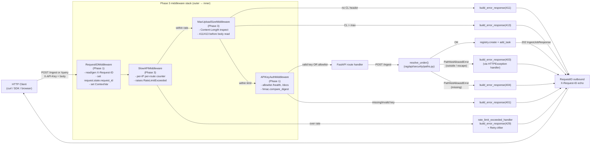
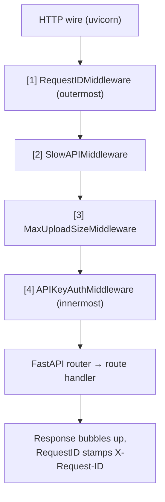

# Phase 3 — Limits and Hardening: Architecture Specification

**Project**: RAG API Tier 1 Hardening (v0.1.0)
**Phase**: 3 of 4
**Source plan**: `pm/v0_1_0/development_plan.md` §9 Phase 3
**Phase 1 contract**: `docs/architecture/phase1_middleware.md` (§5 ordering, §8.2 wiring template)
**Phase 2 contract**: `docs/architecture/phase2_async_ingestion.md` (`POST /ingest` is now async — rate limiter targets submission, not the runner)
**Targets**: FastAPI 0.115.0 / Starlette 0.38.x, Python 3.12, **new dep `slowapi==0.1.9`**
**Intended save path**: `/Users/ramikrispin/Personal/courses/docker-local-ai-11189001/docs/architecture/phase3_limits_hardening.md`
**Status**: Ready for Builder

---

## 1. Phase Overview

### Goal

Add three independent defensive layers on top of the Phase 1+2 stack:

1. **Per-IP rate limiting** via `slowapi` on `/ingest` (low) and `/query` (higher) — 429 responses use the Phase 1 sanitized envelope.
2. **Pre-body upload-size enforcement** via `MaxUploadSizeMiddleware` — returns 413 from `Content-Length` inspection BEFORE FastAPI parses the body or any file lands on disk.
3. **Strict path-traversal hardening** via a new `resolve_under()` helper that confines `source_dir` to a single configured allowed root (default `pdf/`), symlink-resolved.

### Dependencies on previous phases

- **Phase 1**:
  - `build_error_response()` (public) from `rag/api/middleware/errors.py` — reused verbatim for 429, 413, 403, 411 envelopes.
  - `REQUEST_ID_HEADER` constant from `rag/api/middleware/request_id.py` — re-used by the new middleware.
  - `RequestIDMiddleware` must stay outermost (§5 ordering rule). Phase 3 inserts its two new middleware BEFORE the `add_middleware(RequestIDMiddleware)` line so RequestID remains outermost at runtime.
  - The `request.state.request_id` attribute is set by RequestID before any inner middleware runs — `MaxUploadSizeMiddleware` reads from it for the 413 envelope.
- **Phase 2**:
  - `POST /ingest` is the **submission** endpoint that returns 202 in <200 ms. Rate limit applies to this synchronous submission — the background runner (`run_ingestion_job`) is NEVER rate-limited.
  - Phase 2's narrow `source_dir.relative_to(Path.cwd())` check is REPLACED (not extended) by `resolve_under(allowed_root, source_dir)`.
  - The Phase 2 runner already re-globs `source_dir`; that defensive re-check stays.

### What this phase delivers

- New module `rag/api/security/paths.py` — `resolve_under()` symlink-aware validator + `PathNotAllowedError`.
- New module `rag/api/middleware/upload_limit.py` — `MaxUploadSizeMiddleware`.
- New module `rag/api/rate_limit.py` — `slowapi` `Limiter` factory + 429 handler bound to the sanitized envelope.
- New module `rag/api/security/__init__.py` (package marker).
- New `get_upload_settings()` `@lru_cache` singleton in `rag/api/dependencies.py` plus an `UploadSettings` dataclass.
- Updated `rag/api/main.py` middleware stack + `@limiter.limit()` decorators on the two routes + `resolve_under` wired into `/ingest`.
- Updated `rag/api/middleware/__init__.py` to re-export the new symbols.
- Updated `docker/requirements.txt` AND `docker/requirements-api.txt` — `slowapi==0.1.9`.

### What this phase does NOT do

- Streaming responses on `/query` (Tier 2).
- Webhooks, idempotency keys (Tier 3).
- Multi-tenancy / per-tenant collections (Tier 2).
- Distributed rate-limit storage (Redis) (v2 — see §13).
- Writing tests — Phase 4 writes them. The §11 test surface section describes intent.
- Touching `rag/store.py`, `rag/ingestion/*`, `rag/retrieval/*`, `clients/streamlit_app.py`, `notebooks/*`, `docker-compose.yaml`, `docker/Dockerfile_API`.

---

## 2. Module Specifications

### 2.1 `rag/api/security/__init__.py`

```python
from rag.api.security.paths import (
    PathNotAllowedError,
    resolve_under,
)

__all__ = ["PathNotAllowedError", "resolve_under"]
```

**Purpose**: package marker + curated public surface for security helpers.

---

### 2.2 `rag/api/security/paths.py`

**File path rationale**: lives in a new `rag/api/security/` package (sibling of `middleware/` and `jobs/`) because path validation is reusable beyond a single middleware (the route handler calls it directly; future Tier 2 upload endpoints will too). Keeping it out of `middleware/` makes it clear that this is a pure function, not Starlette glue.

**Purpose**: One function that takes a user-supplied path and a configured allowed root, fully resolves both (following symlinks), and verifies the candidate is a real descendant of the root.

**Dependencies**:

```python
from __future__ import annotations
import os
from pathlib import Path
```

**Public API**:

```python
class PathNotAllowedError(ValueError):
    """Raised by resolve_under() when the candidate path resolves
    outside the allowed root, does not exist, or escapes via symlink.
    """

    def __init__(self, candidate: str, allowed_root: str, reason: str) -> None:
        self.candidate = candidate
        self.allowed_root = allowed_root
        self.reason = reason
        super().__init__(
            f"Path '{candidate}' rejected: {reason} "
            f"(allowed root: '{allowed_root}')"
        )


def resolve_under(
    candidate: str | os.PathLike[str],
    allowed_root: str | os.PathLike[str],
    *,
    must_exist: bool = True,
) -> Path:
    """Resolve `candidate` and verify it is a real descendant of
    `allowed_root`, following symlinks on both sides.

    Args:
        candidate: User-supplied path (relative or absolute). If
            relative, resolved against the current working directory
            BEFORE the allowed-root check — callers that want stricter
            behavior should pre-join with `allowed_root` themselves.
        allowed_root: The single directory under which `candidate`
            must resolve. May be absolute or relative; resolved
            against cwd if relative.
        must_exist: If True (default), the resolved candidate AND the
            allowed_root must both exist on disk. If False, only
            allowed_root must exist (candidate may be a future write
            target). Phase 3 always passes `must_exist=True` since
            `/ingest` reads from an existing directory.

    Returns:
        The fully-resolved, absolute, symlink-free Path of the
        candidate. Safe to hand to file-system operations.

    Raises:
        PathNotAllowedError: candidate resolves outside allowed_root,
            does not exist (when `must_exist=True`), or allowed_root
            itself does not exist. Reason field is one of:
              - "allowed_root_missing"
              - "candidate_missing"
              - "outside_allowed_root"
              - "symlink_escapes_root"   (kept distinct for log clarity)
    """
```

**Behavioral contract (algorithm)**:

1. **Resolve allowed root**:
   ```python
   root_resolved = Path(allowed_root).resolve(strict=False)
   if not root_resolved.exists():
       raise PathNotAllowedError(str(candidate), str(allowed_root),
                                  reason="allowed_root_missing")
   root_real = Path(os.path.realpath(root_resolved))  # follow root symlinks
   ```
2. **Resolve candidate**:
   ```python
   candidate_resolved = Path(candidate).resolve(strict=False)
   if must_exist and not candidate_resolved.exists():
       raise PathNotAllowedError(str(candidate), str(allowed_root),
                                  reason="candidate_missing")
   candidate_real = Path(os.path.realpath(candidate_resolved))
   ```
3. **Containment check** — use `os.path.commonpath` instead of `Path.is_relative_to` because `commonpath` is the canonical OS-correct containment primitive and works regardless of `is_relative_to` semantics across Python minor versions:
   ```python
   try:
       common = Path(os.path.commonpath([str(root_real), str(candidate_real)]))
   except ValueError:
       # commonpath raises ValueError on mixed drives / empty (Windows).
       # On POSIX this should not happen; defensive guard.
       raise PathNotAllowedError(str(candidate), str(allowed_root),
                                  reason="outside_allowed_root")
   if common != root_real:
       # Differentiate "outside" vs "symlink escape" for log clarity:
       # if the *unresolved* candidate IS under root but the *resolved*
       # one is not, that's a symlink escape.
       reason = "outside_allowed_root"
       try:
           Path(candidate_resolved).relative_to(root_resolved)
       except ValueError:
           pass
       else:
           reason = "symlink_escapes_root"
       raise PathNotAllowedError(str(candidate), str(allowed_root),
                                  reason=reason)
   return candidate_real
   ```

**Error handling**: only raises `PathNotAllowedError`. Callers (the `/ingest` route) translate that into `HTTPException(403, detail="...")`, which goes through Phase 1's exception handler and lands as the sanitized envelope.

**Edge cases**:

| Input | Behavior |
|---|---|
| `candidate == allowed_root` (the root itself) | `common == root_real` → OK. The root directory is a valid ingest target. |
| `candidate` is a relative path like `"pdf/"` and cwd is project root | Resolves to project-root/pdf — accepted if equal to allowed_root. |
| `candidate` is a symlink at `pdf/etc-link → /etc` | Step 2 resolves to `/etc`; step 3 `commonpath` ≠ root → `symlink_escapes_root`. |
| `candidate == "/etc"` (absolute, outside) | `commonpath` ≠ root → `outside_allowed_root`. |
| `candidate == "pdf/../etc"` (`..` traversal) | `resolve()` normalizes the `..` → `/proj/etc` → outside root → rejected. |
| `allowed_root` does not exist (e.g. typo'd env var) | `allowed_root_missing` — rejected at request time. (Startup banner logs a warning if the dir doesn't exist — see §6.) |
| Both candidate and root are symlinks to the same dir | Both `realpath` to the same target → `common == root_real` → OK. |
| Candidate has trailing slash (`"pdf/"`) | `Path.resolve` strips it; behaves identically to `"pdf"`. |

**Notes**:
- Uses `os.path.realpath` rather than `Path.resolve(strict=True)` for the symlink step because we want the resolution even if any intermediate is a broken symlink; we then check `exists()` separately.
- This function is **synchronous and CPU-bound only** — fast (one or two stat calls). Safe to call from inside an async route without offloading.
- The function never logs — it only raises. The route handler logs via the Phase 1 exception path.

---

### 2.3 `rag/api/middleware/upload_limit.py`

**File path rationale**: lives in `rag/api/middleware/` next to the Phase 1 middleware. Same convention.

**Purpose**: Reject oversized POST/PUT requests aimed at ingestion routes with `413 Payload Too Large` before FastAPI / Starlette parses the body. Uses `Content-Length` header inspection (fast path, fails before any byte hits the app).

**Dependencies**:

```python
from __future__ import annotations
from typing import Awaitable, Callable, Iterable
from starlette.middleware.base import BaseHTTPMiddleware
from starlette.requests import Request
from starlette.responses import Response
from starlette.types import ASGIApp

from rag.api.middleware.errors import build_error_response
from rag.observability.logging import get_current_request_id, get_logger
```

**Module constants**:

```python
DEFAULT_MAX_UPLOAD_MB: int = 50
GUARDED_METHODS: frozenset[str] = frozenset({"POST", "PUT", "PATCH"})
DEFAULT_GUARDED_PATH_PREFIXES: tuple[str, ...] = ("/ingest",)
# /query JSON bodies are tiny — explicitly NOT guarded.
```

**Public class**:

```python
class MaxUploadSizeMiddleware(BaseHTTPMiddleware):
    """Reject POST/PUT/PATCH requests to ingestion routes whose
    Content-Length exceeds `max_bytes`. Returns 413 + sanitized
    envelope BEFORE the request body is read.

    Scope
    -----
    Only requests whose URL path begins with one of `path_prefixes`
    are inspected. Other routes (`/query`, `/health`, `/documents`,
    `/config`, `/ingest/jobs/...`) pass through untouched.

    Missing Content-Length
    ----------------------
    For guarded routes, a missing Content-Length on POST/PUT/PATCH is
    rejected with 411 Length Required. See §3 decision matrix for
    rationale; the short version is: ingestion is JSON-bodied (small,
    well-formed clients always send Content-Length), and ASGI
    receive-side counting would add streaming complexity for a use
    case we deliberately don't support yet (Tier 2 streaming uploads).

    GET / HEAD / DELETE / OPTIONS — never inspected.
    """

    def __init__(
        self,
        app: ASGIApp,
        *,
        max_bytes: int,
        path_prefixes: Iterable[str] = DEFAULT_GUARDED_PATH_PREFIXES,
        guarded_methods: frozenset[str] = GUARDED_METHODS,
    ) -> None:
        super().__init__(app)
        if max_bytes < 1:
            raise ValueError(f"max_bytes must be >= 1, got {max_bytes}")
        self.max_bytes = max_bytes
        # Sort longest-first so a request to /ingest/jobs/X matches /ingest/jobs
        # before /ingest if both were configured (currently only /ingest is).
        self._prefixes: tuple[str, ...] = tuple(
            sorted(set(path_prefixes), key=len, reverse=True)
        )
        self._guarded_methods = guarded_methods

    async def dispatch(
        self,
        request: Request,
        call_next: Callable[[Request], Awaitable[Response]],
    ) -> Response:
        ...
```

**Behavioral contract (algorithm)**:

```python
# 1. Scope filter — bail out fast for anything not in our scope.
if request.method not in self._guarded_methods:
    return await call_next(request)
path = request.url.path
if not any(path == p or path.startswith(p + "/") or path == p
           for p in self._prefixes):
    return await call_next(request)
# NOTE: /ingest exact match guarded; /ingest/jobs and /ingest/jobs/{id}
# also match because they start with "/ingest/". Acceptable: those are
# GET routes (filtered out by method check above). The combination
# (POST/PUT/PATCH AND path under /ingest) is correctly narrow.

# 2. Resolve request_id for the 413 envelope. RequestIDMiddleware is
# OUTERMOST, so request.state.request_id is already set. Fall back to
# the ContextVar (same approach as Phase 1 exception handlers).
request_id: str = (
    getattr(request.state, "request_id", None)
    or get_current_request_id()
)

# 3. Content-Length inspection.
raw_len = request.headers.get("content-length")
logger = get_logger()

if raw_len is None:
    # Decision: reject with 411 Length Required.
    logger.warning(
        "upload_limit.missing_content_length",
        extra={
            "stage": "upload_limit.missing_content_length",
            "extra_data": {"path": path, "method": request.method},
        },
    )
    return build_error_response(
        status_code=411,
        error_message=(
            "Length Required: ingestion requests must include a "
            "Content-Length header."
        ),
        request_id=request_id,
    )

try:
    declared = int(raw_len)
except ValueError:
    logger.warning(
        "upload_limit.invalid_content_length",
        extra={
            "stage": "upload_limit.invalid_content_length",
            "extra_data": {"path": path, "raw": raw_len},
        },
    )
    return build_error_response(
        status_code=400,
        error_message="Invalid Content-Length header.",
        request_id=request_id,
    )

if declared < 0:
    return build_error_response(
        status_code=400,
        error_message="Invalid Content-Length header.",
        request_id=request_id,
    )

if declared > self.max_bytes:
    logger.warning(
        "upload_limit.exceeded",
        extra={
            "stage": "upload_limit.exceeded",
            "extra_data": {
                "path": path,
                "declared_bytes": declared,
                "max_bytes": self.max_bytes,
            },
        },
    )
    return build_error_response(
        status_code=413,
        error_message=(
            f"Payload too large: {declared} bytes exceeds "
            f"the {self.max_bytes}-byte limit."
        ),
        request_id=request_id,
    )

# 4. Within limit — forward.
return await call_next(request)
```

**Error handling**:

| Situation | Status | Envelope `error` field |
|---|---:|---|
| Content-Length missing, guarded route + method | 411 | "Length Required: ingestion requests must include a Content-Length header." |
| Content-Length non-numeric | 400 | "Invalid Content-Length header." |
| Content-Length negative | 400 | "Invalid Content-Length header." |
| Content-Length > max_bytes | 413 | "Payload too large: N bytes exceeds the M-byte limit." |
| Within limit | (pass-through) | — |

All four error responses include the `X-Request-ID` header (set by `build_error_response`) so the client can correlate with logs.

**Notes**:
- Reads `request.headers` — this does NOT consume the body. Starlette parses headers lazily but headers are available without buffering the body.
- Because this middleware sits OUTSIDE the auth middleware (see §5 ordering), a 413 will be returned even for an unauthenticated request. **This is intentional** — there's no reason to buffer 50 MB to then reject for a missing API key. Side benefit: it makes the API a poor target for resource-exhaustion probes.
- 411 is preferred over 400 here because RFC 7231 §6.5.10 explicitly defines `411 Length Required` for "the server refuses to accept the request without a defined Content-Length". This matches the contract exactly.
- The middleware does NOT attempt ASGI receive-side counting (option B in §3). That is deferred to Tier 2 when streaming uploads are introduced.

---

### 2.4 `rag/api/rate_limit.py`

**File path rationale**: top-level under `rag/api/` (not under `middleware/`) because slowapi's `Limiter` is more than just a middleware — it's a stateful object referenced by `@limiter.limit()` decorators on route handlers, by `app.state.limiter`, and by the registered exception handler. Keeping it at one well-known import path (`rag.api.rate_limit.limiter`) keeps the wiring simple.

**Purpose**: Construct the process-wide `Limiter` (in-memory storage), bind it to `app.state.limiter`, and register a 429 handler that emits the Phase 1 sanitized envelope.

**Dependencies**:

```python
from __future__ import annotations
import os
from functools import lru_cache

from fastapi import FastAPI, Request
from slowapi import Limiter
from slowapi.errors import RateLimitExceeded
from slowapi.middleware import SlowAPIMiddleware
from slowapi.util import get_remote_address
from starlette.responses import JSONResponse

from rag.api.middleware.errors import build_error_response
from rag.observability.logging import get_current_request_id, get_logger
```

**Module constants**:

```python
DEFAULT_RATE_LIMIT_INGEST: str = "5/minute"
DEFAULT_RATE_LIMIT_QUERY: str = "30/minute"
ENV_RATE_LIMIT_INGEST: str = "RAG_API_RATE_LIMIT_INGEST"
ENV_RATE_LIMIT_QUERY: str = "RAG_API_RATE_LIMIT_QUERY"
```

**Public API**:

```python
@lru_cache
def get_rate_limit_ingest() -> str:
    return os.environ.get(ENV_RATE_LIMIT_INGEST, DEFAULT_RATE_LIMIT_INGEST).strip() \
           or DEFAULT_RATE_LIMIT_INGEST


@lru_cache
def get_rate_limit_query() -> str:
    return os.environ.get(ENV_RATE_LIMIT_QUERY, DEFAULT_RATE_LIMIT_QUERY).strip() \
           or DEFAULT_RATE_LIMIT_QUERY


# Process-wide singleton. Imported directly by main.py for use in the
# @limiter.limit(...) decorators on the route handlers.
limiter: Limiter = Limiter(
    key_func=get_remote_address,
    default_limits=[],            # no global default; per-route only
    storage_uri="memory://",      # explicit — v1 is single-process
    strategy="fixed-window",      # cheapest; sufficient for v1
    headers_enabled=True,         # emits X-RateLimit-Remaining etc.
)


async def rate_limit_exceeded_handler(
    request: Request, exc: RateLimitExceeded
) -> JSONResponse:
    """Convert slowapi's RateLimitExceeded into our sanitized envelope.

    Preserves the standard `Retry-After` header that slowapi computes,
    while replacing the default plaintext body with `{request_id, error}`.
    """
    request_id: str = (
        getattr(request.state, "request_id", None)
        or get_current_request_id()
    )
    logger = get_logger()
    logger.warning(
        "rate_limit.exceeded",
        extra={
            "stage": "rate_limit.exceeded",
            "extra_data": {
                "path": request.url.path,
                "client": get_remote_address(request),
                "limit": str(exc.detail) if hasattr(exc, "detail") else None,
            },
        },
    )
    response = build_error_response(
        status_code=429,
        error_message=(
            f"Rate limit exceeded: {exc.detail}"
            if getattr(exc, "detail", None)
            else "Rate limit exceeded."
        ),
        request_id=request_id,
    )
    # slowapi attaches a Retry-After header on its default response; we
    # need to mirror that ourselves since we're replacing the response.
    # slowapi >= 0.1.9 sets request.state.view_rate_limit with the limit.
    retry_after = getattr(exc, "retry_after", None)
    if retry_after is not None:
        response.headers["Retry-After"] = str(retry_after)
    return response


def install_rate_limiter(app: FastAPI) -> None:
    """One-call wiring used by main.py. Adds the limiter to app.state,
    installs SlowAPIMiddleware, and registers the 429 exception handler.

    Call BEFORE `app.add_middleware(RequestIDMiddleware)` so RequestID
    remains outermost (Phase 1 §5 contract).
    """
    app.state.limiter = limiter
    app.add_exception_handler(RateLimitExceeded, rate_limit_exceeded_handler)
    app.add_middleware(SlowAPIMiddleware)
```

**Behavioral contract**:
- **Storage**: in-memory, per uvicorn process. Documented single-worker only (matches the in-memory `JobRegistry` from Phase 2; same constraint).
- **Key function**: `slowapi.util.get_remote_address` — uses the immediate peer address. Behind a reverse proxy this collapses all clients to one IP. README will note: "if you put nginx in front, set `X-Forwarded-For` and switch the key_func." (Tier 2 follow-up, matches Phase 1's risk row 7.)
- **Default limits empty**: no global throttle. Only the two decorated routes are limited.
- **`headers_enabled=True`**: clients get `X-RateLimit-Limit`, `X-RateLimit-Remaining`, `X-RateLimit-Reset` headers on every limited route, useful for SDKs.
- **`Retry-After`** preserved on 429 (RFC 7231 §7.1.3).

**Error handling**:
- `RateLimitExceeded` is the only exception this module produces; the registered handler catches it. Any internal slowapi failure (e.g. storage error) propagates to Phase 1's catch-all `Exception` handler → sanitized 500.

**Why a separate handler instead of letting Phase 1's `HTTPException` handler do it**: `RateLimitExceeded` is NOT an `HTTPException` subclass in slowapi (it's a custom exception). The dedicated handler is the cleanest way to keep envelope consistency. The handler still uses `build_error_response` so the body shape is identical to every other error in the API.

---

### 2.5 Additive edit to `rag/api/dependencies.py`

**Add** (one new import, one new dataclass-style settings function):

```python
# Add to existing imports
from dataclasses import dataclass


# Add at bottom of file
DEFAULT_MAX_UPLOAD_MB: int = 50
DEFAULT_ALLOWED_UPLOAD_DIR: str = "pdf/"
ENV_MAX_UPLOAD_MB: str = "RAG_API_MAX_UPLOAD_MB"
ENV_ALLOWED_UPLOAD_DIR: str = "RAG_API_ALLOWED_UPLOAD_DIR"


@dataclass(frozen=True)
class UploadSettings:
    """Resolved upload limits for the running process.

    Attributes:
        max_upload_mb: Maximum aggregate body size for ingestion routes.
            Validated >= 1 at construction.
        max_upload_bytes: Convenience: max_upload_mb * 1024 * 1024.
        allowed_upload_dir: Absolute, resolved path under which all
            `source_dir` values must live. resolve_under() enforces this.
    """
    max_upload_mb: int
    max_upload_bytes: int
    allowed_upload_dir: str   # already resolved to absolute string


@lru_cache
def get_upload_settings() -> UploadSettings:
    """Read RAG_API_MAX_UPLOAD_MB and RAG_API_ALLOWED_UPLOAD_DIR from
    the environment, validate, and return an UploadSettings instance.

    Raises:
        RuntimeError: if either env var is set to an unparseable value,
            so the process fails LOUD at startup (called from lifespan).
    """
    raw_mb = os.environ.get(ENV_MAX_UPLOAD_MB, "").strip()
    if raw_mb:
        try:
            mb = int(raw_mb)
        except ValueError as exc:
            raise RuntimeError(
                f"{ENV_MAX_UPLOAD_MB} must be a positive integer, "
                f"got {raw_mb!r}"
            ) from exc
        if mb < 1:
            raise RuntimeError(
                f"{ENV_MAX_UPLOAD_MB} must be >= 1, got {mb}"
            )
    else:
        mb = DEFAULT_MAX_UPLOAD_MB

    raw_dir = os.environ.get(ENV_ALLOWED_UPLOAD_DIR, "").strip() \
              or DEFAULT_ALLOWED_UPLOAD_DIR
    # Resolve to absolute. We do NOT require it to exist here — the
    # lifespan emits a warning if it doesn't, and resolve_under() will
    # 403 at request time. Keeping the env var stable at startup even
    # if the directory is mounted late is desirable.
    from pathlib import Path
    allowed_abs = str(Path(raw_dir).resolve(strict=False))

    return UploadSettings(
        max_upload_mb=mb,
        max_upload_bytes=mb * 1024 * 1024,
        allowed_upload_dir=allowed_abs,
    )
```

**Notes**:
- `@lru_cache` for process-lifetime caching. Tests call `get_upload_settings.cache_clear()`.
- The function does NOT mutate the file system (no `mkdir`). The orchestrator/operator is responsible for ensuring `RAG_API_ALLOWED_UPLOAD_DIR` exists. The lifespan emits a WARNING log if it doesn't.

---

### 2.6 Updated `rag/api/middleware/__init__.py`

Re-export the new middleware so `main.py` can import everything from one place.

```python
from rag.api.middleware.request_id import RequestIDMiddleware, REQUEST_ID_HEADER
from rag.api.middleware.auth import APIKeyAuthMiddleware, API_KEY_HEADER, AUTH_ALLOWLIST
from rag.api.middleware.errors import register_exception_handlers, build_error_response
from rag.api.middleware.upload_limit import (
    MaxUploadSizeMiddleware,
    DEFAULT_MAX_UPLOAD_MB,
)
from rag.observability.logging import request_id_ctx_var, get_current_request_id

__all__ = [
    "RequestIDMiddleware",
    "REQUEST_ID_HEADER",
    "request_id_ctx_var",
    "get_current_request_id",
    "APIKeyAuthMiddleware",
    "API_KEY_HEADER",
    "AUTH_ALLOWLIST",
    "register_exception_handlers",
    "build_error_response",
    "MaxUploadSizeMiddleware",
    "DEFAULT_MAX_UPLOAD_MB",
]
```

(`build_error_response` is also re-exported now that Phase 3 needs it as a Phase 1 public API — see §8.2 of the Phase 1 spec.)

---

### 2.7 Updated `rag/api/main.py`

Three categories of change:

1. New imports.
2. Middleware stack order — INSERT new middleware BEFORE `RequestIDMiddleware`.
3. Route handlers — `/query` gains `request: Request` first arg + `@limiter.limit(...)`; `/ingest` gains `@limiter.limit(...)` and the new `resolve_under` call replacing the narrow `relative_to` check.

**Skeleton (only the changed lines are annotated `# NEW` / `# CHANGED`)**:

```python
import os
from contextlib import asynccontextmanager
from pathlib import Path

from fastapi import (
    BackgroundTasks, FastAPI, HTTPException, Request, Response, status,
)

from rag.api.dependencies import (
    get_api_keys,
    get_config,
    get_job_registry,
    get_store,
    get_upload_settings,                     # NEW
)
from rag.api.jobs import (
    IngestJobResponse,
    JobRecord,
    JobStatus,
    run_ingestion_job,
)
from rag.api.middleware import (
    APIKeyAuthMiddleware,
    MaxUploadSizeMiddleware,                  # NEW
    RequestIDMiddleware,
    register_exception_handlers,
)
from rag.api.models import (
    ConfigResponse,
    DocumentInfo,
    HealthResponse,
    IngestRequest,
    QueryRequest,
    QueryResponse,
    QueryMetadataResponse,
    SanitizedErrorResponse,
    SourceResponse,
)
from rag.api.rate_limit import (              # NEW
    install_rate_limiter,
    limiter,
    get_rate_limit_ingest,
    get_rate_limit_query,
)
from rag.api.security import (                # NEW
    PathNotAllowedError,
    resolve_under,
)
from rag.observability.logging import get_logger, setup_logging
from rag.observability.tracing import configure_tracing
from rag.retrieval.chain import query_rag


def _require_auth() -> bool:
    return os.environ.get("RAG_API_REQUIRE_AUTH", "true").lower() != "false"


@asynccontextmanager
async def lifespan(app: FastAPI):
    setup_logging()
    config = get_config()
    configure_tracing(config)

    if _require_auth() and not get_api_keys():
        raise RuntimeError(
            "RAG_API_KEYS env var is empty. Set a comma-separated list "
            "of API keys or export RAG_API_REQUIRE_AUTH=false for local dev."
        )

    get_job_registry()

    # NEW — eagerly resolve upload settings so a bad env var fails at startup.
    upload = get_upload_settings()
    logger = get_logger()
    if not Path(upload.allowed_upload_dir).exists():
        logger.warning(
            "startup.allowed_upload_dir_missing",
            extra={
                "stage": "startup.allowed_upload_dir_missing",
                "extra_data": {"path": upload.allowed_upload_dir},
            },
        )
    logger.info(
        "startup.api_limits",
        extra={
            "stage": "startup.api_limits",
            "extra_data": {
                "max_upload_mb": upload.max_upload_mb,
                "allowed_upload_dir": upload.allowed_upload_dir,
                "rate_limit_ingest": get_rate_limit_ingest(),
                "rate_limit_query": get_rate_limit_query(),
            },
        },
    )
    yield


app = FastAPI(
    title="RAG Docker API",
    description="RAG system for financial PDF reports",
    version="0.1.0",
    lifespan=lifespan,
)

# ─── Middleware stack ──────────────────────────────────────────────────────
# Registration order is INVERSE of runtime. LAST-added = OUTERMOST.
# Required runtime order (outer → inner):
#   RequestID  → SlowAPI  → MaxUploadSize  → APIKeyAuth → router
#
# So we register in REVERSE of that. RequestID must always be last so its
# request_id is on request.state by the time any inner middleware (or the
# rate-limit / 413 handlers) tries to read it.

if _require_auth():
    app.add_middleware(APIKeyAuthMiddleware, api_keys=get_api_keys())   # innermost MW
app.add_middleware(                                                      # NEW
    MaxUploadSizeMiddleware,
    max_bytes=get_upload_settings().max_upload_bytes,
)
install_rate_limiter(app)                                                # NEW — adds SlowAPIMiddleware + handler
app.add_middleware(RequestIDMiddleware)                                  # always outermost

register_exception_handlers(app)


# ─── Routes ────────────────────────────────────────────────────────────────

@app.get("/health", response_model=HealthResponse)
def health_check():
    ...  # unchanged from Phase 2


@app.post(
    "/ingest",
    response_model=IngestJobResponse,
    status_code=status.HTTP_202_ACCEPTED,
    responses={
        403: {"model": SanitizedErrorResponse,
              "description": "source_dir outside RAG_API_ALLOWED_UPLOAD_DIR"},
        404: {"model": SanitizedErrorResponse,
              "description": "source_dir not found or contains no PDFs"},
        411: {"model": SanitizedErrorResponse,
              "description": "Content-Length header required"},
        413: {"model": SanitizedErrorResponse,
              "description": "Payload exceeds RAG_API_MAX_UPLOAD_MB"},
        429: {"model": SanitizedErrorResponse,
              "description": "Rate limit exceeded"},
    },
)
@limiter.limit(get_rate_limit_ingest())                                  # NEW
def ingest_documents(
    request: Request,
    body: IngestRequest,
    background_tasks: BackgroundTasks,
    response: Response,
) -> IngestJobResponse:
    """Submit an ingestion job. Returns 202 immediately."""
    request_id: str = request.state.request_id
    upload = get_upload_settings()                                       # NEW

    # ─── CHANGED: tight path check via resolve_under ───────────────────
    try:
        source_dir = resolve_under(
            body.source_dir,
            upload.allowed_upload_dir,
            must_exist=True,
        )
    except PathNotAllowedError as exc:
        # Reason determines status:
        #   candidate_missing → 404
        #   anything else     → 403
        if exc.reason == "candidate_missing":
            raise HTTPException(
                status_code=404,
                detail=f"Source directory not found: {body.source_dir}",
            )
        # allowed_root_missing, outside_allowed_root, symlink_escapes_root
        raise HTTPException(
            status_code=403,
            detail=(
                f"Source directory not allowed: {body.source_dir} "
                f"(must resolve under {upload.allowed_upload_dir})"
            ),
        )

    pdf_files = list(source_dir.glob("*.pdf"))
    if not pdf_files:
        raise HTTPException(
            status_code=404,
            detail=f"No PDF files found in: {source_dir}",
        )

    registry = get_job_registry()
    record = registry.create(
        request_id=request_id,
        source_dir=body.source_dir,
        chunking_method=body.chunking_method,
        chunk_size=body.chunk_size,
        chunk_overlap=body.chunk_overlap,
        keep_tables_intact=body.keep_tables_intact,
    )

    background_tasks.add_task(
        run_ingestion_job,
        record.job_id,
        body,
        request_id,
    )

    poll_url = f"/ingest/jobs/{record.job_id}"
    response.headers["Location"] = poll_url

    return IngestJobResponse(
        job_id=record.job_id,
        request_id=request_id,
        status=record.status,
        poll_url=poll_url,
    )


@app.get("/ingest/jobs/{job_id}", response_model=JobRecord)
def get_ingest_job(job_id: str) -> JobRecord:
    ...  # unchanged from Phase 2


@app.get("/ingest/jobs", response_model=list[JobRecord])
def list_ingest_jobs(limit: int = 50) -> list[JobRecord]:
    ...  # unchanged from Phase 2


@app.post(
    "/query",
    response_model=QueryResponse,
    responses={429: {"model": SanitizedErrorResponse,
                     "description": "Rate limit exceeded"}},
)
@limiter.limit(get_rate_limit_query())                                   # NEW
def query_documents(request: Request, body: QueryRequest):               # CHANGED: added `request: Request`
    """Synchronous query. Rate-limited per-IP via slowapi.

    `request: Request` MUST be the first non-self arg — slowapi's
    decorator introspects the function signature for it.
    """
    config = get_config()
    try:
        response_obj = query_rag(
            question=body.question,
            config=config,
            top_k=body.top_k,
            rerank_method=body.rerank_method,
            chat_provider=body.chat_provider,
        )
    except ValueError as e:
        raise HTTPException(status_code=400, detail=str(e))
    except Exception:
        # Sanitized via Phase 1 catch-all; preserves request_id.
        raise

    sources = [
        SourceResponse(
            file=s.file, page=s.page, section=s.section, excerpt=s.excerpt,
        )
        for s in response_obj.sources
    ]
    metadata = None
    if response_obj.metadata:
        metadata = QueryMetadataResponse(
            provider=response_obj.metadata.provider,
            model=response_obj.metadata.model,
            retrieval_count=response_obj.metadata.retrieval_count,
            latency_ms=response_obj.metadata.latency_ms,
        )
    return QueryResponse(
        answer=response_obj.answer,
        sources=sources,
        metadata=metadata,
    )


@app.get("/documents", response_model=list[DocumentInfo])
def list_documents():
    ...  # unchanged


@app.delete("/documents/{source_file}")
def delete_document(source_file: str):
    ...  # unchanged


@app.get("/config", response_model=ConfigResponse)
def get_configuration():
    ...  # unchanged
```

**Critical points**:

- `/query` previously had signature `def query_documents(request: QueryRequest)` — the parameter named `request` was the **Pydantic body**. slowapi's `@limiter.limit()` requires a parameter of type `starlette.requests.Request` named `request`. We rename the body parameter to `body: QueryRequest` and add a real `request: Request` first arg. **This is a Python-level signature change**, but the HTTP contract for `/query` is unchanged: FastAPI still parses the body from the JSON request, and the field names in the body are identical.
- `/ingest` already has `request: Request` as the first arg (Phase 2). It just gains the `@limiter.limit()` decorator and a different validation block.
- `install_rate_limiter(app)` is called BEFORE `app.add_middleware(RequestIDMiddleware)`. Internally it calls `app.add_middleware(SlowAPIMiddleware)` — so SlowAPI registers earlier than RequestID, making RequestID outermost at runtime. Correct per Phase 1 §5.
- Removed Phase 2's `try/except Exception` that wrapped `query_rag` with `str(e)` leak — Phase 1's catch-all already sanitizes that. The `ValueError → 400` translation stays (it's a legitimate user-facing input error).

---

### 2.8 Updated `docker/requirements.txt` and `docker/requirements-api.txt`

Both files gain one line, pinned exactly:

```
slowapi==0.1.9
```

**Why both files**: `requirements.txt` is what the `python` dev container installs (where uvicorn currently runs); `requirements-api.txt` is the future `Dockerfile_API` container's manifest. Keeping them in sync now removes a paper cut when the Tier 2 lift happens.

**Why `0.1.9`**: latest stable as of 2026-05-28; supports Starlette 0.38.x and FastAPI 0.115.x without warnings. If Builder finds an incompatibility, fall back to `0.1.8`.

---

## 3. Decision Matrix — Missing `Content-Length` on Guarded POST/PUT

| | **Option A: Reject with 411 Length Required** | **Option B: ASGI receive-side counting** |
|---|---|---|
| **HTTP semantics** | RFC 7231 §6.5.10 — explicitly designed for this | Generic 413 / 400 after partial buffering |
| **Implementation complexity** | ~3 lines (read header, branch) | ~30 lines, requires hooking `request._receive` or subclassing the ASGI app; easy to introduce subtle bugs |
| **Memory cost on attack** | Zero — header inspection only | Reads up to max_bytes before erroring (still bounded, but reads do happen) |
| **Latency cost** | One header lookup | One header lookup + per-message accumulator on every receive event |
| **Tier 1 compatibility** | Perfect — current `/ingest` is JSON-bodied; well-formed clients always set Content-Length | Required if we ever accept `Transfer-Encoding: chunked` (we don't, in Tier 1) |
| **Streaming uploads (Tier 2)** | Will need to be revisited when multipart streaming lands | Already in place |
| **Failure mode** | Returns 411 — clearly tells the client what's missing | Returns 413 mid-stream — client may have already sent N bytes |

**Decision**: **Option A — reject with 411 Length Required.**

**Rationale**:
1. Tier 1 `/ingest` accepts a small JSON body (`{"source_dir": "...", "chunking_method": "...", ...}`). Every realistic client (curl, httpx, requests, SDKs) sets Content-Length automatically. Missing it is either a malformed client or a deliberate probe.
2. 411 is the precise RFC code for the situation. We're not making up semantics.
3. Implementation is 3 lines instead of 30; fewer lines to test in Phase 4.
4. When Tier 2 introduces multipart streaming uploads, we'll add a new middleware (or extend this one) that wraps ASGI receive. The Phase 3 middleware shape leaves room for that — the `dispatch` method is the only place that branches.
5. Side effect: 411 also catches malicious chunked-encoding-only requests at the door, which is a small security plus.

**Documented for Builder**: the `MaxUploadSizeMiddleware` docstring (§2.3) cites this decision explicitly so future readers don't re-litigate.

---

## 4. Data Flow



---

## 5. Middleware Ordering — Full Phase 3 Stack



**Code registration order** (last-added = outermost — INVERSE of runtime):

```python
# innermost first
if _require_auth():
    app.add_middleware(APIKeyAuthMiddleware, api_keys=get_api_keys())
app.add_middleware(MaxUploadSizeMiddleware, max_bytes=...)
install_rate_limiter(app)       # internally: app.add_middleware(SlowAPIMiddleware)
app.add_middleware(RequestIDMiddleware)  # added LAST → outermost
```

**Why this order**:

| Position | Middleware | Why here |
|---:|---|---|
| 1 (outer) | RequestIDMiddleware | Every response — including 401/411/413/429 from any inner middleware — must carry `X-Request-ID`. It must be the OUTERMOST so it's the last to write headers. Also sets `request.state.request_id` before anything inner runs. |
| 2 | SlowAPIMiddleware | Rate-limit before doing any auth/body work — burns the least CPU on a misbehaving client. Sees the request_id via `request.state` (RequestID already ran). |
| 3 | MaxUploadSizeMiddleware | Rejects huge bodies before auth — no point validating an API key on a request we're about to drop for size. Reads Content-Length header only; no body consumption. |
| 4 (inner) | APIKeyAuthMiddleware | Authenticates last among middleware. By this point we know the request is small enough, the client isn't rate-limited, and we have a request_id. |
| (handler) | route handler | `resolve_under()` runs inside the `/ingest` handler. |

**Confirmed: 413 from `MaxUploadSizeMiddleware` carries `X-Request-ID`** because:
- `RequestIDMiddleware` runs FIRST at request time and sets `request.state.request_id` before the inner middleware chain.
- `MaxUploadSizeMiddleware` reads `request.state.request_id` (with `get_current_request_id()` fallback) and passes it to `build_error_response`, which sets the header.
- When the 413 `JSONResponse` bubbles back out through `RequestIDMiddleware`'s `dispatch`, the `response.headers[self.header_name] = request_id` line re-writes (or confirms) the header. Net result: the client sees `X-Request-ID` on the 413 response.

Same chain holds for 411, 429, 401, 403, 404.

---

## 6. Configuration — New Environment Variables

| Name | Type | Default | Required? | Validation | Read by |
|---|---|---|---|---|---|
| `RAG_API_MAX_UPLOAD_MB` | int (string) | `50` | No | Parsed by `get_upload_settings()`. `>= 1`. Non-integer or `< 1` → `RuntimeError` at startup (in `lifespan`). | `MaxUploadSizeMiddleware`, `lifespan` startup banner |
| `RAG_API_ALLOWED_UPLOAD_DIR` | string (path) | `pdf/` | No | Resolved to absolute path at startup. Existence NOT enforced at startup (logged WARN if missing); enforced at request time by `resolve_under()` → 403. | `/ingest` handler (via `resolve_under`), startup banner |
| `RAG_API_RATE_LIMIT_INGEST` | slowapi rate string | `5/minute` | No | Parsed by slowapi at decorator-evaluation time. Invalid string → `ValueError` from slowapi at import; surfaces as startup failure (acceptable — fails loud). | `@limiter.limit(...)` on `POST /ingest` |
| `RAG_API_RATE_LIMIT_QUERY` | slowapi rate string | `30/minute` | No | Same as above. | `@limiter.limit(...)` on `POST /query` |

**Defaults rationale**:
- `50` MB upload — bigger than any realistic single 10-Q (~5–15 MB) but well below the buffer cliff. Operators can lower for stricter environments via env.
- `pdf/` (project-relative) — matches the existing repo layout (`pdf/form-10-q.pdf`, `pdf/GOOG-10-Q-Q1-2026.pdf`, etc.). When the team lifts the API into `docker/Dockerfile_API`, they'll override this to `/app/pdf/` via compose env.
- `5/minute` for `/ingest` — ingestion is expensive (CPU, OpenAI tokens); 1 every 12 s is generous for a human and tight enough to keep accidental loops from running up cost.
- `30/minute` for `/query` — interactive Q&A pace, well above human throughput, low enough to flag scripted abuse.

**No `config/settings.yaml` changes in Phase 3** — pure env-var configuration. Matches Phase 2 convention.

**Lifespan startup banner** (already in §2.7) logs all four resolved values at INFO with `stage="startup.api_limits"`, so operators see the effective configuration in one log line.

---

## 7. Interface Contracts (Component Boundaries)

### 7.1 `resolve_under` ↔ caller (`/ingest` handler)

| | |
|---|---|
| **Input** | `candidate: str | PathLike`, `allowed_root: str | PathLike`, kw-only `must_exist: bool = True` |
| **Output** | `Path` (absolute, symlink-resolved) — safe for downstream filesystem ops |
| **Raises** | `PathNotAllowedError` with `reason ∈ {"allowed_root_missing", "candidate_missing", "outside_allowed_root", "symlink_escapes_root"}` |
| **Side effects** | None (pure function; stat-calls only) |
| **Caller responsibility** | Translate `reason` into HTTP status (404 for `candidate_missing`, 403 for the rest) and raise `HTTPException` so Phase 1's handler emits the sanitized envelope |

### 7.2 `MaxUploadSizeMiddleware` ↔ ASGI / next middleware

| | |
|---|---|
| **Input** | Starlette `Request`, `call_next` coroutine |
| **Output** | `Response` (either a short-circuit 411/413/400 from `build_error_response`, or the inner response unchanged) |
| **Raises** | Never (errors converted to responses) |
| **Side effects** | Emits log lines at WARNING level under stages `upload_limit.{missing_content_length, invalid_content_length, exceeded}`; consumes the `request.state.request_id` set by RequestIDMiddleware |
| **Body consumption** | **None** — headers only |
| **Headers added to response** | `X-Request-ID` (via `build_error_response`) |

### 7.3 SlowAPI + `rate_limit_exceeded_handler` ↔ FastAPI

| | |
|---|---|
| **Input to handler** | Starlette `Request`, `RateLimitExceeded` exception |
| **Output** | `JSONResponse` (status 429, `{request_id, error}`, `X-Request-ID` header, `Retry-After` header) |
| **Raises** | Never |
| **Side effects** | Emits WARN log under stage `rate_limit.exceeded` with `path`, `client`, `limit` fields |
| **Storage** | In-memory only (per process); explicitly `storage_uri="memory://"` |

### 7.4 `get_upload_settings` ↔ callers

| | |
|---|---|
| **Input** | None (reads env) |
| **Output** | `UploadSettings(max_upload_mb, max_upload_bytes, allowed_upload_dir)` |
| **Raises** | `RuntimeError` on unparseable env values (only at first call — `@lru_cache` swallows subsequent calls) |
| **Side effects** | None on filesystem; reads env once per process |
| **Cache invalidation** | `get_upload_settings.cache_clear()` — tests only |

### 7.5 `request.state.request_id` flow across the new middleware

| Stage | Read by | Set by | Fallback |
|---|---|---|---|
| Inbound to MaxUploadSize | `MaxUploadSizeMiddleware` | RequestIDMiddleware (outer) | `get_current_request_id()` (ContextVar, also set by RequestID) |
| Inbound to SlowAPI handler | `rate_limit_exceeded_handler` | RequestIDMiddleware | `get_current_request_id()` |
| Inbound to /ingest | `ingest_documents` route | RequestIDMiddleware | n/a (always present at this depth) |
| Outbound on any error response | `RequestIDMiddleware.dispatch` final line — writes `response.headers[header_name] = request_id` | — | — |

---

## 8. API Contract Changes (vs. End of Phase 2)

### 8.1 `POST /ingest`

| Aspect | Phase 2 | Phase 3 |
|---|---|---|
| Success status | `202 Accepted` | `202 Accepted` (unchanged) |
| Success body | `IngestJobResponse{job_id, request_id, status, poll_url}` | unchanged |
| `Location` header | `/ingest/jobs/{job_id}` | unchanged |
| `X-Request-ID` header | yes | unchanged |
| **NEW** `X-RateLimit-Limit`, `X-RateLimit-Remaining`, `X-RateLimit-Reset` | — | yes (slowapi `headers_enabled=True`) |
| 401 — missing/invalid API key | yes | unchanged |
| 403 — path outside project | `source_dir` outside cwd | **CHANGED**: `source_dir` outside `RAG_API_ALLOWED_UPLOAD_DIR`; covers symlink escape AND `..` traversal AND absolute paths |
| 404 — missing dir / no PDFs | yes | unchanged (handler distinguishes via `PathNotAllowedError.reason`) |
| **NEW** 411 — Content-Length required | — | yes (from `MaxUploadSizeMiddleware`) |
| **NEW** 413 — Payload too large | — | yes (from `MaxUploadSizeMiddleware`) |
| **NEW** 429 — Rate limit exceeded | — | yes (5/minute default); includes `Retry-After` |
| 422 — body validation failure | yes | unchanged |
| 500 — sanitized | yes | unchanged |

### 8.2 `POST /query`

| Aspect | Phase 2 | Phase 3 |
|---|---|---|
| Success status / body | `200` + `QueryResponse` | unchanged |
| `X-Request-ID` header | yes | unchanged |
| **NEW** `X-RateLimit-*` headers | — | yes |
| 400 — invalid input | yes (via `ValueError`) | unchanged |
| 401 — missing API key | yes | unchanged |
| **NEW** 429 — Rate limit exceeded | — | yes (30/minute default); includes `Retry-After` |
| 500 — sanitized | yes (via Phase 1 catch-all) | unchanged (the manual `f"Query failed: {str(e)}"` raise from Phase 2 is REMOVED — let the catch-all handle it without leaking `str(e)`) |
| **Handler signature** | `def query_documents(request: QueryRequest)` | **CHANGED**: `def query_documents(request: Request, body: QueryRequest)` — the body parameter is renamed `request → body`. Wire-level request body is unchanged. |

### 8.3 Other endpoints

- `GET /health`, `GET /documents`, `DELETE /documents/{f}`, `GET /config`, `GET /ingest/jobs/{job_id}`, `GET /ingest/jobs` — **unchanged in Phase 3**. Not rate-limited. Not upload-size-limited. Auth-gated (or allowlisted) as in Phase 1.

### 8.4 New response headers — every limited route

```
X-RateLimit-Limit: 5
X-RateLimit-Remaining: 4
X-RateLimit-Reset: 1717920000
Retry-After: 42        # only on 429 responses
```

(plus `X-Request-ID`, already shipped in Phase 1).

### 8.5 New error envelopes — body shapes

All identical Phase 1 shape (`{request_id, error}`), only `error` text changes per case:

```json
// 411
{"request_id": "a1b2c3d4e5f6", "error": "Length Required: ingestion requests must include a Content-Length header."}

// 413
{"request_id": "a1b2c3d4e5f6", "error": "Payload too large: 104857600 bytes exceeds the 52428800-byte limit."}

// 429
{"request_id": "a1b2c3d4e5f6", "error": "Rate limit exceeded: 5 per 1 minute"}

// 403 (path)
{"request_id": "a1b2c3d4e5f6", "error": "Source directory not allowed: /etc (must resolve under /workspace/pdf)"}
```

---

## 9. Streamlit + Notebooks — Migration Notes (Zero Impact)

**Streamlit (`clients/streamlit_app.py`)**:
- Imports from `rag.ingestion.*`, `rag.store.ChromaStore`, `rag.retrieval.chain.query_rag` directly. Confirmed: never goes through the API. None of these modules are modified in Phase 3. Streamlit keeps working unchanged.
- Streamlit-ingested files via its `tempfile.NamedTemporaryFile` path go through the engine directly. They never touch `resolve_under()` or `MaxUploadSizeMiddleware`. **Verify after build**: `bash clients/run_streamlit.sh` followed by uploading a PDF still ingests.

**Notebooks (`notebooks/*`)**:
- Use `rag/` engine directly. No API client. Confirmed unchanged.

**Tests (`tests/test_api.py`)**:
- Existing tests hit the TestClient with `X-API-Key` (Phase 1 conftest). The `TestClient` uses an in-memory ASGI transport — `Content-Length` is computed automatically by httpx (TestClient's underlying transport) on every request body it sends, so no test breaks from the 411 rule.
- Existing tests submitting `source_dir="pdf/"` continue to work IF `RAG_API_ALLOWED_UPLOAD_DIR` is unset (default is `pdf/`). The Phase 1 `tests/conftest.py` should set `RAG_API_ALLOWED_UPLOAD_DIR=pdf/` (or leave it unset and rely on default) — Phase 4 conftest edit.
- The `resolve_under` check is stricter than Phase 2's `relative_to(Path.cwd())`. If any existing test passes `source_dir` outside `pdf/` (e.g. an absolute `/workspace/pdf/`), it will now 403. **Phase 4 must audit existing test inputs.**

---

## 10. Future Migration Path — Redis-Backed Rate Limiting (v2)

The single-process in-memory `Limiter` is identical-shape to a Redis-backed one. The v2 swap is one line:

```python
# v1 (Phase 3)
limiter: Limiter = Limiter(
    key_func=get_remote_address,
    storage_uri="memory://",
    ...
)

# v2 — multi-worker / multi-container
limiter: Limiter = Limiter(
    key_func=get_remote_address,
    storage_uri=os.environ.get("RAG_API_RATE_STORAGE", "redis://redis:6379/0"),
    ...
)
```

slowapi's storage backend is pluggable via the `limits` library (`memory://`, `redis://`, `memcached://`, `mongodb://`). The decorator API and the `RateLimitExceeded` exception are identical across backends, so:
- `install_rate_limiter()` — unchanged.
- `rate_limit_exceeded_handler` — unchanged.
- `@limiter.limit(...)` decorators on routes — unchanged.
- `MaxUploadSizeMiddleware` — unchanged (still in-process; size enforcement doesn't need shared state).
- `resolve_under` — unchanged (pure function).

**What changes when v2 lands**:
- Add `redis` to `docker-compose.yaml` (or use the existing one if added for Celery).
- New env var `RAG_API_RATE_STORAGE` (default `memory://` for backward compat).
- Update README "Running the API" section to mention the new env var.

**What does NOT change**: the contract, the envelope shape, the routes, the middleware ordering. The change is entirely operational.

The in-memory `JobRegistry` (Phase 2) has the SAME v2 trigger as the in-memory rate limiter; both go to Redis together. Documented in Phase 2 §12.

---

## 11. Test Surface (Phase 4 Writes the Tests)

### 11.1 `tests/test_security.py` — `resolve_under` unit tests

| Test | Assertion |
|---|---|
| `test_resolve_under_accepts_root_itself` | `resolve_under("pdf/", "pdf/")` returns abs path of pdf/, no raise |
| `test_resolve_under_accepts_descendant` | `resolve_under("pdf/sub/", "pdf/")` (with tmp_path-created sub) returns descendant abs path |
| `test_resolve_under_rejects_absolute_outside` | `resolve_under("/etc", "pdf/")` → `PathNotAllowedError(reason="outside_allowed_root")` |
| `test_resolve_under_rejects_dotdot_escape` | `resolve_under("pdf/../etc", "pdf/")` → rejected |
| `test_resolve_under_rejects_symlink_escape` | `tmp_path/pdf/link → /etc`; resolve → `reason="symlink_escapes_root"` |
| `test_resolve_under_accepts_symlink_within` | symlink inside pdf/ pointing to another dir inside pdf/ → accepted |
| `test_resolve_under_missing_candidate` | `must_exist=True` + non-existent path → `reason="candidate_missing"` |
| `test_resolve_under_missing_root` | non-existent allowed_root → `reason="allowed_root_missing"` |
| `test_resolve_under_returns_realpath` | Symlink-resolution: returned Path is realpath, not the input |

### 11.2 `tests/test_security.py` — `MaxUploadSizeMiddleware` integration

(via `TestClient`, with a small max set per-test)

| Test | Assertion |
|---|---|
| `test_413_on_oversize_content_length` | POST /ingest with Content-Length=10MB, max=1MB → 413 sanitized envelope |
| `test_413_includes_request_id_header` | 413 response has `X-Request-ID` matching body's `request_id` |
| `test_411_when_content_length_missing_on_post` | manual httpx request without Content-Length → 411 |
| `test_400_on_invalid_content_length` | header value `"abc"` → 400 |
| `test_within_limit_passes_through` | small JSON body → 202 (or further validation) |
| `test_query_route_not_size_guarded` | POST /query with declared body size > max → still 200/400 (NOT 413) |
| `test_get_documents_not_size_guarded` | GET routes always pass through |
| `test_413_before_auth` | POST /ingest with no API key + oversized → 413 (NOT 401) |

### 11.3 `tests/test_security.py` — Rate-limit integration

| Test | Assertion |
|---|---|
| `test_query_429_on_burst` | Override env to `RAG_API_RATE_LIMIT_QUERY="2/minute"`; 3 calls → 200, 200, 429 |
| `test_ingest_429_on_burst` | Override `RAG_API_RATE_LIMIT_INGEST="2/minute"`; 3 calls → 202, 202, 429 |
| `test_429_envelope_shape` | 429 body has `request_id` + `error`; no slowapi default plaintext |
| `test_429_has_retry_after_header` | `Retry-After` header present, numeric |
| `test_429_has_request_id_header` | `X-Request-ID` present, matches body |
| `test_other_routes_not_rate_limited` | `/health`, `/documents`, `/config`, `/ingest/jobs/{id}` — 100 calls each, all succeed |
| `test_rate_limit_per_ip_independent` | (limited usefulness in TestClient — single client IP; document as "covered by manual integration test in §11.5") |

### 11.4 `tests/test_security.py` — Path hardening at `/ingest`

| Test | Assertion |
|---|---|
| `test_ingest_path_outside_allowed_403` | `source_dir="/etc"` → 403 sanitized |
| `test_ingest_path_symlink_escape_403` | tmp_path with symlink → 403 |
| `test_ingest_path_dotdot_403` | `source_dir="pdf/../etc"` → 403 |
| `test_ingest_path_missing_404` | path under allowed root but non-existent → 404 |
| `test_ingest_path_empty_dir_404` | exists but no PDFs → 404 |
| `test_ingest_path_valid_202` | `source_dir="pdf/"` (default allowed) → 202 |

### 11.5 Manual integration smoke (matches plan §9 Phase 3 checkpoint)

The Builder runs the curl block from plan §9 Phase 3 after `pytest` is green. Not codified as a pytest test, but documented in `tests/TEST_INDEX.md` Phase 4 update.

### 11.6 Out of scope for Phase 4 tests

- Multi-IP rate-limit isolation (TestClient is single-IP).
- ASGI receive-side counting (we chose Option A; no streaming test).
- Concurrent rate-limit storage races (in-memory, single-process is correct by construction).
- Streamlit / notebook smoke (separate manual checklist).

---

## 12. Risks

| # | Risk | Likelihood | Impact | Mitigation |
|---|---|---|---|---|
| 1 | slowapi pin `0.1.9` incompatible with Starlette 0.38 | Low | Med | If `pip install` fails, fall back to `0.1.8`. Phase 4 acceptance gate is `pytest` green. |
| 2 | `@limiter.limit(...)` decorator evaluated at module import → `get_rate_limit_ingest()` reads env at import-time | Med | Low | The lru_cache means it's read once; tests need `monkeypatch` + cache clear + app reload. Documented in Phase 4 conftest pattern. |
| 3 | Path resolution + `os.path.realpath` performance on every `/ingest` | Low | Low | Two stat calls — sub-millisecond. Phase 2 latency budget unaffected. |
| 4 | `MaxUploadSizeMiddleware` 411 on legitimate clients that use `Transfer-Encoding: chunked` without `Content-Length` | Low | Med | Tier 1 clients (curl, httpx, requests) all set `Content-Length` for byte-stringed bodies. Documented limitation in README; chunked uploads land in Tier 2. |
| 5 | Behind a reverse proxy, all clients collapse to one IP under `get_remote_address` → rate limit shared | Med (Tier 2) | Med | Plan §13 already flags this. README will add "set `X-Forwarded-For` + use `get_ipaddr` when proxied". v1 deployment is direct-uvicorn — not a v1 issue. |
| 6 | Default `RAG_API_ALLOWED_UPLOAD_DIR="pdf/"` is project-relative — if uvicorn launched from elsewhere, resolves wrong | Low | Med | `lifespan` logs the resolved absolute path at startup so operators see it immediately. Production deployments override via env. |
| 7 | `/query` signature change (`request: QueryRequest` → `request: Request, body: QueryRequest`) breaks any out-of-tree subclass | Low | Low | The HTTP wire contract is identical. Pure Python-level break; no external consumer was documented. |
| 8 | Phase 1 `tests/conftest.py` doesn't reset `slowapi`'s in-memory counter between tests → flaky rate-limit tests | Med | Med | Phase 4 conftest must clear `limiter._storage` (or rebuild via `monkeypatch` + reload) between rate-limit tests. Documented in test surface §11.3. |
| 9 | `MaxUploadSizeMiddleware` runs before auth → exposes our max-upload value to anonymous attackers | Low | Low | Acceptable trade-off: response message includes the limit ("exceeds the 52428800-byte limit"). Operators concerned about info-leak can configure a generic error message via a future env var. Not in v1 scope. |
| 10 | Rate limit `5/minute` on `/ingest` may be too tight for legitimate bulk-ingest scripts | Low | Low | Env var override exists. README will show how to raise it for trusted environments. |

---

## 13. Files Summary

### To be created (4 files)
1. `rag/api/security/__init__.py` — package marker + re-exports.
2. `rag/api/security/paths.py` — `resolve_under()`, `PathNotAllowedError`.
3. `rag/api/middleware/upload_limit.py` — `MaxUploadSizeMiddleware`.
4. `rag/api/rate_limit.py` — `limiter`, `install_rate_limiter`, `rate_limit_exceeded_handler`, env getters.

### To be modified (5 files)
1. `rag/api/main.py` — new imports; middleware stack expanded in correct order; `@limiter.limit()` on `/ingest` and `/query`; `/ingest` validation block replaced with `resolve_under()`; `/query` signature gains `request: Request`; lifespan eagerly calls `get_upload_settings()` and logs the limits banner; removes the leaky `f"Query failed: {str(e)}"` Phase 2 catch.
2. `rag/api/dependencies.py` — add `UploadSettings` dataclass and `get_upload_settings()` `@lru_cache`.
3. `rag/api/middleware/__init__.py` — re-export `MaxUploadSizeMiddleware`, `DEFAULT_MAX_UPLOAD_MB`, `build_error_response`.
4. `docker/requirements.txt` — add `slowapi==0.1.9`.
5. `docker/requirements-api.txt` — add `slowapi==0.1.9`.

### Untouched (constraints)
- `clients/streamlit_app.py`, `notebooks/*` — bypass the API.
- `rag/store.py`, `rag/ingestion/*`, `rag/retrieval/*` — engine.
- `rag/api/jobs/*` — Phase 2 contract is intact.
- `rag/api/middleware/request_id.py`, `rag/api/middleware/auth.py`, `rag/api/middleware/errors.py` — Phase 1 contracts intact.
- `rag/api/models.py` — no symbol changes (the new sanitized 411/413/429 bodies all use the existing `SanitizedErrorResponse`).
- `rag/observability/logging.py` — Phase 1 + 2 contract is sufficient.
- `config/settings.yaml` — no API config block in Phase 3 (env-only).
- `docker-compose.yaml`, `docker/Dockerfile_API` — Tier 2 lift.

---

## 14. Open Questions for the Orchestrator

1. **slowapi version pin** — spec pins `slowapi==0.1.9`. If the dev container's resolver picks a conflicting transitive (`limits` library), is it OK to bump to `>=0.1.9,<0.2`? **Recommend: pin exactly; flex only if build breaks.**
2. **411 vs. ASGI receive-side counting** — spec recommends 411 (Option A). Confirm this matches the orchestrator's intent? The Phase 3 ask explicitly says "pick one and document" — Option A is documented above with full rationale. **Recommend: confirm Option A; revisit in Tier 2 when streaming lands.**
3. **`RAG_API_ALLOWED_UPLOAD_DIR` default** — spec uses `pdf/` to match the existing repo layout. The plan §8 originally proposed `/workspace/uploads`. The repo currently has PDFs in `pdf/`, not `uploads/`. **Recommend: ship as `pdf/`; document the future container-time override (`/app/pdf/` when Dockerfile_API is lifted).** If the orchestrator prefers `uploads/`, Phase 3 also needs to add an `uploads/` directory to the repo.
4. **Rate-limit defaults** — `5/minute` ingest / `30/minute` query. Reasonable for a single-developer dev container; very tight for any team usage. Confirm or adjust before Phase 4 documentation locks them into the README.
5. **`MaxUploadSizeMiddleware` info leak** — the 413 message currently includes the exact byte limit ("exceeds the 52428800-byte limit"). Some orgs prefer a generic "Payload too large." with no number. **Recommend: keep the precise number for developer ergonomics in v1; add an env-var toggle in Tier 2 if a real customer asks.**
6. **`/query` signature change is a Python-level break** — current callers using FastAPI `TestClient(...).post("/query", json={...})` are unaffected (wire-level body unchanged). Any out-of-tree code that imported `query_documents` as a callable will break. The repo has no such consumer. **Recommend: ship; document in Phase 4 README "Migrating to Phase 3".**
7. **Rate-limit headers on non-limited routes** — slowapi `headers_enabled=True` only adds the headers on routes with a `@limiter.limit()` decorator. `/health`, `/documents`, etc. remain header-free. Confirm desired behavior — alternative is to add a no-op `@limiter.limit("10000/second")` to all routes for header uniformity. **Recommend: leave as-is; the current behavior is the slowapi default and is fine.**

---

## Summary for the orchestrator

**Architecture spec target save path** (this agent does not have a Write tool — orchestrator to persist):
`/Users/ramikrispin/Personal/courses/docker-local-ai-11189001/docs/architecture/phase3_limits_hardening.md`

**New files (4)**: `rag/api/security/{__init__.py, paths.py}`, `rag/api/middleware/upload_limit.py`, `rag/api/rate_limit.py`.

**Modified files (5)**: `rag/api/main.py` (middleware stack, decorators, `resolve_under` wiring, `/query` signature), `rag/api/dependencies.py` (`UploadSettings` + `get_upload_settings`), `rag/api/middleware/__init__.py` (re-exports), `docker/requirements.txt` and `docker/requirements-api.txt` (`slowapi==0.1.9`).

**Middleware stack runtime order after Phase 3** (outer → inner):
`RequestIDMiddleware → SlowAPIMiddleware → MaxUploadSizeMiddleware → APIKeyAuthMiddleware → FastAPI router → route handler` — with `resolve_under()` called inside the `/ingest` handler. RequestID stays outermost (Phase 1 §5 contract preserved).

**Four new env vars + defaults**:
- `RAG_API_MAX_UPLOAD_MB` = `50`
- `RAG_API_ALLOWED_UPLOAD_DIR` = `pdf/` (project-relative; resolved absolute at startup)
- `RAG_API_RATE_LIMIT_INGEST` = `5/minute`
- `RAG_API_RATE_LIMIT_QUERY` = `30/minute`

**Content-Length decision**: **Option A — reject with 411 Length Required** when Content-Length is missing on a guarded POST/PUT/PATCH to an ingestion route. Rationale: RFC 7231 §6.5.10 fits exactly; ingestion bodies are small JSON (all real clients set the header); 3-line implementation vs. 30 for ASGI receive-side counting; Tier 2 streaming-upload work will revisit this when needed.

**Open questions (most material)**: (Q2) confirm Option A is acceptable; (Q3) confirm default `RAG_API_ALLOWED_UPLOAD_DIR=pdf/` over plan-§8's `/workspace/uploads`; (Q4) confirm rate-limit defaults before Phase 4 docs lock them. The rest (Q1, Q5–Q7) are minor and have recommendations attached.

**Risk highlights**: slowapi version pin compatibility (Q1, mitigated by Phase 4 acceptance gate); slowapi in-memory counter not reset between tests (test infra concern for Phase 4); Phase 2 path validation tightened — existing test inputs may need audit (Phase 4 conftest).
---

## 15. Orchestrator decisions on the open questions

These resolve §14 — Builder treats these as binding:

1. **slowapi pin** → `slowapi==0.1.9` (exact). If `pip install` errors, fall back to `slowapi>=0.1.9,<0.2`. Either way, both `docker/requirements.txt` and `docker/requirements-api.txt` get the same line.
2. **Content-Length missing** → **Option A — return 411 Length Required** on guarded POST/PUT/PATCH. Simpler and matches RFC 7231. ASGI receive-side counting is deferred to Tier 2 streaming work.
3. **`RAG_API_ALLOWED_UPLOAD_DIR`** → default `pdf/` (matches the repo layout). Document the future override (`/app/pdf/` when `Dockerfile_API` is lifted into its own container).
4. **Rate-limit defaults** → `5/minute` (ingest) and `30/minute` (query). Env vars allow per-deployment overrides.
5. **413 info-leak** → keep the precise byte limit in the message for v1 dev ergonomics. Tier 2 may add a generic-message toggle if a real customer asks.
6. **`/query` signature change** → ship it. HTTP wire contract is unchanged; the repo has no out-of-tree consumer of `query_documents` as a callable.
7. **Rate-limit headers on non-limited routes** → leave as slowapi default (headers only on `@limiter.limit()`-decorated routes). No uniformity-for-its-own-sake.
